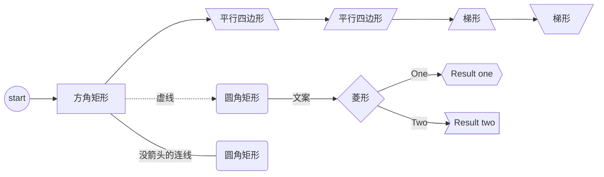

# Typora使用

# 安装及配置

## 主题配置

* https://github.com/Theigrams/My-Typora-Themes
* https://sspai.com/post/43873
* [编写自己的主题](https://theme.typora.io/doc/zh/Write-Custom-Theme/)
* [主题自动编号](https://github.com/lipengzhou/typora-theme-auto-numbering)

### 设置字体

```java
/* https://developer.mozilla.org/zh-CN/docs/Web/CSS/font-family */
html {
    /* 默认字体大小 */
    font-size: 14px;
}

/* 使用SF Pro字体，无衬线字体族 */
body {
    font-family: "SF Pro", sans-serif !important;
    color: #333333;
    -webkit-font-smoothing: auto;
    line-height: 1.6rem;
    letter-spacing: 0;
    margin: 0;
    overflow-x: hidden;
}

/* 代码块 */
#write .md-fences {
    font-size: 0.9rem;
    padding: 0.5rem !important;
    border-radius: 2px;
    /* 调整为等宽字体，使用Apple的SF字体 */
    font-family: "SF Mono", monospace !important;
    word-wrap: normal;
    color: #24292e;
    background-color: #F6F8FA;
    border: none;
}

/*行内代码*/
#write code, tt {
    margin: 0 2px;
    border-radius: 2px;
    /* 调小一点 */
    font-size: 0.9em;
    /* 调整为等宽字体，使用Apple的SF字体 */
    font-family: "SF Mono", monospace  !important;
    color: var(--drake-highlight);
}
```


## PicGo图床配置

0. **参考文档：**

   - https://picgo.github.io/PicGo-Doc/zh/guide/
- [如何利用Typora编写博客，快速发布到多平台？](https://zhuanlan.zhihu.com/p/341932506)
   - [Typora图床上床工具](https://gitee.com/cwayteam/TyporaUpload)

1. 从[github](https://github.com/Molunerfinn/picgo/releases)下载最新的dmg格式安装包（注意是dmg格式的）

2. 打开应用（可能需要在安全设置中确认后才能打开）

3. 安装f插件；

   

4. 在gitee上新建图片仓库

   >  ⚠️注意仓库需要设置成允许公开访问；

5. 在gitee中生成个人访问令牌；

6. 配置Gitee插件，需提供如下信息：

   - gitee用户名
   - 图片仓库名称
   - 个人访问令牌

7. 测试上传功能；

8. 配置typora的图片上传方式为picgoapp


### Gitee图床的限制

gitee图片文件大小超过1M之后，需要登录才能使用。暂时无解

## 分页配置	

typora在自己官方博客中给出了两种解决方法

[分页符 | typora中文www.typora.net](https://link.zhihu.com/?target=https%3A//www.typora.net/440.html)

第一种方法编辑CSS，在CSS中插入下端代码

之后，在导出时，将在每个 h1 元素（第一个元素除外）之前创建一个新页面。

如果你想二级标题之前分页就用 h2,第一个元素也想保留，删除h1:first-of-type这段代码即可

```html
@media print {
  h1 {
    page-break-before: always;
  }
  h1:first-of-type {
    page-break-before: avoid;
  }
}
```

第二个方法

在每个你想要分页处插入

```text
<div style="page-break-after:always;"></div>
```

个人推荐第一个方法


作者：samadhi
链接：https://www.zhihu.com/question/57429587/answer/1111224875
来源：知乎
著作权归作者所有。商业转载请联系作者获得授权，非商业转载请注明出处。


# 使用

## Latex（数学公式）

### 好的参考文档： 

* Latex手册： https://www.moonpapers.com/manual/latex/basic/ ， 几乎涵盖了所有可能的语法格式，包括基础和进阶。
* 

### 中间分割线

>  参考: [文章](http://kuing.orzweb.net/archiver/?tid-139.html)

```latex
\left.
\begin{aligned} x^{\prime} &= x + y . \tan \left( \alpha \right) \\ x + y . \tan \left( \alpha \right) &= a . x + b . y\\\\ \Rightarrow a &= 1 \text{ and }\\ b &= \tan \left( \alpha \right) \end{aligned}

\middle|

\begin{aligned} y^{\prime} &= y\\ y &= c . x + d . y\\\\ \Rightarrow c &= 0 \text{ and }\\ d &= 1 \end{aligned}

\right.
```


$$
\left.
\begin{aligned} x^{\prime} &= x + y . \tan \left( \alpha \right) \\ x + y . \tan \left( \alpha \right) &= a . x + b . y\\\\ \Rightarrow a &= 1 \text{ and }\\ b &= \tan \left( \alpha \right) \end{aligned}

\middle|

\begin{aligned} y^{\prime} &= y\\ y &= c . x + d . y\\\\ \Rightarrow c &= 0 \text{ and }\\ d &= 1 \end{aligned}

\right.
$$

### 数学公式对齐

#### 居中对齐（默认）

```latex
scale = targetDensity/density \\
scaleWidth  =  (width \times scale) \  / sampleSize  \\
scaleHeight =  (height \times scale)\  / sampleSize \\

bitmapSize= scaleWidth \times scaleHeight \times pixelSize
```


$$
scale = targetDensity/density \\
scaleWidth  =  (width \times scale) \  / sampleSize  \\
scaleHeight =  (height \times scale)\  / sampleSize \\

bitmapSize= scaleWidth \times scaleHeight \times pixelSize
$$


#### 对齐左边

使用 `\begin{align*}` ，使用`\\`换行，新行开始使用 `&` 

```latex
\begin{align*}

& scale = targetDensity/density \\
& scaleWidth  =  (width \times scale) \  / sampleSize  \\
& scaleHeight =  (height \times scale)\  / sampleSize \\

& bitmapSize= scaleWidth \times scaleHeight \times pixelSize

\end{align*}
```

$$
\begin{align*}

& scale = targetDensity/density \\
& scaleWidth  =  (width \times scale) \  / sampleSize  \\
& scaleHeight =  (height \times scale)\  / sampleSize \\

& bitmapSize= scaleWidth \times scaleHeight \times pixelSize

\end{align*}
$$


#### 对齐右边

使用 `\begin{align*}` ，使用`\\`换行

```latex
\begin{align*}

 scale = targetDensity/density \\
 scaleWidth  =  (width \times scale) \  / sampleSize  \\
 scaleHeight =  (height \times scale)\  / sampleSize \\

 bitmapSize= scaleWidth \times scaleHeight \times pixelSize

\end{align*}
```

$$
\begin{align*}

 scale = targetDensity/density \\
 scaleWidth  =  (width \times scale) \  / sampleSize  \\
 scaleHeight =  (height \times scale)\  / sampleSize \\

 bitmapSize= scaleWidth \times scaleHeight \times pixelSize

\end{align*}
$$


## 全平台发布

### CSDN 中数学公式格式要求

#### 行内数学公式

1. typora中格式比较宽松，可以使用一个或两个`$`来开始和结束，如以下写法均可以表达 $\mathbf{A}$，且开始标签到内容及结束标签到内容之间可以有空格

   * `$\mathbf{A}$` $\mathbf{A}$
   * `$$\mathbf{A}$$` $$\mathbf{A}$$
   * `$$ \mathbf{A} $$` $$ \mathbf{A} $$

2. CSDN 中只能以单个 `$` 开始和结束，且起始`$`及结束`$`与内容之间不能有空格:

   * 🙆正确：`$\mathbf{A}$` 

   * 🙅错误：`$ \mathbf{A}$`,`$\mathbf{A} $`

#### 数学公式块

1. Typora中使用
2. CSDN中也是以 `$$` 来作为标记，但是中间限制较多，目前发现：
   * 不能包含空行
   * 不能单独一行中只有`=`, `+` 等支付，否则可能被解析成标题，无需列表等
   * 总而言之需要避免空行及单个字符占用一行 


## 图表绘制与矢量图片

### 图表绘制

* [还在到处寻找画图软件？快来用Typora画饼图、时序图、流程图、UML图和状态图吧](https://blog.csdn.net/liuchunming033/article/details/106034799)
* [Flowchart (mermaid-js.github.io)](https://mermaid-js.github.io/mermaid/#/flowchart)

Typora是在 0.9.9.30 (0.9.80) beta版本开始支持classDiagram的，目前支持的还不太好。所以画classDiagram时，最好使用mermaid在线编辑器 https://mermaid-js.github.io/mermaid-live-editor编辑，然后保存成svg图片，再将其插入到markdown中。

类与类之间的关系，常见有下面6种：

依赖（Dependency）：元素A的变化会影响元素B，但反之不成立，那么B和A的关系是依赖关系，B依赖A；uml中用带箭头的虚线表示，箭头指向被依赖元素。

泛化（Generalization）：就是通常所说的继承（特殊个体 is kind of 一般个体）关系。uml中用带空心箭头的实线线表示，箭头指向一般个体。

实现（Realization）：元素A定义一个约定，元素B实现这个约定，则B和A的关系是Realization，B 实现了 A。这个关系最常用于接口。uml中用空心箭头和虚线表示，箭头指向定义约定的元素。

关联（Association）：元素间的结构化关系，是一种弱关系，被关联的元素间通常可以被独立的考虑。uml中用实线表示，箭头指向被依赖元素。

聚合（Aggregation）：关联关系的一种特例，表示部分和整体（整体 has a 部分）的关系。uml中用带空心菱形头的实线表示，菱形头指向整体。

组合（Composition）：组合是聚合关系的变种，表示元素间更强的组合关系。如果是组合关系，如果整体被破坏则个体一定会被破坏。uml中用带实心菱形头的实线表示，菱形头指向整体。

看下类与类之间关系的画法，使用mermaid在线编辑器，写下下面的代码，主要是箭头和线条类型不同：

classDiagram
classK ..> classL : 依赖关系
classA --|> classB : 继承关系（泛化）
classM ..|> classN : 实现关系
classG --> classH : 关联关系
classE --o classF : 聚合关系
classC --* classD : 组合关系


多重性是用来说明两个类之间的数量关系，表示为一个整数范围n…m，整数n定义所链接的最少对象的数目，m为最多对象数目（但不确定最大数时，可以*号表示）。

classDiagram
    Customer "1" --> "*" Ticket
    Student "1" --> "1..*" Course
    Galaxy --> "many" Star : Contains
    Sky "1"--> "1" Sun
    Parent "1" -- "0..2" Children
    Person "1" -- "2" Eyes


> ————————————————
> 版权声明：本文为CSDN博主「liuchunming033」的原创文章，遵循CC 4.0 BY-SA版权协议，转载请附上原文出处链接及本声明。
> 原文链接：https://blog.csdn.net/liuchunming033/article/details/106034799

### 矢量图片

目前知道的不支持的sketch的效果：

* 不支持渐变
* 不支持设置色调（统一改变组件颜色）


### 图形

````shell

````




## 文件导出

### 普通导出

在`版本0.10.3 (5294)`中开始支持添加页眉和页脚了。

### pandoc导出

#### 安装

```shell
brew install pandoc
```

不过上面的命令安装失败，所以才用了pkg安装的方式，直接从[github的release页面](https://github.com/jgm/pandoc/releases)下载pkg文件安装即可。

#### 使用-概述

* [typora的pandoc帮助文档](https://support.typora.io/Install-and-Use-Pandoc/)： 包括安装，卸载，使用。

使用Typora导出和直接使用pandoc的命令行导出还是有区别的，使用Typora导出时，不是直接将markdown文件传递给pandoc，而是将typora中一个内部的ast传递给pandoc。typora导出的样式上会保持一致，但是pandoc直接导出时，格式会不一样。

另外，不用pandoc的话，HTML/PDF也可以导出。只有其他格式导出可能会使用pandoc。


#### pdf引擎

Pandoc 提供了多个引擎

### 导出PDF

#### 分页

1. 设置H1标题自动断页；
2. footnote会自动断页；
3. 手动添加 `<div style="page-break-after:always" /> ` 也可以分页；

#### 设置页眉和页脚

如： 

* 页眉：`${title} - ${author}`
* 页脚：`No. ${pageNo} / ${pageCount}`

可以在[YAML Front Matter](https://jekyllrb.com/docs/front-matter/)中为单个文档设置自己的页眉和页脚的信息。

```yaml
---
header: 
footer: Written in Typora
---
```

也可以通过元数据来修改，下面的元数据是PDF支持的：

```yaml
---
title: Export in Typora
author: John Snow
creator: Typora inc.
subject: Tutorial
keywords: [Pandoc, Tutorial, Export]
---
```

> 注意：当没有声明keywords，typora会使用 tags 。

```yaml
---
tags:
    - Pandoc
    - Tutorial
    - Export
---
```


#### 添加自定义内容到PDF

PDF版本是从HTML输出渲染的，所以可以添加HTML内容（包括scripts）来附加元数据。

设置路径： `首选项 → PDF →Append Extra Content` 

效果： 添加一个`<body>` 标签到生成的HTML 中。

示例：

```html
<meta name="title" content="${title}">
<div id='_export_cover' style="height:100vh;">
  <div id='_export_title' style="margin-top: 25%;text-align: center;font-size: 3rem;">
  </div>
</div>
<script>
var $cover = document.querySelector("#_export_cover");
var title = document.querySelector("meta[name='title']").getAttribute("content");
if(!title || title == "${title}") {
  // no title
  $cover.remove();
} else {
  document.body.insertBefore($cover, document.body.childNodes[0])
  $cover.querySelector("#_export_title").textContent = title;
}
</script>
```

> 另外也可以使用 LaTex/Pandoc 生成PDF时添加额外的内容


# 与其他工具的结合

## 结合IDEA使用

### 配置好的效果

我们设置通过IDEA的上下文菜单在Typora中打开文件，配置好之后的效果如下图：


点击typora之后即可在typora中打开选中的README.md文件，同时将Typora的目录设置为文件所在的目录。


### 配置方式

1. 在IDEA的偏好设置中找到 `External Tools`，并通过添加按钮添加一个外部工具；

   

2. 在弹出的设置表单中填写如下内容

   

   其中，Name，Group，Description可随意填写，Program则需要指向我们自己的一个脚本，脚本内容如下，可自行新建文件保存到合适的位置：

   ```shell
   #!/bin/zsh 
   # 使用typora打开
   open -a typora $*
   ```

   另外两个 Arguments 及 Working directory则可通过输入框旁边的➕号进行选择；

3. 添加完毕后点击OK保存；

4. 在文件或目录上右键即可在Typora中打开选中的文件或者目录；
