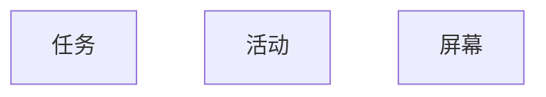

---
时间：2021/03/12
分类：
- Android
- 启动模式
---

# 从人机交互说起

## 基于屏幕的人机交互

我们使用机器完成某件事情，一般是这样的步骤：输入-机器做某件事情-机器输出执行的结果的反馈。输入就是我们告诉机器信息，输出就是机器告诉我们信息，一来一回就完成了信息的交换，在信息交换的过程中，机器可能就帮我们完成了很多事情。

对于现在的各种电子设备来说，屏幕往往即是输入设备，也是输出设备。那么屏幕作为最重要的人机交互窗口，其中展示什么内容，如何展示内容就非常重要了。

对于很多功能单一的电子设备来说，人机的交互是可以非常简单的：

* 比方说我一个电饭煲，有一个按键可以在不同的模式中进行切换（如：精煮，快煮，煮粥等），没按下一次就会对应的模式下就会亮起指示灯，然后我就知道当前处于哪个模式，然后按下另外一个开始按钮，就可以开始煮饭。

对于这种执行单一简单任务的设备来说，交互的模式非常简单且是固定的。

而对于手机和电脑这种电子设备来说，它们现如今都是一个通用的任务运行平台，对与手机来说除去最除打电话的功能之外，现在他们可以完成各种各样的不同的任务。其中很多任务实际上并不由设备的制造商提供，而是由对应的开发者提供，在这种通用的任务运行平台上，运行的特定的任务的程序我们称之为应用。

对于早期的电脑来说，最初采用的是命令式交互界面，打开后就是一个命令式交互环境，我们可以输入预定义的命令，然后机器会输出命令的执行结果，这种交互模式下，虽然我们的屏幕可能有很大，但是实际上屏幕上当前正在展示的应用可能就只有一个。

后期发展出图形化交互方式之后，电脑的一个屏幕上往往可以同时展示多个应用，比方说，我们可以一边使用Typora写文档，同时屏幕上还有个用于查询资料的浏览器应用。

由于电脑的显示器一般都比较大，能够展示的内容非常多，所以同时展现多个应用是非常自然的。

不过，对于初期的触摸屏手机来说，3-5寸左右的屏幕能够展示的内容非常有限，如果在这么小的屏幕上展示多个应用，显然屏幕尺寸是不够用的。所以最初的iPhone及android手机，基本上一个屏幕上都只展示一个应用，随着屏幕越来越大，可用空间越来越多，开始逐渐的发展出分屏的需求及实现。

作为通用的任务执行平台，一开始的时候就需要定好应用开发的模型，其中很重要的一环就是关于一屏幕显示的内容是什么概念，对于iOS来说是Scene，对于Android来说是Activity。

> 机器上的概念也都来源现实生活中的概念模型提取

* 人机交互：`输入-输出反馈-输入`的循环，在如今的触摸屏手机上，输入输出都是屏幕；
* Android手机作为一个通用的应用运行平台，可以运行多种不同的应用，有的是自己厂商提供的，有的是第三方的开发者提供的。
* 应用用于运行一系列相关的任务；
* Android系统作为一个通用的需要提供一种概念模型来代表**任务**-即**一系列的活动的集合**。
* 这里的活动在Android中的概念就是Activity。
* 大屏幕设备中-如电脑，由于屏幕足够大，能够在一个屏幕中展示多个应用；但是对初期的触屏手机来说，屏幕只有3-5寸，没有空间来展示多个应用，一般一个屏幕就只展示一个应用。

所以Android系统中：

1. 任务是一系列活动的集合，代表逻辑上相关的一件事情；
2. 活动就是Activity，一个Activity一般占据一个屏幕；

现在我们有了Android的一大组件 - Activity；

## 黑马，白马，一匹马

> 基因是模板，实体有个性

马是一个种类，白马是马，黑马也是马，汗血宝马也是马，白马也有不同的个体。

Activity是一个类，可以是购物的活动，可以是发邮件的活动，可以是看邮件的活动，我可以看购物网站发的邮件，也可以看银行发的邮件，这两个看邮件的是两个不同的活动，但是它们又是从一个活动的模板创建出来的。

启动模式就是关于Activity如何创建（创建几个）及归属于哪个任务的控制参数；

## 浏览器的导航模式

> 任务是用户在执行某项工作时与之互动的一系列 Activity 的集合。这些 Activity 按照每个 Activity 打开的顺序排列在一个返回堆栈中。
>
> 大多数任务都从设备主屏幕上启动。当用户轻触应用启动器中的图标（或主屏幕上的快捷方式）时，该应用的任务就会转到前台运行。如果该应用没有任务存在（应用最近没有使用过），则会创建一个新的任务，并且该应用的“主”Activity 将会作为堆栈的根 Activity 打开。
>
> 在当前 Activity 启动另一个 Activity 时，新的 Activity 将被推送到堆栈顶部并获得焦点。上一个 Activity 仍保留在堆栈中，但会停止。当 Activity 停止时，系统会保留其界面的当前状态。当用户按**返回**按钮时，当前 Activity 会从堆栈顶部退出（该 Activity 销毁），上一个 Activity 会恢复（界面会恢复到上一个状态）。堆栈中的 Activity 永远不会重新排列，只会被送入和退出，在当前 Activity 启动时被送入堆栈，在用户使用**返回**按钮离开时从堆栈中退出。因此，返回堆栈按照“后进先出”的对象结构运作。

