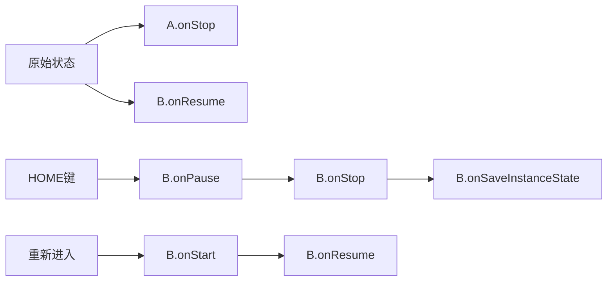

# Android面试宝典

# 前言

当前面试过程中，面试造火箭，工作拧螺丝已经成为常态，那么如何才能在面试中脱颖而出，那也只能随大流，背题了。本书既是为了背题而准备的宝典，后面导出为EPUB电子书，即可在各种设备上方便的进行复习。

本书中讲包含Android开发面试中可能会遇到的各种问题，对于各种问题的答案也本着不求甚解的态度进行描述，主要是方便面试回答面试官的问题，力求做到书中的文字可以直接背诵作为面试的答案。

当然，面试情况非常灵活，如果面试官取其中细节追问，那么我们可能会无言以对，所以关于如何理解面试题底层对应的细节及原理部分也需要有所涉及，但是这一部分我们在另外的文档中进行说明。

本书主要涉及如下方面：

1. Android开发知识；
2. Java知识；
3. 网络知识；
4. Android性能优化；
5. 其他周边；


# Android知识篇

## Android 进程间通信机制-Binder
### 问题
1. Binder通信机制是什么？（是什么，有什么优势，为什么要用它）
2. 实现的原理是什么？
3. 其中的主要参与对象有哪些，分别有什么作用？
4. Binder的机制被用在什么地方？
5. AIDL是什么？如何使用？

### 回答

#### Binder通信机制是什么？（是什么，有什么优势，为什么要用它）
2. 实现的原理是什么？

* Binder是Android上面的IPC进程通信机制，提供了高效的，可以进行权限管理通信机制，并且封装为C/S架构，方便使用。
* Binder通信机制是Android系统的核心部分，我们的应用使用系统的各种服务，APP的生命周期管理等都是通过Binder机制来向系统请求服务的；
* 原理： Binder通信机制中主要参与者有Binder服务端，Binder客户端及Binder驱动程序；Binder客户端及服务端着分别位于需要通信的两个用户进程，Binder驱动程序位于内核空间，用户进程之间相互隔离，一般无法互相访问内存，而运行于内核空间的Binder驱动则充当通信的桥梁。
  * 服务端需要先注册到Binder驱动中，注册时需要先打开binder设备驱动，然后映射内存缓存区到用户空间，之后通过ioctl控制命令来往缓冲区写入命令；
  * 客户端也需要打开binder驱动，然后申请分配缓冲区，之后通过ioctl控制命令来查找对应的Service

#### 其中的主要参与对象有哪些，分别有什么作用？

* 主要对象包括：
  * Binder驱动 - 运行于内核控件，提供进程的渠道及管理；
  * Binder服务端对象 - 系统提供的服务端实现类，用于实现Binder的通信机制中业务无关的部分；
  * BinderStub对象 - 业务需要实现的部分，提供具体的业务功能接口实现；
  * BinderProxy对象 - 对于Binder对象的代理接口对象，用于给客户端来调用服务对象的方法；
  * ServiceManager对象 - Binder服务管理的上下文对象，系统服务需要注册到ServiceManager中，其本身也是一个Binder Service对象。

#### Binder的机制被用在什么地方？

* APP请求系统框架服务都是通过这个来的
* Intent
* 广播等

#### AIDL是什么？如何使用？

* AIDL就是Android接口定义语言，用于简化Binder通信机制中的模板代码的编写，让我们专注于业务实现。
* 对于APP来说，需要编写Service时需要编写AIDL文件来定义IPC的接口；
* 使用的时候需要先提供一个AIDL文件编写通信接口，放入到客户端可服务端的项目中，编译时AIDL文件会生成对应的Java文件，其中包括
  * 一个Stub和一个Proxy类
  * 我们的服务端代码中创建一个Binder类实现Stub类，覆盖里面我们自己的业务接口方法，用于提供具体的业务通信代码，并且在onBind方法中方法我们的Binder对象；
  * 我们的客户端bind服务时提供一个ServiceConnect的对象，用于接收服务绑定的回调，并在服务绑定回调中，通过Stub#asInterface 静态方法将Binder服务对象转换为一个Proxy对象
  * 后续我们在客户端中即可使用这个Proxy对象来访问远程的服务；

#### oneway关键字

默认情况下，通过Proxy对象访问另外一个进程的远程方法时，是同步调用的，也就是说会等待返回结果后才能执行结束，使用oneway关键字在AIDL接口生命中标注接口即接口方法即可将接口调用设置为异步调用的，即调用后会立刻返回，通过我们调用方法时传递的回调对象来通知客户端处理结果；

## Handler和消息队列

### 问题

1. Handler是什么？消息队列是什么？有什么用途？
2. 实现原理：消息如何发送，如何接受，如何处理？消息如何存储？
3. Handler的Framework层的实现？Looper#loop方法为什么不会ANR？ nativePollOnce？eventfd，epoll机制。
4. IdleHandler是什么？何时调用？如何使用？靠谱么？
5. Handler里面的消息类型有哪几种？如何区分普通消息和异步消息？
6. 如何实现Handler发送Runnable，但是不通过Handler#post来发送？

### 问答

#### Handler是什么？消息队列是什么？有什么用途？

* Handler是Android中提供的线程之间通讯的机制中我们作为API使用的一个入口，我们通过Handler来发送消息或者任务到其他线程；
* 消息队列： 消息队列是Handler线程间通讯机制的底层支持，消息队列就是像它的名字一样，是一个存储消息的队列，我们；
* Looper：另外还有一个Looper对象，Looper是底层支撑，用于开启消息队列循环。
* 用途：线程之间通讯；

#### 实现原理：消息如何发送，如何接收，如何处理？消息如何存储？

* Looper#prepare时会构建一个Looper实例并设置为线程变量，也就是每个线程都会有一个Looper
* Looper中包含一个消息队列，也就是说每个线程都有一个消息队列，消息队列中有一个消息链表；
* Looper#loop进入消息循环
* Handler在构造的时候可以传递一个Looper，如果不传递，则通过Looper#myLooper取出当前线程的Looper进行绑定。
* Handler发送消息，可以通过Message#obtain方法获取一个消息对象，通过post 或者sendMessage发送消息时，实际上时将消息加入到对应的Looper的消息队列中，同时会将消息的target指向Handler本身
* Looper#loop中取出消息时，会取出消息中的target，即Handler，然后调用Handler的对应方法来处理消息；
* 消息存储：

#### Handler的Framework层的实现？Looper#loop方法为什么不会ANR？ nativePollOnce？eventfd，epoll机制。

* Looper是一个线程级别的变量，每个线程都一个Looper，Looper中包含一个消息队列，也就是说每个线程都有一个Looper和消息队列。

* 因为java层的消息机制是依赖native层的消息机制来实现的，而native层的消息机制是通过Linux的**管道和epoll机制**实现的，epoll机制是一种高效的IO多路复用机制， 它使用一个文件描述符管理多个描述符，java层通过mPtr指针也就共享了native层的**epoll机制**的高效性，当loop方法中取不到消息时，便阻塞在Java层的MessageQueue的next方法，而next方法阻塞在`nativePollOnce`方法，`nativePollOnce`方法通过JNI调用进入到native层中去，最终`nativePollOnce`方法阻塞在**epoll_wait**方法中，`epoll_wait`方法会让当前线程释放CPU资源进入**休眠状态**，等到下一个消息到达(mWakeEventFd会往管道写入字符)或监听的其他事件发生时就会唤醒线程，然后处理消息，所以**就算loop方法是死循环，当线程空闲时，它会进入休眠状态，不会消耗大量的CPU资源**。

  > 参考：：
  >
  > * [Android消息机制（native层）rain_9155](https://www.jianshu.com/p/57a426b8f145) 
  > * [wiki-epoll](https://zh.wikipedia.org/wiki/Epoll)

#### IdleHandler是什么？何时调用？如何使用？靠谱么？

> 参考： [IdleHandler 是什么？怎么使用，能解决什么问题？](https://blog.csdn.net/jdsjlzx/article/details/110532500)

* 在Looper事件循环的过程中，如果空闲了，可以让我们让我们执行一些任务；
* 在Looper空闲的时候会调用：1）消息队列为空；2）消息队列中最近要处理的消息执行时间还没到；
* 通过add方法向Handler中添加IdleHandler，通过remove移除，也可以将queueIdle方法返回false让消息队列执行一次IdleHandler后自动移除它。
* 由于它是在Handler消息队列空闲的时候执行，所以不一定能保证执行时机，所以不可靠；

#### Handler里面的消息类型有哪几种？如何区分普通消息和异步消息？

> 参考： [花了几天研究Handler消息机制的成果](https://blog.csdn.net/afdafvdaa/article/details/116097327)

1. 同步消息，普通消息；
2. 异步消息，通过setAsynchronous(true)设置的消息
3. 同步屏障消息。通过postSyncBarrier方法添加的消息，特点是target为null，也就是没有对应的handler。
4. 消息遍历时，如果某个`msg`不为`null`而且它的`target`为`null`，那么它就是一个`同步屏障消息`，那我们就要进入这个`if`。此时会往后逐个遍历`MessageQueue`中的消息，当发现下一个异步消息的时候，就退出循环，得到这个异步消息然后加急进行处理。

#### 如何实现Handler发送Runnable，但是不通过Handler#post来发送？

设置callback即可，实际上post(Runnable) 消息就是将消息的callback设置为runnable

```java
    public final boolean post(@NonNull Runnable r) {
       return  sendMessageDelayed(getPostMessage(r), 0);
    }
    private static Message getPostMessage(Runnable r) {
        Message m = Message.obtain();
        m.callback = r;
        return m;
    }
```

## Activity

### 问题

1. Activity是什么？Activity的生命周期？不同的生命周期做什么事情？

2. Activity的几种启动模式？这几种启动模式分别有什么用途？为什么要这几种启动模式？如何指定启动模式？

3. Activity在系统中的系统启动流程（何时创建？如何创建？如何启动？启动过程中做了些什么事情）

4. 场景问题：

   1. A启动B，调用序列
   2. A启动B，然后back，调用序列
   3. A启动B，然后Home键

5. onSaveInstance的调用时机

   

### 回答

#### Activity是什么？Activity的生命周期？不同的生命周期做什么事情？

1. 是什么：Android四大组件之一，用于提供界面交互；
2. 生命周期：onCreate，onStart，resume，stop，resume，destory
3. 生命周期中做什么？
   1. onCreate是实例创建时调用，只调用一次，我们应该执行基本的应用启动逻辑，如设置布局，绑定数据到列表，关联ViewModel；
   2. onStart，进入已开始状态时调用，我们应该为Activity进入前台交互做准备，如初始化界面的内容；
   3. onResume，进入已恢复状态是调用，应用交互状态，等待事件发生；
   4. onPause，Activity不再位于前台时调用，我们应该暂停任务的执行，释放系统资源及传感器，但是由于时间很短，不应执行用户数据保存，网络请求及数据库事物。（因为你pause了，别人才能resume）
   5. onStop： 不再对用户可见，新的Activity覆盖了整个屏幕，或者自己的finish被调用时执行，这时执行相对耗时的关闭操作，数据持久化操作；
   6. onDestory： 用户关闭或者主动调用finish时调用，配置变更导致系统自动销毁时调用；

#### Activity的几种启动模式？这几种启动模式分别有什么用途？为什么要这几种启动模式？如何指定启动模式？

1. 启动模式用于控制Activity的实例个数和所处的任务栈；
2. 标准模式（`standard`）可以多个实例，可以分布在多个任务栈，一个任务栈中可以有多个实例；
3. `singleTop` 和标准模式差不多，唯一的区别在于如果目标任务栈的栈顶有了一个Activity，则不会重新创建实例，而是调用起`onNewIntent` 方法；
4. `singleTask`则限制了Activity在一个任务栈中的实例的数量，每个任务栈中，一个Activity只能有一个实例，如果目标任务栈中已经存在了该Activity的实例，则会复用该实例，如果这个时候Activity不在栈顶，那么其上的Activity都会被销毁，然后调用目标实例的`onNewIntent`方法；
5. `singleInstance` 则限制系统中只能有一个对应的Activity实例，所以也只能存在于一个任务栈，该任务栈中也无法添加其他Activity。
6. ==为什么需要这几种启动模式？分别的用途？： 待补充==
7. 如何指定启动模式：通过Manifest或者Intent的标记可以指定启动模式，其中通过Intent设置标记的优先级要高一些，不过通过Intent无法将Activity设置为singleInstance。

#### Activity在系统中的系统启动流程（何时创建？如何创建？如何启动？启动过程中做了些什么事情）

> 待补充

#### 场景问题

##### A启动B，调用序列


> 1. 栈顶的需要先pause，然后才执行下面的方法；
> 2. 后来者显示出来之后（resume），才会给机会旧的去执行stop；

##### A启动B，然后back，调用序列


> 解释：
>
> 1. 栈顶的需要先pause，然后才执行下面的方法；
> 2. 由于还在栈中，所以不会再create；
> 3. 后来者显示出来之后（resume），才会给机会旧的去执行stop；

##### A启动B，然后Home键



> 1. 注意，此时A不参与（A不在焦点）
> 2. 实际上是B.pause，然后执行桌面Activity的start-resume，再执行B的stop，saveInstanceState

#### onSaveInstance的调用时机

1. 在Android8.0 之前是在onStop之前，但是不确定在onPause之前还是之后。
2. 在Android8.0 之后是在onStop之后，但是在onDestory之前。


#### Window和Activity

* Window 是什么？
  Window 是 Android 中窗口的宏观定义，主要是管理 View 的创建，以及与 ViewRootImpl 的交互，将 Activity 与 View 解耦。

* Activity 与 PhoneWindow 与 DecorView 之间什么关系？
  一个 Activity 对应一个 Window 也就是 PhoneWindow，一个 PhoneWindow 持有一个 DecorView 的实例，DecorView 本身是一个 FrameLayout。

  > 参考链接：https://blog.csdn.net/freekiteyu/article/details/79408969 

## 事件分发机制

### 问题

1. 事件分发机制说明？有哪些流程？

2. 滑动冲突如何解决？具体在哪个方法里面解决？如何判断滑动方向？

### 回答

#### 事件分发机制说明？有哪些流程？

1. 事件分发有三个流程：分发，拦截，消费；
2. 事件最先到达Activity，然后由Activity进行分发(dispatchTouchEvent)，如果Activity分发过程中没有对象处理事件，则最终由Activity进行处理；
3. Activity分发时，会调用Window的superDispatchTouchEvent方法，然后调用到DecorView的（也就是最顶层的ViewGroup的）dispatchTouchEvent方法；
4. ViewGroup则首先尝试拦截，如果本身不拦截（onInterceptTouchEvent），则继续往子View传递；
5. View如果消费事件，则返回true，View如果没有消费事件，则又往上传递，看是否有ViewGroup来消费事件（onTouchEvent）；
6. 如果ViewGroup也都没有消费事件，则最终由Activity来处理；

#### 滑动冲突如何解决？具体在哪个方法里面解决？如何判断滑动方向？

1. 有两种方法：
   1. 外部拦截，在上层ViewGroup中拦截
   2. 内部拦截，在View中拦截
2. 外部拦截：在ViewGroup的`onInterceptTouchEvent`方法中进行是否拦截的逻辑判断；
3. 内部拦截：在子控件事件处理的`dispatchTouchEvent`过程中适当的时机调用`requestDisallowInterceptTouchEvent`方法来告知上层的容器拦截或者不拦截事件；
4. **判断滑动方向**：
   * 屏幕左上角坐标为 $(0,0)$  ，根据当前事件的坐标减去手指落下时的坐标，得到两个值$dx，dy$ 
   * 如果 $dx > 0$，则表示向右滑动，反之，则向左滑动
   * 如果 $dy > 0$ ，则表示向下滑动，反之，则向上滑动
   * 通过打开触摸位置可以看到触摸中的坐标及 $dx$ 和 $dy$

