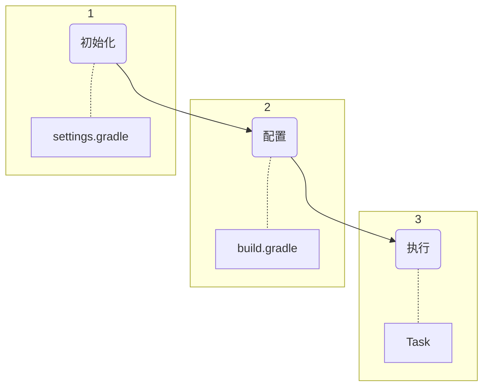
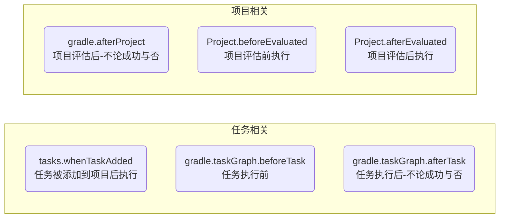

# Gradle 完全指南

Android Gradle 使用的各种问题记录。

<!-- more -->

## 主要内容

* Gradle 基础概念介绍
* Gradle 基础使用与配置
* Gradle Android 常用配置
* Gradle 使用专题
  * Maven 仓库上传
* Kotlin DSL 使用
* Gradle 插件编写（Android相关）

## Gradle 基础概念介绍

### 任务依赖图

Gradle的核心是一种基于依赖关系的编程语言 - 你可以定义任务及任务之间的依赖，Gradle 会保证任务按你定义的顺序依赖顺序进行执行，并且每个任务只执行一次。

任务构成了一个有向无环图。Gradle 的作用就是构建一个这样的图，并且执行其中的任务。

Gradle 会在所有任务被执行之前先构建完整的**任务依赖图**。

**构建脚本**用于配置这个**任务依赖图**，所以严格的说我们应该称之为 **构建配置脚本**

### 三个构建阶段

一个Gradle 构建有三个阶段：

* **初始化**-**Initialization**
  * 决定哪些项目要被包含到此构建中
  * 为每个项目创建一个 Project 实例
* **配置** -**Configuration**
  * 在这个阶段，配置项目对象。所有组成此构建的项目的**构建脚本**都会被执行。
* **执行** - **Execution**
  * 通过给到gradle命令的任务名称，Gradle 会决定需要执行的任务的子集，然后执行每个被选中的任务。

### 构建脚本的生命周期

