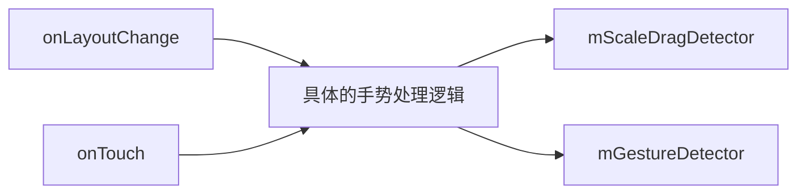
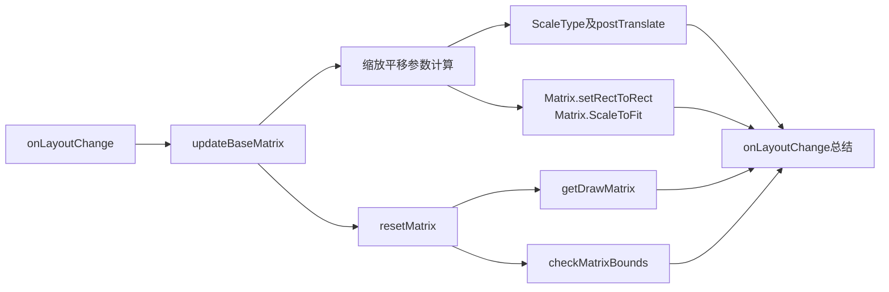
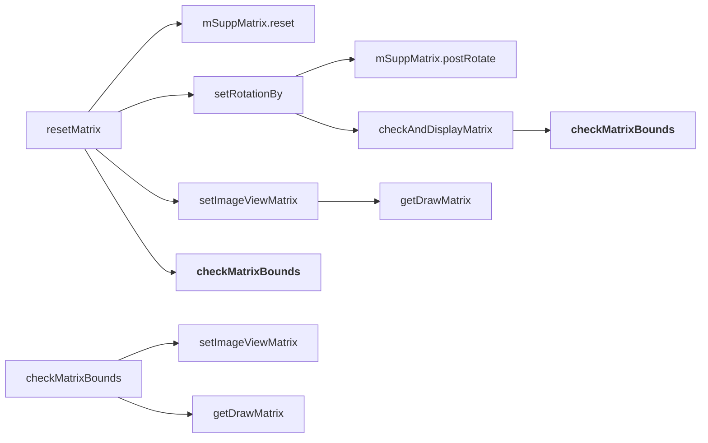
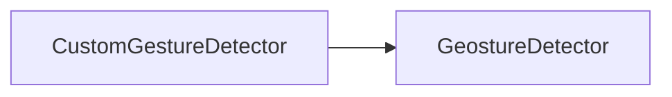
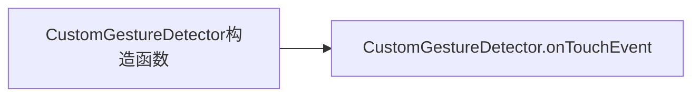
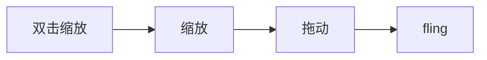

# PhotoView源码分析

> 完成一件自己从未做过的事，有两种方式：
>
> 1. 依靠前人经验；
> 2. 单纯靠自己思考可以直接从零一步步完成；
>
> 第二种方式往往困难重重，因为某个点（东西，知识）可能对事情的达成起着作用，但是你压根不知道这个东西，或者意识不到这个东西在这件事情中的作用。所以，你应该先学习别人的经验，然后做出自己的改良；

## 目录

**本文内容目录：**

 [TOC]

## Library 总体分析

* 功能：
  * 图片查看，支持缩放，滑动，fling等；
* 主要实现类：
  * `PhotoView`：继承ImageView，主要操作都由 `PhotoViewAttacher` 完成；
  * `PhotoViewAttacher`：主要实现类，800+行

## PhotoView

### 方法分析

方法主要有两类：

1. override `ImageView` 的方法；
2. 代理暴露 `PhotoViewAttacher` 类的方法;

| **分类**         | **方法**                      |
| ---------------- | ----------------------------- |
| **构造函数**     | 构造                          |
|                  | init                          |
| **@Override**    | getScaleType                  |
|                  | getImageMatrix                |
|                  | setOnLongClickListener        |
|                  | setOnClickListener            |
|                  | setScaleType                  |
|                  | setImageDrawable              |
|                  | setImageResource              |
|                  | setImageURI                   |
| **操作接口代理** | setRotationTo                 |
|                  | setRotationBy                 |
|                  | isZoomable                    |
|                  | setZoomable                   |
|                  | getDisplayRect                |
|                  | getDisplayMatrix              |
|                  | setDisplayMatrix              |
|                  | getSuppMatrix                 |
|                  | setSuppMatrix                 |
|                  | getMinimumScale               |
|                  | getMediumScale                |
|                  | getMediumScale                |
|                  | getScale                      |
|                  | setAllowParentInterceptOnEdge |
|                  | setMinimumScale               |
|                  | setMediumScale                |
|                  | setMaximumScale               |
|                  | setScaleLevels                |
|                  | setOnMatrixChangeListener     |
|                  | setOnPhotoTapListener         |
|                  | setOnOutsidePhotoTapListener  |
|                  | setOnViewTapListener          |
|                  | setOnViewDragListener         |
|                  | setScale                      |
|                  | setScale                      |
|                  | setScale                      |
|                  | setZoomTransitionDuration     |
|                  | setOnDoubleTapListener        |
|                  | setOnScaleChangeListener      |
|                  | setOnSingleFlingListener      |

### 初始化流程

由于我们直接使用的是`PhotoView`，我们先分析`PhotoView`的构造及初始化流程。初始化流程中调用了 init 方法，完成如下事情：

* 构造 `PhotoViewAttacher` 的实例;
* 将`ImageView` 缩放类型设置为 `ScaleType.MATRIX`;

> pendingScaleType 是当attacher没有初始化的时候，如果调用了PhotoView的setScaleType时，需要先记录下来，待attacher初始化时再设置进去；

```java
    private void init() {
        attacher = new PhotoViewAttacher(this);
        //We always pose as a Matrix scale type, though we can change to another scale type
        //via the attacher
        super.setScaleType(ScaleType.MATRIX);
        //apply the previously applied scale type
        if (pendingScaleType != null) {
            setScaleType(pendingScaleType);
            pendingScaleType = null;
        }
    }
```

### 覆盖的父类方法说明

PhotoView 覆盖了如下方法：

* 缩放类型
  * getScaleType：代理到attacher，返回attacher中的缩放类型信息           
  * setScaleType：代理到attacher，更新attacher中的缩放类型信息
  * getImageMatrix：代理到attacher，返回attacher中的imageMatrix 

* 监听设置：原ImageView支持的两种手势事件        

  * setOnLongClickListener ：代理到attacher，设置attacher的长按事件
  * setOnClickListener： 代理到attacher，设置attacher的点击事件                 

* image设置方法： 图片源设置方法，先调用ImageView的方法，然后再通知attacher进行对应的更新操作；

  * setImageDrawable         

  * setImageResource   

  * setImageURI      

  * ```java
        @Override
        public void setImageURI(Uri uri) {
            super.setImageURI(uri);
            if (attacher != null) {
                attacher.update();
            }
        }
    ```

    

### 其他方法

由于其他方法都是代理转发给attacher处理，所以这些方法等分析PhotoViewAttacher时一起查看；


## PhotoViewAttacher

### 初始化流程

从前面PhotoView的初始化流程中可以看到，初始化PhotoView时，会创建 PhotoViewAttacher 的实例，我们现在看看 PhotoViewAttacher 的初始化过程中都做了些什么。

简化的看它的构造方法：

```java
    public PhotoViewAttacher(ImageView imageView) {
        mImageView = imageView;
        imageView.setOnTouchListener(this);
        imageView.addOnLayoutChangeListener(this);
        if (imageView.isInEditMode()) {
            return;
        }
        mBaseRotation = 0.0f;
        // Create Gesture Detectors...
        mScaleDragDetector = new CustomGestureDetector(imageView.getContext(), onGestureListener);
        mGestureDetector = new GestureDetector(imageView.getContext(), new GestureDetector.SimpleOnGestureListener() {});
        mGestureDetector.setOnDoubleTapListener(new GestureDetector.OnDoubleTapListener() {
        });
    }
```

总体看来，就是初始化了各种事件监听器。从PhotoView的功能来说，都是需要通过触摸手势来触发的，所以初始化的时候需要做的就是设置好事件监听器，看下设置了哪些监听：

* `setOnTouchListener`: 触摸事件处理，各种手势监听器实际上都需要在`onTouch`方法中接受事件序列才能工作；
* `addOnLayoutChangeListener`:  `onLayoutChange` 回调响应布局的变化
* `mScaleDragDetector`: 缩放手势监听
* `mGestureDetector`: 点击，长按，滚动，投掷（fling）等事件监听
* `mGestureDetector.setOnDoubleTapListener`: 双击事件监听


### 分析流程

那么接下来我们从何处开始分析了？



### onLayoutChange

#### onLayoutChange 整体分析流程

整体的分析过程如下：(根据源码的调用方法及涉及到的对应需要知识不断补充)




`onLayoutChange` API文档说明如下：

> Called when the layout bounds of a view changes due to layout processing.

也就是布局过程中View边界发生变化时调用，回调时有9个传入参数：

| 参数                                      | 含义                   |
| ----------------------------------------- | ---------------------- |
| View                                      | 布局边界发生变化的View |
| `left`|`top`|`right`|`bottom`             | 变化后的新的布局参数值 |
| `oldLeft`|`oldTop`|`oldRight`|`oldBottom` | 变化前的信息布局参数值 |

`PhotoViewAttacher` 的实现如下：

```java
    @Override
    public void onLayoutChange(View v, int left, int top, int right, int bottom, int oldLeft, int oldTop, int
        oldRight, int oldBottom) {
        // Update our base matrix, as the bounds have changed
        if (left != oldLeft || top != oldTop || right != oldRight || bottom != oldBottom) {
            updateBaseMatrix(mImageView.getDrawable());
        }
    }
```

当布局参数确实发生变化时，调用了`updateBaseMatrix` ，从方法名上来看，更新了基本的matrix，既然有baseMatrix，就可能还有其他matrix，这里先让我们看下 `updateBaseMatrix` 做了些什么：(一边看代码，边列出关键的点)

* 方法注释说明方法的作用是： 根据传入的drawable（imageView的图片）来计算 FIT_CENTER 的矩阵
* **第一步：mBaseMatrix 重置为单位矩阵，根据设置的 scaleType 对 baseMatrix 应用不同的变换**
* **第二步：重新设置ImageView的imageMatrix**

```java
    /**
     * Calculate Matrix for FIT_CENTER
     *
     * @param drawable - Drawable being displayed
     */
    private void updateBaseMatrix(Drawable drawable) {
        if (drawable == null) {
            return;
        }
        // 第一步
        final float viewWidth = getImageViewWidth(mImageView);
        final float viewHeight = getImageViewHeight(mImageView);
        final int drawableWidth = drawable.getIntrinsicWidth();
        final int drawableHeight = drawable.getIntrinsicHeight();
        mBaseMatrix.reset();
        final float widthScale = viewWidth / drawableWidth;
        final float heightScale = viewHeight / drawableHeight;
        if (mScaleType == ScaleType.CENTER) {
            mBaseMatrix.postTranslate((viewWidth - drawableWidth) / 2F,
                (viewHeight - drawableHeight) / 2F);

        } else if (mScaleType == ScaleType.CENTER_CROP) {
            float scale = Math.max(widthScale, heightScale);
            mBaseMatrix.postScale(scale, scale);
            mBaseMatrix.postTranslate((viewWidth - drawableWidth * scale) / 2F,
                (viewHeight - drawableHeight * scale) / 2F);

        } else if (mScaleType == ScaleType.CENTER_INSIDE) {
            float scale = Math.min(1.0f, Math.min(widthScale, heightScale));
            mBaseMatrix.postScale(scale, scale);
            mBaseMatrix.postTranslate((viewWidth - drawableWidth * scale) / 2F,
                (viewHeight - drawableHeight * scale) / 2F);

        } else {
            RectF mTempSrc = new RectF(0, 0, drawableWidth, drawableHeight);
            RectF mTempDst = new RectF(0, 0, viewWidth, viewHeight);
            if ((int) mBaseRotation % 180 != 0) {
                mTempSrc = new RectF(0, 0, drawableHeight, drawableWidth);
            }
            switch (mScaleType) {
                case FIT_CENTER:
                    mBaseMatrix.setRectToRect(mTempSrc, mTempDst, ScaleToFit.CENTER);
                    break;
                case FIT_START:
                    mBaseMatrix.setRectToRect(mTempSrc, mTempDst, ScaleToFit.START);
                    break;
                case FIT_END:
                    mBaseMatrix.setRectToRect(mTempSrc, mTempDst, ScaleToFit.END);
                    break;
                case FIT_XY:
                    mBaseMatrix.setRectToRect(mTempSrc, mTempDst, ScaleToFit.FILL);
                    break;
                default:
                    break;
            }
        }
        // 第二步
        resetMatrix();
    }

    /**
     * Resets the Matrix back to FIT_CENTER, and then displays its contents
     */
    private void resetMatrix() {
        mSuppMatrix.reset();
        setRotationBy(mBaseRotation);
        setImageViewMatrix(getDrawMatrix()); // getDrawMatrix见下方代码
        checkMatrixBounds(); // 见下方代码
    }

    private Matrix getDrawMatrix() {
        mDrawMatrix.set(mBaseMatrix);
        mDrawMatrix.postConcat(mSuppMatrix);
        return mDrawMatrix;
    }

	private boolean checkMatrixBounds() {
        final RectF rect = getDisplayRect(getDrawMatrix());
        if (rect == null) {
            return false;
        }
        final float height = rect.height(), width = rect.width();
        float deltaX = 0, deltaY = 0;
        final int viewHeight = getImageViewHeight(mImageView);
        if (height <= viewHeight) {
            switch (mScaleType) {
                case FIT_START:
                    deltaY = -rect.top;
                    break;
                case FIT_END:
                    deltaY = viewHeight - height - rect.top;
                    break;
                default:
                    deltaY = (viewHeight - height) / 2 - rect.top;
                    break;
            }
            mVerticalScrollEdge = VERTICAL_EDGE_BOTH;
        } else if (rect.top > 0) {
            mVerticalScrollEdge = VERTICAL_EDGE_TOP;
            deltaY = -rect.top;
        } else if (rect.bottom < viewHeight) {
            mVerticalScrollEdge = VERTICAL_EDGE_BOTTOM;
            deltaY = viewHeight - rect.bottom;
        } else {
            mVerticalScrollEdge = VERTICAL_EDGE_NONE;
        }
        final int viewWidth = getImageViewWidth(mImageView);
        if (width <= viewWidth) {
            switch (mScaleType) {
                case FIT_START:
                    deltaX = -rect.left;
                    break;
                case FIT_END:
                    deltaX = viewWidth - width - rect.left;
                    break;
                default:
                    deltaX = (viewWidth - width) / 2 - rect.left;
                    break;
            }
            mHorizontalScrollEdge = HORIZONTAL_EDGE_BOTH;
        } else if (rect.left > 0) {
            mHorizontalScrollEdge = HORIZONTAL_EDGE_LEFT;
            deltaX = -rect.left;
        } else if (rect.right < viewWidth) {
            deltaX = viewWidth - rect.right;
            mHorizontalScrollEdge = HORIZONTAL_EDGE_RIGHT;
        } else {
            mHorizontalScrollEdge = HORIZONTAL_EDGE_NONE;
        }
        // Finally actually translate the matrix
        mSuppMatrix.postTranslate(deltaX, deltaY);
        return true;
    }
```

#### ScaleType 及 postTranslate 说明

##### ScaleType

由于后续代码中涉及到缩放类型对应的处理，所以此处先看下ImageView支持的几种缩放类型。

首先，缩放类型用于控制**图片**如何将图片**移动及调整大小**来匹配ImageView的大小，下面是ImageView支持的几种缩放类型，来源于API文档：

| 缩放类型     | 说明                                                         |
| ------------ | ------------------------------------------------------------ |
| center       | 图片居中放置，但是不执行任何缩放操作                         |
| centerCrop   | 保持图片宽高比的同时对图片进行缩放，缩放到图片的宽和高都**大于或者等于**视图的对应的宽高（视图宽高需要减去padding）；然后将缩放后的图片放置在View的中间； |
| centerInside | 保持图片宽高比的同时对图片进行缩放，缩放到图片的宽和高都**小于或者等于**视图的对应的宽高（视图宽高需要减去padding）；然后将缩放后的图片放置在View的中间； |
| fitCenter    | 使用 Matrix.ScaleToFit.CENTER 来缩放图像                     |
| fitEnd       | 使用 Matrix.ScaleToFit.END 来缩放图像                        |
| fitStart     | 使用 Matrix.ScaleToFit.START 来缩放图像                      |
| fitXY        | 使用 Matrix.ScaleToFit.FILL 来缩放图像                       |
| matrix       | 使用一个matrix来对图像进行变换，matrix可通过 ImageView.setImageMatrix(Matrix) 设置 |

##### postTranslate

postTranslate有两个参数dx和dy，分别代表x和y方向上移动的距离

* 若dx为`正值向右边移动`，如为`负值则向左边移动`:
* 若dy为`正值则向下移动`，如为`负值则向上移动`;

#### updateBaseMatrix 第一阶段详细分析

通过查看代码，我们可以确定 `updateBaseMatrix` 第一阶段的工作就是，**根据当前的缩放类型设置，更新 `mBaseMatrix` 中的 缩放参数及平移参数**；

首先我们看下不应用任何缩放和平移时，ImageView中的drawable同ImageView之间的关系如下图：

1. 灰色边框的矩形为imageView区域，绿色的点为两个矩形的中点；
2. 红色边框的矩形为**图片（ImageView中称之为drawable）**未经任何变换时的区域；
3. 默认情况下 imageView 和 drawable的左上角重合；


> 对于ImageView来说，有两个矩形，本文中可能会有如下称呼：
>
> * 视图矩形称之为： **imageView** 或 **视图** 或 **view**
> * drawable对应的矩形称之为： **图片** 或 **drawable**

`updateBaseMatrix` 的第一阶段计算出的 **缩放及平移参数** 的作用就是将drawable的矩形区域映射到imageView的可视矩形区域中，映射的手段就是应用计算得到的缩放及平移参数；

对于缩放和平移来说，共有四个参数：

* scaleX： X轴方向的缩放比例；
* scaleY： Y轴方向的缩放比例；
* dX： X轴方向的平移距离；
* dY： Y轴方向的平移距离；

这些值都存储在一个 `Matrix` 中，在这里就是 `mBaseMatrix` ，接下来还是从代码分析，看看`updateBaseMatrix` 最开始做了些什么。

##### 获取两个矩形的信息及`匹配缩放比`

1. 获取view的宽高还有drawable的宽高

2. 计算缩放比例获得drawable对应边完全匹配view的对应边时的缩放比例 `widthScale` 和 `heightScale`

   > 这两个值为将drawable对应边缩放到view对应边的一样长度时所需要的缩放比例； 
   >
   > 如: 缩放比例为 `widthScale`，则 `drawable缩放后的宽` = `widthScale*drawableWidth = viewWidth/drawableWidth * drawableWidth` = `viewWidth` 也就是视图的宽度。

具体代码如下：

> ```java
> // 获取两个矩形的宽高
> final float viewWidth = getImageViewWidth(mImageView);
> final float viewHeight = getImageViewHeight(mImageView);
> final int drawableWidth = drawable.getIntrinsicWidth();
> final int drawableHeight = drawable.getIntrinsicHeight();
> // 获取将drawable对应边缩放到view对应边的一样长度时的缩放比例
> final float widthScale = viewWidth / drawableWidth;
> final float heightScale = viewHeight / drawableHeight;
> ```


接下来，根据设置给ImageView的不同的缩放类型（ScaleType）来确定为了达成对应的缩放类型所需要缩放参数及平移参数的值；

##### ScaleType.CENTER

* 如果缩放类型是 `ScaleType.CENTER`, 则需要将drawable的中心点和imageView视区中点重合，需要对整个画布进行平移，也就是对 `mBaseMatrix` 进行postTranslate操作
  * 如下图可明显看出dx和dy的值计算方式如下：
  * dx =  `(viewWidth - drawableWidth) / 2F`
  * dy =  `(viewHeight - drawableHeight) / 2F`
  * 

##### ScaleType.CENTER_CROP

* 图片其中一边的长度等于imageView的宽度，另外一边大于或等于
* `scale = Math.max(widthScale, heightScale)`
* dx 计算：
  * 由于centerCrop缩放后至少有一边是比view的边大的，也就是drawable显示后会比view视区大，然后一居中，那么drawable左边必定是和view重合或者在view的更左边，如下图，故dx应为负值
  * y 方向向左移动的距离正值 = 缩放后的drawableWidth/2 - viewWidth/2
  * 故：`dx= - (drawableWidth*scale/2 - viewWidth/2 ) = (viewWidth-drawableWidth*scale)/2`
* 
* dy计算类似dx： `dy= - (drawableWidth*scale/2 - viewHeight)/2) = (viewHeight-drawableHeight*scale)/2` 
* 

##### ScaleType.CENTER_INSIDE

* 缩放取值：
  * 如果图片双边都比view的对应边小，那么将不会缩放，即scale=1.0；
  * 如果图片两边中有至少一边比ImageView的大，那么必然有至少一边贴着view的对应边，另外一边无法刚好挨着或者无法抵达view的边界，所以应该取缩放比例小的一边的缩放值，避免超出view边界
  * `scale = Math.min(1.0f, Math.min(widthScale, heightScale))`
* dx 取值：`dx = + ( viewWidth/2 - scale*drawableWidth/2  ) = (viewWidth-drawableWidth*scale)/2`
* dy 取值：`dy = (viewHeight - drawableHeight * scale) / 2F)`
  * 
  * 


##### 其他缩放类型

根据定义，其他缩放类型都是使用`ScaleToFit`的不同类型来进行变换，以下代码也和定义中的说明一致，四种ScaleToFit类型都使用 `mBaseMatrix.setRectToRect` 方法来完成变换参数的计算；

```java
RectF mTempSrc = new RectF(0, 0, drawableWidth, drawableHeight);
    RectF mTempDst = new RectF(0, 0, viewWidth, viewHeight);
    if ((int) mBaseRotation % 180 != 0) {
        mTempSrc = new RectF(0, 0, drawableHeight, drawableWidth);
    }
    switch (mScaleType) {
        case FIT_CENTER:
            mBaseMatrix.setRectToRect(mTempSrc, mTempDst, ScaleToFit.CENTER);
            break;
        case FIT_START:
            mBaseMatrix.setRectToRect(mTempSrc, mTempDst, ScaleToFit.START);
            break;
        case FIT_END:
            mBaseMatrix.setRectToRect(mTempSrc, mTempDst, ScaleToFit.END);
            break;
        case FIT_XY:
            mBaseMatrix.setRectToRect(mTempSrc, mTempDst, ScaleToFit.FILL);
            break;
        default:
            break;
    }
```

`setRectToRect` 方法API文档如下：

> Set the matrix to the scale and translate values that map the source rectangle to the destination rectangle, returning true if the the result can be represented.

将matrix的scale和translate的值设置成为可以将 源矩形映射到目标矩形的值，实际上就是如之前的各种缩放类型一样，计算出scale值还有dx和dy，只不过不需要手动调用matrix的方法进行设置，在`setRectToRect`调用完成后会更新matrix中的对应的值，该方法调用时需要如下参数：

| 参数                  | 说明           |
| --------------------- | -------------- |
| src:RectF             | 源矩形         |
| dst:RectF             | 目标矩形       |
| stf:Matrix.ScaleToFit | ScaleToFit选项 |

**Matrix.ScaleToFit**: 控制元矩形如何对齐的目标矩形，可取如下值：

> 此处网页文档中的描述有误，此处参考的源码的描述（API 29）

| Enum values                | 映射计算方式                                                 |
| :------------------------- | ------------------------------------------------------------ |
| `Matrix.ScaleToFit.CENTER` | 计算一个scale的值，确保缩放后宽高比与原始矩形的宽高保持一致，且源矩形能完全包含在目标矩形中，同时至少有一个轴（x或y）方向上完全填充满目标矩形；<br/><br/>Compute a scale that will maintain the original src aspect ratio, but will also ensure that src fits entirely inside dst. At least one axis (X or Y) will fit exactly. |
| `Matrix.ScaleToFit.END`    | 计算一个scale值，确保缩放后宽高比与原始矩形的宽高保持一致，且源矩形能完全包含在目标矩形中，同时至少有一个轴（x或y）方向上完全填充满目标矩形； **并且往目标矩形的右下角对齐**<br/><br/>Compute a scale that will maintain the original src aspect ratio, but will also ensure that src fits entirely inside dst. At least one axis (X or Y) will fit exactly. END aligns the result to the right and bottom edges of dst. |
| `Matrix.ScaleToFit.START`  | 计算一个scale值，确保缩放后宽高比与原始矩形的宽高保持一致，且源矩形能完全包含在目标矩形中，计算一个scale值，确保缩放后宽高比与原始矩形的宽高保持一致，且源矩形能完全包含在目标矩形中，同时至少有一个轴（x或y）方向上完全填充满目标矩形； **并且往目标矩形的左上角对齐**<br/><br/>Compute a scale that will maintain the original src aspect ratio, but will also ensure that src fits entirely inside dst. At least one axis (X or Y) will fit exactly. START aligns the result to the left and top edges of dst. |
| `Matrix.ScaleToFit.FILL`   | 独立的缩放x和y使得源矩形完全匹配目标矩形，故这种方式可能会改变宽高比<br/><br/>Scale in X and Y independently, so that src matches dst exactly. This may change the aspect ratio of the src. |

#### onLayoutChange 第一阶段小结

经过以上分析，可以知道第一阶段的主要任务就是计算出对应的ScaleType所需要的变换参数，包括缩放比例（scaleX，scaleY），平移距离（dX及dY），这些变化参数都存储在`mBaseMatrix` 中。

#### onLayoutChange 第二阶段

第二阶段调用 resetMatrix 方法，相关代码如下：

```java
	/**
     * Resets the Matrix back to FIT_CENTER, and then displays its contents
     */
    private void resetMatrix() {
        mSuppMatrix.reset();
        setRotationBy(mBaseRotation);
        setImageViewMatrix(getDrawMatrix()); // getDrawMatrix见下方代码
        checkMatrixBounds(); // 见下方代码
    }

	public void setRotationBy(float degrees) {
        mSuppMatrix.postRotate(degrees % 360);
        checkAndDisplayMatrix();
    }

    /**
     * Helper method that simply checks the Matrix, and then displays the result
     */
    private void checkAndDisplayMatrix() {
        if (checkMatrixBounds()) {
            setImageViewMatrix(getDrawMatrix());
        }
    }

    private Matrix getDrawMatrix() {
        mDrawMatrix.set(mBaseMatrix);
        mDrawMatrix.postConcat(mSuppMatrix);
        return mDrawMatrix;
    }

	private boolean checkMatrixBounds() {
        final RectF rect = getDisplayRect(getDrawMatrix());
        if (rect == null) {
            return false;
        }
        final float height = rect.height(), width = rect.width();
        float deltaX = 0, deltaY = 0;
        final int viewHeight = getImageViewHeight(mImageView);
        if (height <= viewHeight) {
            switch (mScaleType) {
                case FIT_START:
                    deltaY = -rect.top;
                    break;
                case FIT_END:
                    deltaY = viewHeight - height - rect.top;
                    break;
                default:
                    deltaY = (viewHeight - height) / 2 - rect.top;
                    break;
            }
            mVerticalScrollEdge = VERTICAL_EDGE_BOTH;
        } else if (rect.top > 0) {
            mVerticalScrollEdge = VERTICAL_EDGE_TOP;
            deltaY = -rect.top;
        } else if (rect.bottom < viewHeight) {
            mVerticalScrollEdge = VERTICAL_EDGE_BOTTOM;
            deltaY = viewHeight - rect.bottom;
        } else {
            mVerticalScrollEdge = VERTICAL_EDGE_NONE;
        }
        final int viewWidth = getImageViewWidth(mImageView);
        if (width <= viewWidth) {
            switch (mScaleType) {
                case FIT_START:
                    deltaX = -rect.left;
                    break;
                case FIT_END:
                    deltaX = viewWidth - width - rect.left;
                    break;
                default:
                    deltaX = (viewWidth - width) / 2 - rect.left;
                    break;
            }
            mHorizontalScrollEdge = HORIZONTAL_EDGE_BOTH;
        } else if (rect.left > 0) {
            mHorizontalScrollEdge = HORIZONTAL_EDGE_LEFT;
            deltaX = -rect.left;
        } else if (rect.right < viewWidth) {
            deltaX = viewWidth - rect.right;
            mHorizontalScrollEdge = HORIZONTAL_EDGE_RIGHT;
        } else {
            mHorizontalScrollEdge = HORIZONTAL_EDGE_NONE;
        }
        // Finally actually translate the matrix
        mSuppMatrix.postTranslate(deltaX, deltaY);
        return true;
    }
```

代码注释为： `Resets the Matrix back to FIT_CENTER, and then displays its contents` - 重置矩阵到FIT_CENTER，然后显示内容，**那么这里的its指的是什么？**

我们一一查看代码的调用：以下为resetMatrix中各个方法的调用路径；



1. `mSuppMatrix.reset` : 重置SuppMatrix

2. `setRotationBy(mBaseRotation)`

* ```java
  mSuppMatrix.postRotate(degrees % 360);
  checkAndDisplayMatrix();
  ```

* suppMatrix 旋转 mBaseRotation 角度

* 然后 **checkAndDisplayMatrix** 

3. `setImageViewMatrix`
4. 再次调用 `checkAndDisplayMatrix`；

可以看到上诉流程中有较多重复的方法调用，如： `checkMatrixBounds`, `setImageViewMatrix`, `getDrawMatrix`，我们先看这个方法：

##### `getDrawMatrix`

代码比较简单，就是将`mBaseMatrix`和`mSuppMatrix`结合起来，并应用到 drawMatrix 

```java
    private Matrix getDrawMatrix() {
        mDrawMatrix.set(mBaseMatrix);
        mDrawMatrix.postConcat(mSuppMatrix);
        return mDrawMatrix;
    }
```

##### `setImageViewMatrix`

1. 更新ImageView的imageMatrix，即将attacher的matrix应用到ImageView上面，那么ImageView就会按这个matrix进行变换然后更新；
2. 通过 MatrixChangedListener 监听器矩阵变化事件；

```java
    private void setImageViewMatrix(Matrix matrix) {
        mImageView.setImageMatrix(matrix);
        // Call MatrixChangedListener if needed
        if (mMatrixChangeListener != null) {
            RectF displayRect = getDisplayRect(matrix);
            if (displayRect != null) {
                mMatrixChangeListener.onMatrixChanged(displayRect);
            }
        }
    }
```

##### `checkMatrixBounds`

这个方法的代码比较多一点，通过名称猜想其作用应该是，在应用到imageView之前，检查当前矩阵如果应用之后，边界是否符合要求，如不符合要求则进行调整，接下来通过分析来验证这个猜想是否正确；

> 这里我们先看下 **Matrix.mapRect:**
>
> API 文档描述如下：
>
> ​	将矩阵应用到矩形，并且将变换后的矩形写入到该矩形。通过变换矩阵的四个角来实现，然后将其设置为这些点的边界。
>
> 参数：要变换的矩阵

`getDisplayRect` 方法首先将 `mDisplayRect` 矩形的范围设置为drawable的范围矩阵，然后应用mapRect将当前的矩阵应用到 `mDisplayRect` 上，接着将  `mDisplayRect` 返回；

所以实际上该方法就如其名，**返回了应用了矩阵变化之后的drawable的矩形范围**，但是，并不实际上应用效果到imageView，只是计算如果更新后值；

```java
private boolean checkMatrixBounds() {
        // 获取如果drawable应用当前matrix之后的矩形范围
        final RectF rect = getDisplayRect(getDrawMatrix());
        if (rect == null) {
            return false;
        }
        final float height = rect.height(), width = rect.width();
        float deltaX = 0, deltaY = 0;
        final int viewHeight = getImageViewHeight(mImageView);
        // 如果（变换后的）drawable高度小于视图高度
        if (height <= viewHeight) {
            switch (mScaleType) {
                // FIT_START 要求至少有一个边能完全填满view的对应边，并且靠左上角对齐view
                // 这里drawable高度小于view，表明Y轴方向上没有填满，则X方向上已经填满，此时需要将Y方向靠顶部对齐
                // 所以deltaY-Y轴方向的调整距离设置为-rect.top
                case FIT_START:
                    deltaY = -rect.top;
                    break;
                case FIT_END:
                    // 同理，FIT_END 要求至少有一个边完全填满View的对应边，但是需要靠右下角对齐
                    // 这里drawable高度小于view，表明Y轴方向上没有填满，则X方向上已经填满，此时需要将Y方向靠底部对齐
                    // 
                    deltaY = viewHeight - height - rect.top;
                    break;
                default:
                    // 其他情况下居中对齐
                    deltaY = (viewHeight - height) / 2 - rect.top;
                    break;
            }
            // 标记垂直滚动边缘标记：垂直方向上两个方向都可以滚动
            mVerticalScrollEdge = VERTICAL_EDGE_BOTH;
        } else if (rect.top > 0) {
            // drawable高度比view高，drawable 顶边在 view 顶部之下，即顶部有白边
            // 标记顶部可向顶边滚动
            mVerticalScrollEdge = VERTICAL_EDGE_TOP;
            // Y方向对齐View顶部
            deltaY = -rect.top;
        } else if (rect.bottom < viewHeight) {
            // drawable高度比view高，drawable底部在View底部之上，即底部有白边
            // 标记底部可向底边滚动
            mVerticalScrollEdge = VERTICAL_EDGE_BOTTOM;
            // Y方向 对齐View底部
            deltaY = viewHeight - rect.bottom;
        } else {
            // 上下都没有白边
            mVerticalScrollEdge = VERTICAL_EDGE_NONE;
        }
       // X 方向同理
        final int viewWidth = getImageViewWidth(mImageView);
        if (width <= viewWidth) {
            switch (mScaleType) {
                case FIT_START:
                    deltaX = -rect.left;
                    break;
                case FIT_END:
                    deltaX = viewWidth - width - rect.left;
                    break;
                default:
                    deltaX = (viewWidth - width) / 2 - rect.left;
                    break;
            }
            mHorizontalScrollEdge = HORIZONTAL_EDGE_BOTH;
        } else if (rect.left > 0) {
            mHorizontalScrollEdge = HORIZONTAL_EDGE_LEFT;
            deltaX = -rect.left;
        } else if (rect.right < viewWidth) {
            deltaX = viewWidth - rect.right;
            mHorizontalScrollEdge = HORIZONTAL_EDGE_RIGHT;
        } else {
            mHorizontalScrollEdge = HORIZONTAL_EDGE_NONE;
        }
        // 将计算出的daltaX和deltaY应用到 suppMatrix上
        // Finally actually translate the matrix
        mSuppMatrix.postTranslate(deltaX, deltaY);
        return true;
    }

    /**
     * Helper method that maps the supplied Matrix to the current Drawable
     *
     * @param matrix - Matrix to map Drawable against
     * @return RectF - Displayed Rectangle
     */
    private RectF getDisplayRect(Matrix matrix) {
        Drawable d = mImageView.getDrawable();
        if (d != null) {
            mDisplayRect.set(0, 0, d.getIntrinsicWidth(),
                d.getIntrinsicHeight());
            matrix.mapRect(mDisplayRect);
            return mDisplayRect;
        }
        return null;
    }
```

`checkMatrixBounds` 整体看下来有如下两个步骤：

1. 计算`deltaX`和`deltaY`及`mHorizontalScrollEdge`，`mVerticalScrollEdge`；
2. 将 `deltaX` 和 `deltaY` 应用到suppMatrix上；
3. `deltaY`的计算方式：
   * 如图片无法填满view的高度，则根据缩放类型来确定是**顶边**对齐（FIT_START）**底边**对齐（FIT_END）还是**居中**对齐（其他情况）
   * 如果图片比View宽，则看上下是否有白边，如果有白边，则平移去除白边，使drawable对齐顶部或底部；
4. `deltaX`计算方式：
   * 如图片无法填满view的宽度，则根据缩放类型来确定是**左边**对齐（FIT_START）**右边**对齐（FIT_END）还是**居中**对齐（其他情况）
   * 如果图片比View宽，则看左右是否有白边，如果有白边，则平移去除白边，使drawable对齐左边或右边；

#### onLayoutChange第二阶段整体小结

以上将几个基础方法都分析了，总结如下：

* `getDrawMatrix`: 获取最终需要应用到imageView上的matrix(结合baseMatrix及suppMatrix)
* `setImageViewMatrix`: 更新imageViewMatrix，更新视图，应用matrix效果，调用时都是传入 getDrawMatrix；
* `checkMatrixBounds`: 对即将应用的matrix进行预检查，如发现有白边，则尝试进行平移纠正以去除白边；
* `checkAndDisplayMatrix` : 就是 `checkMatrixBounds` + `setImageViewMatrix(getDrawMatrix)`，也就是根据现有matrix设置更新ImageView中的图片

然后再回顾`resetMatrix`方法：

```java
private void resetMatrix() {
    // 重置 suppMatrix
    mSuppMatrix.reset();
    // 应用一个旋转角度到 mSuppMatrix，应用纠偏逻辑到矩阵，然后使用最新的矩阵更新ImageView
    setRotationBy(mBaseRotation);
    // 再次应用矩阵到imageViewMatrix，更新imageView
    setImageViewMatrix(getDrawMatrix()); // getDrawMatrix见下方代码
    // 再次应用纠偏逻辑到矩阵
    checkMatrixBounds(); // 见下方代码
}
```

注意，第一阶段修改的事baseMatrix，第二阶段修改的是suppMatrix；

#### onLayoutChange 小结

* 当布局确实发生变化时，重新计算视图边界；
* 按ScaleType类型更新baseMatrix中的缩放及平移参数；
* 将计算的baseMatrix模拟计算，查看是否可能会出现错误的白边，如果有，则计算出对应的平移参数，然后应用到suppMatrix上；
* 将baseMatrix和suppMatrix一起应用到imageView上，更新imageView；

### onTouch方法分析

上面，我们完成的onLayoutChange方法的更新，即`当布局参数发生变化时，重新根据新的布局参数来更新imageView`，接下来我们继续分析流程，走入到`onTouch`方法：

```java
    @Override
    public boolean onTouch(View v, MotionEvent ev) {
        boolean handled = false;
        if (mZoomEnabled && Util.hasDrawable((ImageView) v)) {
            switch (ev.getAction()) {
                case MotionEvent.ACTION_DOWN:
                    ViewParent parent = v.getParent();
                    // 首先，禁止父布局拦截事件
                    if (parent != null) {
                        parent.requestDisallowInterceptTouchEvent(true);
                    }
                    // 如果正在执行flinging动作，当用于按下时，取消正在执行的fling
                    cancelFling();
                    break;
                case MotionEvent.ACTION_CANCEL:
                case MotionEvent.ACTION_UP:
                    // 如果用户缩放比允许最小缩放值小，那么缩放会最小缩放值
                    if (getScale() < mMinScale) {
                        RectF rect = getDisplayRect();
                        if (rect != null) {
                            v.post(new AnimatedZoomRunnable(getScale(), mMinScale,
                                rect.centerX(), rect.centerY()));
                            handled = true;
                        }
                    } else if (getScale() > mMaxScale) {
                        RectF rect = getDisplayRect();
                        if (rect != null) {
                            v.post(new AnimatedZoomRunnable(getScale(), mMaxScale,
                                rect.centerX(), rect.centerY()));
                            handled = true;
                        }
                    }
                    break;
            }
            // 尝试使用Scale/Drag 侦听器侦听事件
            if (mScaleDragDetector != null) {
                // 检测之前是否已经处于缩放或者拖动状态
                boolean wasScaling = mScaleDragDetector.isScaling();
                boolean wasDragging = mScaleDragDetector.isDragging();
                // 应用事件侦听器处理事件
                handled = mScaleDragDetector.onTouchEvent(ev);
                // 处理之后再次检测是否处于缩放或者侦听状态
                boolean didntScale = !wasScaling && !mScaleDragDetector.isScaling();
                boolean didntDrag = !wasDragging && !mScaleDragDetector.isDragging();
                // 如果没有缩放或者拖动手势发生，则表明不需要拦截父布局的事件
                mBlockParentIntercept = didntScale && didntDrag;
            }
            // 检测是否发生了双击手势
            if (mGestureDetector != null && mGestureDetector.onTouchEvent(ev)) {
                handled = true;
            }

        }
        return handled;
    }
```

主要完成如下事情：

1. 自行侦听按下和抬起事件：
   * 用户按下时，如正在进行fling动画，则先停止原先的fling动画；
   * 如果抬起时，缩放的比例超过了最大及最小值，则缩放回去；
2. 侦听缩放和拖动手势；
3. 侦听双击手势；

其中第一点属于边界情况判断；我们先主要关注后面两点，即用户手势侦听；

```java
    // Gesture Detectors
    private GestureDetector mGestureDetector;
    private CustomGestureDetector mScaleDragDetector;
```

其中`ScaleDragDetector`为自定义的，我们按如下顺序进行分析：



#### CustomGestureDetector

整个类的代码如下所示：（此处可直接略过，进入后面文字分析环节）

分析流程：



> 说明：
>
> PhotoViewAttacher的onTouch方法中调用了 `CustomGestureDetector.onTouchEvent`

```java
class CustomGestureDetector {

    private static final int INVALID_POINTER_ID = -1;

    private int mActivePointerId = INVALID_POINTER_ID;
    private int mActivePointerIndex = 0;
    private final ScaleGestureDetector mDetector;

    private VelocityTracker mVelocityTracker;
    private boolean mIsDragging;
    private float mLastTouchX;
    private float mLastTouchY;
    private final float mTouchSlop;
    private final float mMinimumVelocity;
    private OnGestureListener mListener;

    CustomGestureDetector(Context context, OnGestureListener listener) {
        final ViewConfiguration configuration = ViewConfiguration
                .get(context);
        mMinimumVelocity = configuration.getScaledMinimumFlingVelocity();
        mTouchSlop = configuration.getScaledTouchSlop();

        mListener = listener;
        ScaleGestureDetector.OnScaleGestureListener mScaleListener = new ScaleGestureDetector.OnScaleGestureListener() {
            private float lastFocusX, lastFocusY = 0;

            @Override
            public boolean onScale(ScaleGestureDetector detector) {
                float scaleFactor = detector.getScaleFactor();

                if (Float.isNaN(scaleFactor) || Float.isInfinite(scaleFactor))
                    return false;
             
                if (scaleFactor >= 0) {
                    mListener.onScale(scaleFactor,
                            detector.getFocusX(),
                            detector.getFocusY(),
                            detector.getFocusX() - lastFocusX, // 为什么用detector的参数
                            detector.getFocusY() - lastFocusY
                    );
                    lastFocusX = detector.getFocusX();
                    lastFocusY = detector.getFocusY();
                }
                return true;
            }

            @Override
            public boolean onScaleBegin(ScaleGestureDetector detector) {
                lastFocusX = detector.getFocusX();
                lastFocusY = detector.getFocusY();
                return true;
            }

            @Override
            public void onScaleEnd(ScaleGestureDetector detector) {
                // NO-OP
            }
        };
        mDetector = new ScaleGestureDetector(context, mScaleListener);
    }

    private float getActiveX(MotionEvent ev) {
        try {
            return ev.getX(mActivePointerIndex);
        } catch (Exception e) {
            return ev.getX();
        }
    }

    private float getActiveY(MotionEvent ev) {
        try {
            return ev.getY(mActivePointerIndex);
        } catch (Exception e) {
            return ev.getY();
        }
    }

    public boolean isScaling() {
        return mDetector.isInProgress();
    }

    public boolean isDragging() {
        return mIsDragging;
    }

    public boolean onTouchEvent(MotionEvent ev) {
        try {
            mDetector.onTouchEvent(ev);
            return processTouchEvent(ev);
        } catch (IllegalArgumentException e) {
            // Fix for support lib bug, happening when onDestroy is called
            return true;
        }
    }

    private boolean processTouchEvent(MotionEvent ev) {
        final int action = ev.getAction();
        switch (action & MotionEvent.ACTION_MASK) {
            case MotionEvent.ACTION_DOWN:
                mActivePointerId = ev.getPointerId(0);

                mVelocityTracker = VelocityTracker.obtain();
                if (null != mVelocityTracker) {
                    mVelocityTracker.addMovement(ev);
                }

                mLastTouchX = getActiveX(ev);
                mLastTouchY = getActiveY(ev);
                mIsDragging = false;
                break;
            case MotionEvent.ACTION_MOVE:
                final float x = getActiveX(ev);
                final float y = getActiveY(ev);
                final float dx = x - mLastTouchX, dy = y - mLastTouchY;

                if (!mIsDragging) {
                    // Use Pythagoras to see if drag length is larger than
                    // touch slop
                    mIsDragging = Math.sqrt((dx * dx) + (dy * dy)) >= mTouchSlop;
                }

                if (mIsDragging) {
                    mListener.onDrag(dx, dy);
                    mLastTouchX = x;
                    mLastTouchY = y;

                    if (null != mVelocityTracker) {
                        mVelocityTracker.addMovement(ev);
                    }
                }
                break;
            case MotionEvent.ACTION_CANCEL:
                mActivePointerId = INVALID_POINTER_ID;
                // Recycle Velocity Tracker
                if (null != mVelocityTracker) {
                    mVelocityTracker.recycle();
                    mVelocityTracker = null;
                }
                break;
            case MotionEvent.ACTION_UP:
                mActivePointerId = INVALID_POINTER_ID;
                if (mIsDragging) {
                    if (null != mVelocityTracker) {
                        mLastTouchX = getActiveX(ev);
                        mLastTouchY = getActiveY(ev);

                        // Compute velocity within the last 1000ms
                        mVelocityTracker.addMovement(ev);
                        mVelocityTracker.computeCurrentVelocity(1000);

                        final float vX = mVelocityTracker.getXVelocity(), vY = mVelocityTracker
                                .getYVelocity();

                        // If the velocity is greater than minVelocity, call
                        // listener
                        if (Math.max(Math.abs(vX), Math.abs(vY)) >= mMinimumVelocity) {
                            mListener.onFling(mLastTouchX, mLastTouchY, -vX,
                                    -vY);
                        }
                    }
                }

                // Recycle Velocity Tracker
                if (null != mVelocityTracker) {
                    mVelocityTracker.recycle();
                    mVelocityTracker = null;
                }
                break;
            case MotionEvent.ACTION_POINTER_UP:
                final int pointerIndex = Util.getPointerIndex(ev.getAction());
                final int pointerId = ev.getPointerId(pointerIndex);
                if (pointerId == mActivePointerId) {
                    // This was our active pointer going up. Choose a new
                    // active pointer and adjust accordingly.
                    final int newPointerIndex = pointerIndex == 0 ? 1 : 0;
                    mActivePointerId = ev.getPointerId(newPointerIndex);
                    mLastTouchX = ev.getX(newPointerIndex);
                    mLastTouchY = ev.getY(newPointerIndex);
                }
                break;
        }

        mActivePointerIndex = ev
                .findPointerIndex(mActivePointerId != INVALID_POINTER_ID ? mActivePointerId
                        : 0);
        return true;
    }
}
```

##### 构造函数

同样的，我们先从构造函数开始：(我们在代码中直接注释注明代码用途)

```java
    CustomGestureDetector(Context context, OnGestureListener listener) {
        final ViewConfiguration configuration = ViewConfiguration
                .get(context);
        // 获取触发fling的最小速度（单位为px/s）
        mMinimumVelocity = configuration.getScaledMinimumFlingVelocity();
        // 被认为是滚动手势的触摸移动距离
        mTouchSlop = configuration.getScaledTouchSlop();

        mListener = listener;
        // 定义Android提供的缩放侦听器（ ScaleGestureDetector ）并初始化
        ScaleGestureDetector.OnScaleGestureListener mScaleListener = new ScaleGestureDetector.OnScaleGestureListener() {
            private float lastFocusX, lastFocusY = 0;

            @Override
            public boolean onScale(ScaleGestureDetector detector) {
                float scaleFactor = detector.getScaleFactor();

                if (Float.isNaN(scaleFactor) || Float.isInfinite(scaleFactor))
                    return false;
             
                if (scaleFactor >= 0) {
                    mListener.onScale(scaleFactor,
                            detector.getFocusX(),
                            detector.getFocusY(),
                            detector.getFocusX() - lastFocusX, // 为什么用detector的参数
                            detector.getFocusY() - lastFocusY
                    );
                    lastFocusX = detector.getFocusX();
                    lastFocusY = detector.getFocusY();
                }
                return true;
            }

            @Override
            public boolean onScaleBegin(ScaleGestureDetector detector) {
                lastFocusX = detector.getFocusX();
                lastFocusY = detector.getFocusY();
                return true;
            }

            @Override
            public void onScaleEnd(ScaleGestureDetector detector) {
                // NO-OP
            }
        };
        mDetector = new ScaleGestureDetector(context, mScaleListener);
    }
```

经过一番分析，我们可以发现核心代码就在 onScale 及 onScaleBegin，主要作用就是:

* 调用Attacher自身的`mListener`的对应onScale方法通知缩放事件发生；

接下来我们看下`mListener.onScale`方法的定义及当前传递的值(具体什么含义，我们后续再结合使用的地方看)：

| 参数         | 传递值                    | 说明 |
| ------------ | ------------------------- | ---- |
| `scaleFator` | detector.getScaleFattor() |      |
| `focusX`     | detector.getFocusX()      |      |
| `focusY`     | detector.getFocusY()      |      |
| `dx`         | focusX - lastFocusX       |      |
| `dy`         | focusY - lastFocusY       |      |

> 此处暂且放下，后续再继续分析

##### onTouchEvent

接下来让我们看下onTouchEvent方法的实现。

1. 调用Android 缩放侦听器进行事件侦听；
2. 调用自定义的 `processTouchEvent` 方法处理事件，并返回其结果；

所以我们主要关注 自定义的 `processTouchEvent` 方法，具体分析将如下代码中注释：

```java
    public boolean onTouchEvent(MotionEvent ev) {
        try {
            mDetector.onTouchEvent(ev);
            return processTouchEvent(ev);
        } catch (IllegalArgumentException e) {
            // Fix for support lib bug, happening when onDestroy is called
            return true;
        }
    }

    private float getActiveX(MotionEvent ev) {
        try {
            return ev.getX(mActivePointerIndex);
        } catch (Exception e) {
            return ev.getX();
        }
    }

    private boolean processTouchEvent(MotionEvent ev) {
        final int action = ev.getAction();
        switch (action & MotionEvent.ACTION_MASK) {
            case MotionEvent.ACTION_DOWN:
                // 触摸down事件发生时记录第一个按下的手指的ID
                mActivePointerId = ev.getPointerId(0);
				// 获取速度跟踪器实例，并记录处事down事件
                mVelocityTracker = VelocityTracker.obtain();
                if (null != mVelocityTracker) {
                    mVelocityTracker.addMovement(ev);
                }
				// 获取按下的第一个手指的事件发生点的坐标，分别记录为 mLastTouchX，mLastTouchY
                mLastTouchX = getActiveX(ev);
                mLastTouchY = getActiveY(ev);
                // mIsDragging 重置为 false
                mIsDragging = false;
                break;
            case MotionEvent.ACTION_MOVE:
                final float x = getActiveX(ev);
                final float y = getActiveY(ev);
                // 计算移动距离 dx，dy
                final float dx = x - mLastTouchX, dy = y - mLastTouchY;

                // 如果不在拖动过程中
                if (!mIsDragging) {
                    // Use Pythagoras to see if drag length is larger than
                    // touch slop
                    // 判断触摸拖动的距离是否达到滚动的标准最小距离，是的话则设置标记（mIsDragging=true）
                    mIsDragging = Math.sqrt((dx * dx) + (dy * dy)) >= mTouchSlop;
                }

                // 达到了拖动的事件标准，则提示拖动事件发生
                if (mIsDragging) {
                    mListener.onDrag(dx, dy);
                    mLastTouchX = x;
                    mLastTouchY = y;
					// 同样的，收集速度侦听器所需要的数据
                    if (null != mVelocityTracker) {
                        mVelocityTracker.addMovement(ev);
                    }
                }
                break;
            case MotionEvent.ACTION_CANCEL:
                // 取消时，清除各成员变量的状态
                mActivePointerId = INVALID_POINTER_ID;
                // Recycle Velocity Tracker
                if (null != mVelocityTracker) {
                    mVelocityTracker.recycle();
                    mVelocityTracker = null;
                }
                break;
            case MotionEvent.ACTION_UP:
                mActivePointerId = INVALID_POINTER_ID;
                // 取消时，若处于拖动过程，则尝试触发onFling事件
                if (mIsDragging) {
                    if (null != mVelocityTracker) {
                        mLastTouchX = getActiveX(ev);
                        mLastTouchY = getActiveY(ev);

                        // 计算最后1s的滑动速度
                        mVelocityTracker.addMovement(ev);
                        mVelocityTracker.computeCurrentVelocity(1000);
						// 计算后取出x及y方向的滑动速度
                        final float vX = mVelocityTracker.getXVelocity(), vY = mVelocityTracker
                                .getYVelocity();

                        // If the velocity is greater than minVelocity, call
                        // listener
                        // 如任一方向上的滑动速度超过了定义的最小速度，则表示达到了fling事件的标准，通知fling事件发生；
                        if (Math.max(Math.abs(vX), Math.abs(vY)) >= mMinimumVelocity) {
                            mListener.onFling(mLastTouchX, mLastTouchY, -vX,
                                    -vY);
                        }
                    }
                }
				
                // 夜晚后回收并释放 速度跟踪器
                if (null != mVelocityTracker) {
                    mVelocityTracker.recycle();
                    mVelocityTracker = null;
                }
                break;
            case MotionEvent.ACTION_POINTER_UP:
                // 多点触摸处理，有多个手指同时触摸时
                // 当其中某个手指抬起的时候，获取当前抬起手指的ID，如果当前抬起的是我们之前记录为活跃的手指
                // ，则说明我们需要切换跟踪的手指，这里就是做对应的跟踪手指切换处理
                final int pointerIndex = Util.getPointerIndex(ev.getAction());
                final int pointerId = ev.getPointerId(pointerIndex);
                if (pointerId == mActivePointerId) {
                    // This was our active pointer going up. Choose a new
                    // active pointer and adjust accordingly.
                    final int newPointerIndex = pointerIndex == 0 ? 1 : 0;
                    mActivePointerId = ev.getPointerId(newPointerIndex);
                    mLastTouchX = ev.getX(newPointerIndex);
                    mLastTouchY = ev.getY(newPointerIndex);
                }
                break;
        }

        mActivePointerIndex = ev
                .findPointerIndex(mActivePointerId != INVALID_POINTER_ID ? mActivePointerId
                        : 0);
        return true;
    }
```

##### `CustomGestureDetector`总结

总结下来， `processTouchEvent` 就是自行侦听了 `拖动` 及 `fling` 事件，对于 `CustomGestureDetector`的作用目前我们可以明确了：

* 侦听 缩放手势 - onScale
* 侦听 拖动手势 - onDrag
* 侦听 投掷手势 - onFling

下面我们分别列出各事件回调方法的回调参数，以便后续分析：

* **onScale**

  ```java
  mListener.onScale(scaleFactor,
                    detector.getFocusX(),
                    detector.getFocusY(),
                    detector.getFocusX() - lastFocusX, 
                    detector.getFocusY() - lastFocusY
  );
  ```

  | 参数         | 传递值                    | 说明                                                  |
  | ------------ | ------------------------- | ----------------------------------------------------- |
  | `scaleFator` | detector.getScaleFattor() | 缩放手势的缩放因子                                    |
  | `focusX`     | detector.getFocusX()      | 缩放焦点X坐标                                         |
  | `focusY`     | detector.getFocusY()      | 缩放焦点Y坐标                                         |
  | `dx`         | focusX - lastFocusX       | 上一次事件触发时缩放焦点到当前缩放焦点之间的X方向距离 |
  | `dy`         | focusY - lastFocusY       | 上一次事件触发时缩放焦点到当前缩放焦点之间的Y方向距离 |

* `onDrag`

  ```java
  mListener.onDrag(dx, dy)
  ```

  | 参数 | 传递值          | 说明                                   |
  | ---- | --------------- | -------------------------------------- |
  | `dx` | x - mLastTouchX | x方向滑动的距离，`当前点 - 上一事件点` |
  | `dy` | y - mLastTouchY | y方向滑动的距离，`当前点 - 上一事件点` |

* `onFling`

  ```java
  mListener.onFling(mLastTouchX, mLastTouchY, -vX, -vY);
  ```

  | 参数          | 传递值      | 说明                            |
  | ------------- | ----------- | ------------------------------- |
  | `startX`      | mLastTouchX | 当前抬起手指事件发生的点的X坐标 |
  | `startY`      | mLastTouchY | 当前抬起手指事件发生的点的Y坐标 |
  | `velocityX`   | -vX         | 抬起时前1s内X方向滑动的速度     |
  | `dxvelocityY` | -vY         | 抬起时前1s内Y方向滑动的速度     |


#### GestureDetector

明白了CustomGestureDetector 的作用及他的几个监听通知方法，我们接下来看下 GestureDetector 在PhotoViewAttacher中的作用；

我们只需要查看设置给 GestureDetector 的事件回调监听器的实现即可，这里设置监听器的代码位于 `PhotoViewAttacher` 的构造方法中：

```java
 public PhotoViewAttacher(ImageView imageView) {        
        // ... 省略若干代码
		mGestureDetector = new GestureDetector(imageView.getContext(), new GestureDetector.SimpleOnGestureListener() {

            // forward long click listener
            @Override
            public void onLongPress(MotionEvent e) {
                if (mLongClickListener != null) {
                    mLongClickListener.onLongClick(mImageView);
                }
            }

            @Override
            public boolean onFling(MotionEvent e1, MotionEvent e2,
                float velocityX, float velocityY) {
                if (mSingleFlingListener != null) {
                    if (getScale() > DEFAULT_MIN_SCALE) {
                        return false;
                    }
                    if (e1.getPointerCount() > SINGLE_TOUCH
                        || e2.getPointerCount() > SINGLE_TOUCH) {
                        return false;
                    }
                    return mSingleFlingListener.onFling(e1, e2, velocityX, velocityY);
                }
                return false;
            }
        });
        mGestureDetector.setOnDoubleTapListener(new GestureDetector.OnDoubleTapListener() {
            @Override
            public boolean onSingleTapConfirmed(MotionEvent e) {
                if (mOnClickListener != null) {
                    mOnClickListener.onClick(mImageView);
                }
                final RectF displayRect = getDisplayRect();
                final float x = e.getX(), y = e.getY();
                if (mViewTapListener != null) {
                    mViewTapListener.onViewTap(mImageView, x, y);
                }
                if (displayRect != null) {
                    // Check to see if the user tapped on the photo
                    if (displayRect.contains(x, y)) {
                        float xResult = (x - displayRect.left)
                            / displayRect.width();
                        float yResult = (y - displayRect.top)
                            / displayRect.height();
                        if (mPhotoTapListener != null) {
                            mPhotoTapListener.onPhotoTap(mImageView, xResult, yResult);
                        }
                        return true;
                    } else {
                        if (mOutsidePhotoTapListener != null) {
                            mOutsidePhotoTapListener.onOutsidePhotoTap(mImageView);
                        }
                    }
                }
                return false;
            }

            @Override
            public boolean onDoubleTap(MotionEvent ev) {
                try {
                    float scale = getScale();
                    float x = ev.getX();
                    float y = ev.getY();
                    if (scale < getMediumScale()) {
                        setScale(getMediumScale(), x, y, true);
                    } else if (scale >= getMediumScale() && scale < getMaximumScale()) {
                        setScale(getMaximumScale(), x, y, true);
                    } else {
                        setScale(getMinimumScale(), x, y, true);
                    }
                } catch (ArrayIndexOutOfBoundsException e) {
                    // Can sometimes happen when getX() and getY() is called
                }
                return true;
            }

            @Override
            public boolean onDoubleTapEvent(MotionEvent e) {
                // Wait for the confirmed onDoubleTap() instead
                return false;
            }
        });
```

完成如下事情：

1. 长按事件侦听与分发 - onLongClick
2. 点击事件侦听与分发 - onClick
3. 视图点击事件侦听与分发 - onViewTap
4. 照片点击事件侦听与分发 - onPhotoTap
5. 照片外部点击事件侦听与分发 - onOutsidePhotoTap
6. 双击缩放处理

#### onTouch总结

现在我们总结一下`onTouch` 做的事情：总的来说，就是完成了各种事件的监测与分发，包括如下类型的事件：

1. 点击类
   * 点击（Android ImageView原有的onClick）
   * 点击ImageView
   * 点击照片
   * 点击照片外部
   * 双击缩放
2. 缩放
3. 拖动
4. fling

具体实现上面，

1. 使用GeostureDetector来监听点击类事件；
2. 使用自定义的手势侦听器来监听缩放和拖动及fling事件；


### 具体手势处理逻辑分析

接下来，让我们回顾一下我们的分析路线


到目前为止，所有的初始化动作已经完成，监听器已经设置完毕，现在我们开始分析具体的手势处理逻辑，即手势发生时，如何改变ImageView的图片展示；

由于有众多事件，这里我们只分析如下几个：



#### 双击缩放

双击事件监听回调在 `onDoubleTap` 方法中，具体对image的处理如下：

```java
		@Override
        public boolean onDoubleTap(MotionEvent ev) {
                try {
                    float scale = getScale();
                    float x = ev.getX();
                    float y = ev.getY();
                    if (scale < getMediumScale()) {
                        setScale(getMediumScale(), x, y, true);
                    } else if (scale >= getMediumScale() && scale < getMaximumScale()) {
                        setScale(getMaximumScale(), x, y, true);
                    } else {
                        setScale(getMinimumScale(), x, y, true);
                    }
                } catch (ArrayIndexOutOfBoundsException e) {
                    // Can sometimes happen when getX() and getY() is called
                }
                return true;
         }
```

可以看到处理逻辑非常简单，就是获取当前的缩放值，然后计算出适用的缩放值，需要注意的是这里有三个缩放参考值，分别是最大，中间缩放值，最小缩放值，下面是默认情况下的三个参考值的大小，不过PhotoViewAttacher也提供了公共方法来设置这三个值；

```java
    private static float DEFAULT_MAX_SCALE = 3.0f;
    private static float DEFAULT_MID_SCALE = 1.75f;
    private static float DEFAULT_MIN_SCALE = 1.0f;

    private float mMinScale = DEFAULT_MIN_SCALE;
    private float mMidScale = DEFAULT_MID_SCALE;
    private float mMaxScale = DEFAULT_MAX_SCALE;
```

双击缩放的逻辑如下：

* 如果当前缩放值 比 中间缩放值小，则缩放到中间缩放值；
* 如当前缩放值大于等于中间缩放值，并且比最大缩放值小，则缩放到最大的缩放值；
* 其他情况（如已经已经缩放到最大缩放），则恢复到最小缩放；

以上逻辑也和我们使用PhotoView时的操作逻辑符合；


上面部分我们根据setScale方法的名称来估计其作用是将图片的缩放指定值，不过这里我们还需要具体分析下setScale的源码：

```java
    public void setScale(float scale, float focalX, float focalY,
        boolean animate) {
        // Check to see if the scale is within bounds
        if (scale < mMinScale || scale > mMaxScale) {
            throw new IllegalArgumentException("Scale must be within the range of minScale and maxScale");
        }
        if (animate) {
            mImageView.post(new AnimatedZoomRunnable(getScale(), scale,
                focalX, focalY));
        } else {
            mSuppMatrix.setScale(scale, scale, focalX, focalY);
            checkAndDisplayMatrix();
        }
    }
```

> 回顾之前分析的 `checkAndDisplayMatrix` 的作用：
>
> `checkAndDisplayMatrix` : 就是 `checkMatrixBounds` + `setImageViewMatrix(getDrawMatrix)`，也就是根据现有matrix设置更新ImageView中的图片

所以双击的逻辑很明显：

* 根据当前的缩放值计算出一个参考的缩放值（预先设定的最小，中间，最大缩放值中的一个）
* 以当前事件的重点作为缩放轴心点（缩放不变点）进行缩放
* 将缩放效果应用到图片上并更新视图；

#### 缩放手势

缩放手势的处理在onScale回调监听方法中：

```java
        @Override
        public void onScale(float scaleFactor, float focusX, float focusY) {
            onScale(scaleFactor, focusX, focusY, 0, 0);
        }

        @Override
        public void onScale(float scaleFactor, float focusX, float focusY, float dx, float dy) {
            if (getScale() < mMaxScale || scaleFactor < 1f) {
                if (mScaleChangeListener != null) {
                    mScaleChangeListener.onScaleChange(scaleFactor, focusX, focusY);
                }
                mSuppMatrix.postScale(scaleFactor, scaleFactor, focusX, focusY);
                mSuppMatrix.postTranslate(dx, dy);
                checkAndDisplayMatrix();
            }
        }
```

可以看到上面的代码中有两个方法，其中一个onScale(scaleFactor,focusX,focusY)是调用的另外一个方法。所以我们只需要看参数较多的方法即可，实际上这个方法的代码也非常简单：应用一个缩放变化到suppMatrix，接着应用一个平移变换到suppMatrix，然后应用矩阵到imageView并更新视图；

> 需要补充！！！
>
> 平移的作用

#### 拖动

接下来我们看下拖动手势的实现方式，缩放手势位于 `onDrag` 事件监听回调中：

```java
@Override
        public void onDrag(float dx, float dy) {
            if (mScaleDragDetector.isScaling()) {
                return; // Do not drag if we are already scaling
            }
            if (mOnViewDragListener != null) {
                mOnViewDragListener.onDrag(dx, dy);
            }
            mSuppMatrix.postTranslate(dx, dy);
            checkAndDisplayMatrix();

            /*
             * Here we decide whether to let the ImageView's parent to start taking
             * over the touch event.
             *
             * First we check whether this function is enabled. We never want the
             * parent to take over if we're scaling. We then check the edge we're
             * on, and the direction of the scroll (i.e. if we're pulling against
             * the edge, aka 'overscrolling', let the parent take over).
             */
            ViewParent parent = mImageView.getParent();
            if (mAllowParentInterceptOnEdge && !mScaleDragDetector.isScaling() && !mBlockParentIntercept) {
                if (mHorizontalScrollEdge == HORIZONTAL_EDGE_BOTH
                        || (mHorizontalScrollEdge == HORIZONTAL_EDGE_LEFT && dx >= 1f)
                        || (mHorizontalScrollEdge == HORIZONTAL_EDGE_RIGHT && dx <= -1f)
                        || (mVerticalScrollEdge == VERTICAL_EDGE_TOP && dy >= 1f)
                        || (mVerticalScrollEdge == VERTICAL_EDGE_BOTTOM && dy <= -1f)) {
                    if (parent != null) {
                        parent.requestDisallowInterceptTouchEvent(false);
                    }
                }
            } else {
                if (parent != null) {
                    parent.requestDisallowInterceptTouchEvent(true);
                }
            }
        }
```

实际上实现方式非常简单：

```java
            mSuppMatrix.postTranslate(dx, dy);
            checkAndDisplayMatrix();
```

即将suppMatrix平移dx和dy的距离，然后应用到图片上；

不过下方添加了与parent的一些交互处理逻辑，即当滑动到边界之后，可根据设置决定是否允许父布局拦截事件并处理。

#### fling

fling的逻辑实现位于onFling事件监听回调中：

```java
        @Override
        public void onFling(float startX, float startY, float velocityX, float velocityY) {
            mCurrentFlingRunnable = new FlingRunnable(mImageView.getContext());
            mCurrentFlingRunnable.fling(getImageViewWidth(mImageView),
                getImageViewHeight(mImageView), (int) velocityX, (int) velocityY);
            mImageView.post(mCurrentFlingRunnable);
        }

    private class FlingRunnable implements Runnable {

        private final OverScroller mScroller;
        private int mCurrentX, mCurrentY;

        public FlingRunnable(Context context) {
            mScroller = new OverScroller(context);
        }

        public void cancelFling() {
            mScroller.forceFinished(true);
        }

        public void fling(int viewWidth, int viewHeight, int velocityX,
            int velocityY) {
            final RectF rect = getDisplayRect();
            if (rect == null) {
                return;
            }
            final int startX = Math.round(-rect.left);
            final int minX, maxX, minY, maxY;
            if (viewWidth < rect.width()) {
                minX = 0;
                maxX = Math.round(rect.width() - viewWidth);
            } else {
                minX = maxX = startX;
            }
            final int startY = Math.round(-rect.top);
            if (viewHeight < rect.height()) {
                minY = 0;
                maxY = Math.round(rect.height() - viewHeight);
            } else {
                minY = maxY = startY;
            }
            mCurrentX = startX;
            mCurrentY = startY;
            // If we actually can move, fling the scroller
            if (startX != maxX || startY != maxY) {
                mScroller.fling(startX, startY, velocityX, velocityY, minX,
                    maxX, minY, maxY, 0, 0);
            }
        }

        @Override
        public void run() {
            if (mScroller.isFinished()) {
                return; // remaining post that should not be handled
            }
            if (mScroller.computeScrollOffset()) {
                final int newX = mScroller.getCurrX();
                final int newY = mScroller.getCurrY();
                mSuppMatrix.postTranslate(mCurrentX - newX, mCurrentY - newY);
                checkAndDisplayMatrix();
                mCurrentX = newX;
                mCurrentY = newY;
                // Post On animation
                Compat.postOnAnimation(mImageView, this);
            }
        }
    }
```

> 待补充


### 问题

#### baseMatrix，suppMatrix及drawMatrix的用途

* `mBaseMatrix` 只在 `updateBaseMatrix` 方法中更新，其中的变换参数是在预定的缩放类型下，未经任何手势操作的变化时，图片映射到ImageView时所需要的变换参数；在如下情况下可能会需要重新计算：
  * 布局发生变化 - `onLayoutChange`，`setFrame(left,top,right,bottom)`
  * 图片源更换 - `setImageXXX`
  * 基本的缩放选项变换 - `setBaseRotation`，`setScaleType`，`setZoomable`
* `mSuppMatrix` 用于附加手势操作产生的变化所需要的变换参数
* `drawMatrix` 的用途则是结合二者，准备应用给ImageView

#### 缩放缩小时的重新缩放回来的处理逻辑


#### fling / 滚动超出边界的处理逻辑