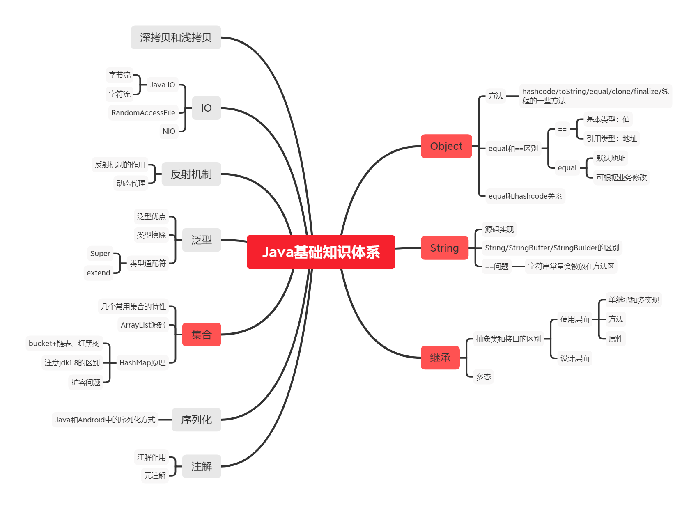

# Android面试大全

面试题包含java基础，数据结构，网络，Android，设计模式，Jvm，Kotlin等。适合中高级工程师。

## Java基础



### Object

#### equals和==的区别？equals和hashcode的关系？

- ==：基本类型比较值，引用类型比较地址。
- equals：默认情况下，equals作为对象中的方法，比较的是地址，不过可以根据业务，修改equals方法，比如String就重写了equals方法。

- 默认情况下，equals相等，hashcode必相等，hashcode相等，equals不是必相等、hashcode基于内存地址计算得出，可能会相等，虽然几率微乎其微。


### String

- String,StringBuffer和StringBuilder的区别？

- String:String属于不可变对象，每次修改都会生成新的对象。

- StringBuilder：可变对象，非多线程安全，效率高于StringBuffer

- StringBuffer：可变对象，多线程安全。


效率：StringBuilder>StringBuffer>String

### 面向对象的特征

java中抽象类和接口的特点？

**共同点：**

1. 抽象类和接口都不能生成具体的实例。

2. 都是作为上层使用。

**不同点：**

1. 抽象类可以有属性和成员方法，接口不可以。

2. 一个类只能继承一个类，但是可以实现多个接口。

3. 抽象类中的变量是普通变量，接口中的变量是静态变量。

4. 抽象类表达的是一种is-a的关系，即父类和派生子类在概念上的本质是相同的。

5. 接口表达的是一种like-a的关系，即接口和实现类的关系只是实现了定义行为，并无本质上的联系。

### 关于多态的理解？

多态是面向对象的三大特性：继承，封装和多态之一。

多态的定义：允许不同类对同一消息做出响应。

多态存在的条件

1. 要有继承。

2. 要有复写。

3. 父类引用指向子类对象。

java中多态的实现方式：接口实现，继承父类进行方法重写，同一个类中的方法重载。

### 集合

HashMap的特点是什么？HashMap的原理？

HashMap的特点：

1. 通过键的Hash值确定数组的位置。

2. 找到以后，如果该位置无节点，直接存放。

3. 该位置有节点即位置发生冲突，遍历该节点以及后续的节点，比较key值，相等则覆盖。

4. 没有就新增节点，默认使用链表，相连节点数超过8的时候，在jdk1.8中会变成红黑树。

5. 如果Hashmap中的数组使用情况超过一定比例，就回扩容，默认扩容两倍。

**这是存入的过程。需要注意的是：**

key的hash值计算过程是高16位不变，低16位取抑或，让更多位参与进来，可以有效的减少碰撞的发生。

初始数组容量为16，默认不超过的比例为0.75.

### 泛型

泛型的本质是参数化类型，在不创建新的类型的情况下，通过泛型指定不同的类型来控制形参具体限制的类型。也就是说在泛型的使用中，操作的数据类型被指定为一个参数，这种参数可以被用在类，接口和方法中，分别被称为泛型类，泛型接口和泛型方法。

泛型是java中的一种语法糖，能够在代码编写的时候起到类型检测的作用，但是虚拟机是不支持这些语法的。

泛型的优点：

1.类型安全，避免类型的强转。

2.提高了代码的可读性，不必要等到运行的时候才去强制转换。

**什么是类型擦除？**

不管泛型的类型传入哪一种类型实参，对于java来说，都会被当成同一类处理，在内存中也只占用一块空间，通俗一点来说，就是泛型之作用于代码编译阶段，在编译过程中，对于正确检验泛型结果后，会将泛型的信息擦除，也就是说，成功编译过后的class文件时不包含任何泛型信息的。

### 反射

动态代理和静态代理

静态代理很简单，运用的就是代理模式：声明一个接口，再分别实现一个真实的主题类和代理主题类，通过让代理类持有真实主题类，从而控制用户对真实主题的访问。

动态代理指的是在运行时动态生成代理类，即代理类的字节码在运行时生成并载入当前的ClassLoader。

动态代理的原理是使用反射，思路和上面的一致。

**使用动态代理的好处：**

1.不需要为RealSubject写一个形式完全一样的代理类。

2.使用一些动态代理的方法可以在运行时制定代理类的逻辑，从而提升系统的灵活性。

## java并发


java并发中考察频率较高的有线程，线程池，锁，线程间的等待和唤醒，线程特性和阻塞队列等。

### 线程

线程的状态有哪些？下图为一张状态转换图


**线程中wait和sleep的区别？**

wait方法即释放cpu，又释放锁。

sleep方法只释放cpu，但是不释放锁。

**进程和线程的区别？**

进程是资源分配的最小单位，线程是程序执行的最小单位，一个进程可以包含多个线程，在Android中，一个进程通常是一个App，App中会有一个主线程，主线程可以用来操作界面元素。如果有耗时操作，必须开启子线程执行。不然会导致ANR。进程间的数据是独立的，线程间的数据可以共享。

### 线程池

线程池地位十分重要，基本上涉及到跨线程的框架都是用到了线程池，比如`OkHttp`,`RxJava`,`LiveData`以及`协程`等。

**与新建一个线程相比，线程池的特点？**

1.节省开销，线程池中的线程可以重复利用。

2.速度快，任务来了就开始，省去创建线程的时间。

3.线程可控，线程数量可控和任务可控。

4.功能强大，可以定时和重复执行任务。

**线程池中的几个参数是什么意思，线程池的种类有哪些？**

线程池的构造函数如下：

> publicThreadPoolExecutor(intcorePoolSize,
>
> intmaximumPoolSize,
>
> longkeepAliveTime,
>
> TimeUnit unit,
>
> BlockingQueue workQueue){
>
>   this(corePoolSize, maximumPoolSize, keepAliveTime, unit, workQueue,
>
> ​       Executors.defaultThreadFactory(), defaultHandler);
>
> }


`参数含义：`

- corePoolize:核心线程数量，不会释放。

- maximumPoolSize:允许使用的最大线程池数量，非核心线程数量，闲置时会释放。

- keepAliveTime:闲置线程允许的最大闲置时间。

- unit：闲置时间的单位。

- workQueue:阻塞队列，不同的阻塞队列有不同的特性。


#### **线程池分为四个类型：**

1. CachedThreadPool:闲置线程超时会释放，没有闲置线程的情况下，每次都会创建新的线程。

2. FixedThreadPool:线程池只能存放指定数量的线程池，线程不会释放，可重复利用。

3. SingleThreadExecutor:单线程的线程池。

4. ScheduledThreadPool:可定时和重复执行的线程池。


#### **线程池的工作流程？**


1. 任务来了，优先考虑核心线程。

2. 核心线程满了，进入阻塞队列。

3. 阻塞队列满了，考虑非核心线程。

4. 非核心线程满了，再触发拒绝任务。

### 锁

#### 死锁触发的四大条件？

1. 互斥锁

2. 请求与保持

3. 不可剥夺

4. 循环的请求与等待

#### **synchronized关键字的使用？synchronized的参数放入对象和Class有什么区别？**

**synchronized关键字的用法：**

1. 修饰方法

2. 修饰代码块，需要自己提供锁对象，锁对象包括对象本身，对象的Class和其他对象。

放入对象和Class的区别是：

1. 锁住的对象不同：成员方法锁住的实例对象，静态方法锁住的是Class。

2. 访问控制不同：如果锁住的是实例，只会针对同一个对象方法进行同步访问，多线程访问同一个对象的synchronized代码块是串行的，访问不同对象是并行的。如果锁住的是类，多线程访问的不管是同一对象还是不同对象的synchronized代码块都是串行的。

#### **synchronized的原理？**

任何一个对象都有一个monitor与之相关联，JVM基于进入和退出mointor对象来实现代码块同步和方法同步，两者实现细节不同：

1. 代码块同步：在编译字节码的时候，代码块起始的地方插入monitorenter指令，异常和代码块结束处插入monitorexit指令，线程在执行monitorenter指令的时候尝试获取monitor对象的所有权。获取 不到的情况下就是阻塞。

2. 方法同步：synchronized方法在method_info结构有AAC_synchronized标记，线程在执行的时候获取对应的锁，从而实现同步方法。

#### **synchronized和 Lock 的区别 ？**

主要区别：

1. synchronized是Java中的关键字，是Java的内置实现；Lock是Java中的接口。

2. synchronized遇到异常会释放锁；Lock需要在发生异常的时候调用成员方法Lock#unlock（）方法。

3. synchronized是不可以中断的，Lock可中断。

4. synchronized不能去尝试获得锁，没有获得锁就会被阻塞；Lock可以去尝试获得锁，如果未获得可以尝试处理 其他逻辑。

5. synchronized多线程效率步入Lock，不过Java1.6以后已经对synchronized进行大量的优化，所以性能上来讲，其实差不了多少。

#### **悲观锁和乐观锁的举例？以及他们的相关实现？**

悲观锁和乐观锁的概念：

- 悲观锁：悲观锁会认为，修改共享数据的时候其他线程也会修改数据，因此只在不会受到其他线程干扰的情况下执行，这样会导致其他有需要锁的线程挂起，等到持有锁的线程释放锁。

- 乐观锁：每次不加锁，每次直接修改共享数据假设其他线程不会修改，如果发生冲突就直接重试，直到成功为止。


举例：

- 悲观锁：典型的悲观锁是独占锁，有synchronized，ReentrantLock。

- 乐观锁：典型的乐观锁是CAS,实现CAS的atomic为代表的一系列类。


#### **CAS是什么？底层原理？**

CAS全程Compare And Set，核心的三个元素是：内存位置，预期原值和新值，执行CAS的时候，会将内存位置的值与预期原值进行比较，如果一致，就将原值更新为新值，否则就不更新。

底层原理：**是借助CPU底层指令cmpxchg实现原子操作**。

### 线程间通讯

#### **notify和notifyAll方法的区别？**

notify随机唤醒一个线程，notifyAll唤醒所有等待的线程，让他们竞争锁。

#### **wait/notify和Condition类实现的等待通知有什么区别？**

synchronized与wait/notify结合的等待通知只有一个条件，而Condition类可以实现多个条件等待。

### 多线程间的特性

#### **多线程间的有序性，可见性和原子性是什么意思？**

原子性：执行一个或者多个操作的时候，要么全部执行，要么都不执行，并且中间过程中不会被打断。Java中的原子性可以通过独占锁和CAS去保证。

可见性：指多线程访问同一个变量的时候，一个线程修改了变量的值，其他线程能够立刻看得到修改的值。锁和volatile能够保证可见性。

有序性：程序执行的顺序按照代码先后的顺序执行。锁和volatile能够保证有序性。

#### **happens-before原则有哪些？**

Java内存模型具有一些先天的有序性，它通常叫做happens-before原则。

如果两个操作的先后顺序不能通过happens-before原则推倒出来，那就不能保证他们的先后执行顺序。虚拟机就可以随意打乱执行命令。happens-before原则有：

1. 程序次序规则：单线程程序的执行结果得和看上去代码执行的结果要一致。

2. 锁定规则：一个锁的lock操作一定发生在上一个unlock操作之后。

3. volatile规则：对volatile变量的写操作一定先行于后面对这个变量的对操作。

4. 传递规则：A发生在B前面，B发生在C前面，那么A一定发生在C前面。

5. 线程启动规则：线程的start方法先行发生于线程中的每个动作。

6. 线程中断规则：对线程的interrup操作先行发生于中断线程的检测代码。

7. 线程终结原则：线程中所有的操作都先行发生于线程的终止检测。

8. 对象终止原则：一个对象的初始化先行发生于他的finalize()方法的执行。

前四条规则比较重要。

#### **volatile的原理？**

可见性：如果对声明了volatile的变量进行写操作的时候，JVM会向处理器发送一条Lock前缀的指令，将这个变量所在缓存行的数据写入到系统内存。

多处理器的环境下，其他处理器的缓存还是旧的，为了保证各个处理器一致，会通过嗅探在总线上传播的数据来检测自己的数据是否过期，如果过期，会强制重新将系统内存的数据读取到处理器缓存。

有序性：Lock前缀的指令相当于一个内存栅栏，它确保指令排序的时候，不会把后面的指令排到内存栅栏的前面，也不会吧把前面的指令排到内存栅栏的后面。

### 阻塞队列

#### **通常的阻塞队列有哪几种？特点是什么？**

- ArrayBlockQueue: 基于数组实现的有界的FIFO（先进先出）阻塞队列。

- LinkedBlockQueue: 基于链表实现的无界的FIFO(先进先出)阻塞队列。

- SynchronousQueue: 内部没有任何缓存的阻塞队列。

- PriorityBlockingQueue: 具有优先级的无限阻塞队列。


#### **ConcurrentHashMap的原理**

数据结构的实现跟HashMap一样，不做介绍。

JDK1.8之前采用的是分段锁，核心类是一个Segment，Segment继承了ReentrantLock，每个Segment对象管理若干个桶，多个线程访问同一个元素的时候只能去竞争获取锁。

JDK1.8采用了CAS+synchronized，插入键值对的时候如果当前桶中没有Node节点，使用CAS方式进行更新，如果有Node节点，则使用synchronized的方式进行更新。

## 网络基础知识


### HTTP和HTTPS

#### **HTTP是哪一层的协议，常见的HTTP状态码有那些？分别代表什么意思？**

HTTP协议是应用层协议。

常见的HTTP状态码有：

> 1xx请求已经接收，继续处理
>
> 2xx服务器已经正确处理请求，比如200
>
> 3xx重定向，需要做进一步的处理才能完成请求
>
> 4xx服务器无法理解的请求，比如404，访问的资源不存在
>
> 5xx服务器收到请求以后，处理错误


#### **HTTP1.1和HTTP2有什么区别？**

HTTP2.0基于1.1，HTTP2.0增加了：

1.二进制格式：HTTP1.1使用纯文本进行通信，HTTP2.0使用二进制进行传输。

2.Head压缩：对已经发送的Header使用键值建立索引表，相同的Header使用索引表示。

3.服务器推送：服务器可以进行主动推送

4.多路复用：一个TCP连接可以划分成多个流，每个流都会分配Id，客户端可以借助流和服务端建立全双工进行通信，并且流具有优先级。


**HTTP和HTTPS有什么区别？**

简单来说，HTTP和HTTPS的关系是：HTTPS=HTTP+SSL/TLS

区别如下：

HTTP作用于应用层，使用80端口，起始地址是http://明文传输，消息容易被拦截，串改。

HTTPS作用域传输层，使用443端口，起始地址是https://，需要下载CA证书，传输的过程需要加密，安全性高。

**SSL/TLS的握手过程？**

这里借用《趣谈网络协议》的图片：


**HTTPS传输过程中是如何处理进行加密的？为什么又对称加密的情况下仍然需要进行非对称加密？**

过程和上图类似，一次获取证书，公钥，最后生成对称加密的钥匙进行对称加密。

对称加密可以保证加密效率，但是不能解决秘钥传输问题；非对称加密可以解决传输问题，但是效率不高。

### TCP相关

**TCP的三次握手过程，为什么需要三次，而不是两次或者四次？**


只发送两次，服务端是不知道自己发送的消息能不能被客户端接收到。

因为TCP握手是三次，所以此时双方都已经知道自己发送的消息能够被对方收到，所以，第四次的发送就显得多余了。

#### **TCP的四次挥手过程？**


大致意思：

Client:我要断开连接了

Server:我收到你的消息了

Server:我也要断开连接了

Client:收到你要断开连接的消息了

之后Client等待两个MSL(数据包在网络上生存的最长时间)，如果服务端没有回消息就彻底断开了。

#### **TCP和UDP有什么区别？**

TCP:基于字节流，面向连接，可靠，能够进行全双工通信，除此以外，还能进行流量控制和拥塞控制，不过效率略低。

UDP:基于报文，面向无连接，不可靠，但是传输效率高。

总的来说，TCP使用于传输效率要求低，准确性要求高或要求有连接。而UDP适用于对准确性要求低，传输效率要求较高的场景，比如语音通话，直播等。

#### **TCP为什么是一种可靠的协议？如何做到流量控制和拥塞控制？**

TCP可靠：是因为可以做到数据包发送的有序，无差错和无重复。

流量控制：是通过滑动窗口实现的，因为发送方和接收方消息发送速度和接收速度不一定对等，所以需要一个滑动窗口来平衡处理效率，并且保证没有差错和有序的接收数据包。

拥塞控制：慢开始和拥塞避免，快重传和快恢复算法，这些算法主要是为了适应网络中的带宽而做出的调整。

## 设计模式

### **1.六大原则**

单一职责：合理分配类和函数的职责

开闭原则：开放扩展，关闭修改

里式替换：继承

依赖倒置：面向接口

接口隔离：控制接口的粒度

迪米特：一个类应该对其他的类了解最少

### **2.单例模式**

单例的常用写法有哪几种？

懒汉模式：该模式主要问题是每次获取实例都需要同步，造成不必要的同步开销。

```java
public classSingleInstance{

private static SingleInstance instance;

private SingleInstance(){}

public static synchronized SingleInstance getInstance(){
        if(instance == null) {
          instance = new SingleInstance();
        }
        return instance;
	}
}
```

DCL模式：高并发环境下可能发生问题

> public classSingleInstance{
>
>   private static SingleInstance instance;
>
>   privateSingleInstance(){}
>
>   publicstaticSingleInstancegetInstance(){
>
> ​    if(instance == null) {
>
> ​      synchronized (SingleInstance.class) {
>
> ​        if(instance == null) {
>
> ​          instance = new SingleInstance();
>
> ​        }
>
> ​      }
>
> ​    }
>
> ​    return instance;
>
>   }
>
> }

静态内部类单例

> public classSingleInstance{
>
>   privateSingleInstance(){}
>
>   publicstaticSingleInstancegetInstance(){
>
> ​    return SingleHolder.instance;
>
>   }
>
>   private static classSingleHolder{
>
> ​    private static final SingleInstance instance = new SingleInstance();
>
>   }
>
> }

枚举单例

> public enum SingletonEnum {
>
>   INSTANCE
>
> }

优点：线程安全和反序列化不会生成新的实例。

**DCL模式会有什么问题？**

对象生成实例的过程中，大概会经过以下过程：

1.为对象分配内存空间

2.初始化对象中的成员变量

3.将对象指向分配的内存空间（此时对象就不为null）

由于JVM会优化指令顺序，也就是说2和3的顺序是不能保证的。在多线程的情况下，当一个线程完成了1.3过程后，当前线程的时间片已用完，这个时候会切换到另一个线程，另一个线程调用这个单例，会使用这个还没初始化完成的实例。

解决方法是使用volatile关键字：


### **需要关注的设计模式**

重点了解以下的几种常用的设计模式：

1.工厂模式和抽象工厂模式：注意他们的区别。

2.责任链模式：View的事件分发和OkHttp的调用过程都使用到了责任链模式。

3.观察者模式：重要性不言而喻。

4.代理模式：建议了解一下动态代理。

### MVC/MVP/MVVM

MVC,MVP和MVVM应该是设计模式中考察频率最高的知识点了，严格意义上来说，他们不能算是设计模式，而是框架。

#### **MVC、MVP和MVVM是什么？**

MVC:Model-View-Controller，是一种分层解耦的框架，Model层提供本地数据和网络请求，View层处理视图，Controller处理逻辑，存在问题是Controller层的划分不明显，Model层和View层存在耦合。

MVP:Model_View_Presenter,是对MVC的升级，Model层和View层与MVC的意思一致，但Model层和View层不再存在耦合，而是通过Presenter层这个桥梁进行交流。

MVVM:Model_View_ViewModel：不同于上面的两个框架，ViewModel持有数据状态，当数据状态改变的时候，会自动通知View层进行更新。

#### **MVC和MVP的区别是什么？**

MVP是MVC的进一步解耦，简单来讲，在MVC中，View层既可以和Controller层交互，又可以和Model层交互，而在MVP中，View层只能和Presenter层交互，Model层也只能和Presenter层交互，减少了View层和Model层的耦合，更容易定位错误来源。

#### **MVVM和MVP的最大区别在哪里？**

MVP中的每个方法都需要你去主动调用，他其实是被动的，而MVVM中有数据驱动这个概念，当你的持有的数据状态发生变更的时候，你的View可以监听到这个变化，从而主动去更新，这其实是主动的。

#### **ViewModel如何知道View层的生命周期？**

事实上，如果你仅仅使用ViewModel，他是感知不了生命周期，他需要结合LiveData去感知生命周期，如果仅仅使用DataBinding去实现MVVM，它对数据源使用了弱引用，所以一定程度上可以避免内存泄露的发生。

## Android基础


### Activity

#### **Activity的四大启动模式，以及应用场景？**

standard:标准模式，每次都会在活动栈中生成一个新的Activity实例，通常我们使用的活动都是标准模式。

singleTop:栈顶复用，如果Activity实例已经存在栈顶，那么就不会再活动栈中创建新的实例。比较常见的场景就是给通知跳转的Activity设置，因为你肯定不想前台Activity已经是该Activity的情况下，点击通知，又创建一个同样的Activity。

singleTask：栈内复用，如果Activity实例在当前栈中已经存在，就会将当前Activity实例上面的其他Activity实例都移除出栈，常见于跳转到主界面。

singleInstance:单例模式，创建一个新的任务栈，这个活动实例独自处在这个活动栈中。

### 屏幕适配

使用的屏幕适配方案？原理是什么？

屏幕适配一般采用的头条的屏幕适配方案。简单来说，以屏幕的一边作为适配，通常是宽。

原理：设备像素px和设备独立像素dp之间的关系。

px = dp*density

假设UI给的设计图屏幕宽度基于360dp，那么设备宽的像素点已知，即px,dp也已知，360dp，所以density = px/dp,之后根据这个修改系统中跟density相关的知识点即可。

### Android消息机制

#### **Android消息机制介绍？**

Android消息机制中的四大概念：

ThreadLocal:当前线程存储的数据仅能从当前线程取出。

MessageQueue：具有时间优先级的消息队列。

Looper：轮询消息队列，看是否有新的消息到来。

Handler：具体处理逻辑的地方。

**过程：**

1.准备工作：创建Handler，如果是在子线程中创建，还需要调用Looper#prepare()，在Handler的构造函数中，会绑定其中的Looper和MessageQueue。

2.发送消息：创建消息，使用Handler发送。

3.进入MessageQueue:因为Handler中绑定这消息队列，所以Message很自然的被放进消息队列。

4.Looper轮询消息队列：Looper是一个死循环，一直观察有没有新的消息到来，之后从Message取出绑定的Handler，最后调用Handler中的处理逻辑，这一切都发生在Looper循环的线程，这也是Handler能够在指定线程处理任务的原因。

**Looper在主线程中死循环为什么没有导致界面的卡顿？**

1.导致卡死的是在UI线程中执行耗时操作导致界面出现掉帧，甚至ANR。Looper.Loop()这个操作本身不会导致这个情况。

2.有人可能说，我在点击事件中设置死循环会导致界面卡死，同样都是死循环，不都一样吗？Looper会在没有消息的时候阻塞当前线程，释放CPU资源，等到有消息到来的时候，再唤醒主线程。

3.App进程中是需要死循环的，如果循环结束的话，App进程就结束了。

建议阅读：

> 《Android中为什么主线程不会因为Looper.loop()里的死循环卡死？》
>
> https://www.zhihu.com/question/34652589
>
> **主线程的死循环一直运行是不是特别消耗CPU资源呢？** 其实不然，这里就涉及到**Linux pipe/epoll机制**，简单说就是在主线程的MessageQueue没有消息时，便阻塞在loop的queue.next()中的nativePollOnce()方法里，详情见[Android消息机制1-Handler(Java层)](https://link.zhihu.com/?target=http%3A//www.yuanhh.com/2015/12/26/handler-message-framework/%23next)，**此时主线程会释放CPU资源进入休眠状态，直到下个消息到达或者有事务发生**，通过往pipe管道写端写入数据来唤醒主线程工作。这里采用的epoll机制，是一种IO多路复用机制，可以同时监控多个描述符，当某个描述符就绪(读或写就绪)，则立刻通知相应程序进行读或写操作，本质同步I/O，即读写是阻塞的。 **所以说，主线程大多数时候都是处于休眠状态，并不会消耗大量CPU资源。**
>
> 
>
> 作者：Gityuan
> 链接：https://www.zhihu.com/question/34652589/answer/90344494
> 来源：知乎
> 著作权归作者所有。商业转载请联系作者获得授权，非商业转载请注明出处。

#### **IdleHandler介绍？**

IdleHandler是在Handler空闲时处理空闲任务的一种机制。

执行场景：

MessageQueue没有消息，队列为空的时候。

MessageQueue属于延迟消息，当前没有消息执行的时候。

会不会发生死循环：

肯定会，MessageQueue使用计数的方法保证一次调用MessageQueue#next方法只会使用一次的IdleHandler集合。

### View事件分发机制。

建议阅读《Android开发艺术探索》第三章，很详细。

#### 事件分发机制说明？有哪些流程？

1. 事件分发有三个流程：分发，拦截，消费；
2. 事件最先到达Activity，然后由Activity进行分发(dispatchTouchEvent)，如果Activity分发过程中没有对象处理事件，则最终由Activity进行处理；
3. Activity分发时，会调用Window的superDispatchTouchEvent方法，然后调用到DecorView的（也就是最顶层的ViewGroup的）dispatchTouchEvent方法；
4. ViewGroup则首先尝试拦截，如果本身不拦截（onInterceptTouchEvent），则继续往子View传递；
5. View如果消费事件，则返回true，View如果没有消费事件，则又往上传递，看是否有ViewGroup来消费事件（onTouchEvent）；
6. 如果ViewGroup也都没有消费事件，则最终由Activity来处理；

#### 滑动冲突如何解决？具体在哪个方法里面解决？如何判断滑动方向？

1. 有两种方法：
   1. 外部拦截，在上层ViewGroup中拦截
   2. 内部拦截，在View中拦截
2. 外部拦截：在ViewGroup的`onInterceptTouchEvent`方法中进行是否拦截的逻辑判断；
3. 内部拦截：在子控件事件处理的`dispatchTouchEvent`过程中适当的时机调用`requestDisallowInterceptTouchEvent`方法来告知上层的容器拦截或者不拦截事件；
4. **判断滑动方向**：
   * 屏幕左上角坐标为 $(0,0)$  ，根据当前事件的坐标减去手指落下时的坐标，得到两个值$dx，dy$ 
   * 如果 $dx > 0$，则表示向右滑动，反之，则向左滑动
   * 如果 $dy > 0$ ，则表示向下滑动，反之，则向上滑动
   * 通过打开触摸位置可以看到触摸中的坐标及 $dx$ 和 $dy$


### View绘制原理

#### View绘制一秒钟调用多少次？

一秒60次，16ms一次。

Android系统每隔16ms发出VSYNC（垂直同步）信号，触发GPU对UI进行渲染，如果你的某个操作花费时间是24ms，系统在得到VSYNC信号的时候由于还没有准备好，就无法进行更新任何内容，那么用户在32ms内看到的会是同一帧画面（卡顿现象），即丢帧现象。

内容输出到帧缓存中，垂直同步的时候从其中取出绘制到屏幕上面，如果16ms内没有准备好，那么就不会刷新屏幕，出现掉帧。

#### View绘制流程


### Bitmap

#### **Bitmap的内存计算方式？**

在已知图片的长和宽的像素情况下，影响内存大小的因素会有资源文件位置和像素点大小。

**常见的像素点有：**

ARGB_8888:4个字节

ARGB_4444,ARGB_565:2个字节

**资源文件位置：**

不同dpi对应存放的文件夹

比如一个一张图片的像素为180*180px，dpi（设备独立像素密度）为320，如果它仅仅存放在drawable-hdpi,则有

> 横向像素点=180*320/240+0.5f = 240px
>
> 纵向像素点=180*320/240+0.5f = 240px

如果它仅仅存放在drawable-xxhdpi,则有

> 横向像素点=180*320/480+0.5f=120px
>
> 纵向像素点=180*320/480+0.5f=120px

所以，对于一张180*180px的图片，设备dpi为320，资源图片仅仅存在drawable-hdpi,像素点大小为ARGB_4444,最后生成的文件内存大小为：

> 横向像素点=180*320/240+0.5f=240px
>
> 纵向像素点=180*320/240+0.5f=240px
>
> 内存大小=240*240*2 = 115200 byte 越等于 112.5kb

建议阅读；

> 《Android Bitmap的内存大小是如何计算的？》
>
> https://ivonhoe.github.io/2017/03/22/Bitmap&Memory/

#### **Bitmap的高效加载？**

Bitmap的高效加载在Glide中也用到了，思路：

1. 获取需要的长和宽，一般获取控件的长和宽。

2. 设置BitmapFactory.Options中的inJustDecodeBounds为true，可以帮助我们在不加载内存的方式获得Bitmap的长和宽。

3. 对需要的长和宽和Bitmap的长和宽进行对比，从而获得压缩比例，放入BitmapFactory.Options中的inSampleSize属性。

4. 设置BitmapFactory.Options中的inJustDecodeBounds为false,将图片加载进内存，进而设置到控件中。

#### 跨进程传递大图

应用进程在启动 Binder 机制时会映射一块 1M 大小的内存，所有正在进行的 Binder 事务共享这 1M 的缓冲区。当使用 Intent 进行 IPC 时申请的缓存超过 1M，**较大的 bitmap 直接通过 Intent 传递容易抛异常是因为 Intent 启动组件时，系统禁掉了文件描述符 fd 机制 , bitmap 无法利用共享内存，只能拷贝到 Binder 映射的缓冲区，导致缓冲区超限, 触发异常; 而通过 putBinder 的方式，避免了 Intent 禁用描述符的影响，bitmap 写 parcel 时的 allowFds 默认是 true , 可以利用共享内存，所以能高效传输图片。**

```java
Bundle bundle = new Bundle();
bundle.putBinder("binder", new IRemoteGetBitmap.Stub() {
    @Override
    public Bitmap getBitMap() throws RemoteException {
        return mBitmap;
    }
});
intent.putExtras(bundle);
```

## Android进阶


Android进阶中重点考察Android Framework,性能优化和第三方框架。

### **Binder**

#### Binder通信机制是什么？（是什么，有什么优势，为什么要用它）
2. 实现的原理是什么？

* Binder是Android上面的IPC进程通信机制，提供了高效的，可以进行权限管理通信机制，并且封装为C/S架构，方便使用。
* Binder通信机制是Android系统的核心部分，我们的应用使用系统的各种服务，APP的生命周期管理等都是通过Binder机制来向系统请求服务的；
* 原理： Binder通信机制中主要参与者有Binder服务端，Binder客户端及Binder驱动程序；Binder客户端及服务端着分别位于需要通信的两个用户进程，Binder驱动程序位于内核空间，用户进程之间相互隔离，一般无法互相访问内存，而运行于内核空间的Binder驱动则充当通信的桥梁。
  * 服务端需要先注册到Binder驱动中，注册时需要先打开binder设备驱动，然后映射内存缓存区到用户空间，之后通过ioctl控制命令来往缓冲区写入命令；
  * 客户端也需要打开binder驱动，然后申请分配缓冲区，之后通过ioctl控制命令来查找对应的Service

#### 其中的主要参与对象有哪些，分别有什么作用？

* 主要对象包括：
  * Binder驱动 - 运行于内核控件，提供进程的渠道及管理；
  * Binder服务端对象 - 系统提供的服务端实现类，用于实现Binder的通信机制中业务无关的部分；
  * BinderStub对象 - 业务需要实现的部分，提供具体的业务功能接口实现；
  * BinderProxy对象 - 对于Binder对象的代理接口对象，用于给客户端来调用服务对象的方法；
  * ServiceManager对象 - Binder服务管理的上下文对象，系统服务需要注册到ServiceManager中，其本身也是一个Binder Service对象。

#### Binder的机制被用在什么地方？

* APP请求系统框架服务都是通过这个来的
* Intent
* 广播等

#### AIDL是什么？如何使用？

* AIDL就是Android接口定义语言，用于**简化Binder通信机制中的模板代码的编写**，让我们专注于业务实现。

* 对于APP来说，需要编写Service时需要编写AIDL文件来定义IPC的接口；

* 使用的时候需要先提供一个AIDL文件编写通信接口，放入到客户端可服务端的项目中，编译时AIDL文件会生成对应的Java文件，其中包括

  * 一个Stub和一个Proxy类
  * 我们的服务端代码中创建一个Binder类实现Stub类，覆盖里面我们自己的业务接口方法，用于提供具体的业务通信代码，并且在onBind方法中方法我们的Binder对象；
  * 我们的客户端bind服务时提供一个ServiceConnect的对象，用于接收服务绑定的回调，并在服务绑定回调中，通过Stub#asInterface 静态方法将Binder服务对象转换为一个Proxy对象
  * 后续我们在客户端中即可使用这个Proxy对象来访问远程的服务；

  > 服务端和客户端都是我们自己定义的，所以，AIDL编译工具会为我们生成模板代码，包括stub和proxy，其中stub供我们继承实现服务端的接口。proxy用来帮助我们作为客户端同Server进行通讯。

#### oneway关键字

默认情况下，通过Proxy对象访问另外一个进程的远程方法时，是同步调用的，也就是说会等待返回结果后才能执行结束，使用oneway关键字在AIDL接口生命中标注接口即接口方法即可将接口调用设置为异步调用的，即调用后会立刻返回，通过我们调用方法时传递的回调对象来通知客户端处理结果；

### 序列化

#### **Android有那些序列化方式？**

为了解决Android中内存序列化速度过慢的问题，Android使用了Parcelable.


### Framework

#### **Zygote孕育进程过程？**


#### **Activity的启动过程？**


建议阅读：

> 《3分钟看懂Activity启动流程》
>
> https://www.jianshu.com/p/9ecea420eb52

#### **App的启动过程？**

介绍下App进程和System Server进程如何联系：


**App进程**

- ActivityThread:依赖于UI线程，实际处理与AMS中交互的工作。

- ActivityManagerService:负责Activity,Service等的生命周期工作。

- ApplicationThread:System Server进程中ApplicationThreadProxy的服务端，帮助System Server进程跟App进程交流。

- System Server:Android核心的进程，掌管着Android系统中各种重要的服务。


**具体过程：**

1. 用户点击App图标，Lanuacher进程通过Binder联系到System Server进程发起startActivity。

2. System Server通过Socket联系到Zygote,fork出一个新的App进程。

3. 创建一个新的App进程以后，Zygote启动App进程的ActivityThread#main()方法。

4. 在ActivityThread中，调用AMS进行ApplicationThread的绑定。

5. AMS发送创建Application的消息给ApplicationThread，进而转交给ActivityThread中的H,他是一个Handler，接着进行Application的创建工作。

6. AMS以同样的方式创建Activity，接着就是大家熟悉的创建Activity的工作了。

#### **APK的安装过程？**

建议阅读：

> 《Android Apk安装过程分析》
>
> https://www.jianshu.com/p/953475cea991

#### **Activity启动过程跟Window的关系？**

建议阅读：

> 《简析Window、Activity、DecorView以及ViewRoot之间的错综关系》
>
> https://juejin.im/post/5dac6aa2518825630e5d17da

#### **Activity,Window,ViewRoot和DecorView之间的关系？**

建议阅读：

> 《总结UI原理和高级的UI优化方式》
>
> https://www.jianshu.com/p/8766babc40e0

### Context

关于Context的理解？

建议阅读：

> 《Android Context 上下文 你必须知道的一切》
>
> https://blog.csdn.net/lmj623565791/article/details/40481055

### 断点续传

**多线程断点续传？**

基础知识：

1. Http基础：在Http请求中，可以加入请求头Range，下载特定区间的文件数。

2. RandomAccessFile：支持随机访问，可以从指定位置进行数据的读写。

### 性能优化

平时做了哪些性能优化？

建议阅读：

> 《Android 性能优化最佳实践》
>
> https://juejin.im/post/5b50b017f265da0f7b2f649c

#### 性能优化哪些方面？

布局，内存，网络，电量，多线程，卡顿

#### 一般怎么进行内存优化？内存优化主要针对哪些问题？

避免内存泄漏，内存溢出-OOM，优化不必要的内存使用；

#### 垃圾回收机制

> [浅析JAVA的垃圾回收机制（GC） - 简书 (jianshu.com)](https://www.jianshu.com/p/5261a62e4d29)

***1.什么是垃圾回收？\***

  垃圾回收(Garbage Collection)是Java虚拟机(JVM)垃圾回收器提供的一种用于在空闲时间不定时回收无任何对象引用的对象占据的内存空间的一种机制。

  注意：垃圾回收回收的是无任何引用的对象占据的内存空间而不是对象本身。换言之，垃圾回收只会负责释放那些对象占有的内存。对象是个抽象的词，包括引用和其占据的内存空间。当对象没有任何引用时其占据的内存空间随即被收回备用，此时对象也就被销毁。但不能说是回收对象，可以理解为一种文字游戏。

***分析：***

  引用：如果Reference类型的数据中存储的数值代表的是另外一块内存的起始地址，就称这块内存代表着一个引用。（***引用都有哪些？对垃圾回收又有什么影响？***）

  垃圾：无任何对象引用的对象（***怎么通过算法找到这些对象呢？***）。

  回收：清理“垃圾”占用的内存空间而非对象本身（***怎么通过算法实现回收呢？\***）。

  发生地点：一般发生在堆内存中，因为大部分的对象都储存在堆内存中（***堆内存为了配合垃圾回收有什么不同区域划分，各区域有什么不同？***）。

  发生时间：程序空闲时间不定时回收（***回收的执行机制是什么？******是否可以通过显示调用函数的方式来确定的进行回收过程？\***）

  带着这些问题我们开始进一步的分析。

***2.Java中的对象引用\***

 （1）强引用（Strong Reference）：如“Object obj = new Object（）”，这类引用是Java程序中最普遍的。只要强引用还存在，垃圾收集器就永远不会回收掉被引用的对象。

 （2）软引用（Soft Reference）：它用来描述一些可能还有用，但并非必须的对象。在系统内存不够用时，这类引用关联的对象将被垃圾收集器回收。JDK1.2之后提供了SoftReference类来实现软引用。

 （3）弱引用（Weak Reference）：它也是用来描述非须对象的，但它的强度比软引用更弱些，被弱引用关联的对象只能生存到下一次垃圾收集发生之前。当垃圾收集器工作时，无论当前内存是否足够，都会回收掉只被弱引用关联的对象。在JDK1.2之后，提供了WeakReference类来实现弱引用。

 （4）虚引用（Phantom Reference）：最弱的一种引用关系，完全不会对其生存时间构成影响，也无法通过虚引用来取得一个对象实例。为一个对象设置虚引用关联的唯一目的是希望能在这个对象被收集器回收时收到一个系统通知。JDK1.2之后提供了PhantomReference类来实现虚引用。


作者：简欲明心
链接：https://www.jianshu.com/p/5261a62e4d29
来源：简书
著作权归作者所有。商业转载请联系作者获得授权，非商业转载请注明出处。


### 第三方库

一定要在熟练使用后再去查看原理。

#### **Glide**

Glide考察的频率挺高的，常见的问题有：

1. Glide和其他图片加载框架的比较？

2. 如何设计一个图片加载框架？

3. Glide缓存实现机制？

4. Glide如何处理生命周期？

建议阅读：

> 《Glide最全解析》
>
> https://blog.csdn.net/sinyu890807/category_9268670.html
>
> 《面试官：简历上最好不要写Glide，不是问源码那么简单》
>
> https://juejin.im/post/5dbeda27e51d452a161e00c8


#### **OkHttp**

OkHttp常见知识点：

1. 责任链模式

2. interceptors和networkInterceptors的区别？

建议看一遍源码，过程并不复杂。

#### **Retrofit**

Retrofit常见问题：

1. 设计模式和封层解耦的理念

2. 动态代理

建议看一遍源码，过程并不复杂。

#### **RxJava**

RxJava难在各种操作符，我们了解一下大致的设计思想即可。

建议阅读一些RxJava的文章。

#### **Android Jetpack**

我们主要阅读了Android Jetpack中以下库的源码：

1. Lifecycle: 观察者模式，组件生命周期中发送事件。

2. DataBinding: 核心就是利用LiveData或者Observable xxx 实现的观察者模式，对16进制的状态位更新，之后根据这个状态位取更新对应的内容。

3. LiveData：观察者模式，事件的生产消费模型。

4. ViewModel：借用Activity异常销毁时存储隐藏Fragment的机制存储ViewModel，保证数据的生命周期尽可能的延长。

5. Paging: 设计思想。

建议阅读：

> 《Android Jetpack源码分析系列》
>
> https://blog.csdn.net/mq2553299/column/info/24151


> 作者：简雨山舍
> 链接：https://www.jianshu.com/p/554bb50385b7
> 来源：简书
> 著作权归作者所有。商业转载请联系作者获得授权，非商业转载请注明出处。