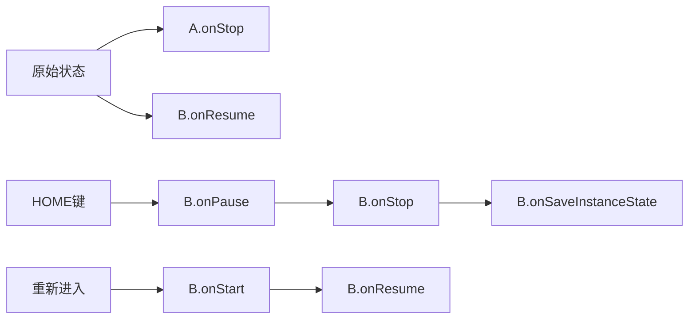

# Activity的启动模式

> 2021/03/18 简单总结：（把面试官当作什么角色？有Android经验的，还是零基础的？）
>
> 1. 启动模式首先要看针对的目标，目标是activity，那么activity是什么？
> 2. Activity就是Android上面任务的一个活动；多个活动组成一个任务；Andriod里面用**任务栈**表示；
> 3. Activity是一个类，可以有多种子类，代表不同的活动类型；每个具体的活动类型可以生成一个实例也可以生成多个实例；比方说，看邮件可以是看工作邮件，也可能是生活邮件，这个动作可以是两个不同的实例；
> 4. 启动模式就是控制一个Activity能生成几个实例，属于哪个任务栈，位于任务栈的什么位置；
> 5. 从生成几个实例来说：singleInstance 只能有一个实例，而其他三种能够有多个实例；而singleTask在一个任务栈中只能有一个实例，而其他两种可以在一个任务栈中有多个实例，区别在于singleTop在启动时，如果有对应的类型的实例位于顶部，就不重新创建，而是复用当前顶部的使用onNewIntent通知，而standard则始终会创建；
> 6. 从属任务栈这个方面来说，一个是属于哪个任务栈，二是位于任务栈的什么位置：singleInstance只能属于一个任务栈，且任务栈中只有它自己一个活动；singleTask可以属于多个任务栈，任务栈中可以添加其他实例；singleTop和standard则都可以属于多个任务栈，可以放在任务栈中的任意位置。
> 7. 指定启动模式的方式：
>    1. manifest文件中定义Activity时，可以支持四种模式；
>    2. start时传递的Intent中，通过addFlag来设置标记，支持覆盖为两种（singleTask-FLAG_ACTIVITY_NEW_TASK和singleTop-FLAG_ACTIVITY_SINGLE_TOP）
>    3. 其中intent中通过代码动态设置的优先级比manifest中的优先级高；
> 8. 可能奇怪的问题：
>    1. singleInstance如果不设置单独的taskAffinity，那么会占用当前任务在最近任务中的入口；
>    2. standard及singleTop上设置taskAffinity无效；
> 9. onNewIntent的调用时机：
>    1. 要启动singleTop的Activity实例时，已经有实例在将要启动的任务栈顶部的，再次启动时，会onNewIntent
>    2. 要启动singleTask的实例时，如果已经有实例在当前任务中（不管是否在顶部），则会先清除其顶部的所有actiity，然后调用onNewIntent
>    3. singleInstance的实例，如果已经有启动过，再次启动时；
> 10. taskAffinity 用法
>     1. 用于指定Activity对任务的亲和度；
>     2. 默认情况下为appID；
>     3. 如果声明了新的taskAffinity，需要启动模式为singleTask或者singleInstance才可以启动到新的任务栈；

1. Android上Activity只一个活动，一般占据一个屏幕的内容；

2. 一系列逻辑上相关的活动组成一个任务，任务以栈的方式存储Activity；

3. Activity是一个类模板，一个Activity可以有多个实例；

4. 启动模式主要是关于Activity实例个数及如何与任务关联的标识；

   | 模式           | 实例个数 | 在任务栈中的位置                                             |
   | -------------- | -------- | ------------------------------------------------------------ |
   | standard       | N个      | 多个任务栈任意位置；可以属于多个任务，一个任务中可以有多个实例 |
   | singleTop      | N个      | 多个任务栈任意位置；如果需要新实例时目标任务栈中有实例在顶部，则使用当前顶部的，否则创建新的放到顶部 |
   | singleTask     | N个      | 多个任务栈，一个任务栈中只能有一个；如果目标任务栈中已经存在，则清除其顶部的其他Activity，然后使用newIntent通知（1） |
   | singleInstance | 1个      | 始终位于任务栈的底部，任务栈中不能放入其他任务栈             |

   > 开启新的任务栈的方式
   >
   > - 应用默认的`taskAffnity`为`applicationId`，故不同的应用启动的`Activity`默认属于不同的任务栈；
   > - 使用 `taskAffnity` 指定任务栈的亲和性，如声明的`taskAffnity`与当前的不同，则启动到`taskAffnity`指定的任务栈中；Activity的启动模式必须为singleTask或者singleInstance模式；
   > - 启动时使用 `FLAG_ACTIVITY_NEW_DOCUMENT` 标识，此时`taskAffnity`可能一样，但是却属于不同的任务，其`taskId`不一样；

5. 指定启动模式的方式
   1. 通过在manifest中声明 `launchMode` 属性；
   2. 通过在启动Intent的代码中加入FLAG；
   3. 差异：
      1. Intent中的优先级要高；
      2. Intent中只能指定singleTask（`FLAG_ACTIVITY_NEW_TASK`）和singleTop（`FLAG_ACTIVITY_SINGLE_TOP`）

6. 其他启动标记说明
   1. `FLAG_ACTIVITY_CLEAR_TOP` + `standard`： Activity实例会被销毁，然后重新创建；
   2. `FLAG_ACTIVITY_CLEAR_TOP` + `FLAG_ACTIVITY_SINGLE_TOP`： 使用当前实例处理onNewIntent处理intent；
   3. `FLAG_ACTIVITY_CLEAR_TOP` + `FLAG_ACTIVITY_NEW_TASK`：和将任务切换到前台，然后清除目标activity顶部的activity，可用于从通知管理器中启动Activity。

7. `allowTaskReparting`: 允许任务重新分配属于的任务，如启动时属于当前任务，当回到后台后会回归声明中的任务栈；


# Activity生命周期

## 生命周期方法

| 生命周期方法 | 说明                                                         | 执行哪些动作                                                 | 对应的OnLifecycleEvent |
| ------------ | ------------------------------------------------------------ | ------------------------------------------------------------ | ---------------------- |
| onCreate     | 首次创建时执行，调用一次                                     | 基本的应用启动逻辑：设置布局，绑定数据到列表，关联ViewModel等 | ON_CREATE              |
| onStart      | Activity进入已开始状态时回调                                 | 为Activiy进入前台支持互动做准备：初始化界面内容              | ON_START               |
| onResume     | 进入已恢复状态，进入前台时调用                               | 此时应用处于与用户互动的状态，直到事件发生（跳转到另外的Activity，关闭屏幕）：执行在可见时需要完成的功能 | ON_RESUME              |
| onPause      | Activity 不再位于前台（尽管在用户处于多窗口模式时 Activity 仍然可见 | 1）暂停或者调整已暂停状态不应继续的工作，希望很快恢复的操作；<br/>2）释放系统资源、传感器（例如 GPS）手柄<br/> 3)由于时间有限，不应该用于保存应用或用户数据，网络请求及数据库事物；（在onStop时进行高负债的关闭操作） | ON_PAUSE               |
| onStop       | 不在对用户可见-已停止状态，新的Activity覆盖了整个屏幕或调用了finish | 执行应用未显示在屏幕上的时候的事情，CPU相对密集的关闭操作，持久化数据库 | ON_STOP                |
| onDestroy    | stop->onRestart<br/>stop->onDestroy<br/>调用时机：1）用户关闭或主动finish；2）配置变更系统自动销毁； | 销毁前调用，                                                 | ON_DESTROY             |

> 1. 选择在哪个构建事件中执行初始化操作，都请务必使用相应的生命周期事件来释放资源。如果您在收到 ON_START 事件后初始化某些内容，请在收到 ON_STOP 事件后释放或终止相应内容。如果您在收到 ON_RESUME 事件后初始化某些内容，请在收到 ON_PAUSE 事件后将其释放。
> 2. 建议将相关代码放到生命周期感知型组件中，而不是直接放入到回调方法中；
> 3. 进入onPause的原因：
>    1. 事件中断-如启动新的Activity；（来电话，启动新的等）
>    2. 多窗口模式下焦点切换到其他应用窗口时；
>    3. 新的半透明的Activity（如对话框）处于开启状态；
> 4. 在onPause不要执行耗时操作，应该在onStop中执行；
> 5. onStop时Activity还停留在内存中即保有状态和成员信息（除非资源不足回收），不过从窗口管理器中取消了关联；


其他问题：

* 生命周期组件使用方法
* isFinishing的作用
* Activity状态恢复：[Google文档](https://developer.android.com/guide/components/activities/activity-lifecycle#saras)

## 问题


### A启动B，调用序列


### A启动B，然后back


### A启动B，然后Home



注意，此时A不参与

## onSaveInstance调用时机

因为系统原因需要暂时销毁回收Activity，如在后台时资源不足，如配置变化需要自动重启；

* Android P 以下：onStop之前，但是不确定时在onPause之前还是之后
* Android P 以上：onStop之后，onDestory之前（如果有的话）

恢复使用方法：

* onCreate(Bundle):
* onRestoreInstanceState(Bundle)，这个方法在onStart之后调用，仅仅当自动重新创建activity时调用；


# Bitmap内存优化

## Bitmap内存占用计算方式

### 屏幕密度缩放

| 属性              | 说明                                                         |      |
| ----------------- | ------------------------------------------------------------ | ---- |
| `inDensity`       | bitmap将要使用的像素密度。对应的bitmap将会将density设置为此值（参考 `Bitmap#setDensity(int)`）。不过，如果设置了 `inScaled` 且这个 `inDensity` 的值和 `inTargetDensity` 不匹配，那么bitmap将会在返回之前缩放到 `inTargetDensity` 的密度值；<br/>当值为 0 时, `BitmapFactory#decodeResource(Resources, int)`, `BitmapFactory#decodeResource(Resources, int, android.graphics.BitmapFactory.Options)`, 和 `BitmapFactory#decodeResourceStream` 将会使用对应资源所对应的密度值。其他函数会将会保持不变并不会应用任何density。 |      |
| `inScaled`        | 当设置为true时，如果 `inDensity` 和 `inTargetDensity` 不为0，则bitmap在加载时将会被缩放以匹配 `inTargetDensity`。而不是每次绘制到Canvas时都依赖于图形系统对其进行缩放。<br/>BitmapRegionDecoder 会忽略这个标识，并且不会基于density进行缩放。（不过它支持 `inSampleSize` ）。<br/>默认情况下为true，如果你希望得到非缩放版本的bitmap，需要手动关掉这个标识。 点九图会忽略这个标识，并且一直应用缩放； |      |
| `inTargetDensity` | bitmap将要被绘制时的目标像素密度；和`inScaled` 及`inDensity`一起使用用于决定如何缩放bitmap。 |      |
| `inScreenDensity` | 真实屏幕的像素密度. 适用于以密度兼容代码运行的应用程序, 其中`inTargetDensity`实际上是应用程序看到的密度，而不是实际屏幕的密度。<br/>通过设置此项，您可以允许加载代码避免将屏幕密度中当前的位图放大/缩小到兼容密度。相反，如果inDensity与inScreenDensity相同，则位图将保持不变。所有使用结果位图的代码都必须使用`Bitmap＃getScaledWidth（int）`和`Bitmap＃getScaledHeight`来计算位图密度与目标密度之间的差异。<br/>`BitmapFactory` 不会自动设置这个值，必须被显式的调用，因为调用者必须以密度感知的方式处理生成的位图。 |      |


缩放比例的计算逻辑：

```flow
st=>start: 开始
opScaled=>operation: 
cond=>condition: inScaled是否设置？
condDensity=>condition: inDensity是否=0？
condTargetDensity=>condition: inTargetDensity是否=0？
condEqualScreenDensity=>condition: inDensity==inScreenDensity?
eOne=>end: scale=1.0f
opScaled=>operation: scale=inTargetDensity/inDensity

st->cond

cond(yes)->condDensity
cond(no)->eOne

condDensity(no)->condTargetDensity
condDensity(yes)->eOne

condTargetDensity(no)->condEqualScreenDensity
condTargetDensity(yes)->eOne

condEqualScreenDensity(yes)->eOne

opScaled->eOne

```


计算公式：
$$
\begin{align}

bitmapSize = scaledWidth \times scaledHeight \times pixelSize \\
\\
scaledWidth = scale \times width \\
scaleHeight = scale \times height \\
\\
scale = 1.0f \\
或者 \\
scale = targetDensity/density \\

\end{align}
$$
即： $bitmapSize=(targetDensity/density \times width) \times (targetDensity/density \times height)\times pixelSize$

不同情况下默认的targetDensity和density(bitmap的密度)的值：

| 情况             | targetDensity(如为xhdpi) | density          | scale                        |
| ---------------- | ------------------------ | ---------------- | ---------------------------- |
| res/drawable     | 设备密度（2.0f）         | 1.0f             | 设备密度（2.0f）/1.0f=2      |
| res/raw          | 设备密度（2.0f）         | 1.0f             | 设备密度（2.0f）/1.0f=2      |
| res/nodpi        | 设备密度（2.0f）         | 设备密度（2.0f） | 设备密度/设备密度 = 1        |
| res/mdpi         | 设备密度（2.0f）         | 1.0f             | 设备密度（2.0f）/1.0f = 2    |
| res/hdpi         | 设备密度（2.0f）         | 1.5              | 设备密度（2.0f）/1.5f = 1.33 |
| res/xhdpi        | 设备密度（2.0f）         | 2.0              | 设备密度（2.0f）/2.0f = 1    |
| res/xxhdpi       | 设备密度（2.0f）         | 3.0              | 设备密度（2.0f）/3.0f = 0.67 |
| res/xxxhdpi      | 设备密度（2.0f）         | 4.0              | 设备密度（2.0f）/4.0f = 0.5  |
| 文件/流/字节数组 | 设备密度（2.0f）         | 设备密度（2.0f） | 设备密度/设备密度 = 1        |

> ⚠️注意：上面表格的targetDensity和density都是160的倍数，如2.0f则表示实际的值为 2.0 x 160 = 320dpi

加载resource的时候，如果没有设置对应的密度信息，则默认情况下会设置成如下值：

* `inDensity` = 资源对应的密度（`DisplayMetrics.DENSITY_DEFAULT` 或者对应的具体值 ）
* `inTargetDensity` = `res.getDisplayMetrics().densityDpi`

也就是说默认情况下 inDensity 为资源的密度或者160(1.0f)，targetDensity 为屏幕密度，也就是默认缩放到屏幕密度；


我将bitmap的加载的缩放过程分为两种：

1. 解码时缩放；
2. 绘制时缩放；

对于bitmap的内存优化来说，应该在解码时尽量让解码出来的尺寸尽量匹配需要绘制的view的大小；而不是解码时获取较大的bitmap，在绘制时去缩放；

### 主动采样缩放（inSampleSize）

```cpp
// scale 来自上面的density计算出的值
scaledWidth = static_cast<int>(scaledWidth * scale + 0.5f);
scaledHeight = static_cast<int>(scaledHeight * scale + 0.5f);

scaledWidth = codec->getInfo().width() / sampleSize; // 这里的sampleSize是修正过的
scaledHeight = codec->getInfo().height() / sampleSize;

peeker.scale(scaleX, scaleY, scaledWidth, scaledHeight);
memcpy(array, peeker.mPatch, peeker.mPatchSize);
```

故修正后的计算公式为：
$$
\begin{align*}

& scale = targetDensity/density \\
& scaleWidth  =  (width \times scale) \  / sampleSize  \\
& scaleHeight =  (height \times scale)\  / sampleSize \\

& bitmapSize= scaleWidth \times scaleHeight \times pixelSize

\end{align*}
$$


## inBitmap 内存复用


## 跨进程传递大图

应用进程在启动 Binder 机制时会映射一块 1M 大小的内存，所有正在进行的 Binder 事务共享这 1M 的缓冲区。当使用 Intent 进行 IPC 时申请的缓存超过 1M，**较大的 bitmap 直接通过 Intent 传递容易抛异常是因为 Intent 启动组件时，系统禁掉了文件描述符 fd 机制 , bitmap 无法利用共享内存，只能拷贝到 Binder 映射的缓冲区，导致缓冲区超限, 触发异常; 而通过 putBinder 的方式，避免了 Intent 禁用描述符的影响，bitmap 写 parcel 时的 allowFds 默认是 true , 可以利用共享内存，所以能高效传输图片。**

```java
Bundle bundle = new Bundle();
bundle.putBinder("binder", new IRemoteGetBitmap.Stub() {
    @Override
    public Bitmap getBitMap() throws RemoteException {
        return mBitmap;
    }
});
intent.putExtras(bundle);
```


# Android Binder和AIDL

## 何时使用多进程？

* 场景： WebView/大内存/保活/定位

## Android进程通信的几种方式？

1. 广播；
2. binder; 

> Android 利用远程过程调用 (RPC) 提供了一种进程间通信 (IPC) 机制，在此机制中，系统会（在其他进程中）远程执行由 Activity 或其他应用组件调用的方法，并将所有结果返回给调用方。因此，您需将方法调用及其数据分解至操作系统可识别的程度，并将其从本地进程和地址空间传输至远程进程和地址空间，然后在远程进程中重新组装并执行该调用。然后，返回值将沿相反方向传输回来。Android 提供执行这些 IPC 事务所需的全部代码，因此您只需集中精力定义和实现 RPC 编程接口。
>
> 参考：https://developer.android.com/guide/components/processes-and-threads#IPC

如要执行 IPC，您必须使用 `bindService()` 将应用绑定到服务。如需了解详细信息，请参阅[服务](https://developer.android.com/guide/components/services)开发者指南。

## AIDL介绍及用法

1. AIDL全称是Android接口定义语言，用于客户端和服务端之间的通信接口；以便于实现跨进程通信（IPC）。
2. 为什么需要这个？一个进程内部可以互相访问内存，因为进程之间无法简单的互相访问内存，假设我们有了通信渠道，两个进程之间为了能够通信，需要互相理解，就需要将通讯传递的对象分解成进程（操作系统）可以理解的原始类型-序列化后进行传输；

## Binder介绍


## Binder原理介绍


## 参考文章

* [写给 Android 应用工程师的 Binder 原理剖析-知乎](https://zhuanlan.zhihu.com/p/35519585)
* [Android进程间通信（IPC）机制Binder简要介绍和学习计划](https://blog.csdn.net/Luoshengyang/article/details/6618363)


# Context

## Context的理解

应用环境的全局信息访问接口，可以访问应用相关的资源和类，允许访问特定于应用程序的资源和类，以及对应用程序级操作（如启动活动，广播和接收意图等）的调用。如：

* 获取资源，包括Resource及AssetsManager，还有各种方便的方法
* 启动组件，如Activity，Service，广播接收器；
* 获取系统服务：getSystemService
* 应用信息：
  * 应用信息
  * 数据目录，数据库，缓存目录
* APP主线程消息：getMainExecutor，getMainLooper
* 类加载器；

## 四大组件中的Context的来源

* Application，Service，Activity都是创建对应的对象示例的时候创建的ContextImpl对象，然后关联起来；
* 广播接收器则使用的是Application的Context，然后包装成一个新的Context，限制了bindService和registerReceiver相关操作；


# Application启动流程

## AMS是如何确认Application启动完成的？关键条件是什么

zygote进程会向AMS返回（socket）进程的PID，如果PID大于0，则启动成功；

```java
// android.os.ZygoteProcess#attemptZygoteSendArgsAndGetResult   
private Process.ProcessStartResult attemptZygoteSendArgsAndGetResult(
            ZygoteState zygoteState, String msgStr) throws ZygoteStartFailedEx {
        try {
            final BufferedWriter zygoteWriter = zygoteState.mZygoteOutputWriter;
            final DataInputStream zygoteInputStream = zygoteState.mZygoteInputStream;

            zygoteWriter.write(msgStr);
            zygoteWriter.flush();

            // Always read the entire result from the input stream to avoid leaving
            // bytes in the stream for future process starts to accidentally stumble
            // upon.
            Process.ProcessStartResult result = new Process.ProcessStartResult();
            result.pid = zygoteInputStream.readInt();
            result.usingWrapper = zygoteInputStream.readBoolean();

            if (result.pid < 0) {
                throw new ZygoteStartFailedEx("fork() failed");
            }

            return result;
        } catch (IOException ex) {
            zygoteState.close();
            Log.e(LOG_TAG, "IO Exception while communicating with Zygote - "
                    + ex.toString());
            throw new ZygoteStartFailedEx(ex);
        }
 }
```

## 应用如何注册到AMS

应用进程启动后，会执行ActivityThread的main方法，然后会执行binder通信调用AMS的attachApplication方法将进程的ApplicationThread的代理对象注册到AMS中；在AMS中，AMS会为进程创建一个`ProcessRecord`，然后将进程的`ApplicationThread`的代理对象记录在其中；

```java
// com.android.server.am.ActivityManagerService#attachApplicationLocked
private boolean attachApplicationLocked(@NonNull IApplicationThread thread,
            int pid, int callingUid, long startSeq) {
        ProcessRecord app;
        // 省略若干代码
        // Make app active after binding application or client may be running requests (e.g
        // starting activities) before it is ready.
        app.makeActive(thread, mProcessStats);
}

// com.android.server.am.ProcessRecord#makeActive
public void makeActive(IApplicationThread _thread, ProcessStatsService tracker) {
        thread = _thread;
        mWindowProcessController.setThread(thread);
}
```


## Application#constructor、Application#onCreate、Application#attach的执行顺序

1. Application#constructor
2. Application#attach
3. Application#onCreate

构造之后就会执行attach来绑定基础context，然后在通知AMS来attachApplication(记录进程-同时也记录AppcalitionThread)，AMS执行attach时会通知ApplicationThread处理，此时调用handleBindApplication，在这里只想了onCreate


```java
  // android.app.ActivityThread#handleBindApplication
    private void handleBindApplication(AppBindData data) {
        Application app;
        try {
            // If the app is being launched for full backup or restore, bring it up in
            // a restricted environment with the base application class.
            app = data.info.makeApplication(data.restrictedBackupMode, null);
            // Do this after providers, since instrumentation tests generally start their
            // test thread at this point, and we don't want that racing.
            mInstrumentation.onCreate(data.instrumentationArgs);
            // 这里执行onCreate
            mInstrumentation.callApplicationOnCreate(app);
        }
    }
```


# startActivity的具体过程

