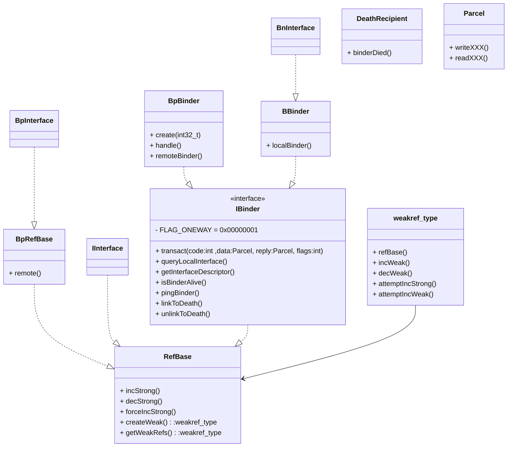
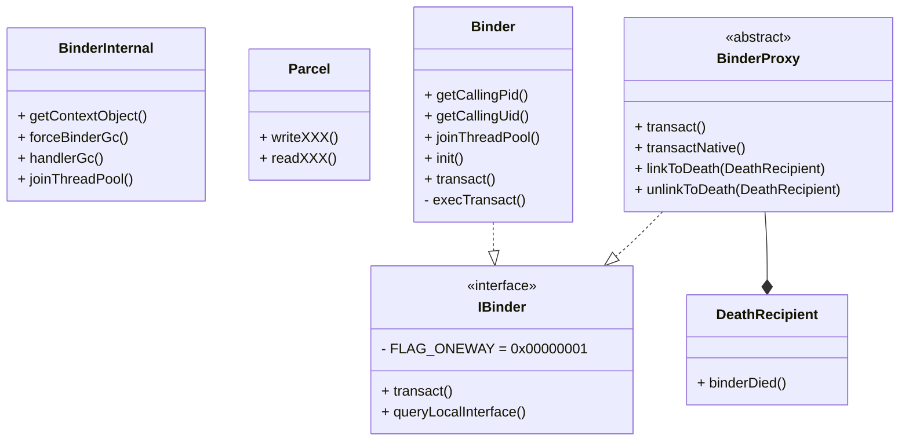

# 第三章、Binder及MessageQueue详解

本章主要内容：

* 介绍Java层的Binder实现原理
* 介绍Java层的MessageQueue实现机制；


第一章中我们了解了如何下载安卓源码并编译运行我们自己的镜像，同时学习了如何编译framework模块并更新到手机，也了解了如何调试framework（即system_process）模块的java层。接下来我们将探索Java层的Binder及消息队列实现。


## 前言

如何将源码以一种好懂的方式讲出来？

* 讲主要的方法单独作为单元，分析完成后作为黑盒。只管输入输出。


## Android JNI常用辅助函数

我们在第二章中介绍了Android JNI中的常用辅助函数，这里为了便于我们分析native侧代码，将其中的表格复制到此处，方便参考；

| 方法                  | 实际动作                                                     | 总结                             |
| --------------------- | ------------------------------------------------------------ | -------------------------------- |
| FindClassOrDie        | `env->FindClass(class_name)`                                 | 加载类                           |
| GetFieldIDOrDie       | `env->GetFieldID(clazz, field_name, field_signature)`        | 获取字段id                       |
| GetMethodIDOrDie      | `env->GetMethodID(clazz, method_name, method_signature)`     | 获取方法id                       |
| GetStaticFieldIDOrDie | `env->GetStaticMethodID(clazz, method_name, method_signature)` | 获取静态方法id                   |
| MakeGlobalRefOrDie    | `template <typename T>`<br/>`env->NewGlobalRef(T)`           | 创建全局引用                     |
| RegisterMethodsOrDie  | `AndroidRuntime::registerNativeMethods`<br/>`env->RegisterNatives(jclass, gMethods, numMethods)` | 注册native方法到类中             |
| getStringField        | 读取指定字段，并转换为`std::string`返回                      | 获取对象的字段的值并转换为string |

## Binder架构总览

### Native层Binder架构

> * `system/core/include/utils/RefBase.h`
> * `frameworks/native/include/binder/IBinder.h`
> * `frameworks/native/include/binder/Binder.h`
> * `frameworks/native/libs/binder/include/binder/BpBinder.h`
> * `frameworks/native/libs/binder/include/binder/IInterface.h`




### Java层Binder架构



* Binder 类和BinderProxy类分别实现了IBinder接口，其中Binder类作为服务端的Bn的代表，而BinderProxy类作为客户端的Bp的代表；
* 系统还定义了一个 BinderInternal类。该类时一个仅供Binder架构使用的类，它内部有一个GcWatcher类，专门用于处理与Binder架构相关的垃圾回收♻️；
* Java层也提供了一个用于承载通信数据的Parcel类；
* FLAG_ONEWAY：客户端利用Binder发起一个跨进程调用时，调用方一般会阻塞，直到服务端返回结果。这种方式和普通的函数调用是一样的。这个参数则表明客户端不用等待服务端返回，也就是非阻塞的方式。在native层中，Binder调用基本都是阻塞的，但是在Java层的framework中，非阻塞调用的情况非常多。

## 初始化Java层Binder框架

Java世界创建之前，系统会提前注册一些JNI函数，其中有一个函数专门负责搭建`JavaBinder`和`NativeBinder`的交互关系，该函数是 `int_register_android_os_Binder`，主要就是在JNI中加载和注册一些需要用到的java类，注册一些native函数到指定的java类中，方便后续java和native之间相互调用。

| 方法                                     | 说明                                          |
| ---------------------------------------- | --------------------------------------------- |
| `register_android_os_Binder`             | 入口，完成Java 和 Native 交互关系初始化       |
| `int_register_android_os_Binder`         | 将对应native方法注册到Java Binder类中         |
| `int_register_android_os_BinderInternal` | 将对应native方法注册到Java BinderInternal类中 |
| `int_register_android_os_BinderProxy`    | 将对应native方法注册到Java BinderProxy类中    |
|                                          |                                               |

* `register_android_os_Binder` : `frameworks/base/core/jni/android_util_Binder.cpp` :

  ```cpp
  int register_android_os_Binder(JNIEnv* env)
  {
      // 初始化Java Binder类和Native层的关系
      if (int_register_android_os_Binder(env) < 0)
          return -1;
      // 初始化Java BinderInternal类和Native层的关系
      if (int_register_android_os_BinderInternal(env) < 0)
          return -1;
      // 初始化Java BinderProxy类和Native层的关系
      if (int_register_android_os_BinderProxy(env) < 0)
          return -1;
  
      // 加载其他一些涉及到的java类到native，并存储为全局引用
      // 包括 gLogOffsets， gParcelFileDescriptorOffsets，gStrictModeCallbackOffsets，gThreadDispatchOffsets
      jclass clazz = FindClassOrDie(env, "android/util/Log");
      gLogOffsets.mClass = MakeGlobalRefOrDie(env, clazz);
      gLogOffsets.mLogE = GetStaticMethodIDOrDie(env, clazz, "e",
              "(Ljava/lang/String;Ljava/lang/String;Ljava/lang/Throwable;)I");
  
      clazz = FindClassOrDie(env, "android/os/ParcelFileDescriptor");
      gParcelFileDescriptorOffsets.mClass = MakeGlobalRefOrDie(env, clazz);
      gParcelFileDescriptorOffsets.mConstructor = GetMethodIDOrDie(env, clazz, "<init>",
                                                                   "(Ljava/io/FileDescriptor;)V");
  
      clazz = FindClassOrDie(env, "android/os/StrictMode");
      gStrictModeCallbackOffsets.mClass = MakeGlobalRefOrDie(env, clazz);
      gStrictModeCallbackOffsets.mCallback = GetStaticMethodIDOrDie(env, clazz,
              "onBinderStrictModePolicyChange", "(I)V");
  
      clazz = FindClassOrDie(env, "java/lang/Thread");
      gThreadDispatchOffsets.mClass = MakeGlobalRefOrDie(env, clazz);
      gThreadDispatchOffsets.mDispatchUncaughtException = GetMethodIDOrDie(env, clazz,
              "dispatchUncaughtException", "(Ljava/lang/Throwable;)V");
      gThreadDispatchOffsets.mCurrentThread = GetStaticMethodIDOrDie(env, clazz, "currentThread",
              "()Ljava/lang/Thread;");
  
      return 0;
  }
  ```

* `gBinderOffsets` 为一个静态类对象，专门保存Binder类在JNI层中的一些使用的信息:

  ```cpp
  static struct bindernative_offsets_t
  {
      // 类状态
      jclass mClass;
      jmethodID mExecTransact;
      jmethodID mGetInterfaceDescriptor;
  
      // 对象状态
      jfieldID mObject;
  
  } gBinderOffsets;
  ```

### Java Binder 类的初始化

加载 Binder类并存储在 gBinderMethods 全局引用中，将native方法绑定到Binder的Java类中；

* `int_register_android_os_Binder` : (`frameworks/base/core/jni/android_util_Binder.cpp`) 

  ```cpp
  const char* const kBinderPathName = "android/os/Binder";
  
  // 将要注册到java Binder类的native方法
  static const JNINativeMethod gBinderMethods[] = {
       /* name, signature, funcPtr */
      // @CriticalNative
      { "getCallingPid", "()I", (void*)android_os_Binder_getCallingPid },
      // @CriticalNative
      { "getCallingUid", "()I", (void*)android_os_Binder_getCallingUid },
      // @CriticalNative
      { "isHandlingTransaction", "()Z", (void*)android_os_Binder_isHandlingTransaction },
      // @CriticalNative
      { "clearCallingIdentity", "()J", (void*)android_os_Binder_clearCallingIdentity },
      { "restoreCallingIdentity", "(J)V", (void*)android_os_Binder_restoreCallingIdentity },
      // @CriticalNative
      { "setThreadStrictModePolicy", "(I)V", (void*)android_os_Binder_setThreadStrictModePolicy },
      // @CriticalNative
      { "getThreadStrictModePolicy", "()I", (void*)android_os_Binder_getThreadStrictModePolicy },
      // @CriticalNative
      { "setCallingWorkSourceUid", "(I)J", (void*)android_os_Binder_setCallingWorkSourceUid },
      // @CriticalNative
      { "getCallingWorkSourceUid", "()I", (void*)android_os_Binder_getCallingWorkSourceUid },
      // @CriticalNative
      { "clearCallingWorkSource", "()J", (void*)android_os_Binder_clearCallingWorkSource },
      { "restoreCallingWorkSource", "(J)V", (void*)android_os_Binder_restoreCallingWorkSource },
      { "markVintfStability", "()V", (void*)android_os_Binder_markVintfStability},
      { "flushPendingCommands", "()V", (void*)android_os_Binder_flushPendingCommands },
      { "getNativeBBinderHolder", "()J", (void*)android_os_Binder_getNativeBBinderHolder },
      { "getNativeFinalizer", "()J", (void*)android_os_Binder_getNativeFinalizer },
      { "blockUntilThreadAvailable", "()V", (void*)android_os_Binder_blockUntilThreadAvailable },
      { "getExtension", "()Landroid/os/IBinder;", (void*)android_os_Binder_getExtension },
      { "setExtension", "(Landroid/os/IBinder;)V", (void*)android_os_Binder_setExtension },
  };
  
  static int int_register_android_os_Binder(JNIEnv* env)
  {
      jclass clazz = FindClassOrDie(env, kBinderPathName);
  
      gBinderOffsets.mClass = MakeGlobalRefOrDie(env, clazz);
      gBinderOffsets.mExecTransact = GetMethodIDOrDie(env, clazz, "execTransact", "(IJJI)Z");
      gBinderOffsets.mGetInterfaceDescriptor = GetMethodIDOrDie(env, clazz, "getInterfaceDescriptor",
          "()Ljava/lang/String;");
      gBinderOffsets.mObject = GetFieldIDOrDie(env, clazz, "mObject", "J");
  
      return RegisterMethodsOrDie(
          env, kBinderPathName,
          gBinderMethods, NELEM(gBinderMethods));
  }
  ```

### Java BinderInternal类的初始化

加载 BinderInternal类并存储在 gBinderInternalOffsets 全局引用中，将native方法绑定到BinderInternal的Java类中；

* `int_register_android_os_BinderInternal` : (`frameworks/base/core/jni/android_util_Binder.cpp`)

  ```cpp
  static const JNINativeMethod gBinderInternalMethods[] = {
       /* name, signature, funcPtr */
      { "getContextObject", "()Landroid/os/IBinder;", (void*)android_os_BinderInternal_getContextObject },
      { "joinThreadPool", "()V", (void*)android_os_BinderInternal_joinThreadPool },
      { "disableBackgroundScheduling", "(Z)V", (void*)android_os_BinderInternal_disableBackgroundScheduling },
      { "setMaxThreads", "(I)V", (void*)android_os_BinderInternal_setMaxThreads },
      { "handleGc", "()V", (void*)android_os_BinderInternal_handleGc },
      { "nSetBinderProxyCountEnabled", "(Z)V", (void*)android_os_BinderInternal_setBinderProxyCountEnabled },
      { "nGetBinderProxyPerUidCounts", "()Landroid/util/SparseIntArray;", (void*)android_os_BinderInternal_getBinderProxyPerUidCounts },
      { "nGetBinderProxyCount", "(I)I", (void*)android_os_BinderInternal_getBinderProxyCount },
      { "nSetBinderProxyCountWatermarks", "(II)V", (void*)android_os_BinderInternal_setBinderProxyCountWatermarks}
  };
  
  const char* const kBinderInternalPathName = "com/android/internal/os/BinderInternal";
  
  static int int_register_android_os_BinderInternal(JNIEnv* env)
  {
      jclass clazz = FindClassOrDie(env, kBinderInternalPathName);
  
      gBinderInternalOffsets.mClass = MakeGlobalRefOrDie(env, clazz);
      gBinderInternalOffsets.mForceGc = GetStaticMethodIDOrDie(env, clazz, "forceBinderGc", "()V");
      gBinderInternalOffsets.mProxyLimitCallback = GetStaticMethodIDOrDie(env, clazz, "binderProxyLimitCallbackFromNative", "(I)V");
  
      jclass SparseIntArrayClass = FindClassOrDie(env, "android/util/SparseIntArray");
      gSparseIntArrayOffsets.classObject = MakeGlobalRefOrDie(env, SparseIntArrayClass);
      gSparseIntArrayOffsets.constructor = GetMethodIDOrDie(env, gSparseIntArrayOffsets.classObject,
                                                             "<init>", "()V");
      gSparseIntArrayOffsets.put = GetMethodIDOrDie(env, gSparseIntArrayOffsets.classObject, "put",
                                                     "(II)V");
  
      BpBinder::setLimitCallback(android_os_BinderInternal_proxyLimitcallback);
  
      return RegisterMethodsOrDie(
          env, kBinderInternalPathName,
          gBinderInternalMethods, NELEM(gBinderInternalMethods));
  }
  ```

### Java BinderProxy类的初始化

加载BinderProxy类，并存储到 全局引用`gBinderProxyOffsets`中，将native方法绑定到BinderProxy的Java类中；

* `int_register_android_os_BinderProxy`: (`frameworks/base/core/jni/android_util_Binder.cpp`)

  ```cpp
  static const JNINativeMethod gBinderProxyMethods[] = {
       /* name, signature, funcPtr */
      {"pingBinder",          "()Z", (void*)android_os_BinderProxy_pingBinder},
      {"isBinderAlive",       "()Z", (void*)android_os_BinderProxy_isBinderAlive},
      {"getInterfaceDescriptor", "()Ljava/lang/String;", (void*)android_os_BinderProxy_getInterfaceDescriptor},
      {"transactNative",      "(ILandroid/os/Parcel;Landroid/os/Parcel;I)Z", (void*)android_os_BinderProxy_transact},
      {"linkToDeath",         "(Landroid/os/IBinder$DeathRecipient;I)V", (void*)android_os_BinderProxy_linkToDeath},
      {"unlinkToDeath",       "(Landroid/os/IBinder$DeathRecipient;I)Z", (void*)android_os_BinderProxy_unlinkToDeath},
      {"getNativeFinalizer",  "()J", (void*)android_os_BinderProxy_getNativeFinalizer},
      {"getExtension",        "()Landroid/os/IBinder;", (void*)android_os_BinderProxy_getExtension},
  };
  
  const char* const kBinderProxyPathName = "android/os/BinderProxy";
  
  static int int_register_android_os_BinderProxy(JNIEnv* env)
  {
      gErrorOffsets.mError = MakeGlobalRefOrDie(env, FindClassOrDie(env, "java/lang/Error"));
      gErrorOffsets.mOutOfMemory =
          MakeGlobalRefOrDie(env, FindClassOrDie(env, "java/lang/OutOfMemoryError"));
      gErrorOffsets.mStackOverflow =
          MakeGlobalRefOrDie(env, FindClassOrDie(env, "java/lang/StackOverflowError"));
  
      jclass clazz = FindClassOrDie(env, kBinderProxyPathName);
      gBinderProxyOffsets.mClass = MakeGlobalRefOrDie(env, clazz);
      gBinderProxyOffsets.mGetInstance = GetStaticMethodIDOrDie(env, clazz, "getInstance",
              "(JJ)Landroid/os/BinderProxy;");
      gBinderProxyOffsets.mSendDeathNotice =
              GetStaticMethodIDOrDie(env, clazz, "sendDeathNotice",
                                     "(Landroid/os/IBinder$DeathRecipient;Landroid/os/IBinder;)V");
      gBinderProxyOffsets.mNativeData = GetFieldIDOrDie(env, clazz, "mNativeData", "J");
  
      clazz = FindClassOrDie(env, "java/lang/Class");
      gClassOffsets.mGetName = GetMethodIDOrDie(env, clazz, "getName", "()Ljava/lang/String;");
  
      return RegisterMethodsOrDie(
          env, kBinderProxyPathName,
          gBinderProxyMethods, NELEM(gBinderProxyMethods));
  }
  ```

## addService实例分析

下面我们通过一个例子来分析Java层Binder的工作流程。这个例子源自 ActivityManagerService（AMS），我们通过它揭示Java层的Binder的工作原理。

分析步骤如下：

* 首先分析 AMS 如何将自己注册到 ServiceManager；
* 然后分析 AMS 如何响应客户端的Binder调用请求；


首先我们看AMS是何时被构建的，一路跟踪，可以找到最终是在`SystemServer`的main()函数中中被初始化的。

### SystemServer启动流程简介

我们可能对SystemServer如何启动的感到好奇，下面简单介绍了SystemServer的main是如何被执行的。

这里我们对init的来源不在追究，init时android中内核启动的第一个进程，通过下面的源码调用流程可以发现：

1. init进程启动了zygote进程；
2. zygote 则启动了system_server进程，需要说明的是，ZygoteInit中调用forkSystemServer方法时指定了SystemServer的类路径，并一路作为参数传递了下去；
3. 在system_server进程中，则找到了 SystemServer.java 的main入口，并执行main函数。


<svg width="680px" height="887px" viewBox="0 0 680 887" version="1.1" xmlns="http://www.w3.org/2000/svg" xmlns:xlink="http://www.w3.org/1999/xlink">
    <g id="Android源码分析" stroke="none" stroke-width="1" fill="none" fill-rule="evenodd">
        <g id="SystemServer如何启动？备份" transform="translate(-65.000000, -56.000000)">
            <g id="zygote-process" transform="translate(65.000000, 226.000000)">
                <g id="init">
                    <rect id="矩形" stroke="#FEE291" fill="#F5F5F5" x="0.5" y="0.5" width="678" height="360" rx="3"></rect>
                    <text id="zygote" font-family="PingFangSC-Regular, PingFang SC" font-size="22" font-weight="normal" line-spacing="41" letter-spacing="0.242000008" fill="#000000">
                        <tspan x="10" y="34">zygote</tspan>
                    </text>
                </g>
                <g id="line" transform="translate(336.500000, 200.000000) scale(1, -1) translate(-336.500000, -200.000000) translate(268.000000, 199.000000)" fill="#979797" fill-rule="nonzero">
                    <path id="直线" d="M125.368686,-7.11183678 L126.240261,-6.62157554 L138.240261,0.128424463 L139.789729,1 L138.240261,1.87157554 L126.240261,8.62157554 L125.368686,9.11183678 L124.388163,7.3686857 L125.259739,6.87842446 L133.932,2 L-1,2 L-1,0 L133.932,0 L125.259739,-4.87842446 L124.388163,-5.3686857 L125.368686,-7.11183678 Z"></path>
                </g>
                <g id="编组" transform="translate(405.000000, 170.000000)">
                    <rect id="矩形" stroke="#979797" fill="#D8D8D8" x="0.5" y="0.5" width="240" height="58" rx="3"></rect>
                    <text id="ZygoteInit.java-main" font-family="PingFangSC-Regular, PingFang SC" font-size="15" font-weight="normal" letter-spacing="0.165000006" fill="#000000">
                        <tspan x="68.675" y="16">ZygoteInit.java </tspan>
                        <tspan x="13.3474999" y="37" font-family="PingFangSC-Semibold, PingFang SC" font-weight="500">main() -&gt; forkSystemServer()</tspan>
                    </text>
                </g>
                <g id="编组备份-3" transform="translate(44.000000, 66.000000)">
                    <rect id="矩形" stroke="#979797" fill="#D8D8D8" x="0.5" y="0.5" width="223" height="58" rx="3"></rect>
                    <text id="app_main.cpp-main()" font-family="PingFangSC-Regular, PingFang SC" font-size="15" font-weight="normal" letter-spacing="0.165000006" fill="#000000">
                        <tspan x="62.6875" y="16">app_main.cpp</tspan>
                        <tspan x="89.17" y="37" font-family="PingFangSC-Semibold, PingFang SC" font-weight="500">main()</tspan>
                    </text>
                </g>
                <g id="编组备份-4" transform="translate(332.000000, 66.000000)">
                    <rect id="矩形" stroke="#979797" fill="#D8D8D8" x="0.5" y="0.5" width="313" height="58" rx="3"></rect>
                    <text id="AndroidRuntime.cpp-s" font-family="PingFangSC-Regular, PingFang SC" font-size="15" font-weight="normal" letter-spacing="0.165000006" fill="#000000">
                        <tspan x="85.0599999" y="16">AndroidRuntime.cpp</tspan>
                        <tspan x="14.0109999" y="37" font-family="PingFangSC-Semibold, PingFang SC" font-size="14" font-weight="500" letter-spacing="0.154000005">start() -&gt; startVM()-&gt;JNI_CreateJavaVM()</tspan>
                    </text>
                </g>
                <g id="编组备份-2" transform="translate(44.000000, 170.000000)">
                    <rect id="矩形" stroke="#979797" fill="#D8D8D8" x="0.5" y="0.5" width="223" height="58" rx="3"></rect>
                    <text id="Zygote.java-nativeFo" fill-rule="nonzero" font-family="PingFangSC-Regular, PingFang SC" font-size="15" font-weight="normal" letter-spacing="0.165000006" fill="#000000">
                        <tspan x="71.0575" y="16">Zygote.java</tspan>
                        <tspan x="18.5799999" y="37" font-family="PingFangSC-Semibold, PingFang SC" font-weight="500">nativeForkSystemServer()</tspan>
                    </text>
                </g>
                <g id="编组备份-5" transform="translate(44.000000, 275.000000)">
                    <rect id="矩形" stroke="#979797" fill="#D8D8D8" x="0.5" y="0.5" width="601" height="58" rx="3"></rect>
                    <text id="com_android_internal" fill-rule="nonzero" font-family="PingFangSC-Regular, PingFang SC" font-size="15" font-weight="normal" letter-spacing="0.165000006" fill="#000000">
                        <tspan x="169.1275" y="16">com_android_internal_os_Zygote.cpp</tspan>
                        <tspan x="125.0875" y="37" font-family="PingFangSC-Semibold, PingFang SC" font-weight="500">nativeForkSystemServer() -&gt; fork() &amp;&amp; waitpid()</tspan>
                    </text>
                </g>
                <path id="直线-5" d="M533.5,228.5 L533.5,272.432 L538.378424,263.759739 L538.868686,262.888163 L540.611837,263.868686 L540.121576,264.740261 L533.371576,276.740261 L532.5,278.289729 L531.628424,276.740261 L524.878424,264.740261 L524.388163,263.868686 L526.131314,262.888163 L526.621576,263.759739 L531.5,272.432 L531.5,228.5 L533.5,228.5 Z" fill="#979797" fill-rule="nonzero"></path>
                <path id="直线-2" d="M320.868686,84.3881632 L321.740261,84.8784245 L333.740261,91.6284245 L335.289729,92.5 L333.740261,93.3715755 L321.740261,100.121576 L320.868686,100.611837 L319.888163,98.8686857 L320.759739,98.3784245 L329.432,93.5 L267.5,93.5 L267.5,91.5 L329.432,91.5 L320.759739,86.6215755 L319.888163,86.1313143 L320.868686,84.3881632 Z" fill="#979797" fill-rule="nonzero"></path>
                <path id="直线-4" d="M530,125 L530,168.932 L534.878424,160.259739 L535.368686,159.388163 L537.111837,160.368686 L536.621576,161.240261 L529.871576,173.240261 L529,174.789729 L528.128424,173.240261 L521.378424,161.240261 L520.888163,160.368686 L522.631314,159.388163 L523.121576,160.259739 L528,168.932 L528,125 L530,125 Z" fill="#979797" fill-rule="nonzero"></path>
            </g>
            <g id="init-process" transform="translate(66.000000, 56.000000)">
                <g id="init">
                    <rect id="矩形" stroke="#FFDF86" fill="#F5F5F5" x="0.5" y="0.5" width="678" height="125" rx="3"></rect>
                    <text font-family="PingFangSC-Regular, PingFang SC" font-size="22" font-weight="normal" line-spacing="41" letter-spacing="0.242000008" fill="#000000">
                        <tspan x="10" y="25">init</tspan>
                    </text>
                </g>
                <g id="line" transform="translate(251.000000, 62.000000)">
                    <path id="直线" d="M142.342325,-7.07390693 L143.215492,-6.58648728 L155.237416,0.124389169 L156.789714,0.990912984 L155.243094,1.867531 L143.265144,8.65658293 L142.39517,9.14968056 L141.408975,7.4097326 L142.278949,6.91663497 L150.935,2.01 L142.75808,2.03662394 L0.503257312,2.49999469 L-0.496737383,2.50325201 L-0.503252007,0.503262617 L0.496742688,0.500005305 L142.751565,0.0366345483 L150.929,0.01 L142.240653,-4.84015159 L141.367485,-5.32757123 L142.342325,-7.07390693 Z" fill="#979797" fill-rule="nonzero"></path>
                    <text id="fork&amp;execv" font-family="PingFangSC-Regular, PingFang SC" font-size="16" font-weight="normal" letter-spacing="0.176000006" fill="#000000">
                        <tspan x="143" y="88">fork&amp;execv</tspan>
                    </text>
                    <path id="直线-3" d="M230.49361,30.493651 L230.49998,31.4936307 L230.928384,98.7530565 L230.98,106.927 L235.803528,98.2225355 L236.288228,97.347855 L238.037589,98.3172549 L237.552889,99.1919354 L230.879457,111.234685 L230.017769,112.789672 L229.136342,111.245787 L222.310047,99.2890236 L221.814244,98.4205883 L223.551115,97.4289831 L224.046918,98.2974183 L228.98,106.937 L228.928424,98.7657951 L228.50002,31.5063693 L228.493651,30.5063896 L230.49361,30.493651 Z" fill="#979797" fill-rule="nonzero"></path>
                </g>
                <g id="编组备份" transform="translate(405.000000, 34.000000)">
                    <rect id="矩形" stroke="#979797" fill="#D8D8D8" x="0.5" y="0.5" width="158" height="58" rx="3"></rect>
                    <text id="start-zygote" font-family="PingFangSC-Regular, PingFang SC" font-size="15" font-weight="normal" letter-spacing="0.165000006" fill="#000000">
                        <tspan x="37" y="35">start zygote</tspan>
                    </text>
                </g>
                <g id="编组" transform="translate(93.000000, 34.000000)">
                    <rect id="矩形" stroke="#979797" fill="#D8D8D8" x="0.5" y="0.5" width="158" height="58" rx="3"></rect>
                    <text id="read-init.rc" font-family="PingFangSC-Regular, PingFang SC" font-size="15" font-weight="normal" letter-spacing="0.165000006" fill="#000000">
                        <tspan x="41" y="35">read init.rc</tspan>
                    </text>
                </g>
            </g>
            <g id="init" transform="translate(65.000000, 631.000000)">
                <rect id="矩形" stroke="#FFE394" fill="#F5F5F5" x="0.5" y="0.5" width="678" height="311" rx="3"></rect>
                <text id="system_server" font-family="PingFangSC-Regular, PingFang SC" font-size="22" font-weight="normal" line-spacing="41" letter-spacing="0.242000008" fill="#000000">
                    <tspan x="10" y="30">system_server</tspan>
                </text>
            </g>
            <g id="RuntimeInit.java" transform="translate(109.000000, 775.000000)">
                <rect id="矩形" stroke="#979797" fill="#D8D8D8" x="0.5" y="0.5" width="600" height="58" rx="3"></rect>
                <text id="RuntimeInit.java-app" font-family="PingFangSC-Regular, PingFang SC" font-size="15" font-weight="normal" letter-spacing="0.165000006" fill="#000000">
                    <tspan x="244.025" y="16">RuntimeInit.java </tspan>
                    <tspan x="58.0099998" y="37" font-family="PingFangSC-Semibold, PingFang SC" font-weight="500">applicationInit() -&gt; findStaticMain() -&gt; MethodAndArgsCaller.run() </tspan>
                </text>
            </g>
            <g id="SystemServer.java" transform="translate(109.000000, 864.000000)">
                <rect id="矩形" stroke="#979797" fill="#D8D8D8" x="0.5" y="0.5" width="600" height="58" rx="3"></rect>
                <text id="SystemServer.java-ma" font-family="PingFangSC-Regular, PingFang SC" font-size="15" font-weight="normal" letter-spacing="0.165000006" fill="#000000">
                    <tspan x="235.475" y="16">SystemServer.java </tspan>
                    <tspan x="277.67" y="37" font-family="PingFangSC-Semibold, PingFang SC" font-weight="500">main()</tspan>
                </text>
            </g>
            <g id="ZygoteInit.java" transform="translate(109.000000, 686.000000)">
                <rect id="矩形" stroke="#979797" fill="#D8D8D8" x="0.5" y="0.5" width="600" height="58" rx="3"></rect>
                <text id="ZygoteInit.java-hand" font-family="PingFangSC-Regular, PingFang SC" font-size="15" font-weight="normal" letter-spacing="0.165000006" fill="#000000">
                    <tspan x="248.675" y="16">ZygoteInit.java </tspan>
                    <tspan x="136.7525" y="37" font-family="PingFangSC-Semibold, PingFang SC" font-weight="500">handleSystemServerProcess() -&gt; zygoteInit()</tspan>
                </text>
            </g>
            <path id="直线-6" d="M411.5,744.5 L411.5,772.432 L416.378424,763.759739 L416.868686,762.888163 L418.611837,763.868686 L418.121576,764.740261 L411.371576,776.740261 L410.5,778.289729 L409.628424,776.740261 L402.878424,764.740261 L402.388163,763.868686 L404.131314,762.888163 L404.621576,763.759739 L409.5,772.432 L409.5,744.5 L411.5,744.5 Z" fill="#979797" fill-rule="nonzero"></path>
            <path id="直线-7" d="M411.5,833.5 L411.5,861.432 L416.378424,852.759739 L416.868686,851.888163 L418.611837,852.868686 L418.121576,853.740261 L411.371576,865.740261 L410.5,867.289729 L409.628424,865.740261 L402.878424,853.740261 L402.388163,852.868686 L404.131314,851.888163 L404.621576,852.759739 L409.5,861.432 L409.5,833.5 L411.5,833.5 Z" fill="#979797" fill-rule="nonzero"></path>
            <path id="直线-8" d="M409.52298,586.477537 L411.522463,586.52298 L411.499742,587.522721 L410.754661,620.306282 L410.569,628.456 L415.643662,619.896336 L416.1536,619.036125 L417.874022,620.056001 L417.364084,620.916212 L410.34317,632.759744 L409.436613,634.289009 L408.600469,632.720138 L402.124868,620.569866 L401.654537,619.687376 L403.419517,618.746714 L403.889848,619.629204 L408.569,628.409 L408.755177,620.260839 L409.500258,587.477279 L409.52298,586.477537 Z" fill="#979797" fill-rule="nonzero"></path>
        </g>
    </g>
</svg>

### ActivityManagerService 的初始化及启动

#### 概览

通过上面对SystemServer的启动流程的简单介绍，现在我们了解了SystemServer是如何被启动的，在SystemServer启动后，我们来到了其main函数；所以我们以SystemServer.java 作为我们分析的起点。

1. 启动时启动main函数，在其中构造SystemServer对象，并执行其run方法；
3. run() 中执行了其核心逻辑：

   * 构造了 `SystemServiceManager` 的实例；

   * `startBootstrapServices()` 调用 `ActivityManagerService.Lifecycle.startService` 来启动服务
   *  `ActivityManagerService.Lifecycle.startService` 则调用 `SystemServiceManager` 的 `startService` 方法通过反射来创建AMS服务的实例，然后将其加入到 `SystemServiceManager` 的 `mServices` 成员变量定义的列表中，再调用AMS服务实例的onStart回调函数。
3. 之后再调用 `mActivityManagerService.setSystemProcess();` 来将其设置为系统进程。具体的 `addService` 逻辑即在此方法中。
4. 关于 `addService` 我们则放到下一个步骤进行分析。


以下为上述过程中涉及到的具体的源码：

#### SystemServer.main()

* `SystemServer.main()`: (`frameworks/base/services/java/com/android/server/SystemServer.java`) 

  ```java
  public final class SystemServer {
  
      private static final String TAG = "SystemServer";
      // maximum number of binder threads used for system_server
      // will be higher than the system default
      private static final int sMaxBinderThreads = 31;
      /**
       * The main entry point from zygote.
       */
      public static void main(String[] args) {
          new SystemServer().run();
      }
      
       public SystemServer() {
         // ...
      }
      
      private void run() {
          TimingsTraceAndSlog t = new TimingsTraceAndSlog();
          try {
              t.traceBegin("InitBeforeStartServices");
              // Create the system service manager.
              mSystemServiceManager = new SystemServiceManager(mSystemContext);
              mSystemServiceManager.setStartInfo(mRuntimeRestart,
                      mRuntimeStartElapsedTime, mRuntimeStartUptime);
              LocalServices.addService(SystemServiceManager.class, mSystemServiceManager);
          } finally {
              t.traceEnd();  // InitBeforeStartServices
          }
           // Start services.
          try {
              t.traceBegin("StartServices");
              // 在这里启动了AMS
              startBootstrapServices(t);
              startCoreServices(t);
              startOtherServices(t);
          } catch (Throwable ex) {
              Slog.e("System", "******************************************");
              Slog.e("System", "************ Failure starting system services", ex);
              throw ex;
          } finally {
              t.traceEnd(); // StartServices
          }
      }
  ```

#### `SystemServer.startBootstrapServices`

* `SystemServer.startBootstrapServices`: (`frameworks/base/services/java/com/android/server/SystemServer.java` )

  ```java
  private void startBootstrapServices(@NonNull TimingsTraceAndSlog t) {
          t.traceBegin("startBootstrapServices");
      	// "StartInstaller"
          Installer installer = mSystemServiceManager.startService(Installer.class);
  
          // Activity manager runs the show.
          t.traceBegin("StartActivityManager");
          // 构造AMS服务的实例，然后启动AMS服务
          ActivityTaskManagerService atm = mSystemServiceManager.startService(
                  ActivityTaskManagerService.Lifecycle.class).getService();
          mActivityManagerService = ActivityManagerService.Lifecycle.startService(
                  mSystemServiceManager, atm);
          mActivityManagerService.setSystemServiceManager(mSystemServiceManager);
          mActivityManagerService.setInstaller(installer);
         
          t.traceEnd();
  
          // Now that the power manager has been started, let the activity manager
          // initialize power management features.
          t.traceBegin("InitPowerManagement");
          mActivityManagerService.initPowerManagement();
          t.traceEnd();
  
          // Set up the Application instance for the system process and get started.
          t.traceBegin("SetSystemProcess");
          mActivityManagerService.setSystemProcess();
          t.traceEnd();
  
          // Complete the watchdog setup with an ActivityManager instance and listen for reboots
          // Do this only after the ActivityManagerService is properly started as a system process
          t.traceBegin("InitWatchdog");
          watchdog.init(mSystemContext, mActivityManagerService);
          t.traceEnd();
  
      }
  ```

#### SystemServiceManager.startService & AMS.startService

* `SystemServiceManager.startService`: (`frameworks/base/services/core/java/com/android/server/SystemServiceManager.java`)

  ```java
      public <T extends SystemService> T startService(Class<T> serviceClass) {
          final String name = serviceClass.getName();
          // Create the service.
          final T service;
          try {
              Constructor<T> constructor = serviceClass.getConstructor(Context.class);
              service = constructor.newInstance(mContext);
          } {
              // ...
          }
          startService(service);
          return service;
      }
  ```

  ```java
  public void startService(@NonNull final SystemService service) {
          // Register it.
          mServices.add(service);
          // Start it.
          long time = SystemClock.elapsedRealtime();
          try {
              service.onStart();
          } catch (RuntimeException ex) {
              throw new RuntimeException("Failed to start service " + service.getClass().getName()
                      + ": onStart threw an exception", ex);
          }
          warnIfTooLong(SystemClock.elapsedRealtime() - time, service, "onStart");
      }
  ```

* `ActivityManagerService.Lifecycle.startService` : (`frameworks/base/services/core/java/com/android/server/am/ActivityManagerService.java`)

  ```java
     public static final class Lifecycle extends SystemService {
          private final ActivityManagerService mService;
          private static ActivityTaskManagerService sAtm;
  
          public Lifecycle(Context context) {
              super(context);
              mService = new ActivityManagerService(context, sAtm);
          }
  
          public static ActivityManagerService startService(
                  SystemServiceManager ssm, ActivityTaskManagerService atm) {
              sAtm = atm;
              return ssm.startService(ActivityManagerService.Lifecycle.class).getService();
          }
  
          public ActivityManagerService getService() {
              return mService;
          }
      }
  ```

### 添加到服务列表源码分析

#### 概览

根据前面的分析，现在AMS服务已经：

1. 创建了AMS服务对应的实例；
2. 并且将其添加到了`SystemServiceManager`的成员变量`mServices`中；
3. 调用了AMS的`onStart`回调

现在正在调用  `mActivityManagerService.setSystemProcess()` ，我们看这个方法的源码：

* 第一行就调用了 `ServiceManager.addService` 将自己添加到服务管理器中。
* 之后又陆续添加了其他的服务，其他服务我们暂时不关注

  

以下为以上过程的源码：

#### ActivityManagerService.setSystemProcess

* `ActivityManagerService.setSystemProcess()` : (`frameworks/base/services/core/java/com/android/server/am/ActivityManagerService.java`)

  ```java
  public void setSystemProcess() {
          try {
              ServiceManager.addService(Context.ACTIVITY_SERVICE, this, /* allowIsolated= */ true,
                      DUMP_FLAG_PRIORITY_CRITICAL | DUMP_FLAG_PRIORITY_NORMAL | DUMP_FLAG_PROTO);
              ServiceManager.addService(ProcessStats.SERVICE_NAME, mProcessStats);
              // 添加一些其他Service
          }{
              //... 
          }
      }
  ```

* `ServiceManager.addService()` : (`frameworks/base/core/java/android/os/ServiceManager.java`)

  * 可以到，注册需要一个名称，这里AMS被设置为`Context.ACTIVITY_SERVICE`;
  * 还需要一个IBinder的服务对象，这里使用的 `ActivityManagerService` 的实例对象；
  * 然后通过Binder调用`ServiceManager`的Binder服务的addService来添加AMS到ServiceManager。

  ```java
      public static void addService(String name, IBinder service, boolean allowIsolated,
              int dumpPriority) {
          try {
              getIServiceManager().addService(name, service, allowIsolated, dumpPriority);
          } catch (RemoteException e) {
              Log.e(TAG, "error in addService", e);
          }
      }
  
      private static IServiceManager getIServiceManager() {
          if (sServiceManager != null) {
              return sServiceManager;
          }
  
          // Find the service manager
          sServiceManager = ServiceManagerNative
                  .asInterface(Binder.allowBlocking(BinderInternal.getContextObject()));
          return sServiceManager;
      }
  
  ```

#### ServiceManagerNative & ServiceManagerProxy

* `ServiceManagerNative` : (`frameworks/base/core/java/android/os/ServiceManagerNative.java`)

  * 这里可以看到，addService实际上最终是通过 `ServiceManagerProxy` 作为代理来调用 remote 服务的。
  * remote服务对象的来源是： `BinderInternal.getContextObject()`
  
  ```java
  public final class ServiceManagerNative {
      private ServiceManagerNative() {}
  
      /**
       * Cast a Binder object into a service manager interface, generating
       * a proxy if needed.
       *
       * TODO: delete this method and have clients use
       *     IServiceManager.Stub.asInterface instead
       */
      @UnsupportedAppUsage
      public static IServiceManager asInterface(IBinder obj) {
          if (obj == null) {
              return null;
          }
  
          // ServiceManager is never local
          return new ServiceManagerProxy(obj);
    }
  }
  ```

#### 获取ServiceManager ContextObject

* `BinderInternal.getContextObject()`: (`frameworks/base/core/java/com/android/internal/os/BinderInternal.java`)

  * 可以看到ServiceManager的来源实际上是通过BinderInternal中的native方法getContextObject()获取的

  ```java
      /**
       * Return the global "context object" of the system.  This is usually
       * an implementation of IServiceManager, which you can use to find
       * other services.
       */
      @UnsupportedAppUsage
      public static final native IBinder getContextObject();
  ```

* 在 `int_register_android_os_BinderInternal`(`frameworks/base/core/jni/android_util_Binder.cpp`) 中，我们可以找到getContextObject具体对应于哪个native方法-`android_os_BinderInternal_getContextObject`：

  * 通过下述代码分析
    * `ServiceManager`的`Binder`对象通过`ProcessState`的`getContextObject`方法获取；（这里实际上返回了ServiceManager的Binder服务端代理对象）
    * 然后通过`javaObjectForIBinder`转换成一个Java对象，这个Java对象是通过JNI调用 `BinderProxy.java` 的 `getInstance` 方法来获取的；也就是一个包含ServiceManager native 端服务指针的 BinderProxy 对象。

  ```cpp
  static const JNINativeMethod gBinderInternalMethods[] = {
       /* name, signature, funcPtr */
      { "getContextObject", "()Landroid/os/IBinder;", (void*)android_os_BinderInternal_getContextObject },
  }
  
  static jobject android_os_BinderInternal_getContextObject(JNIEnv* env, jobject clazz)
  {
      // 这里返回了ServiceManager的BpProxy对象，NULL表示0，就是指定需要返回ServiceManager
      sp<IBinder> b = ProcessState::self()->getContextObject(NULL);
      // 转换层Java对象
      return javaObjectForIBinder(env, b);
  }
  
  jobject javaObjectForIBinder(JNIEnv* env, const sp<IBinder>& val)
  {
      // N.B. This function is called from a @FastNative JNI method, so don't take locks around
      // calls to Java code or block the calling thread for a long time for any reason.
  
      if (val == NULL) return NULL;
      // 如果之前已经创建过了，就直接返回
      if (val->checkSubclass(&gBinderOffsets)) {
          // It's a JavaBBinder created by ibinderForJavaObject. Already has Java object.
          jobject object = static_cast<JavaBBinder*>(val.get())->object();
          LOGDEATH("objectForBinder %p: it's our own %p!\n", val.get(), object);
          return object;
      }
  
      BinderProxyNativeData* nativeData = new BinderProxyNativeData();
      nativeData->mOrgue = new DeathRecipientList;
      nativeData->mObject = val;
  
      // 这里的IBinder实际上是通过BinderProxy的静态的GetInstance方法获取到的
      jobject object = env->CallStaticObjectMethod(gBinderProxyOffsets.mClass,
              gBinderProxyOffsets.mGetInstance, (jlong) nativeData, (jlong) val.get());
      if (env->ExceptionCheck()) {
          // In the exception case, getInstance still took ownership of nativeData.
          return NULL;
      }
      BinderProxyNativeData* actualNativeData = getBPNativeData(env, object);
      if (actualNativeData == nativeData) {
          // Created a new Proxy
          uint32_t numProxies = gNumProxies.fetch_add(1, std::memory_order_relaxed);
          uint32_t numLastWarned = gProxiesWarned.load(std::memory_order_relaxed);
          if (numProxies >= numLastWarned + PROXY_WARN_INTERVAL) {
              // Multiple threads can get here, make sure only one of them gets to
              // update the warn counter.
              if (gProxiesWarned.compare_exchange_strong(numLastWarned,
                          numLastWarned + PROXY_WARN_INTERVAL, std::memory_order_relaxed)) {
                  ALOGW("Unexpectedly many live BinderProxies: %d\n", numProxies);
              }
          }
      } else {
          delete nativeData;
      }
  
      return object;
  }
  ```

##### BinderProxy.getInstance()： BinderProxy（Java）对象

* `BinderProxy.getInstance` : (`frameworks/base/core/java/android/os/BinderProxy.java`)

  * getInstance 方法有两个参数：
    * nativeData： `BinderProxyNativeData` 对象指针，包含一个指向Service IBinder对象指针的指针（sp<IBinder>& val）；
    * iBinder： Service IBinder对象指针

  ```java
      /**
       * Return a BinderProxy for IBinder.
       * If we previously returned a BinderProxy bp for the same iBinder, and bp is still
       * in use, then we return the same bp.
       *
       * @param nativeData C++ pointer to (possibly still empty) BinderProxyNativeData.
       * Takes ownership of nativeData iff <result>.mNativeData == nativeData, or if
       * we exit via an exception.  If neither applies, it's the callers responsibility to
       * recycle nativeData.
       * @param iBinder C++ pointer to IBinder. Does not take ownership of referenced object.
       */
      private static BinderProxy getInstance(long nativeData, long iBinder) {
          BinderProxy result;
          synchronized (sProxyMap) {
              try {
                  result = sProxyMap.get(iBinder);
                  if (result != null) {
                      return result;
                  }
                  result = new BinderProxy(nativeData);
              } catch (Throwable e) {
                  // We're throwing an exception (probably OOME); don't drop nativeData.
                  NativeAllocationRegistry.applyFreeFunction(NoImagePreloadHolder.sNativeFinalizer,
                          nativeData);
                  throw e;
              }
              NoImagePreloadHolder.sRegistry.registerNativeAllocation(result, nativeData);
              // The registry now owns nativeData, even if registration threw an exception.
              sProxyMap.set(iBinder, result);
          }
          return result;
      }
  ```

##### ProcessState->getContextObject(NULL) : 返回 BpBinder （Native对象）

* `ProcessState::self()->getContextObject(NULL)`: (`frameworks/native/libs/binder/ProcessState.cpp`)

  * getStrongProxyForHandle(0) 这里不展开分析，就是返回了ServiceManager的native的BpBinder对象。

  ```cpp
  
  sp<IBinder> ProcessState::getContextObject(const sp<IBinder>& /*caller*/)
  {
      sp<IBinder> context = getStrongProxyForHandle(0);
  
      if (context == nullptr) {
         ALOGW("Not able to get context object on %s.", mDriverName.c_str());
      }
  
      // The root object is special since we get it directly from the driver, it is never
      // written by Parcell::writeStrongBinder.
      internal::Stability::tryMarkCompilationUnit(context.get());
  
      return context;
  }
  
  sp<IBinder> ProcessState::getStrongProxyForHandle(int32_t handle)
  {
      sp<IBinder> result;
  
      AutoMutex _l(mLock);
  
      handle_entry* e = lookupHandleLocked(handle);
  
      if (e != nullptr) {
          // We need to create a new BpBinder if there isn't currently one, OR we
          // are unable to acquire a weak reference on this current one.  The
          // attemptIncWeak() is safe because we know the BpBinder destructor will always
          // call expungeHandle(), which acquires the same lock we are holding now.
          // We need to do this because there is a race condition between someone
          // releasing a reference on this BpBinder, and a new reference on its handle
          // arriving from the driver.
          IBinder* b = e->binder;
          if (b == nullptr || !e->refs->attemptIncWeak(this)) {
              if (handle == 0) {
                  // Special case for context manager...
                  // The context manager is the only object for which we create
                  // a BpBinder proxy without already holding a reference.
                  // Perform a dummy transaction to ensure the context manager
                  // is registered before we create the first local reference
                  // to it (which will occur when creating the BpBinder).
                  // If a local reference is created for the BpBinder when the
                  // context manager is not present, the driver will fail to
                  // provide a reference to the context manager, but the
                  // driver API does not return status.
                  //
                  // Note that this is not race-free if the context manager
                  // dies while this code runs.
                  //
                  // TODO: add a driver API to wait for context manager, or
                  // stop special casing handle 0 for context manager and add
                  // a driver API to get a handle to the context manager with
                  // proper reference counting.
  
                  Parcel data;
                  status_t status = IPCThreadState::self()->transact(
                          0, IBinder::PING_TRANSACTION, data, nullptr, 0);
                  if (status == DEAD_OBJECT)
                     return nullptr;
              }
  
              b = BpBinder::create(handle);
              e->binder = b;
              if (b) e->refs = b->getWeakRefs();
              result = b;
          } else {
              // This little bit of nastyness is to allow us to add a primary
              // reference to the remote proxy when this team doesn't have one
              // but another team is sending the handle to us.
              result.force_set(b);
              e->refs->decWeak(this);
          }
      }
  
      return result;
  }
  ```

#### ServiceManager.addService  (binder通讯)

* `IServiceManager.Stub.addService()` : `android/os/IServiceManager.java` AIDL生成的默认实现 

  * 实际上是调用`mRemote.transact`实现，这里的mRemote就是ServiceManagerProxy构造时传入的，也就是我们之前获取的 `ServiceManagerProxy(BinderProxy(nativeServiceManager))`，也就是说，最终会调用到ServiceManager的Binder服务侧实现的方法，即`BinderProxy.transact` -> `BinderProxy.transactNative` (将下小节源码)

  ```java
  		/**
             * Place a new @a service called @a name into the service
             * manager.
             */
        @Override public void addService(java.lang.String name, android.os.IBinder service, boolean allowIsolated, int dumpPriority) throws android.os.RemoteException
        {
          android.os.Parcel _data = android.os.Parcel.obtain();
          android.os.Parcel _reply = android.os.Parcel.obtain();
          try {
            _data.writeInterfaceToken(DESCRIPTOR);
            _data.writeString(name);
            _data.writeStrongBinder(service);
            _data.writeInt(((allowIsolated)?(1):(0)));
            _data.writeInt(dumpPriority);
              // 调用remote的实现，这里的mRemote就是ServiceManagerProxy构造时传入的，也就是我们之前
            boolean _status = mRemote.transact(Stub.TRANSACTION_addService, _data, _reply, 0);
            if (!_status && getDefaultImpl() != null) {
              getDefaultImpl().addService(name, service, allowIsolated, dumpPriority);
              return;
            }
            _reply.readException();
          }
          finally {
            _reply.recycle();
            _data.recycle();
          }
        }
  ```

* `BinderProxy.transact()` : (`frameworks/base/core/java/android/os/BinderProxy.java`)

  也就是最终调用到了 transactNative ，接下来我们找到其native实现

  ```java
  public boolean transact(int code, Parcel data, Parcel reply, int flags) throws RemoteException {
          Binder.checkParcel(this, code, data, "Unreasonably large binder buffer");
          if ((flags & FLAG_ONEWAY) == 0 && AppOpsManager.isListeningForOpNoted()) {
              flags |= FLAG_COLLECT_NOTED_APP_OPS;
          }
  		// ... 
          return transactNative(code, data, reply, flags);
          
  }
  
  /**
  * Native implementation of transact() for proxies
  */
  public native boolean transactNative(int code, Parcel data, Parcel reply, int flags) throws RemoteException;
  ```

* 这里的实现和之前的`int_register_android_os_BinderProxy`: (`frameworks/base/core/jni/android_util_Binder.cpp`) 位于同一个地方，我们可以 transactNative 的实现指向的方法是：android_os_BinderProxy_transact

  ```cpp
  static const JNINativeMethod gBinderProxyMethods[] = {
       /* name, signature, funcPtr */
      {"transactNative",      "(ILandroid/os/Parcel;Landroid/os/Parcel;I)Z", (void*)android_os_BinderProxy_transact},
  };
  
  
  static jboolean android_os_BinderProxy_transact(JNIEnv* env, jobject obj,
          jint code, jobject dataObj, jobject replyObj, jint flags) // throws RemoteException
  {
  	// 从java的parcel对象获取native的parcel
      Parcel* data = parcelForJavaObject(env, dataObj);
      if (data == NULL) {
          return JNI_FALSE;
      }
      // 获取用于返回数据的Parcel
      Parcel* reply = parcelForJavaObject(env, replyObj);
      if (reply == NULL && replyObj != NULL) {
          return JNI_FALSE;
      }
  
      // 从Java的BinderProxy对象中获取创建BinderProxy时传递的NativeData（ 指向BinderProxyNativeData的 C++ 指针，其中包含指向native的IBinder对象的强指针及一个DeathRecipientList），用于检查该Binder在native中现在是否被释放了
      IBinder* target = getBPNativeData(env, obj)->mObject.get();
      if (target == NULL) {
          jniThrowException(env, "java/lang/IllegalStateException", "Binder has been finalized!");
          return JNI_FALSE;
      }
      // 实际的Binder通信，target为之前构造BinderProxy时从native侧构造的JavaBBinder对象
      //printf("Transact from Java code to %p sending: ", target); data->print();
      status_t err = target->transact(code, *data, reply, flags);
      //if (reply) printf("Transact from Java code to %p received: ", target); reply->print();
  
      if (err == NO_ERROR) {
          return JNI_TRUE;
      } else if (err == UNKNOWN_TRANSACTION) {
          return JNI_FALSE;
      }
  
      signalExceptionForError(env, obj, err, true /*canThrowRemoteException*/, data->dataSize());
      return JNI_FALSE;
  }
  
  BinderProxyNativeData* getBPNativeData(JNIEnv* env, jobject obj) {
      return (BinderProxyNativeData *) env->GetLongField(obj, gBinderProxyOffsets.mNativeData);
  }
  
  // frameworks/base/core/jni/android_os_Parcel.cpp
  Parcel* parcelForJavaObject(JNIEnv* env, jobject obj)
  {
      if (obj) {
          Parcel* p = (Parcel*)env->GetLongField(obj, gParcelOffsets.mNativePtr);
          if (p != NULL) {
              return p;
          }
          jniThrowException(env, "java/lang/IllegalStateException", "Parcel has been finalized!");
      }
      return NULL;
  }
  ```

  

### 添加服务列表详细过程总结

通过上面的代码分析，将整个过程总结如下：


<svg width="674px" height="507px" viewBox="0 0 674 507" version="1.1" xmlns="http://www.w3.org/2000/svg" xmlns:xlink="http://www.w3.org/1999/xlink">
    <g id="Android源码分析" stroke="none" stroke-width="1" fill="none" fill-rule="evenodd">
        <g id="Binder-addService流程分析" transform="translate(-86.000000, -60.000000)">
            <g id="模块" transform="translate(242.000000, 60.000000)">
                <rect id="矩形" stroke="#CECECE" fill="#F7F7F7" x="0.5" y="0.5" width="361" height="39" rx="4"></rect>
                <text id="模块名称" font-family="PingFangSC-Semibold, PingFang SC" font-size="12" font-weight="500" letter-spacing="-0.288" fill="#696969">
                    <tspan x="65.002" y="14">ActivityManagerService.setSystemProcess</tspan>
                </text>
                <text id="描述" font-family="PingFangSC-Regular, PingFang SC" font-size="11" font-weight="normal" letter-spacing="0.121000004" fill="#FFA527" fill-opacity="0.88378138">
                    <tspan x="152.310245" y="30">注册的起点 </tspan>
                </text>
            </g>
            <g id="模块备份" transform="translate(242.000000, 114.070423)">
                <rect id="矩形" stroke="#CECECE" fill="#F7F7F7" x="0.5" y="0.5" width="361" height="39" rx="4"></rect>
                <text id="模块名称" font-family="PingFangSC-Semibold, PingFang SC" font-size="12" font-weight="500" letter-spacing="-0.288" fill="#696969">
                    <tspan x="65.926" y="14">ServiceManager.addService(name,IBinder)</tspan>
                </text>
                <text id="描述" font-family="PingFangSC-Regular, PingFang SC" font-size="11" font-weight="normal" letter-spacing="0.121000004" fill="#FFA527" fill-opacity="0.88378138">
                    <tspan x="4.316245" y="30">name 为 Context.ACTIVITY_SERVICE，IBinder为对应的要注册的服务</tspan>
                </text>
            </g>
            <g id="模块备份-2" transform="translate(242.000000, 169.591549)">
                <rect id="矩形" stroke="#CECECE" fill="#F7F7F7" x="0.5" y="0.5" width="361" height="39" rx="4"></rect>
                <text id="模块名称" font-family="PingFangSC-Semibold, PingFang SC" font-size="12" font-weight="500" letter-spacing="-0.288" fill="#696969">
                    <tspan x="52.066" y="14">getIServiceManager().addService(name,IBinder)</tspan>
                </text>
                <text id="描述" font-family="PingFangSC-Regular, PingFang SC" font-size="11" font-weight="normal" letter-spacing="0.121000004" fill="#FFA527" fill-opacity="0.88378138">
                    <tspan x="19.144245" y="30"> ServiceManagerNative 中调用Binder机制来执行真实的add操作</tspan>
                </text>
            </g>
            <g id="模块备份-3" transform="translate(225.000000, 225.112676)">
                <rect id="矩形" stroke="#CECECE" fill="#F7F7F7" x="0.5" y="0.5" width="395" height="39" rx="4"></rect>
                <text id="模块名称" font-family="PingFangSC-Semibold, PingFang SC" font-size="12" font-weight="500" letter-spacing="-0.288" fill="#696969">
                    <tspan x="11.91" y="14">ServiceManagerProxy(BinderInternal.getContextObject()).addService</tspan>
                </text>
                <text id="描述" font-family="PingFangSC-Regular, PingFang SC" font-size="11" font-weight="normal" letter-spacing="0.121000004" fill="#FFA527" fill-opacity="0.88378138">
                    <tspan x="83.0529117" y="30"> 获取到的对象是ServiceManagerProxy类型的</tspan>
                </text>
            </g>
            <g id="模块备份-4" transform="translate(86.000000, 279.000000)">
                <rect id="矩形" stroke="#CECECE" fill="#F7F7F7" x="0.5" y="0.5" width="317" height="39" rx="4"></rect>
                <text id="模块名称" font-family="PingFangSC-Semibold, PingFang SC" font-size="12" font-weight="500" letter-spacing="-0.288" fill="#696969">
                    <tspan x="4.638" y="14">ServiceManagerProxy(BinderInternal.getContextObject())</tspan>
                </text>
                <text id="描述" font-family="PingFangSC-Regular, PingFang SC" font-size="11" font-weight="normal" letter-spacing="0.121000004" fill="#FFA527" fill-opacity="0.88378138">
                    <tspan x="55.3650882" y="30"> ServiceManagerProxy的初始化构造过程</tspan>
                </text>
            </g>
            <g id="模块备份-6" transform="translate(86.000000, 335.000000)">
                <rect id="矩形" stroke="#CECECE" fill="#F7F7F7" x="0.5" y="0.5" width="317" height="39" rx="4"></rect>
                <text id="模块名称" font-family="PingFangSC-Semibold, PingFang SC" font-size="12" font-weight="500" letter-spacing="-0.288" fill="#696969">
                    <tspan x="67.794" y="14">BinderInternal.getContextObject()</tspan>
                </text>
                <text id="描述" font-family="PingFangSC-Regular, PingFang SC" font-size="11" font-weight="normal" letter-spacing="0.121000004" fill="#FFA527" fill-opacity="0.88378138">
                    <tspan x="62.8615882" y="30"> 获取ServiceManager服务IBinder对象</tspan>
                </text>
            </g>
            <g id="模块备份-7" transform="translate(86.000000, 390.000000)">
                <rect id="矩形" stroke="#CECECE" fill="#F7F7F7" x="0.5" y="0.5" width="317" height="39" rx="4"></rect>
                <text id="模块名称" font-family="PingFangSC-Semibold, PingFang SC" font-size="12" font-weight="500" letter-spacing="-0.288" fill="#696969">
                    <tspan x="33.642" y="14">android_os_BinderInternal_getContextObject()</tspan>
                </text>
                <text id="描述" font-family="PingFangSC-Regular, PingFang SC" font-size="11" font-weight="normal" letter-spacing="0.121000004" fill="#FFA527" fill-opacity="0.88378138">
                    <tspan x="77.8655882" y="30"> native的getContextObject方法</tspan>
                </text>
            </g>
            <g id="模块备份-8" transform="translate(86.000000, 452.000000)">
                <rect id="矩形" stroke="#CECECE" fill="#F7F7F7" x="0.5" y="0.5" width="269" height="39" rx="4"></rect>
                <text id="模块名称" font-family="PingFangSC-Semibold, PingFang SC" font-size="12" font-weight="500" letter-spacing="-0.288" fill="#696969">
                    <tspan x="8.124" y="14">ProcessState::self()-&gt;getContextObject(NULL)</tspan>
                </text>
                <text id="描述" font-family="PingFangSC-Regular, PingFang SC" font-size="11" font-weight="normal" letter-spacing="0.121000004" fill="#FFA527" fill-opacity="0.88378138">
                    <tspan x="42.5047352" y="30">获取 ServiceManager BpBinder对象</tspan>
                </text>
            </g>
            <g id="模块备份-9" transform="translate(87.000000, 513.000000)">
                <rect id="矩形" stroke="#CECECE" fill="#F7F7F7" x="0.5" y="0.5" width="361" height="39" rx="4"></rect>
                <text id="模块名称" font-family="PingFangSC-Semibold, PingFang SC" font-size="12" font-weight="500" letter-spacing="-0.288" fill="#696969">
                    <tspan x="104.026" y="14">javaObjectForIBinder(env, b)</tspan>
                </text>
                <text id="描述" font-family="PingFangSC-Regular, PingFang SC" font-size="11" font-weight="normal" letter-spacing="0.121000004" fill="#FFA527" fill-opacity="0.88378138">
                    <tspan x="16.801245" y="30"> 转换为BinderProxy Java对象（ new BinderProxy(nativeData)）</tspan>
                </text>
            </g>
            <path id="直线-8" d="M431,509 L431,512 L430,512 L430,509 L431,509 Z M431,505 L431,508 L430,508 L430,505 L431,505 Z M431,501 L431,504 L430,504 L430,501 L431,501 Z M431,497 L431,500 L430,500 L430,497 L431,497 Z M431,493 L431,496 L430,496 L430,493 L431,493 Z M431,489 L431,492 L430,492 L430,489 L431,489 Z M431,485 L431,488 L430,488 L430,485 L431,485 Z M431,481 L431,484 L430,484 L430,481 L431,481 Z M431,477 L431,480 L430,480 L430,477 L431,477 Z M431,473 L431,476 L430,476 L430,473 L431,473 Z M431,469 L431,472 L430,472 L430,469 L431,469 Z M431,465 L431,468 L430,468 L430,465 L431,465 Z M431,461 L431,464 L430,464 L430,461 L431,461 Z M431,457 L431,460 L430,460 L430,457 L431,457 Z M431,453 L431,456 L430,456 L430,453 L431,453 Z M431,449 L431,452 L430,452 L430,449 L431,449 Z M431,445 L431,448 L430,448 L430,445 L431,445 Z M431,441 L431,444 L430,444 L430,441 L431,441 Z M431,437 L431,440 L430,440 L430,437 L431,437 Z M431,433 L431,436 L430,436 L430,433 L431,433 Z M431,429 L431,432 L430,432 L430,429 L431,429 Z M431,425 L431,428 L430,428 L430,425 L431,425 Z M431,421 L431,424 L430,424 L430,421 L431,421 Z M433.5,411.458071 L442.5,415.958071 L433.5,420.458071 L433.5,411.458071 Z M431,417 L431,420 L430,420 L430,417 L431,417 Z M433.458071,415.458071 L433.458071,416.458071 L430.458071,416.458071 L430.458071,415.458071 L433.458071,415.458071 Z" fill="#979797" fill-rule="nonzero"></path>
            <g id="模块备份-5" transform="translate(442.000000, 279.000000)">
                <rect id="矩形" stroke="#CECECE" fill="#F7F7F7" x="0.5" y="0.5" width="317" height="39" rx="4"></rect>
                <text id="模块名称" font-family="PingFangSC-Semibold, PingFang SC" font-size="12" font-weight="500" letter-spacing="-0.288" fill="#696969">
                    <tspan x="28.494" y="14">ServiceManagerProxy.addService(name,IBinder)</tspan>
                </text>
                <text id="描述" font-family="PingFangSC-Regular, PingFang SC" font-size="11" font-weight="normal" letter-spacing="0.121000004" fill="#FFA527" fill-opacity="0.88378138">
                    <tspan x="34.0140882" y="30"> SMP只是将请求通过Binder转发给native的的实现</tspan>
                </text>
            </g>
            <g id="模块备份-10" transform="translate(442.000000, 335.000000)">
                <rect id="矩形" stroke="#CECECE" fill="#F7F7F7" x="0.5" y="0.5" width="317" height="39" rx="4"></rect>
                <text id="模块名称" font-family="PingFangSC-Semibold, PingFang SC" font-size="12" font-weight="500" letter-spacing="-0.288" fill="#696969">
                    <tspan x="30.042" y="14">IServiceManager.java.addService(name,IBinder)</tspan>
                </text>
                <text id="描述" font-family="PingFangSC-Regular, PingFang SC" font-size="11" font-weight="normal" letter-spacing="0.121000004" fill="#FFA527" fill-opacity="0.88378138">
                    <tspan x="123.702588" y="30">AIDL生成代码</tspan>
                </text>
            </g>
            <g id="模块备份-12" transform="translate(462.000000, 512.000000)">
                <rect id="矩形" stroke="#CECECE" fill="#F7F7F7" x="0.5" y="0.5" width="297" height="39" rx="4"></rect>
                <text id="模块名称" font-family="PingFangSC-Semibold, PingFang SC" font-size="12" font-weight="500" letter-spacing="-0.288" fill="#696969">
                    <tspan x="32.42" y="14">ServiceManager::addService(name,IBinder)</tspan>
                </text>
                <text id="描述" font-family="PingFangSC-Regular, PingFang SC" font-size="11" font-weight="normal" letter-spacing="0.121000004" fill="#FFA527" fill-opacity="0.88378138">
                    <tspan x="52.9491078" y="30">IPC到ServiceManager的Server的实现</tspan>
                </text>
            </g>
            <line x1="602.5" y1="492.5" x2="602.5" y2="514.5" id="直线-15" stroke="#979797" stroke-linecap="square"></line>
            <g id="模块备份-13" transform="translate(462.000000, 452.000000)">
                <rect id="矩形" stroke="#CECECE" fill="#F7F7F7" x="0.5" y="0.5" width="297" height="39" rx="4"></rect>
                <text id="模块名称" font-family="PingFangSC-Semibold, PingFang SC" font-size="12" font-weight="500" letter-spacing="-0.288" fill="#696969">
                    <tspan x="86.594" y="14">Binder.transactNative() </tspan>
                </text>
                <text id="描述" font-family="PingFangSC-Regular, PingFang SC" font-size="11" font-weight="normal" letter-spacing="0.121000004" fill="#FFA527" fill-opacity="0.88378138">
                    <tspan x="66.4571078" y="30">jni调用native端的transactNative</tspan>
                </text>
            </g>
            <g id="模块备份-11" transform="translate(442.000000, 391.000000)">
                <rect id="矩形" stroke="#CECECE" fill="#F7F7F7" x="0.5" y="0.5" width="317" height="39" rx="4"></rect>
                <text id="模块名称" font-family="PingFangSC-Semibold, PingFang SC" font-size="12" font-weight="500" letter-spacing="-0.288" fill="#696969">
                    <tspan x="33.828" y="14">BinderProxy.transact() -&gt; mRemote.transcat()</tspan>
                </text>
                <text id="描述" font-family="PingFangSC-Regular, PingFang SC" font-size="11" font-weight="normal" letter-spacing="0.121000004" fill="#FFA527" fill-opacity="0.88378138">
                    <tspan x="24.0315881" y="30">mRemote为javaObjectForIBinder创建的JavaBBinder</tspan>
                </text>
            </g>
            <line x1="434.5" y1="99.5" x2="434.5" y2="114.5" id="直线-9" stroke="#979797" stroke-linecap="square"></line>
            <line x1="434.5" y1="148.5" x2="434.5" y2="169.5" id="直线" stroke="#979797" stroke-linecap="square"></line>
            <line x1="434.5" y1="209.5" x2="434.5" y2="225.5" id="直线-2" stroke="#979797" stroke-linecap="square"></line>
            <line x1="366.5" y1="265.5" x2="366.5" y2="279.5" id="直线-3" stroke="#979797" stroke-linecap="square"></line>
            <line x1="502.5" y1="265.5" x2="502.5" y2="279.5" id="直线-4" stroke="#979797" stroke-linecap="square"></line>
            <line x1="355.5" y1="319.5" x2="355.5" y2="334.5" id="直线-10" stroke="#979797" stroke-linecap="square"></line>
            <line x1="177.5" y1="375.5" x2="177.5" y2="390.5" id="直线-5" stroke="#979797" stroke-linecap="square"></line>
            <line x1="146.5" y1="430.5" x2="146.5" y2="453.5" id="直线-11" stroke="#979797" stroke-linecap="square"></line>
            <line x1="393.5" y1="430.5" x2="393.5" y2="514.5" id="直线-6" stroke="#979797" stroke-linecap="square"></line>
            <line x1="601.5" y1="319.5" x2="601.5" y2="335.5" id="直线-12" stroke="#979797" stroke-linecap="square"></line>
            <path id="直线-7" d="M416.224909,356.009572 L416.292921,356 L405.908,355.999 L412.245131,359.564212 C412.459067,359.684552 412.550283,359.938798 412.472829,360.162848 L412.435788,360.245131 C412.315448,360.459067 412.061202,360.550283 411.837152,360.472829 L411.754869,360.435788 L403.754869,355.935788 L402.980136,355.5 L403.754869,355.064212 L411.754869,350.564212 C411.995548,350.42883 412.300406,350.51419 412.435788,350.754869 C412.556127,350.968806 412.502053,351.233452 412.319515,351.384704 L412.245131,351.435788 L405.908,354.999 L416.314253,354.9994 C416.32833,354.998631 416.342118,354.997185 416.355622,354.995437 L416.395294,354.989653 L416.440708,354.98346 C416.902753,354.935365 416.983201,355.617793 416.99712,376.844956 L416.997922,378.227973 C416.998041,378.46319 416.998154,378.70078 416.99826,378.940766 L416.998944,380.785974 L416.999081,381.261581 L416.999081,381.261581 L416.999992,389.110291 L417.000001,389.682763 L417.000001,389.682763 L417,395.125 L416.999995,395.522249 L416.999995,395.522249 L416.999255,400.022743 C416.999172,400.302765 416.999082,400.584108 416.998985,400.866771 L416.998323,402.578601 C416.998198,402.866548 416.998067,403.155815 416.997929,403.446404 L416.997018,405.205783 C416.98244,431.242485 416.914407,467.507622 416.792919,514.001306 C416.792198,514.277448 416.567756,514.50072 416.291615,514.499998 C416.015473,514.499277 415.792201,514.274835 415.792923,513.998694 C415.914408,467.505711 415.98244,431.241249 415.997018,405.205417 L415.997929,403.446096 L415.998131,403.011219 L415.998131,403.011219 L415.998985,400.866554 L415.999125,400.443565 L415.999125,400.443565 L415.999979,395.921447 L416,395.125 L415.999994,394.713339 L415.999994,394.713339 L415.999191,390.326958 C415.999101,390.069 415.999004,389.812474 415.998899,389.557382 L415.99818,388.044027 C415.992923,378.319006 415.976275,370.773893 415.948237,365.408863 C415.930989,362.108376 415.909431,359.633338 415.88358,357.9844 C415.876417,357.52755 415.868928,357.134354 415.861122,356.805033 L415.85755,356.637591 C415.870307,357.057392 415.861818,356.11552 416.224909,356.009572 Z" fill="#979797" fill-rule="nonzero"></path>
            <text id="java对象中只存储cpp层的指针（地址" font-family="PingFangSC-Regular, PingFang SC" font-size="11" font-weight="normal" letter-spacing="0.121000004" fill="#FFA527" fill-opacity="0.88378138">
                <tspan x="175.0065" y="564">java对象中只存储cpp层的指针（地址）</tspan>
            </text>
            <line x1="602.5" y1="375.5" x2="602.5" y2="391.5" id="直线-13" stroke="#979797" stroke-linecap="square"></line>
            <line x1="602.5" y1="430.5" x2="602.5" y2="451.5" id="直线-14" stroke="#979797" stroke-linecap="square"></line>
        </g>
    </g>
</svg>


## 请求如何分发到ActivityManagerService？

在上面的分析中，我们关注如下流程，这里可以抽象为一个具体的业务通过Binder驱动来执行的流程。

我们需要执行ServiceManager服务端的addService业务，不过第3-4步都是业务无关的，只是调用了Binder的transact方法来通讯。那么第4->5步骤是如何完成业务相关的呢？


<svg width="351px" height="273px" viewBox="0 0 351 273" version="1.1" xmlns="http://www.w3.org/2000/svg" xmlns:xlink="http://www.w3.org/1999/xlink">
    <g id="Android源码分析" stroke="none" stroke-width="1" fill="none" fill-rule="evenodd">
        <g id="Binder-addService流程分析" transform="translate(-442.000000, -279.000000)">
            <g id="模块备份-5" transform="translate(442.000000, 279.000000)">
                <rect id="矩形" stroke="#CECECE" fill="#F7F7F7" x="0.5" y="0.5" width="317" height="39" rx="4"></rect>
                <text id="模块名称" font-family="PingFangSC-Semibold, PingFang SC" font-size="12" font-weight="500" letter-spacing="-0.288" fill="#696969">
                    <tspan x="28.494" y="14">ServiceManagerProxy.addService(name,IBinder)</tspan>
                </text>
                <text id="描述" font-family="PingFangSC-Regular, PingFang SC" font-size="11" font-weight="normal" letter-spacing="0.121000004" fill="#FFA527" fill-opacity="0.88378138">
                    <tspan x="34.0140882" y="30"> SMP只是将请求通过Binder转发给native的的实现</tspan>
                </text>
            </g>
            <g id="模块备份-10" transform="translate(442.000000, 335.000000)">
                <rect id="矩形" stroke="#CECECE" fill="#F7F7F7" x="0.5" y="0.5" width="317" height="39" rx="4"></rect>
                <text id="模块名称" font-family="PingFangSC-Semibold, PingFang SC" font-size="12" font-weight="500" letter-spacing="-0.288" fill="#696969">
                    <tspan x="30.042" y="14">IServiceManager.java.addService(name,IBinder)</tspan>
                </text>
                <text id="描述" font-family="PingFangSC-Regular, PingFang SC" font-size="11" font-weight="normal" letter-spacing="0.121000004" fill="#FFA527" fill-opacity="0.88378138">
                    <tspan x="123.702588" y="30">AIDL生成代码</tspan>
                </text>
            </g>
            <g id="模块备份-12" transform="translate(462.000000, 512.000000)">
                <rect id="矩形" stroke="#CECECE" fill="#F7F7F7" x="0.5" y="0.5" width="297" height="39" rx="4"></rect>
                <text id="模块名称" font-family="PingFangSC-Semibold, PingFang SC" font-size="12" font-weight="500" letter-spacing="-0.288" fill="#696969">
                    <tspan x="32.42" y="14">ServiceManager::addService(name,IBinder)</tspan>
                </text>
                <text id="描述" font-family="PingFangSC-Regular, PingFang SC" font-size="11" font-weight="normal" letter-spacing="0.121000004" fill="#FFA527" fill-opacity="0.88378138">
                    <tspan x="52.9491078" y="30">IPC到ServiceManager的Server的实现</tspan>
                </text>
            </g>
            <line x1="602.5" y1="492.5" x2="602.5" y2="514.5" id="直线-15" stroke="#979797" stroke-linecap="square"></line>
            <g id="模块备份-13" transform="translate(462.000000, 452.000000)">
                <rect id="矩形" stroke="#CECECE" fill="#F7F7F7" x="0.5" y="0.5" width="297" height="39" rx="4"></rect>
                <text id="模块名称" font-family="PingFangSC-Semibold, PingFang SC" font-size="12" font-weight="500" letter-spacing="-0.288" fill="#696969">
                    <tspan x="86.594" y="14">Binder.transactNative() </tspan>
                </text>
                <text id="描述" font-family="PingFangSC-Regular, PingFang SC" font-size="11" font-weight="normal" letter-spacing="0.121000004" fill="#FFA527" fill-opacity="0.88378138">
                    <tspan x="66.4571078" y="30">jni调用native端的transactNative</tspan>
                </text>
            </g>
            <g id="模块备份-11" transform="translate(442.000000, 391.000000)">
                <rect id="矩形" stroke="#CECECE" fill="#F7F7F7" x="0.5" y="0.5" width="317" height="39" rx="4"></rect>
                <text id="模块名称" font-family="PingFangSC-Semibold, PingFang SC" font-size="12" font-weight="500" letter-spacing="-0.288" fill="#696969">
                    <tspan x="33.828" y="14">BinderProxy.transact() -&gt; mRemote.transcat()</tspan>
                </text>
                <text id="描述" font-family="PingFangSC-Regular, PingFang SC" font-size="11" font-weight="normal" letter-spacing="0.121000004" fill="#FFA527" fill-opacity="0.88378138">
                    <tspan x="24.0315881" y="30">mRemote为javaObjectForIBinder创建的JavaBBinder</tspan>
                </text>
            </g>
            <line x1="601.5" y1="319.5" x2="601.5" y2="335.5" id="直线-12" stroke="#979797" stroke-linecap="square"></line>
            <line x1="602.5" y1="375.5" x2="602.5" y2="391.5" id="直线-13" stroke="#979797" stroke-linecap="square"></line>
            <line x1="602.5" y1="430.5" x2="602.5" y2="451.5" id="直线-14" stroke="#979797" stroke-linecap="square"></line>
            <g id="标号" transform="translate(768.000000, 287.000000)">
                <circle id="椭圆形" stroke="#979797" fill="#D8D8D8" cx="11.5" cy="11.5" r="11"></circle>
                <text id="1" font-family="PingFangSC-Semibold, PingFang SC" font-size="11" font-weight="500" letter-spacing="0.121000004" fill="#151515" fill-opacity="0.88378138">
                    <tspan x="9.1845" y="16">1</tspan>
                </text>
            </g>
            <g id="标号备份" transform="translate(768.000000, 343.000000)">
                <circle id="椭圆形" stroke="#979797" fill="#D8D8D8" cx="11.5" cy="11.5" r="11"></circle>
                <text id="2" font-family="PingFangSC-Semibold, PingFang SC" font-size="11" font-weight="500" letter-spacing="0.121000004" fill="#151515" fill-opacity="0.88378138">
                    <tspan x="8.1395" y="16">2</tspan>
                </text>
            </g>
            <g id="标号备份-2" transform="translate(768.000000, 400.000000)">
                <circle id="椭圆形" stroke="#979797" fill="#D8D8D8" cx="11.5" cy="11.5" r="11"></circle>
                <text id="3" font-family="PingFangSC-Semibold, PingFang SC" font-size="11" font-weight="500" letter-spacing="0.121000004" fill="#151515" fill-opacity="0.88378138">
                    <tspan x="8.1395" y="16">3</tspan>
                </text>
            </g>
            <g id="标号备份-3" transform="translate(770.000000, 461.000000)">
                <circle id="椭圆形" stroke="#979797" fill="#D8D8D8" cx="11.5" cy="11.5" r="11"></circle>
                <text id="4" font-family="PingFangSC-Semibold, PingFang SC" font-size="11" font-weight="500" letter-spacing="0.121000004" fill="#151515" fill-opacity="0.88378138">
                    <tspan x="8.1395" y="16">4</tspan>
                </text>
            </g>
            <g id="标号备份-4" transform="translate(770.000000, 521.000000)">
                <circle id="椭圆形" stroke="#979797" fill="#D8D8D8" cx="11.5" cy="11.5" r="11"></circle>
                <text id="5" font-family="PingFangSC-Semibold, PingFang SC" font-size="11" font-weight="500" letter-spacing="0.121000004" fill="#151515" fill-opacity="0.88378138">
                    <tspan x="8.1395" y="16">5</tspan>
                </text>
            </g>
        </g>
    </g>
</svg>


## 问题

### BinderProxy中的如何找到具体的自行实现的Binder对象？

也是通过Binder接口协议吗？比方说，通信时将内容导向到ServiceManager，然后找到对应的Service。

> 通讯的Parcel中，在transact时，会先将接口描述符写入: `_data.writeInterfaceToken(DESCRIPTOR);`

具体的需要分析bindService的源码

### 自定义的Service如何找到的呢？

## 参考

* [Java 原生接口规范](http://docs.oracle.com/javase/7/docs/technotes/guides/jni/spec/jniTOC.html)
* [GoogleAndroid开发文档-JNI提示](https://developer.android.google.cn/training/articles/perf-jni?hl=zh-cn)


