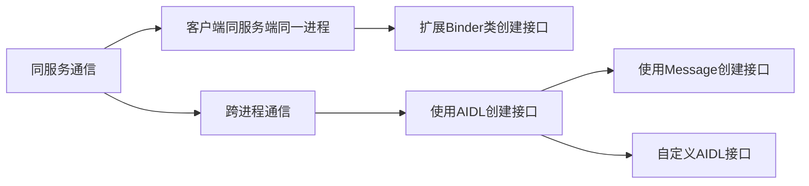

# 目录

[toc]

# 学习资料

* [Google官方文章-指南-Android 接口定义语言 (AIDL)](https://developer.android.com/guide/components/aidl?hl=zh-cn)
* [Google官方文档-Source-AIDL概览](https://source.android.com/devices/architecture/aidl/overview?hl=zh-cn)
* [gityuan-彻底理解Android Binder通信架构](http://gityuan.com/2016/09/04/binder-start-service/)
* [ioctl-wiki百科](https://zh.wikipedia.org/wiki/Ioctl)
* [An Introduction to Android Interprocess Communication and Common Pitfalls](https://medium.com/@vardaansh1/an-introduction-to-android-interprocess-communication-and-common-pitfalls-ac4dfeddf89b)
* [写给 Android 应用工程师的 Binder 原理剖析-知乎](https://zhuanlan.zhihu.com/p/35519585)
* [Android进程间通信（IPC）机制Binder简要介绍和学习计划](https://blog.csdn.net/Luoshengyang/article/details/6618363)
* [android-source架构-使用Binder IPC](https://source.android.com/devices/architecture/hidl/binder-ipc)
* [Binders In Android (part I)](https://proandroiddev.com/binders-in-android-part-1-e875daeb762f)
* [Advantages of using Binder for IPC in Android](https://stackoverflow.com/questions/7469337/advantages-of-using-binder-for-ipc-in-android)
* [Android Binder IPC Framework | Scatter-Gather Optimization](https://www.pathpartnertech.com/android-binder-ipc-framework-scatter-gather-optimization/#:~:text=Binder%20IPC%20Framework%20in%20Android&text=Framework%20enables%20a%20remote%20invocation,data%20from%20the%20server%20process.)
* [googlesource.com-Android IPC Security Considerations](https://chromium.googlesource.com/chromium/src.git/+/master/docs/security/android-ipc.md)
* [PDF-Andevcon-Binder-in-depth.pdf](http://newandroidbook.com/files/Andevcon-Binder.pdf)
* [在线课程-Overview of Android Local Inter-Process Communication (IPC) (Part 2)](https://www.coursera.org/lecture/androidapps-2/overview-of-android-local-inter-process-communication-ipc-part-2-gDgbv)


# IPC 介绍及 unix IPC

## IPC 

**进程间通信**（**IPC**，*Inter-Process Communication*），指至少两个[进程](https://zh.wikipedia.org/wiki/进程)或[线程](https://zh.wikipedia.org/wiki/线程)间传送数据或信号的一些技术或方法。

进程是[计算机系统](https://zh.wikipedia.org/wiki/计算机系统)分配资源的最小单位（严格说来是线程）。每个进程都有自己的一部分独立的系统资源，彼此是隔离的。为了能使不同的进程互相访问资源并进行协调工作，才有了进程间通信。通常，使用进程间通信的两个应用可以被分为客户端和服务器（见[主从式架构](https://zh.wikipedia.org/wiki/主從式架構)），客户端进程请求数据，服务端响应客户端的数据请求。有一些应用本身既是服务器又是客户端，这在[分布式计算](https://zh.wikipedia.org/wiki/分布式计算)中，时常可以见到。这些进程可以运行在同一计算机上或网络连接的不同计算机上。

主要的IPC方法有如下几种:

|                             方法                             |                 提供方（操作系统或其他环境）                 |
| :----------------------------------------------------------: | :----------------------------------------------------------: |
|          [文件](https://zh.wikipedia.org/wiki/檔案)          |                         多数操作系统                         |
|   [信号](https://zh.wikipedia.org/wiki/信号_(计算机科学))    |                         多数操作系统                         |
| [Berkeley套接字](https://zh.wikipedia.org/wiki/Berkeley套接字) |                         多数操作系统                         |
|      [消息队列](https://zh.wikipedia.org/wiki/消息队列)      |                         多数操作系统                         |
|      [管道](https://zh.wikipedia.org/wiki/管道_(Unix))       | 所有的 [POSIX 系统](https://zh.wikipedia.org/wiki/POSIX), Windows. |
|      [命名管道](https://zh.wikipedia.org/wiki/命名管道)      | 所有的 [POSIX 系统](https://zh.wikipedia.org/wiki/POSIX), Windows. |
|        [信号量](https://zh.wikipedia.org/wiki/信号量)        | 所有的 [POSIX 系统](https://zh.wikipedia.org/wiki/POSIX), Windows. |
|      [共享内存](https://zh.wikipedia.org/wiki/共享内存)      | 所有的 [POSIX 系统](https://zh.wikipedia.org/wiki/POSIX), Windows. |
|  [消息传递](https://zh.wikipedia.org/wiki/訊息傳遞_(軟體))   | 用于[MPI](https://zh.wikipedia.org/wiki/MPI)规范，[Java RMI](https://zh.wikipedia.org/wiki/Java_RMI)，[CORBA](https://zh.wikipedia.org/wiki/CORBA)，[MSMQ](https://zh.wikipedia.org/w/index.php?title=MSMQ&action=edit&redlink=1)，[MailSlot](https://zh.wikipedia.org/w/index.php?title=MailSlot&action=edit&redlink=1)以及其他. |
|  [内存映射文件](https://zh.wikipedia.org/wiki/内存映射文件)  | 所有的 [POSIX 系统](https://zh.wikipedia.org/wiki/POSIX), Windows. |

> 以上内容来源于 [维基百科](https://zh.wikipedia.org/wiki/%E8%A1%8C%E7%A8%8B%E9%96%93%E9%80%9A%E8%A8%8A) 

## unix IPC机制


**管道：**

* 只能在具有公共祖先的进程之间使用，通常，一个管道又一个进程创建，然后该进程调用fork，此后父、子进程之间就可以使用该管道；管道有FIFO（命名管道）和半双工管道（数据只能在一个方向上流动）两种类型；比方说，如果你在管道线中键入一个由shell执行的命令序列时，shell为每一条命令单独创建一个进程，然后将前一条命令进程的标准输出用管道与后一条命令的标准输入相连接；管道由调用pipe函数创建，可以传递两个参数-两个文件描述符，一个是输入，一个是输出。通常，调用pipe的进程接着调用fork，这样就创建了从父进程到子进程（或反向）的IPC通道；
* FIFO有时被称为**命名管道**。普通管道只能由相关进程使用，这些相关进程的的共同祖先进程创建了管道。但是通过FIFO，不相关的进程也能交换数据；可通过mkfifo函数来创建一个管道，类似于创建文件。FIFO的一般用途有两种：1）由shell命令使用，以便将数据从一条管道传送到另一条，为此中间无需创建临时文件；2）用于客户进程-服务器进程的应用程序中，以在客户进程和服务端进程之间传递数据；
  * 第一种可通过如下方式测试：1）`mkfifo fifo1` ; 2) `cat < fifo1`; 3)新启动 shell，执行 `cat >fifo1`，然后输入任意字符，可以看到第二步骤中有对应的输出；4) 再启动一个shell，执行`cat fifo1` 发现没有输出；

**消息队列：**(消息链表，msgget，msgsnd，msgrcv)

* 消息队列是消息的链接表，存放在内核中并由消息队列标识符标识。msgget用于创建一个新队列或打开一个现存的队列。msgsnd将新消息添加到队列尾端。每个消息包含一个正长整型类型字段，一个非负长度以及实际数据字节，所有这些都将在消息添加到队列时传送给msgsnd。msgrcv用于从消息队列中取消息，并不一定要以先进先出的次序取消息，可以按消息类型取消息；

**信号量：**（同步原语而非IPC）

* 信号量于管道，FIFO，及消息队列不同，它是一个计数器，用于多进程对共享数据对象的访问；为了获得共享资源，进程需要执行下列操作：
  * 测试控制该资源的信号量；
  * 若此信号量的值为正，则进程可以使用该资源。进程将信号量的值减1，表示它使用了一个资源单位。
  * 若此信号量的值为0，则进程进入休眠状态，直至信号量值大于0。进程被唤醒后，它返回至地一步。
  * 当进程不再使用由一个信号量控制的共享资源时，该信号量增1.如果有进程在正在休眠等待此信号量，则唤醒他们。
  * 为了正确的实现信号量，信号量值的测试及减1操作应该是原子操作。为此，信号量通常是在内核中实现的。常用的信号量形式被称之为二元信号量或双态信号量。它控制单个资源，初始值为1，但是一般而言，信号量的初始值可以为任一正值，该值说明有多少个共享资源单位可供共享使用；

**共享存储**

* 共享存储允许两个或多个进程共享一个给定的存储区。因为数据不需要在客户进程和服务器进程之间复制，所以这是最快的一种IPC。使用共享存储时需要掌握的唯一窍门是多个进程之间对一个给定存储区的同步访问。若服务器进程正在将数据放入共享存储区，则在它做完这一个操作之前，客户进程不应当去读取这些数据。通常，信号量被用来实现对共享存储访问的同步。（记录锁也可以用于这种场合）	
  * shmctl函数对共享存储段执行多种操作：取得shmid_ds结构并将buf指向结构中，设置buf值，删除共享存储段，将共享存储段锁定在内存中，解锁共享存储段。
  * shmat可将之前创建的共享存储段连接到其地址空间中。
* 匿名存储映射，很多实现提供了一种类似于 /dev/zero 的设置，称之为匿名存储映射。可在调用mmap时指定MAP_ANON 标志，并将文件描述符设置为-1，结果得到的区域是匿名的，并且可以创建一个与后台进程共享的存储区。

**网络IPC：套接字**

* 进程可使用套接字接口和其他进程通信，通过该接口，其他进程运行的位置是透明的，它们可以在同一台计算机上，也可以在不同的计算机上，实际上这正是套接字的目标之一：同样的接口即可用于计算机之间的通讯又可以用于计算机内通信。
* 套接字是通信端点的抽象，与应用程序要使用文件描述符访问文件一样，访问套接字也需要用套接字描述符。

## 名词解释

### ioctl

> 在计算机中，**ioctl**(input/output control)是一个专用于设备输入输出操作的系统调用,该调用传入一个跟设备有关的请求码，系统调用的功能完全取决于请求码。举个例子，CD-ROM驱动程序可以弹出光驱，它就提供了一个对应的**Ioctl**请求码。设备无关的请求码则提供了内核调用权限。ioctl这名字第一次出现在Unix第七版中，他在很多类[unix](https://zh.wikipedia.org/wiki/Unix)系统（比如[Linux](https://zh.wikipedia.org/wiki/Linux)、[Mac OSX](https://zh.wikipedia.org/wiki/Mac_OSX)等）都有提供，不过不同系统的请求码对应的设备有所不同。[Microsoft Windows](https://zh.wikipedia.org/wiki/Microsoft_Windows)在Win32 API里提供了相似的函数，叫做[DeviceIoControl](https://zh.wikipedia.org/w/index.php?title=DeviceIoControl&action=edit&redlink=1)。

* 系统调用
* 专用于设备输入输出的系统调用

> 传统的操作系统可以分成两层，用户层和内核层。应用程序代码比如编辑器，处于用户层，然而系统底层程序，比如网络栈，处于内核层。内核代码处理敏感资源同时在不同应用程序中间提供了安全且可信的隔离，出于此，操作系统要阻止用户态的程序直接访问内核资源。用户空间的程序通常发出一个给内核的请求，该请求称为系统调用，它的实现代码在内核层。系统调用采取“系统调用增量”的方式，用递增的序号指示系统调用。举个例子，exit()可能是1，write()可能是4。系统调用增量能通过这样的不同数值找到对应的被请求的内核函数，传统的操作系统通常用这种方式给用户空间提供了上百个系统调用。操作系统提供了内核访问标准外部设备的系统调用，因为大多数硬件设备只能够在内核空间内直接寻址,但是当访问非标准硬件设备这些系统调用显得不合适,有时候用户模式可能需要直接访问设备，比如，一个系统管理员可能要修改网卡的配置。==现代操作系统提供了各种各样设备的支持，有一些设备可能没有被内核设计者考虑到，如此一来提供一个这样的系统调用来使用设备就变得不可能了。== 为了解决这个问题，内核被设计成可扩展的，可以加入一个称为设备驱动的模块，驱动的代码允许在内核空间运行而且可以对设备直接寻址。一个**Ioctl**接口是一个独立的系统调用，通过它用户空间可以跟设备驱动沟通。对设备驱动的请求是一个以设备和请求号码为参数的**Ioctl**调用，如此内核就允许用户空间访问设备驱动进而访问设备而不需要了解具体的设备细节，同时也不需要一大堆针对不同设备的系统调用。

### 进程控制基本原语函数

进程控制基本原语函数：

* `fork` 函数： 一个现有进程可以调用fork函数创建一个新的进程，创建的新的进程称之为子进程，fork调用一次但是返回两次，两次返回的唯一区别是，子进程的返回值是0，父进程的返回值是新的子进程的id；父进程通过返回值获取子进程的进程id，子进程通过getppid函数获取父进程的id；子进程是父进程的副本，会获得父进程数据空间及堆和栈的副本；

* `exec` 函数：在fork创建子进程后，子进程往往需要调用一种exec函数以执行另一个程序；当进程调用一种exec函数时，该进程执行的程序完全替换为新的程序，而新程序从其main函数开始执行；因为exec并不创建新的进程，所以前后的进程ID并未改变；exec只是用一个全新的程序替换了当前进程的正文、数据、堆和栈段；

* `exit` 函数：exit 函数可以用于正常终止进程，其操作包括调用各终止处理程序，然后关闭所有标准I/O流等；

* `wait` 函数：当一个进程正常或异常终止时，内核就向其父进程发送SIGCHLD信号。因为子进程终止是个异步事件（者可以在父进程运行的任何时候发生），所以这种信号也是内核向父进程发的异步通知。父进程可以选择忽略该信号，或者提供一个该信号发生时即被调用执行的函数（信号处理程序）。对于这种信号的系统默认动作是忽略它。调用wait或者waitpid的进程可能会：

  * 如果其所有子进程都还在运行，则阻塞；
  * 如果一个子进程已终止，正等待父进程获取其终止状态，则取得该子进程的终止状态立即返回；
  * 如果它没有任何子进程，则立即出错返回；

  如果进程由于接收到SIGCHLD信号而调用wait，则可期望wait会立即返回。但是如果在任意时刻调用wait，则进程可能会阻塞；


# Android IPC 概述

## 关于IPC及unix IPC的总结

根据上面的关于IPC的讨论，总结如下：

1. 进程是操作系统控制调度的最小单元，为了能够让不同的进程之间互相访问并协调工作，就需要进行进程间通讯；
2. 常用的IPC方式有如下几种：
   * 文件
   * 管道，包括普通管道及命名管道（FIFO）
   * 消息队列
   * 共享存储（一般结合信号量或者记录锁）使用，因为需要同步不同进程的对于共享资源的访问；
   * 网络套接字，也可用于跨计算机的进程间通讯
3. 进程间通讯的过程一般需要内核空间中的程序参与：传统的操作系统可以分成两层，用户层和内核层。应用程序代码比如编辑器，处于用户层，然而系统底层程序，比如网络栈，处于内核层。内核代码处理敏感资源同时在不同应用程序中间提供了安全且可信的隔离，出于此，操作系统要阻止用户态的程序直接访问内核资源。用户空间的程序通常发出一个给内核的请求，该请求称为系统调用，它的实现代码在内核层。内核空间可以访问系统所有资源，而用户空间中程序只能访问对应进程中的资源，所以进程间的通讯必须依赖与内核空间中的程序驱动；


> 从进程角度来看IPC机制

> 

> 每个Android的进程，只能运行在自己进程所拥有的虚拟地址空间。对应一个4GB的虚拟地址空间，其中3GB是用户空间，1GB是内核空间，当然内核空间的大小是可以通过参数配置调整的。对于用户空间，不同进程之间彼此是不能共享的，而内核空间却是可共享的。Client进程向Server进程通信，恰恰是利用进程间可共享的内核内存空间来完成底层通信工作的，Client端与Server端进程往往采用ioctl等方法跟内核空间的驱动进行交互。


## Android 的 Binder IPC 概述

### Android的几种IPC方式

* 文件
* Intent
* ContentProvider
* BroadCastReceiver
* Messenger
* AIDL

实际上暴露出来IPC方式的除了文件外，其他都是基于Binder的。可以说，Android开发使用的IPC都是基于Binder的。

### Android为什么引入Binder

> 本小节来源于： [写给 Android 应用工程师的 Binder 原理剖析 - 为什么是 Binder](https://zhuanlan.zhihu.com/p/35519585)


Android 系统是基于 Linux 内核的，Linux 已经提供了管道、消息队列、共享内存和 Socket 等 IPC 机制。那为什么 Android 还要提供 Binder 来实现 IPC 呢？主要是基于**性能**、**稳定性**和**安全性**几方面的原因。

#### 性能

首先说说性能上的优势。Socket 作为一款通用接口，其传输效率低，开销大，主要用在跨网络的进程间通信和本机上进程间的低速通信。消息队列和管道采用存储-转发方式，即数据先从发送方缓存区拷贝到内核开辟的缓存区中，然后再从内核缓存区拷贝到接收方缓存区，至少有两次拷贝过程。共享内存虽然无需拷贝，但控制复杂，难以使用。Binder 只需要一次数据拷贝，性能上仅次于共享内存。

注：各种IPC方式数据拷贝次数，此表来源于[Android Binder 设计与实现 - 设计篇](https://link.zhihu.com/?target=http%3A//blog.csdn.net/universus/article/details/6211589)


> 注： Android8及上才是只需要拷贝一次，具体可参考 [google-source-使用Binder-IPC-分散集中优化](https://source.android.com/devices/architecture/hidl/binder-ipc?hl=zh-cn#scatter)，摘录如下：
>
> 在之前的 Android 版本中，Binder 调用中的每条数据都会被复制 3 次：
>
> - 一次是在调用进程中将数据序列化为 `Parcel`
> - 一次是在内核驱动程序中将 `Parcel` 复制到目标进程
> - 一次是在目标进程中反序列化 `Parcel`
>
> Android 8 使用[分散-集中优化](https://en.wikipedia.org/wiki/Vectored_I/O)将副本数量从 3 减少到 1。==数据保留其原始结构和内存布局，且 Binder 驱动程序会立即将数据复制到目标进程中，而不是先在 `Parcel` 中对数据进行序列化。在目标进程中，这些数据的结构和内存布局保持不变，并且，在无需再次复制的情况下即可读取这些数据。==

> **关于矢量I/O:**
>
> 矢量io的系统调用函数为`readv` 和 `writev`, readv和writev函数用于==在一次函数调用中读、写多个非连续缓冲区==。可以用于减少write调用次数（也就减少了系统调用的次数）。
>
> 
>
> 
>
> 

#### 稳定性

再说说稳定性，Binder 基于 C/S 架构，客户端（Client）有什么需求就丢给服务端（Server）去完成，架构清晰、职责明确又相互独立，自然稳定性更好。共享内存虽然无需拷贝，但是控制共享存储空间的同步访问，难以使用。从稳定性的角度讲，Binder 机制是优于内存共享的。

#### 安全性

另一方面就是安全性。Android 作为一个开放性的平台，市场上有各类海量的应用供用户选择安装，因此安全性对于 Android 平台而言极其重要。作为用户当然不希望我们下载的 APP 偷偷读取我的通信录，上传我的隐私数据，后台偷跑流量、消耗手机电量。传统的 IPC 没有任何安全措施，完全依赖上层协议来确保。首先传统的 IPC 接收方无法获得对方可靠的进程用户ID/进程ID（UID/PID），从而无法鉴别对方身份。Android 为每个安装好的 APP 分配了自己的 UID，故而进程的 UID 是鉴别进程身份的重要标志。传统的 IPC 只能由用户在数据包中填入 UID/PID，但这样不可靠，容易被恶意程序利用。可靠的身份标识只有由 IPC 机制在内核中添加。其次传统的 IPC 访问接入点是开放的，只要知道这些接入点的程序都可以和对端建立连接，不管怎样都无法阻止恶意程序通过猜测接收方地址获得连接。同时 Binder 既支持实名 Binder，又支持匿名 Binder，安全性高。

基于上述原因，Android 需要建立一套新的 IPC 机制来满足系统对稳定性、传输性能和安全性方面的要求，这就是 Binder。

**最后用一张表格来总结下 Binder 的优势：**


### Android系统架构中Binder的位置

> 来源： [source.android.com-Android 架构](https://source.android.com/devices/architecture?hl=zh-cn)


- **应用框架**。应用框架最常被应用开发者使用。作为硬件开发者，您应该非常了解开发者 API，因为很多此类 API 都可以直接映射到底层 HAL 接口，并可提供与实现驱动程序相关的实用信息。
- **Binder IPC**。==Binder 进程间通信 (IPC) 机制允许应用框架跨越进程边界并调用 Android 系统服务代码，这使得高级框架 API 能与 Android 系统服务进行交互。在应用框架级别，开发者无法看到此类通信的过程，但一切似乎都在“按部就班地运行”。==
- **系统服务**。系统服务是专注于特定功能的模块化组件，例如窗口管理器、搜索服务或通知管理器。应用框架 API 所提供的功能可与系统服务通信，以访问底层硬件。Android 包含两组服务：“系统”（诸如窗口管理器和通知管理器之类的服务）和“媒体”（与播放和录制媒体相关的服务）。
- **硬件抽象层 (HAL)**。HAL 可定义一个标准接口以供硬件供应商实现，这可让 Android 忽略较低级别的驱动程序实现。借助 HAL，您可以顺利实现相关功能，而不会影响或更改更高级别的系统。HAL 实现会被封装成模块，并会由 Android 系统适时地加载。如需了解详情，请参阅[硬件抽象层 (HAL)](https://source.android.com/devices/architecture/hal?hl=zh-cn)。
- **Linux 内核**。开发设备驱动程序与开发典型的 Linux 设备驱动程序类似。Android 使用的 Linux 内核版本包含一些特殊的补充功能，例如低内存终止守护进程（一个内存管理系统，可更主动地保留内存）、唤醒锁定（一种 [`PowerManager`](https://developer.android.com/reference/android/os/PowerManager.html?hl=zh-cn) 系统服务）、==Binder IPC 驱动程序==，以及对移动嵌入式平台来说非常重要的其他功能。这些补充功能主要用于增强系统功能，不会影响驱动程序开发。您可以使用任意版本的内核，只要它支持所需功能（如 Binder 驱动程序）即可。不过，我们建议您使用 Android 内核的最新版本。如需了解详情，请参阅[构建内核](https://source.android.com/setup/building-kernels?hl=zh-cn)一文。

由此可见，Binder 在Android的整体架构中，非常重要。

1. 用于APP与系统服务之间的跨进程通讯；
2. 用于APP与其他APP或者自己APP进程的通信；


# Binder的用法

整体流程如下：

1. 创建 aidl 文件
2. 实现接口
3. 向客户端公开接口

## 创建 .aidl 文件

AIDL 使用一种简单语法，允许您通过一个或多个方法（可接收参数和返回值）来声明接口。参数和返回值可为任意类型，甚至是 AIDL 生成的其他接口。

您必须使用 Java 编程语言构建 `.aidl` 文件。每个 `.aidl` 文件均须定义单个接口，并且只需要接口声明和方法签名。

默认情况下，AIDL 支持下列数据类型：

- Java 编程语言中的所有原语类型（如 `int`、`long`、`char`、`boolean` 等）
- `String`
- `CharSequence`
- `List`: `List` 中的所有元素必须是以上列表中支持的数据类型，或者您所声明的由 AIDL 生成的其他接口或 Parcelable 类型。您可选择将 `List` 用作“泛型”类（例如，`List<String>`）。尽管生成的方法旨在使用 `List` 接口，但另一方实际接收的具体类始终是 `ArrayList`。
- `Map`:`Map` 中的所有元素必须是以上列表中支持的数据类型，或者您所声明的由 AIDL 生成的其他接口或 Parcelable 类型。不支持泛型 Map（如 `Map<String,Integer>` 形式的 Map）。尽管生成的方法旨在使用 `Map` 接口，但另一方实际接收的具体类始终是 `HashMap`。

即使您在与接口相同的包内定义上方未列出的附加类型，亦须为其各自加入一条 `import` 语句。

定义服务接口时，请注意：

- 方法可带零个或多个参数，返回值或空值。

- 所有非原语参数均需要指示数据走向的方向标记。这类标记可以是`in`、`out` 或`inout`（见下方示例）。原语默认为 `in`，不能是其他方向。

  > **注意：**您应将方向限定为真正需要的方向，因为编组参数的开销较大。

- 生成的 `IBinder` 接口内包含 `.aidl` 文件中的所有代码注释（import 和 package 语句之前的注释除外）。

- 您可以在 ADL 接口中定义 String 常量和 int 字符串常量。例如：`const int VERSION = 1;`。

- 方法调用由 [transact() 代码](https://developer.android.com/reference/android/os/IBinder?hl=zh-cn#transact(int, android.os.Parcel, android.os.Parcel, int))分派，该代码通常基于接口中的方法索引。由于这会增加版本控制的难度，因此您可以向方法手动配置事务代码：`void method() = 10;`。

- 使用 `@nullable` 注释可空参数或返回类型。


客户端请求服务端的能力，方法在服务端中调用，然后完成客户端要求的事情，也可以返回结果给客户端；（返回的时候就需要考虑同步和异步了）

对系统机制/开源实现学习时考虑的方式：

1. 需求；
2. 实现方式；
3. 实现过程中需要可能处理的问题；
4. 实现对应的处理方式；

5. 


### AIDL 做的事情

1. 生成序列化代码；
2. 生成反序列化代码；
3. 方法code注册及调用过程桥接；


# AIDL原理

来源：[Google](https://source.android.com/devices/architecture/aidl/overview?hl=zh-cn)

> AIDL 使用 Binder 内核驱动程序进行调用。当您发出调用时，系统会将方法标识符和所有对象打包到某个缓冲区中，然后将其复制到某个远程进程，该进程中有一个 Binder 线程正在等待读取数据。Binder 线程收到某个事务的数据后，该线程会在本地进程中查找原生存根对象，然后此类会解压缩数据并调用本地接口对象。此本地接口对象正是服务器进程所创建和注册的对象。当在同一进程和同一后端中进行调用时，不存在代理对象，因此直接调用即可，无需执行任何打包或解压缩操作。

> Android 接口定义语言 (AIDL) 与您可能使用过的其他接口语言 (IDL) 类似。您可以利用它定义客户端与服务均认可的编程接口，以便二者使用进程间通信 (IPC) 进行相互通信。
>
> 在 Android 中，一个进程通常无法访问另一个进程的内存。因此，为进行通信，进程需将其对象分解成可供操作系统理解的原语，并将其编组为可供您操作的对象。编写执行该编组操作的代码较为繁琐，因此 Android 会使用 AIDL 为您处理此问题。
>
> [link](https://developer.android.com/guide/components/aidl?hl=zh-cn)

**注意：**只有在需要不同应用的客户端通过 IPC 方式访问服务，并且希望在服务中进行多线程处理时，您才有必要使用 AIDL。如果您无需跨不同应用或不同进程执行并发 IPC，则应通过[实现 Binder](https://developer.android.com/guide/components/bound-services?hl=zh-cn#Binder) 来创建接口；或者，如果您想执行 IPC，但*不*需要处理多线程，请[使用 Messenger ](https://developer.android.com/guide/components/bound-services?hl=zh-cn#Messenger)来实现接口。无论如何，在实现 AIDL 之前，请您务必理解[绑定服务](https://developer.android.com/guide/components/bound-services?hl=zh-cn)。

## 需求

同Service通讯

## Android IPC机制

首先，Android的Linux内核层应该是有linux的一些进程通信机制的，比方说mkfifo命名管道命令也可以在android shell中使用，而Android又新增加了其特有的进程通信机制，就是Binder，下面的可能都是基于binder。

* Intent
* 广播
* Binder

## 实现手段

需要创建两边都认可的接口，然后通过接口来通信




* 扩展Binder类
* 使用Messenger


## 问题

1. `in` 是针对哪个端来说的？
2. 如何实现只绑定的服务？（居然忘记干净了）
3. 单步调试，查看`AIDL`生成的代码到底做了什么？
4. `binder`机制可以共享内存（如`bitmap`大图传递中的），那么为什么还需要这么多复杂的步骤呢？
5. `Messenger`能实现复杂对象的传递吗？（应该是不能的）


# Binder机制总结


   Android深入浅出之Binder机制一文从情景出发，深入地介绍了Binder在用户空间的三个组件Client、Server和Service Manager的相互关系，Android Binder设计与实现一文则是详细地介绍了内核空间的Binder驱动程序的数据结构和设计原理。非常感谢这两位作者给我们带来这么好的Binder学习资料。总结一下，Android系统Binder机制中的四个组件Client、Server、Service Manager和Binder驱动程序的关系如下图所示： 

 1. Client、Server和Service Manager实现在用户空间中，Binder驱动程序实现在内核空间中

 2. Binder驱动程序和Service Manager在Android平台中已经实现，开发者只需要在用户空间实现自己的Client和Server

 3. Binder驱动程序提供设备文件/dev/binder与用户空间交互，Client、Server和Service Manager通过open和ioctl文件操作函数与Binder驱动程序进行通信
 4. Client和Server之间的进程间通信通过Binder驱动程序间接实现
 5. Service Manager是一个守护进程，用来管理Server，并向Client提供查询Server接口的能力

> 版权声明：本文为CSDN博主「罗升阳」的原创文章，遵循CC 4.0 BY-SA版权协议，转载请附上原文出处链接及本声明。
> 原文链接：https://blog.csdn.net/Luoshengyang/article/details/6618363


# 服务创建

```java
SystemServiceRegistry.java
 // Not instantiable.
    private SystemServiceRegistry() { }

    static {
        //CHECKSTYLE:OFF IndentationCheck
        registerService(Context.ACCESSIBILITY_SERVICE, AccessibilityManager.class,
                new CachedServiceFetcher<AccessibilityManager>() {
            @Override
            public AccessibilityManager createService(ContextImpl ctx) {
                return AccessibilityManager.getInstance(ctx);
            }});
            
    }

```


# Binder驱动程序总结-罗升阳

仅关注流程，不关注源码

## Binder通信机制概览

1. Binder进程间通信机制是在OpenBinder的基础上实现的，使用CS通信方式；

2. 其中提供服务的进程为Server进程，访问服务的为Client进程，

3. 同一个Server进程可以同时运行多个组件来向Client提供服务，这些组件称为Service组件。

4. 同一个Client进程可以同时向多个Service组件请求服务，每一个请求都对应一个Client组件（或称为==Service代理对象==）；

5. Binder通信机制的每个Server进程和Client进程都维护一个Binder线程池来处理进程间的通信请求。因此Server进程和Client进程可以并发的提供或者访问服务。

6. 进程间的通信依靠运行在内核空间的Binder驱动程序来进行。

7. Binder驱动程序向用户空间暴露了一个设备文件/dev/binder,是的应用程序可以间接的通过它来建立通信通道。

8. Service组件启动的时候，会将自己注册到一个ServiceManager的组件中，以便Client组件可以通过ServiceManager组件找到它。我们将ServiceManager组件称为Binder进程间通信机制的上下文管理者；同时由于它也需要与普通的Service进程和Client进程通信，我们也将它看作是一个Service组件，只不过它是一个特殊的Service组件。

9. 各组件的关系如下：

   

   *  Client、Service和ServiceManager运行在用户空间，Binder驱动运行在内核空间。
   * ServiceManager和Binder驱动程序又系统负责提供，Client和Service组件由应用程序实现。
   * Client、Service和ServiceManager均是通过系统调用（open、mmap、ioctl）来访问设备文件/dev/binder，从而实现与Binder驱动程序的交互，而交互的目的就是能够执行进程间通信。

## ServiceManager的启动过程

1. 用途：ServiceManager是Binder进程间通信机制的核心组件之一，扮演Binder进程间通信机制的上下文管理者的角色，负责管理系统中的Service组件，并向Client组件提供获取Service代理对象的服务。

   > 自行开发的服务是否也经过ServiceMananger？

2. ServiceManager由init进程负责启动，在系统启动时启动；

   * ServiceMananger以服务的方式启动，对应的可运行程序为 `/system/bin/servicemanager` ，进程名称为 `servicemanager`

   * ```shell
     adb shell ps | grep servicemanager
     system          589      1 2135124   3812 0                   0 S servicemanager
     system          590      1 2140276   4276 0                   0 S hwservicemanager
     system          591      1 2134936   3072 0                   0 S vndservicemanager
     # 可见，一个binder驱动对应于一个servicemanager，故所有的Service组件都会经过servicemanager
     ```

   * `servicemanager` 是一个系统关键服务，系统运行过程中，关键服务是不可以退出的，一旦退出，就会自动被系统重启，

3. ServiceManager的启动过程由三个步骤组成：（service_manager.c 中定义的一级步骤）

   1. **第一步，打开binder设备文件（/dev/binder），并将其映射到本进程的地址空间(128kb)； open 系统调用**（调用binder_open @service_manager.c）
      * binder_open调用时，为当前进程创建一个binder_proc的结构体，用于描述当前进程的Binder进程间通信的状态
      * 使用mmap将 /dev/binder 映射到进程的地址空间，==请求映射的地址空间大小为mapsize（128K），即请求Binder驱动程序为进程分配128K大小的内核缓存区==。映射后将得到的地址空间的起始地址和大小分别保存在binder_state结构体bs的变量mapped和mapsize中。==bs->fd 则记录当前打开的/dev/binder设备的文件描述符。==（映射内核缓冲区地址空间并记录）
   2. **第二步，将自己注册为Binder进程间通信机制的上下文管理者；**（调用binder_become_context_manager @service_manager.c）
      * ServiceManager对应的Binder本地对象是一个虚拟的额对象，这个虚拟的Binder本地对象的地址值等于0，并且Binder驱动程序中应用了他的Binder应用对象的句柄值也为0.通过IOCTL中的BINDER_SET_CONTEXT_MGR参数设置为0
      * 获取之前创建的binder_proc结构体，并为当前线程创建一个binder_thread结构体。当前线程就是ServiceManager进程；
      * 有一个全局的 binder_context_mgr_node 用来描述进程间通信机制的上下文管理者对应的Binder实体对象，如果它不等于NULL，就说明之前已经有组件将自己注册为Binder间通信机制的上下文管理者了。 并使用 binder_context_mgr_uid来记录上下文管理者的进程的有效ID，如果不为-1，则表示已经注册了。允许同一个进程使用重复使用IO控制命令注册为管理者。
      * binder_context_mgr_node 及 binder_context_mgr_uid检测通过后，就会调用binder_new_node创建一个Binder实体对象，并保存在binder_context_mgr_node中
      * 第一次注册的时候ioctl会将当前线程的状态BINDER_LOOPER_STATE_NEED_RETRUEN为设置为true，表示还不能进行处理，注册完成后则清除此标识，则下次进入时就可以处理通信请求了。
   3. **第三步，循环等待和处理Client进程的通信请求**（调用binder_loop @service_manager.c）
      * 在binder_loop中，循环不断使用ioctl往设备/dev/binder（之前打开的bs->fd） 发送发送BINDER_WRITE_READ请求来检查Binder驱动程序中是否有新的进程间通信请求需要处理，如果有，就将它们交给函数binder_parse来处理，否则当前线程就会在Binder驱动程序中睡眠等待，知道有新的进程间通信请求到来为止。(这里就是内核与应用程序空间的切换)
      * 线程需要通过 BC_ENTER_LOOPER或 BC_REGISTER_LOOPER将自己注册为binder线程，以便Binder驱动程序将进程间通信的请求分发给它处理。
      * ServiceManager进程的主线程是主动成为一个Binder线程的，它使用BINDER_ENTER_LOOPER协议将自己注册到Binder驱动程序中。
      * binder_loop中通过调用binder_get_thread获取当前线程，也就是ServiceManager之前创建的主线程。
      * 检查当前事物栈transaction_stack是否为NULL，及todo队列是否为空，如果两个条件都成立，就设置 wait_for_proc_work为1，表示接下来要检查它所属进程的todo队列中是否有未处理的工作项。否则，它接下来就要邮箱处理自己的事务或者工作项了。

> **mmap函数**
>
> 分配内存，或者将文件或者设备映射到内存中
>
> `void * mmap(void *addr, size_t len, int prot, int flags, int fd, off_t offset);`
>
> mmap系统调用将fd描述的对象从addr开始，最多连续len各字节的page空间映射到内存中。从字节偏移量offset开始。如果offset或len不是页面大小的整数倍数时，映射区域可能会超出指定范围。任何超出待映射对象大小的部分的内存都将被填充为零。
>
> **ioctl**
>
> 控制设备
>
> `int ioctl(int fildes, unsigned long request, ...);`
>
> ioctl 可以控制通过文件描述符指定的底层设备。特别是操作各种中字符类设备（如：终端）。fildes 参数必须是一个打开的文件描述符。
>
> 如出错，

 

## Service 组件的启动过程

Service组件是在Server进程中运行的，Service进程在启动时，会首先将它里面的Service组件注册到ServiceManager中，接着再启动一个Binder线程池来等待和处理Client进程的通信请求。


1. 创建FregService实例；
2. 注册到ServiceManager；
3. 启动Binder线程池，将主线程嘉茹到Binder线程池中等待及处理Client进程的通信请求；


### 注册service

1. 通过`defaultServiceManager`获取`ServiceManager`代理对象（`BpServiceManager`）；
2. 调用`ServiceManager`的`addService`方法注册Service组件到ServiceManager；

