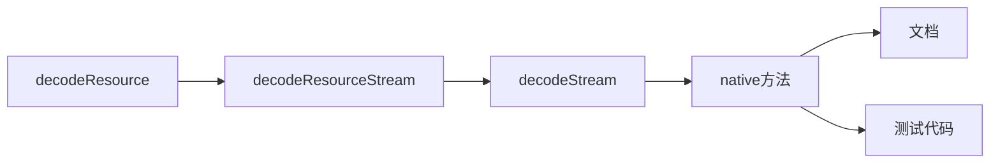

# Bitmap加载尺寸源码分析

## resource的加载逻辑

### 分析路径



### 源码

#### `decodeResource`: 

```java
public static Bitmap decodeResource(Resources res, int id, Options opts) {
    validate(opts);
    Bitmap bm = null;
    InputStream is = null; 
    
    try {
        final TypedValue value = new TypedValue();
        is = res.openRawResource(id, value);

        bm = decodeResourceStream(res, value, is, null, opts);
    } catch (Exception e) {
        /*  do nothing.
            If the exception happened on open, bm will be null.
            If it happened on close, bm is still valid.
        */
    } finally {
        try {
            if (is != null) is.close();
        } catch (IOException e) {
            // Ignore
        }
    }

    if (bm == null && opts != null && opts.inBitmap != null) {
        throw new IllegalArgumentException("Problem decoding into existing bitmap");
    }

    return bm;
}
```

#### 最终都到了 `decodeResourceStream` ：

```java
    /**
     * 从InputStream中解码一个Bitmap。这个 InputStream 从resources中获得，我们能够根据需要缩放相应的位图；
     * 
     * @throws IllegalArgumentException if {@link BitmapFactory.Options#inPreferredConfig}
     *         is {@link android.graphics.Bitmap.Config#HARDWARE}
     *         and {@link BitmapFactory.Options#inMutable} is set, if the specified color space
     *         is not {@link ColorSpace.Model#RGB RGB}, or if the specified color space's transfer
     *         function is not an {@link ColorSpace.Rgb.TransferParameters ICC parametric curve}
     */
public static Bitmap decodeResourceStream(@Nullable Resources res, @Nullable TypedValue value,
            @Nullable InputStream is, @Nullable Rect pad, @Nullable Options opts) {
        validate(opts);
        if (opts == null) {
            opts = new Options();
        }
		// 如果没有设置inDensity，且TypedValue有值
        if (opts.inDensity == 0 && value != null) {
            final int density = value.density;
            if (density == TypedValue.DENSITY_DEFAULT) {
                // inDensity 设置为系统默认值（？具体是什么？）
                opts.inDensity = DisplayMetrics.DENSITY_DEFAULT;
            } else if (density != TypedValue.DENSITY_NONE) {
                // inDensity 设置
                opts.inDensity = density;
            }
        }
        // 如果没有设置 inTargetDensity ，就设置为屏幕密度（DisplayMetrics.densityDpi）
        if (opts.inTargetDensity == 0 && res != null) {
            opts.inTargetDensity = res.getDisplayMetrics().densityDpi;
        }
        
        return decodeStream(is, pad, opts);
    }
```

总结一下，对如下值进行了检查和默认值设置：

* `inDensity`：设置为 TypedValue 中指定的 density（ `DisplayMetrics.DENSITY_DEFAULT` 或者对应的具体值 ）；
* `inTargetDensity`：`res.getDisplayMetrics().densityDpi`


#### `decodeStream`->`nativeDecodeStream`

可以看到`decodeStream`调用了`decodeStreamInternal`，`decodeStreamInternal`然后调用了`nativeDecodeStream`方法:

```java
   @Nullable
    public static Bitmap decodeStream(@Nullable InputStream is, @Nullable Rect outPadding,
            @Nullable Options opts) {
        // we don't throw in this case, thus allowing the caller to only check
        // the cache, and not force the image to be decoded.
        if (is == null) {
            return null;
        }
        validate(opts);

        Bitmap bm = null;

        Trace.traceBegin(Trace.TRACE_TAG_GRAPHICS, "decodeBitmap");
        try {
            if (is instanceof AssetManager.AssetInputStream) {
                final long asset = ((AssetManager.AssetInputStream) is).getNativeAsset();
                bm = nativeDecodeAsset(asset, outPadding, opts, Options.nativeInBitmap(opts),
                    Options.nativeColorSpace(opts));
            } else {
                bm = decodeStreamInternal(is, outPadding, opts);
            }

            if (bm == null && opts != null && opts.inBitmap != null) {
                throw new IllegalArgumentException("Problem decoding into existing bitmap");
            }

            setDensityFromOptions(bm, opts);
        } finally {
            Trace.traceEnd(Trace.TRACE_TAG_GRAPHICS);
        }

        return bm;
    }

    /**
     * Private helper function for decoding an InputStream natively. Buffers the input enough to
     * do a rewind as needed, and supplies temporary storage if necessary. is MUST NOT be null.
     */
    private static Bitmap decodeStreamInternal(@NonNull InputStream is,
            @Nullable Rect outPadding, @Nullable Options opts) {
        // ASSERT(is != null);
        byte [] tempStorage = null;
        if (opts != null) tempStorage = opts.inTempStorage;
        if (tempStorage == null) tempStorage = new byte[DECODE_BUFFER_SIZE];
        return nativeDecodeStream(is, tempStorage, outPadding, opts,
                Options.nativeInBitmap(opts),
                Options.nativeColorSpace(opts));
    }
```

#### nativeDecodeStream

接着我们看下 nativeDecodeStream 的代码：

> 代码直接查看的线上的（可能需要挂代理）：[BitmapFactory.cpp](https://android.googlesource.com/platform/frameworks/base/+/refs/heads/android10-c2f2-release/core/jni/android/graphics/BitmapFactory.cpp)

可以看到，`nativeDecodeStream` 调用了 `doDecode` 方法，同时我也将

```cpp
static jobject nativeDecodeStream(JNIEnv* env, jobject clazz, jobject is, jbyteArray storage,
        jobject padding, jobject options, jlong inBitmapHandle, jlong colorSpaceHandle) {
    jobject bitmap = NULL;
    std::unique_ptr<SkStream> stream(CreateJavaInputStreamAdaptor(env, is, storage));
    if (stream.get()) {
        std::unique_ptr<SkStreamRewindable> bufferedStream(
                SkFrontBufferedStream::Make(std::move(stream), SkCodec::MinBufferedBytesNeeded()));
        SkASSERT(bufferedStream.get() != NULL);
        bitmap = doDecode(env, std::move(bufferedStream), padding, options, inBitmapHandle,
                          colorSpaceHandle);
    }
    return bitmap;
}

int register_android_graphics_BitmapFactory(JNIEnv* env) {
    jclass options_class = FindClassOrDie(env, "android/graphics/BitmapFactory$Options");
    gOptions_bitmapFieldID = GetFieldIDOrDie(env, options_class, "inBitmap",
            "Landroid/graphics/Bitmap;");
    gOptions_justBoundsFieldID = GetFieldIDOrDie(env, options_class, "inJustDecodeBounds", "Z");
    gOptions_sampleSizeFieldID = GetFieldIDOrDie(env, options_class, "inSampleSize", "I");
    gOptions_configFieldID = GetFieldIDOrDie(env, options_class, "inPreferredConfig",
            "Landroid/graphics/Bitmap$Config;");
    gOptions_colorSpaceFieldID = GetFieldIDOrDie(env, options_class, "inPreferredColorSpace",
            "Landroid/graphics/ColorSpace;");
    gOptions_premultipliedFieldID = GetFieldIDOrDie(env, options_class, "inPremultiplied", "Z");
    gOptions_mutableFieldID = GetFieldIDOrDie(env, options_class, "inMutable", "Z");
    gOptions_ditherFieldID = GetFieldIDOrDie(env, options_class, "inDither", "Z");
    gOptions_preferQualityOverSpeedFieldID = GetFieldIDOrDie(env, options_class,
            "inPreferQualityOverSpeed", "Z");
    gOptions_scaledFieldID = GetFieldIDOrDie(env, options_class, "inScaled", "Z");
    gOptions_densityFieldID = GetFieldIDOrDie(env, options_class, "inDensity", "I");
    gOptions_screenDensityFieldID = GetFieldIDOrDie(env, options_class, "inScreenDensity", "I");
    gOptions_targetDensityFieldID = GetFieldIDOrDie(env, options_class, "inTargetDensity", "I");
    gOptions_widthFieldID = GetFieldIDOrDie(env, options_class, "outWidth", "I");
    gOptions_heightFieldID = GetFieldIDOrDie(env, options_class, "outHeight", "I");
    gOptions_mimeFieldID = GetFieldIDOrDie(env, options_class, "outMimeType", "Ljava/lang/String;");
    gOptions_outConfigFieldID = GetFieldIDOrDie(env, options_class, "outConfig",
             "Landroid/graphics/Bitmap$Config;");
    gOptions_outColorSpaceFieldID = GetFieldIDOrDie(env, options_class, "outColorSpace",
             "Landroid/graphics/ColorSpace;");
    gOptions_mCancelID = GetFieldIDOrDie(env, options_class, "mCancel", "Z");
    jclass bitmap_class = FindClassOrDie(env, "android/graphics/Bitmap");
    gBitmap_ninePatchInsetsFieldID = GetFieldIDOrDie(env, bitmap_class, "mNinePatchInsets",
            "Landroid/graphics/NinePatch$InsetStruct;");
    gBitmapConfig_class = MakeGlobalRefOrDie(env, FindClassOrDie(env,
            "android/graphics/Bitmap$Config"));
    gBitmapConfig_nativeToConfigMethodID = GetStaticMethodIDOrDie(env, gBitmapConfig_class,
            "nativeToConfig", "(I)Landroid/graphics/Bitmap$Config;");
    return android::RegisterMethodsOrDie(env, "android/graphics/BitmapFactory",
                                         gMethods, NELEM(gMethods));
}
```

> 参考[这篇文章](http://gityuan.com/2015/11/21/binder-framework/)，以下方法的含义：
>
> - FindClassOrDie(env, kBinderPathName) 基本等价于 env->FindClass(kBinderPathName)
> - MakeGlobalRefOrDie() 等价于 env->NewGlobalRef()
> - GetMethodIDOrDie() 等价于 env->GetMethodID()
> - GetFieldIDOrDie() 等价于 env->GeFieldID()
> - RegisterMethodsOrDie() 等价于 Android::registerNativeMethods();
>
> 参考[这篇文章](https://mronion0603.github.io/myblog/android/jni/2017/08/29/jni-registernatives/)，获取registerNativeMethods的用法：
>
> 在Android中通过jni调用本地方法（c/c++），通常使用javah生成规范的头文件，定义一个函数实现本地方法，函数名必须使用本地方法的全类名的规范来写。　
>
> > Java_ + 包名 + 类名+ 接口名
>
> 注意名字之间用下划线，下面是示例： `JNIEXPORT jstring Java_com_example_test_MainActivity_helloworld(JNIEnv *, jclass );`
>
> 有没有觉得这种写法太反人类了，其实jni还提供了RegisterNative函数手动的注册native方法，该方法可以自由命名函数，不必像上述方法那样拘泥特定烦杂的命名方式。`RegisterNatives`使用示例：
>
> ```
> static int registerNativeMethods(JNIEnv* env)
> {
>     jclass clazz;
>     clazz = env->FindClass("com/example/test/MainActivity");
>     if (clazz == NULL) {
>         return JNI_FALSE;
>     }
>     if (env->RegisterNatives(clazz, gMethods, sizeof(gMethods) / sizeof(gMethods[0])) < 0) {
>         return JNI_FALSE;
>     }
> 
>     return JNI_TRUE;
> }
> ```
>
> RegisterNatives中第二个参数`gMethods`是一个二维数组，代表着这个class里的每一个native方法所对应的实现的方法。写法如下示例：
>
> ```
> static JNINativeMethod gMethods[] = {
>     {"helloworld", "()Ljava/lang/String;", (void*)Jni_helloworld}};
> ```
>
> 第三个参数代表要指定的native的数量。 这时将前面在jni中声明的
>
> ```
> jstring JNIEXPORT jstring Java_com_example_test_MainActivity_helloworld(JNIEnv *, jclass );
> ```
>
> 改为
>
> ```
> jstring helloworld(JNIEnv *, jclass);
> ```
>
> 是不是清爽了很多！

#### `doDecode`:

> 代码地址：[BitmapFactory.cpp](https://android.googlesource.com/platform/frameworks/base/+/refs/heads/android10-c2f2-release/core/jni/android/graphics/BitmapFactory.cpp)

```cpp
static jobject doDecode(JNIEnv* env, std::unique_ptr<SkStreamRewindable> stream,
                        jobject padding, jobject options, jlong inBitmapHandle,
                        jlong colorSpaceHandle) {
    // Set default values for the options parameters.
    int sampleSize = 1;
    bool onlyDecodeSize = false;
    SkColorType prefColorType = kN32_SkColorType;
    bool isHardware = false;
    bool isMutable = false;
    float scale = 1.0f;
    bool requireUnpremultiplied = false;
    jobject javaBitmap = NULL;
    sk_sp<SkColorSpace> prefColorSpace = GraphicsJNI::getNativeColorSpace(colorSpaceHandle);
    // Update with options supplied by the client.
    if (options != NULL) {
        sampleSize = env->GetIntField(options, gOptions_sampleSizeFieldID);
        // Correct a non-positive sampleSize.  sampleSize defaults to zero within the
        // options object, which is strange.
        if (sampleSize <= 0) {
            sampleSize = 1;
        }
        if (env->GetBooleanField(options, gOptions_justBoundsFieldID)) {
            onlyDecodeSize = true;
        }
        // initialize these, in case we fail later on
        env->SetIntField(options, gOptions_widthFieldID, -1);
        env->SetIntField(options, gOptions_heightFieldID, -1);
        env->SetObjectField(options, gOptions_mimeFieldID, 0);
        env->SetObjectField(options, gOptions_outConfigFieldID, 0);
        env->SetObjectField(options, gOptions_outColorSpaceFieldID, 0);
        jobject jconfig = env->GetObjectField(options, gOptions_configFieldID);
        prefColorType = GraphicsJNI::getNativeBitmapColorType(env, jconfig);
        isHardware = GraphicsJNI::isHardwareConfig(env, jconfig);
        isMutable = env->GetBooleanField(options, gOptions_mutableFieldID);
        requireUnpremultiplied = !env->GetBooleanField(options, gOptions_premultipliedFieldID);
        javaBitmap = env->GetObjectField(options, gOptions_bitmapFieldID);
        if (env->GetBooleanField(options, gOptions_scaledFieldID)) {
            const int density = env->GetIntField(options, gOptions_densityFieldID);
            const int targetDensity = env->GetIntField(options, gOptions_targetDensityFieldID);
            const int screenDensity = env->GetIntField(options, gOptions_screenDensityFieldID);
            if (density != 0 && targetDensity != 0 && density != screenDensity) {
                scale = (float) targetDensity / density;
            }
        }
    }
    if (isMutable && isHardware) {
        doThrowIAE(env, "Bitmaps with Config.HARDWARE are always immutable");
        return nullObjectReturn("Cannot create mutable hardware bitmap");
    }
    // Create the codec.
    NinePatchPeeker peeker;
    std::unique_ptr<SkAndroidCodec> codec;
    {
        SkCodec::Result result;
        std::unique_ptr<SkCodec> c = SkCodec::MakeFromStream(std::move(stream), &result,
                                                             &peeker);
        if (!c) {
            SkString msg;
            msg.printf("Failed to create image decoder with message '%s'",
                       SkCodec::ResultToString(result));
            return nullObjectReturn(msg.c_str());
        }
        codec = SkAndroidCodec::MakeFromCodec(std::move(c));
        if (!codec) {
            return nullObjectReturn("SkAndroidCodec::MakeFromCodec returned null");
        }
    }
    // Do not allow ninepatch decodes to 565.  In the past, decodes to 565
    // would dither, and we do not want to pre-dither ninepatches, since we
    // know that they will be stretched.  We no longer dither 565 decodes,
    // but we continue to prevent ninepatches from decoding to 565, in order
    // to maintain the old behavior.
    if (peeker.mPatch && kRGB_565_SkColorType == prefColorType) {
        prefColorType = kN32_SkColorType;
    }
    // Determine the output size.
    SkISize size = codec->getSampledDimensions(sampleSize);
    int scaledWidth = size.width();
    int scaledHeight = size.height();
    bool willScale = false;
    // Apply a fine scaling step if necessary.
    if (needsFineScale(codec->getInfo().dimensions(), size, sampleSize)) {
        willScale = true;
        scaledWidth = codec->getInfo().width() / sampleSize;
        scaledHeight = codec->getInfo().height() / sampleSize;
    }
    // Set the decode colorType
    SkColorType decodeColorType = codec->computeOutputColorType(prefColorType);
    if (decodeColorType == kRGBA_F16_SkColorType && isHardware &&
            !uirenderer::HardwareBitmapUploader::hasFP16Support()) {
        decodeColorType = kN32_SkColorType;
    }
    sk_sp<SkColorSpace> decodeColorSpace = codec->computeOutputColorSpace(
            decodeColorType, prefColorSpace);
    // Set the options and return if the client only wants the size.
    if (options != NULL) {
        jstring mimeType = encodedFormatToString(
                env, (SkEncodedImageFormat)codec->getEncodedFormat());
        if (env->ExceptionCheck()) {
            return nullObjectReturn("OOM in encodedFormatToString()");
        }
        env->SetIntField(options, gOptions_widthFieldID, scaledWidth);
        env->SetIntField(options, gOptions_heightFieldID, scaledHeight);
        env->SetObjectField(options, gOptions_mimeFieldID, mimeType);
        jint configID = GraphicsJNI::colorTypeToLegacyBitmapConfig(decodeColorType);
        if (isHardware) {
            configID = GraphicsJNI::kHardware_LegacyBitmapConfig;
        }
        jobject config = env->CallStaticObjectMethod(gBitmapConfig_class,
                gBitmapConfig_nativeToConfigMethodID, configID);
        env->SetObjectField(options, gOptions_outConfigFieldID, config);
        env->SetObjectField(options, gOptions_outColorSpaceFieldID,
                GraphicsJNI::getColorSpace(env, decodeColorSpace.get(), decodeColorType));
        if (onlyDecodeSize) {
            return nullptr;
        }
    }
    // Scale is necessary due to density differences.
    if (scale != 1.0f) {
        willScale = true;
        scaledWidth = static_cast<int>(scaledWidth * scale + 0.5f);
        scaledHeight = static_cast<int>(scaledHeight * scale + 0.5f);
    }
    android::Bitmap* reuseBitmap = nullptr;
    unsigned int existingBufferSize = 0;
    if (javaBitmap != nullptr) {
        reuseBitmap = &bitmap::toBitmap(inBitmapHandle);
        if (reuseBitmap->isImmutable()) {
            ALOGW("Unable to reuse an immutable bitmap as an image decoder target.");
            javaBitmap = nullptr;
            reuseBitmap = nullptr;
        } else {
            existingBufferSize = reuseBitmap->getAllocationByteCount();
        }
    }
    HeapAllocator defaultAllocator;
    RecyclingPixelAllocator recyclingAllocator(reuseBitmap, existingBufferSize);
    ScaleCheckingAllocator scaleCheckingAllocator(scale, existingBufferSize);
    SkBitmap::HeapAllocator heapAllocator;
    SkBitmap::Allocator* decodeAllocator;
    if (javaBitmap != nullptr && willScale) {
        // This will allocate pixels using a HeapAllocator, since there will be an extra
        // scaling step that copies these pixels into Java memory.  This allocator
        // also checks that the recycled javaBitmap is large enough.
        decodeAllocator = &scaleCheckingAllocator;
    } else if (javaBitmap != nullptr) {
        decodeAllocator = &recyclingAllocator;
    } else if (willScale || isHardware) {
        // This will allocate pixels using a HeapAllocator,
        // for scale case: there will be an extra scaling step.
        // for hardware case: there will be extra swizzling & upload to gralloc step.
        decodeAllocator = &heapAllocator;
    } else {
        decodeAllocator = &defaultAllocator;
    }
    SkAlphaType alphaType = codec->computeOutputAlphaType(requireUnpremultiplied);
    const SkImageInfo decodeInfo = SkImageInfo::Make(size.width(), size.height(),
            decodeColorType, alphaType, decodeColorSpace);
    SkImageInfo bitmapInfo = decodeInfo;
    if (decodeColorType == kGray_8_SkColorType) {
        // The legacy implementation of BitmapFactory used kAlpha8 for
        // grayscale images (before kGray8 existed).  While the codec
        // recognizes kGray8, we need to decode into a kAlpha8 bitmap
        // in order to avoid a behavior change.
        bitmapInfo =
                bitmapInfo.makeColorType(kAlpha_8_SkColorType).makeAlphaType(kPremul_SkAlphaType);
    }
    SkBitmap decodingBitmap;
    if (!decodingBitmap.setInfo(bitmapInfo) ||
            !decodingBitmap.tryAllocPixels(decodeAllocator)) {
        // SkAndroidCodec should recommend a valid SkImageInfo, so setInfo()
        // should only only fail if the calculated value for rowBytes is too
        // large.
        // tryAllocPixels() can fail due to OOM on the Java heap, OOM on the
        // native heap, or the recycled javaBitmap being too small to reuse.
        return nullptr;
    }
    // Use SkAndroidCodec to perform the decode.
    SkAndroidCodec::AndroidOptions codecOptions;
    codecOptions.fZeroInitialized = decodeAllocator == &defaultAllocator ?
            SkCodec::kYes_ZeroInitialized : SkCodec::kNo_ZeroInitialized;
    codecOptions.fSampleSize = sampleSize;
    SkCodec::Result result = codec->getAndroidPixels(decodeInfo, decodingBitmap.getPixels(),
            decodingBitmap.rowBytes(), &codecOptions);
    switch (result) {
        case SkCodec::kSuccess:
        case SkCodec::kIncompleteInput:
            break;
        default:
            return nullObjectReturn("codec->getAndroidPixels() failed.");
    }
    // This is weird so let me explain: we could use the scale parameter
    // directly, but for historical reasons this is how the corresponding
    // Dalvik code has always behaved. We simply recreate the behavior here.
    // The result is slightly different from simply using scale because of
    // the 0.5f rounding bias applied when computing the target image size
    const float scaleX = scaledWidth / float(decodingBitmap.width());
    const float scaleY = scaledHeight / float(decodingBitmap.height());
    jbyteArray ninePatchChunk = NULL;
    if (peeker.mPatch != NULL) {
        if (willScale) {
            peeker.scale(scaleX, scaleY, scaledWidth, scaledHeight);
        }
        size_t ninePatchArraySize = peeker.mPatch->serializedSize();
        ninePatchChunk = env->NewByteArray(ninePatchArraySize);
        if (ninePatchChunk == NULL) {
            return nullObjectReturn("ninePatchChunk == null");
        }
        jbyte* array = (jbyte*) env->GetPrimitiveArrayCritical(ninePatchChunk, NULL);
        if (array == NULL) {
            return nullObjectReturn("primitive array == null");
        }
        memcpy(array, peeker.mPatch, peeker.mPatchSize);
        env->ReleasePrimitiveArrayCritical(ninePatchChunk, array, 0);
    }
    jobject ninePatchInsets = NULL;
    if (peeker.mHasInsets) {
        ninePatchInsets = peeker.createNinePatchInsets(env, scale);
        if (ninePatchInsets == NULL) {
            return nullObjectReturn("nine patch insets == null");
        }
        if (javaBitmap != NULL) {
            env->SetObjectField(javaBitmap, gBitmap_ninePatchInsetsFieldID, ninePatchInsets);
        }
    }
    SkBitmap outputBitmap;
    if (willScale) {
        // Set the allocator for the outputBitmap.
        SkBitmap::Allocator* outputAllocator;
        if (javaBitmap != nullptr) {
            outputAllocator = &recyclingAllocator;
        } else {
            outputAllocator = &defaultAllocator;
        }
        SkColorType scaledColorType = decodingBitmap.colorType();
        // FIXME: If the alphaType is kUnpremul and the image has alpha, the
        // colors may not be correct, since Skia does not yet support drawing
        // to/from unpremultiplied bitmaps.
        outputBitmap.setInfo(
                bitmapInfo.makeWH(scaledWidth, scaledHeight).makeColorType(scaledColorType));
        if (!outputBitmap.tryAllocPixels(outputAllocator)) {
            // This should only fail on OOM.  The recyclingAllocator should have
            // enough memory since we check this before decoding using the
            // scaleCheckingAllocator.
            return nullObjectReturn("allocation failed for scaled bitmap");
        }
        SkPaint paint;
        // kSrc_Mode instructs us to overwrite the uninitialized pixels in
        // outputBitmap.  Otherwise we would blend by default, which is not
        // what we want.
        paint.setBlendMode(SkBlendMode::kSrc);
        paint.setFilterQuality(kLow_SkFilterQuality); // bilinear filtering
        SkCanvas canvas(outputBitmap, SkCanvas::ColorBehavior::kLegacy);
        canvas.scale(scaleX, scaleY);
        canvas.drawBitmap(decodingBitmap, 0.0f, 0.0f, &paint);
    } else {
        outputBitmap.swap(decodingBitmap);
    }
    if (padding) {
        peeker.getPadding(env, padding);
    }
    // If we get here, the outputBitmap should have an installed pixelref.
    if (outputBitmap.pixelRef() == NULL) {
        return nullObjectReturn("Got null SkPixelRef");
    }
    if (!isMutable && javaBitmap == NULL) {
        // promise we will never change our pixels (great for sharing and pictures)
        outputBitmap.setImmutable();
    }
    bool isPremultiplied = !requireUnpremultiplied;
    if (javaBitmap != nullptr) {
        bitmap::reinitBitmap(env, javaBitmap, outputBitmap.info(), isPremultiplied);
        outputBitmap.notifyPixelsChanged();
        // If a java bitmap was passed in for reuse, pass it back
        return javaBitmap;
    }
    int bitmapCreateFlags = 0x0;
    if (isMutable) bitmapCreateFlags |= android::bitmap::kBitmapCreateFlag_Mutable;
    if (isPremultiplied) bitmapCreateFlags |= android::bitmap::kBitmapCreateFlag_Premultiplied;
    if (isHardware) {
        sk_sp<Bitmap> hardwareBitmap = Bitmap::allocateHardwareBitmap(outputBitmap);
        if (!hardwareBitmap.get()) {
            return nullObjectReturn("Failed to allocate a hardware bitmap");
        }
        return bitmap::createBitmap(env, hardwareBitmap.release(), bitmapCreateFlags,
                ninePatchChunk, ninePatchInsets, -1);
    }
    // now create the java bitmap
    return bitmap::createBitmap(env, defaultAllocator.getStorageObjAndReset(),
            bitmapCreateFlags, ninePatchChunk, ninePatchInsets, -1);
}

```

与这几个density属性相关的代码在：

```cpp
// Update with options supplied by the client.
    if (options != NULL) {
        sampleSize = env->GetIntField(options, gOptions_sampleSizeFieldID);
        // Correct a non-positive sampleSize.  sampleSize defaults to zero within the
        // options object, which is strange.
        if (sampleSize <= 0) {
            sampleSize = 1;
        }
        if (env->GetBooleanField(options, gOptions_justBoundsFieldID)) {
            onlyDecodeSize = true;
        }
        // initialize these, in case we fail later on
        env->SetIntField(options, gOptions_widthFieldID, -1);
        env->SetIntField(options, gOptions_heightFieldID, -1);
        env->SetObjectField(options, gOptions_mimeFieldID, 0);
        env->SetObjectField(options, gOptions_outConfigFieldID, 0);
        env->SetObjectField(options, gOptions_outColorSpaceFieldID, 0);
        jobject jconfig = env->GetObjectField(options, gOptions_configFieldID);
        prefColorType = GraphicsJNI::getNativeBitmapColorType(env, jconfig);
        isHardware = GraphicsJNI::isHardwareConfig(env, jconfig);
        isMutable = env->GetBooleanField(options, gOptions_mutableFieldID);
        requireUnpremultiplied = !env->GetBooleanField(options, gOptions_premultipliedFieldID);
        javaBitmap = env->GetObjectField(options, gOptions_bitmapFieldID);
        if (env->GetBooleanField(options, gOptions_scaledFieldID)) {
            const int density = env->GetIntField(options, gOptions_densityFieldID);
            const int targetDensity = env->GetIntField(options, gOptions_targetDensityFieldID);
            const int screenDensity = env->GetIntField(options, gOptions_screenDensityFieldID);
            if (density != 0 && targetDensity != 0 && density != screenDensity) {
                scale = (float) targetDensity / density;
            }
        }
    }
```

**具体逻辑如下：**

1. 查看是否设置了 scaled 属性；
2. 如果没有设置，则不缩放；
3. 如设置了，按以下规则确定缩放比例：
   * 仅当设置了density，targetDensity且density不等于screenDensity时才缩放，否则不缩放；
   * 缩放值为 targetDensity/density，即缩放到targetDensity的目标密度；
   * 大致含义就是：如果bitmap本身的密度和屏幕的密度不一致，就缩放到targetDensity。

那么，density及targetDensity的值为多少了？如果由我们自行设置，还有什么意义？

## `BitmapFactory.Options`

| 属性                        | 解释                                                         |
| --------------------------- | ------------------------------------------------------------ |
| `inBitmap`                  | 如果设置了，则加载的时候会复用这个Bitmap。如果解码操作无法使用这个bitmap，则解码方法会抛出一个IllegalArumentException。<br/>当前的实现方式要求重用位图是可变的，并且即使在解码通常会生成不可变位图的资源时，所得到的重用位图也将继续保持可变。由于上述限制和可能发生的故障情况，您仍应始终使用返回的解码方法的位图，而不应假定重用该位图是有效的。<br/>可以通过检查返回的Bitmap和inBitmap是否同一个来判断是否真的重用了传入的Bitmap，由于不一定能够重用inBitmap，应该始终使用解码函数返回的位图以确保使用的位图中包含了真正的位图内容。<br/>**和BitmapFactory一起使用**<br/>在KITKAT及之后的版本上，只要要解码的位图的字节数小于或者等于inBitmap声明的的位图，任何可变位图都可以被重用。（）<br/>在KITKAT之前的版本上，还有额外的限制：1）要解码的位图（不管是资源还是流）都必须是jpeg或者png格式；2）仅支持inSampleSize设置为1的大小相等的位图。 另外如果设置了inPreferredConfig，那么被重用的bitmap的该设置值会被opts中的设置覆盖；<br/>**和BitmapRegionDecoder一起使用**<br/>BitmapRegionDecoder会将请求的内容绘制到提供的Bitmap中，如果输出的大小比提供的位图大，则会裁剪内容大小（执行缩放）。且提供的位图的宽高及Bitmap.Config均会保持不变；<br/>从JELLY_BEAN开始支持inBitmap，所有BitmapRegionDecoder支持的格式都能通过inBitmap来复用位图； |
| `inDensity`                 | bitmap要使用的像素密度。设置了这个值后，返回的位图总会被设置对应的density；<br/>另外，如果设置了 inScaled ，并且inDensity和inTargetDensity不匹配，那么Bitmap将会被缩放以匹配目标密度（targetDensity）。<br/>如果设置为0，则 decodeResource(Resources,int),<br/>decodeResource(Resources,int,BitmapFactory.Options)及decodeResourceStream将会使用资源的密度来设置inDensity；而其他函数则会保持没有设置density的状态； |
| `inDither`                  | API 24 已弃用                                                |
| `inInputShareble`           | API 21 已弃用                                                |
| `inJustDecodeBounds`        | 如果设置为true，则返回null的bitmap，但是`outXXX`的属性会被设置，这个属性可以用来查询bitmap的属性（不分配实际的像素内存）； |
| `inMutable`                 | true - 解码方法将会返回一个可修改的Bitmap；<br/>例如，可以将可修改的bitmap传递给BitmapFactory以实现Bitmap的复用。 <br/>不能与`inPreferredConfig` = `Bitmap.Config.HARDWARE`同时设置，因为硬件位图始终是不可变的。 |
| `inPreferQualityOverSpeed`  | Android N已弃用                                              |
| `inPreferredColorSpace`     | 如果设置为非null，则解码器将尝试解码到此颜色空间；<br/>如果设置为null，或者说设置的颜色空间请求不能满足要求，解码器会使用嵌入在图像中的颜色空间，或者最适合于请求的图片的颜色空间（如：`Bitmap.Config.ARGB_8888`会使用`sRGB`，而`Bitmap.Config.RGBA_F16`会使用`EXTENDED_SRGB`)。<br/>当前仅支持 `ColorSpace.Model.RGB` 颜色空间，当使用非RGB的颜色空间（如Lab）时，会抛出一个非法参数异常。<br/> 指定的颜色空间转换函数必须时一个 ICC parametric curve 。如果在指定的颜色空间上调用 `ColorSpace.Rgb.getTransferParameters()` 返回了null，则解码器会抛出一个非法参数异常。 |
| `inPreferredConfig`         | 如果设置为非null，解码器将会尝试解码为该内部配置。<br/>如果设置为null，或者设置的值无法满足要求，则会基于系统的屏幕深度及原始图片的特征（如是否具有alpha值）挑选一个最为匹配的配置。<br/>图片默认以 `Bitmap.Config.ARGB_8888` 的配置被加载； |
| `inPremultiplied`           | 预乘<br/>如果设置为true，生成的位图的颜色通道将预乘以Alpha通道。对于由视图系统或通过Canvas直接绘制的图像，不应将其设置为false。Canvas假定所有绘制的图像都已预乘以简化绘制时混合（blending），并且绘制未预乘的图像时将抛出RuntimeException。<br/>仅当您要操纵原始编码的图像数据（例如， 使用RenderScript或自定义OpenGL。 这不会影响没有Alpha通道的位图。 将inScaled设置为true时将此标志设置为false可能会导致颜色错误。 |
| `inPurgeable`               | LOLLIPOP 及以上会忽略                                        |
| `inSampleSize`              | 如果设置为大于1的值，则请求解码器对原始图像进行二次采样，然后返回较小的图像以节省内存。样本大小是任一维度中与解码后的位图中的单个像素相对应的像素数。例如，inSampleSize == 4返回的图像为原始宽度/高度的1/4，最终像素数量为原始图像的1/16。任何小于等于1的值都与1相同。注意：解码器使用基于2的幂的最终值，任何其他值将四舍五入为最接近的2的幂。 |
| `inScaled`                  | 设置此标志后，如果`inDensity`和`inTargetDensity`不为0，则位图将在加载时缩放为与`inTargetDensity`匹配，而不是依赖于图形系统在每次绘制到Canvas时对其进行缩放。<br/>`BitmapRegionDecoder`忽略此标志，并且不会根据密度缩放输出。 （尽管支持`inSampleSize`） 默认情况下，此标志是打开的；如果需要位图的非缩放版本，则应将其关闭。<br/>点九图会忽略此标志，并且始终会缩放。<br/>如果将`inPremultiplied`设置为`false`，并且图像具有`Alpha`，则将此标志设置为`true`可能会导致颜色错误。 |
| `inScreenDensity`           | 正在使用的实际屏幕的像素密度。 这纯粹是针对以密度兼容性代码运行的应用程序，其中inTargetDensity实际上是应用程序看到的密度，而不是实际屏幕密度。<br/>通过设置此项，您可以允许加载代码避免将屏幕密度中当前的位图放大/缩小到兼容密度。 相反，如果inDensity与inScreenDensity相同，则位图将保持不变。 任何使用结果位图的东西都必须使用`Bitmap.getScaledWidth`和`Bitmap.getScaledHeight`来说明位图密度与目标密度之间的任何差异。<br/>BitmapFactory本身永远不会自动设置这个属性的值。调用者必须明确设置它，因为调用者必须以密度感知的方式处理生成的位图。 |
| `inTargetDensity`           | 该位图将被绘制到的目标像素密度。 它与`inDensity`和`inScaled`结合使用，以确定是否以及如何在返回位图之前对其进行缩放。 如果该值为0，`decodeResource（Resources，int）`，`decodeResource（Resources，int，BitmapFactory.Options）`和`decodeResourceStream`将填充与资源对象的DisplayMetrics相关的密度。 其他功能将保持原样，并且不会执行密度缩放。 |
| `inTempStorage`             | 用于解码的临时存储。 建议16K左右。                           |
| `mCancel`                   | Android N 已不推荐使用                                       |
| `outColorSpace`             | 解码后的位图将具有的色彩空间。 请注意，不能保证输出颜色空间是使用位图编码的颜色空间。 如果未知（例如，配置为Bitmap.Config.ALPHA_8），或者存在错误，则将其设置为null。 |
| `outConfig`:`Bitmap.Config` | 如果是已知的配置，则解码后的位图将具有该配置。 如果未知或存在错误，则将其设置为null。 |
| `outHeight`                 | 位图的最终高度。 如果inJustDecodeBounds设置为false，则这是应用任何缩放比例后输出位图的高度。 如果为true，它将是输入图像的高度，不考虑缩放比例。 如果尝试解码时发生错误，outHeight将设置为-1。 |
| `outMimeType`               | 如果是已知的，则将该字符串设置为解码图像的模仿类型。 如果未知或存在错误，则将其设置为null。 |
| `outWidth`                  | 位图的结果宽度。 如果inJustDecodeBounds设置为false，则这将是应用任何缩放后输出位图的宽度。 如果为true，则为输入图像的宽度，不考虑缩放。 如果尝试解码时发生错误，outWidth将被设置为-1。 |

## density缩放机制

### 为什么要缩放

图片的ppi一般是72ppi（pixel per inch），而对于android来说，默认的dpi(dot per inch)是160，那么一个普通的100x100的图片，加载到160的设备上，尺寸是多大呢？

我将一个模拟器设置为160dpi，不缩放加载一个192x192的图片，然后截图测量，可以看到其宽高


也就是说，在Android上，dpi=160 表示 1。实际上上面这个192x192的图片显示的时候，可以有两种看法：

1. 192x192 像素；
2. 192x192 dp；


如果说一个dpi=320的设备上，加载一个192x192像素的图片，那么它最终要显示多大呢，是192x192像素，还是192x192dp呢？

如果显示为192x192dp，那么实际的像素宽高应该是:384(192x2)x384，也就是我们需要缩放；

### 缩放机制概述

相关属性：`inDensity`，`inScaled`，`inScreenDensity`，`inTargetDensity`

* `inDensity`： bitmap要使用的像素密度。设置了这个值后，返回的位图总会被设置对应的density；<br/>另外，如果设置了 `inScaled` ，并且`inDensity`和`inTargetDensity`不匹配，那么Bitmap将会被缩放以匹配目标密度（targetDensity）。<br/>如果设置为0，则 `decodeResource(Resources,int)`,`decodeResource(Resources,int,BitmapFactory.Options)`及`decodeResourceStream`将会使用资源的密度来设置`inDensity`；而其他函数则会保持没有设置density的状态；

* `inTargetDensity`： 该位图将被绘制到的目标像素密度。 它与`inDensity`和`inScaled`结合使用，以确定是否以及如何在返回位图之前对其进行缩放。 如果该值为0，`decodeResource（Resources，int）`，`decodeResource（Resources，int，BitmapFactory.Options）`和`decodeResourceStream`将填充与资源对象的DisplayMetrics相关的密度。 其他功能将保持原样，并且不会执行密度缩放。
* `inScreenDensity`:正在使用的实际屏幕的像素密度。 这纯粹是针对以密度兼容性代码运行的应用程序，其中`inTargetDensity`实际上是应用程序看到的密度，而不是实际屏幕密度。<br/>通过设置此项，您可以允许加载代码避免将屏幕密度中当前的位图放大/缩小到兼容密度。 相反，如果`inDensity`与`inScreenDensity`相同，则位图将保持不变。 任何使用结果位图的东西都必须使用`Bitmap.getScaledWidth`和`Bitmap.getScaledHeight`来说明位图密度与目标密度之间的任何差异。<br/>BitmapFactory本身永远不会自动设置这个属性的值。调用者必须明确设置它，因为调用者必须以密度感知的方式处理生成的位图。

* `inScaled`: 设置此标志后，如果`inDensity`和`inTargetDensity`不为0，则位图将在加载时缩放为与`inTargetDensity`匹配，而不是依赖于图形系统在每次绘制到Canvas时对其进行缩放。<br/>`BitmapRegionDecoder`忽略此标志，并且不会根据密度缩放输出。 （尽管支持`inSampleSize`） 默认情况下，此标志是打开的；如果需要位图的非缩放版本，则应将其关闭。<br/>点九图会忽略此标志，并且始终会缩放。<br/>如果将`inPremultiplied`设置为`false`，并且图像具有`Alpha`，则将此标志设置为`true`可能会导致颜色错误。

**结合先前的源码分析总结如下：**(确定缩放scale的值)

```flow
​```flow
st=>start: 开始
opScaled=>operation: 
cond=>condition: inScaled是否设置？
condDensity=>condition: inDensity是否=0？
condTargetDensity=>condition: inTargetDensity是否=0？
condEqualScreenDensity=>condition: inDensity==inScreenDensity?
eOne=>end: scale=1.0f
opScaled=>operation: scale=inTargetDensity/inDensity

st->cond

cond(yes)->condDensity
cond(no)->eOne

condDensity(no)->condTargetDensity
condDensity(yes)->eOne

condTargetDensity(no)->condEqualScreenDensity
condTargetDensity(yes)->eOne

condEqualScreenDensity(yes)->eOne

opScaled->eOne

​```	
```


> 参考：
>
> * [inDensity，inTargetDensity，inScreenDensity关系详解](https://blog.csdn.net/wwzuizz/article/details/73249254)


### 缩放机制中默认情况说明

本小结解决如下几个问题：

1. 默认情况下，这几个density属性是如何设置的？
2. 不同的图片源这几个值是如何设置的？
3. 直接的含义是什么？

首先，我们看下BitmapFactory提供的解码方法：

| 方法                                                         | 说明 |
| ------------------------------------------------------------ | ---- |
| `decodeFile(String pathName, Options opts)`                  |      |
| `decodeFile(String pathName)`                                |      |
|                                                              |      |
| `decodeResourceStream(Resources,TypedValue,InputStream,`<br/>`Rect pad,Options opts)` |      |
| `decodeResource(Resources res, int id, Options opts)`        |      |
| `decodeResource(Resources res, int id)`                      |      |
|                                                              |      |
| `decodeByteArray(byte[] data, int offset, int length,`<br/> `Options opts)` |      |
| `decodeByteArray(byte[] data, int offset, int length)`       |      |
|                                                              |      |
| `decodeStream(InputStream is,` <br/>`Rect outPadding,Options opts)` |      |
| `decodeStream(InputStream is)`                               |      |
|                                                              |      |
| `decodeFileDescriptor(FileDescriptor fd,`<br/> `Rect outPadding, Options opts)` |      |
| `decodeFileDescriptor(FileDescriptor fd)`                    |      |

可以看到，共提供了五组解码方法，分别为：

1. 文件；
2. Resource；
3. ByteArray
4. Stream
5. FileDescriptor

每组中一般由两个方法变体，Resource有三个变体，其中：

* 所有方法都有一个提供多一个Options参数的变体；
* Resource，Stream，FileDescriptor则还提供另外一个outPadding（Rect）的参数；

也就是说，==支持按默认方式解码，也支持按自定义选项的方式解码。==至于其中的outPadding是什么含义呢？

> 官方文档如下：（不过还是不清楚）
>
> 如果不为null，则返回位图的填充矩形（如果存在），否则将填充设置为[-1，-1，-1，-1]。 如果没有返回位图（空），则填充保持不变。 

所以，实际上bitmap占用的内存与其加载方式有关；可以通过选项控制其缩放，不过我们需要找到最适合的缩放比例，一般来说就是在当前设备上最为合适的显示方式；


现在我们测试一下。

### 代码示例验证

通过示例代码验证之前的结论

* 默认情况下几种类型的加载缩放效果；

* 验证PaddingRect的效果；
* 自行传入选项时，是否与前面分析的缩放机制一致；
* 总结


$$
\begin{align}

& bitmapSize = scaledWidth \times scaledHeight \times pixelSize \\
\\
& scaledWidth = scale \times width \\
& scaleHeight = scale \times height \\
\\
& scale = 1.0f \\
& 或者 \\
& scale = targetDensity/density \\

\end{align}
$$


不同资源来说，其density一般都是图片自身的密度，一般图片的ppi为72，一个100x100的图片在不同ppi的密度下大小为：


<!DOCTYPE svg PUBLIC "-//W3C//DTD SVG 1.1//EN" "http://www.w3.org/Graphics/SVG/1.1/DTD/svg11.dtd">
<svg xmlns:dc="http://purl.org/dc/elements/1.1/" xmlns="http://www.w3.org/2000/svg" version="1.1" xmlns:xl="http://www.w3.org/1999/xlink" viewBox="433.97634 358.97653 104.0472 104.04694" width="104.0472" height="104.04694">
  <defs>
    <radialGradient cx="0" cy="0" r="1" id="Gradient" gradientUnits="userSpaceOnUse">
      <stop offset="0" stop-color="#9ed9c5"/>
      <stop offset="1" stop-color="#77ae95"/>
    </radialGradient>
    <radialGradient id="Obj_Gradient" xl:href="#Gradient" gradientTransform="translate(486 411) scale(70.71068)"/>
  </defs>
  <metadata> Produced by OmniGraffle 7.18.4\n2021-03-17 06:35:55 +0000</metadata>
  <g id="Canvas_1" fill-opacity="1" stroke="none" stroke-opacity="1" stroke-dasharray="none" fill="none">
    <title>Canvas 1</title>
    <g id="Canvas_1_Layer_1">
      <title>Layer 1</title>
      <g id="Group_2">
        <g id="Graphic_9">
          <path d="M 485.9993 412.9773 C 485.9993 329.9307 537.88824 359.11036 484.7338 412.26653 C 537.88824 359.11036 567.07024 411.00105 484.02304 411.00105 C 567.07024 411.00105 537.88824 462.88964 484.7338 409.73347 C 537.88824 462.88964 485.9993 492.0693 485.9993 409.0227 C 485.9993 492.0693 434.11457 462.88964 487.2648 409.73347 C 434.11457 462.88964 404.92835 411.00105 487.97556 411.00105 C 404.92835 411.00105 434.11457 359.11036 487.2648 412.26653 C 434.11457 359.11036 485.9993 329.9307 485.9993 412.9773 Z" fill="url(#Obj_Gradient)"/>
          <path d="M 485.9993 412.9773 C 485.9993 329.9307 537.88824 359.11036 484.7338 412.26653 C 537.88824 359.11036 567.07024 411.00105 484.02304 411.00105 C 567.07024 411.00105 537.88824 462.88964 484.7338 409.73347 C 537.88824 462.88964 485.9993 492.0693 485.9993 409.0227 C 485.9993 492.0693 434.11457 462.88964 487.2648 409.73347 C 434.11457 462.88964 404.92835 411.00105 487.97556 411.00105 C 404.92835 411.00105 434.11457 359.11036 487.2648 412.26653 C 434.11457 359.11036 485.9993 329.9307 485.9993 412.9773 Z" stroke="#1a1918" stroke-linecap="round" stroke-linejoin="miter" stroke-width="1"/>
        </g>
        <g id="Graphic_8">
          <path d="M 485.4391 412.44686 C 508.937 351.67888 538.64416 387.7111 484.7157 411.56946 C 538.64416 387.7111 545.3238 433.93036 484.5533 410.4411 C 545.3238 433.93036 509.2913 463.64576 485.4307 409.71555 C 509.2913 463.64576 463.0633 470.32323 486.55906 409.55314 C 463.0633 470.32323 433.3561 434.2889 487.2825 410.43265 C 433.3561 434.2889 426.6765 388.06753 487.4449 411.5589 C 426.6765 388.06753 462.70896 358.35424 486.5675 412.28445 C 462.70896 358.35424 508.937 351.67888 485.4391 412.44686 Z" fill="white"/>
        </g>
        <g id="Graphic_7">
          <path d="M 485.4391 412.44686 C 508.937 351.67888 538.64416 387.7111 484.7157 411.56946 C 538.64416 387.7111 545.3238 433.93036 484.5533 410.4411 C 545.3238 433.93036 509.2913 463.64576 485.4307 409.71555 C 509.2913 463.64576 463.0633 470.32323 486.55906 409.55314 C 463.0633 470.32323 433.3561 434.2889 487.2825 410.43265 C 433.3561 434.2889 426.6765 388.06753 487.4449 411.5589 C 426.6765 388.06753 462.70896 358.35424 486.5675 412.28445 C 462.70896 358.35424 508.937 351.67888 485.4391 412.44686 Z" fill="#a9e8d3"/>
          <path d="M 485.4391 412.44686 C 508.937 351.67888 538.64416 387.7111 484.7157 411.56946 C 538.64416 387.7111 545.3238 433.93036 484.5533 410.4411 C 545.3238 433.93036 509.2913 463.64576 485.4307 409.71555 C 509.2913 463.64576 463.0633 470.32323 486.55906 409.55314 C 463.0633 470.32323 433.3561 434.2889 487.2825 410.43265 C 433.3561 434.2889 426.6765 388.06753 487.4449 411.5589 C 426.6765 388.06753 462.70896 358.35424 486.5675 412.28445 C 462.70896 358.35424 508.937 351.67888 485.4391 412.44686 Z" stroke="#1a1918" stroke-linecap="round" stroke-linejoin="miter" stroke-width="1"/>
        </g>
        <g id="Graphic_6">
          <path d="M 500.39035 410.23376 C 503.94846 411.67007 499.1586 412.49895 496.2881 413.1127 C 498.49 415.20495 502.316 418.18725 498.5596 417.58404 C 500.9978 420.6444 496.39986 419.09206 493.58417 418.1514 C 494.50164 421.1379 496.37666 425.61557 493.37115 423.15845 C 494.01443 427.09196 490.8423 423.43474 488.79643 421.1316 C 488.17 424.2067 487.4318 429.0007 485.9976 425.2802 C 484.5634 429.0007 483.8252 424.2067 483.1988 421.1316 C 481.1529 423.43474 477.9808 427.08985 478.6241 423.15845 C 475.61855 425.61346 477.4936 421.1358 478.41105 418.1493 C 475.59324 419.08995 470.9932 420.6444 473.4335 417.58193 C 469.6771 418.18514 473.5052 415.20706 475.70714 413.1148 C 472.8366 412.49895 468.04465 411.67007 471.60487 410.23376 C 468.04465 408.79955 472.8366 407.96856 475.70714 407.3548 C 473.5052 405.26256 469.68134 402.28237 473.4356 402.8856 C 470.99955 399.82103 475.59324 401.37545 478.41105 402.3161 C 477.4936 399.3296 475.61855 394.85405 478.62196 397.30907 C 477.9808 393.37556 481.1529 397.03277 483.1988 399.33593 C 483.8252 396.26083 484.5634 391.4668 485.9976 395.1873 C 487.4318 391.4668 488.17 396.26083 488.79643 399.33593 C 490.8444 397.03277 494.01654 393.37556 493.37326 397.30907 C 496.3809 394.85405 494.50164 399.3296 493.58417 402.3161 C 496.39986 401.37545 500.9999 399.82314 498.5617 402.8856 C 502.316 402.28237 498.49 405.26045 496.2881 407.3527 C 499.1586 407.96856 503.94846 408.79745 500.39035 410.23376 Z" fill="white"/>
        </g>
        <g id="Graphic_5">
          <path d="M 500.39035 410.23376 C 503.94846 411.67007 499.1586 412.49895 496.2881 413.1127 C 498.49 415.20495 502.316 418.18725 498.5596 417.58404 C 500.9978 420.6444 496.39986 419.09206 493.58417 418.1514 C 494.50164 421.1379 496.37666 425.61557 493.37115 423.15845 C 494.01443 427.09196 490.8423 423.43474 488.79643 421.1316 C 488.17 424.2067 487.4318 429.0007 485.9976 425.2802 C 484.5634 429.0007 483.8252 424.2067 483.1988 421.1316 C 481.1529 423.43474 477.9808 427.08985 478.6241 423.15845 C 475.61855 425.61346 477.4936 421.1358 478.41105 418.1493 C 475.59324 419.08995 470.9932 420.6444 473.4335 417.58193 C 469.6771 418.18514 473.5052 415.20706 475.70714 413.1148 C 472.8366 412.49895 468.04465 411.67007 471.60487 410.23376 C 468.04465 408.79955 472.8366 407.96856 475.70714 407.3548 C 473.5052 405.26256 469.68134 402.28237 473.4356 402.8856 C 470.99955 399.82103 475.59324 401.37545 478.41105 402.3161 C 477.4936 399.3296 475.61855 394.85405 478.62196 397.30907 C 477.9808 393.37556 481.1529 397.03277 483.1988 399.33593 C 483.8252 396.26083 484.5634 391.4668 485.9976 395.1873 C 487.4318 391.4668 488.17 396.26083 488.79643 399.33593 C 490.8444 397.03277 494.01654 393.37556 493.37326 397.30907 C 496.3809 394.85405 494.50164 399.3296 493.58417 402.3161 C 496.39986 401.37545 500.9999 399.82314 498.5617 402.8856 C 502.316 402.28237 498.49 405.26045 496.2881 407.3527 C 499.1586 407.96856 503.94846 408.79745 500.39035 410.23376 Z" fill="#035b7e"/>
          <path d="M 500.39035 410.23376 C 503.94846 411.67007 499.1586 412.49895 496.2881 413.1127 C 498.49 415.20495 502.316 418.18725 498.5596 417.58404 C 500.9978 420.6444 496.39986 419.09206 493.58417 418.1514 C 494.50164 421.1379 496.37666 425.61557 493.37115 423.15845 C 494.01443 427.09196 490.8423 423.43474 488.79643 421.1316 C 488.17 424.2067 487.4318 429.0007 485.9976 425.2802 C 484.5634 429.0007 483.8252 424.2067 483.1988 421.1316 C 481.1529 423.43474 477.9808 427.08985 478.6241 423.15845 C 475.61855 425.61346 477.4936 421.1358 478.41105 418.1493 C 475.59324 419.08995 470.9932 420.6444 473.4335 417.58193 C 469.6771 418.18514 473.5052 415.20706 475.70714 413.1148 C 472.8366 412.49895 468.04465 411.67007 471.60487 410.23376 C 468.04465 408.79955 472.8366 407.96856 475.70714 407.3548 C 473.5052 405.26256 469.68134 402.28237 473.4356 402.8856 C 470.99955 399.82103 475.59324 401.37545 478.41105 402.3161 C 477.4936 399.3296 475.61855 394.85405 478.62196 397.30907 C 477.9808 393.37556 481.1529 397.03277 483.1988 399.33593 C 483.8252 396.26083 484.5634 391.4668 485.9976 395.1873 C 487.4318 391.4668 488.17 396.26083 488.79643 399.33593 C 490.8444 397.03277 494.01654 393.37556 493.37326 397.30907 C 496.3809 394.85405 494.50164 399.3296 493.58417 402.3161 C 496.39986 401.37545 500.9999 399.82314 498.5617 402.8856 C 502.316 402.28237 498.49 405.26045 496.2881 407.3527 C 499.1586 407.96856 503.94846 408.79745 500.39035 410.23376 Z" stroke="#1a1918" stroke-linecap="butt" stroke-linejoin="miter" stroke-width=".5"/>
        </g>
        <g id="Graphic_4">
          <path d="M 494.996 409.79506 C 494.996 414.8042 490.93383 418.8664 485.9225 418.8664 C 480.9112 418.8664 476.85113 414.8042 476.85113 409.79506 C 476.85113 404.7817 480.9112 400.7216 485.9225 400.7216 C 490.93383 400.7216 494.996 404.7817 494.996 409.79506 Z" fill="white"/>
        </g>
        <g id="Graphic_3">
          <path d="M 494.996 409.79506 C 494.996 414.8042 490.93383 418.8664 485.9225 418.8664 C 480.9112 418.8664 476.85113 414.8042 476.85113 409.79506 C 476.85113 404.7817 480.9112 400.7216 485.9225 400.7216 C 490.93383 400.7216 494.996 404.7817 494.996 409.79506 Z" fill="#ecb932"/>
          <path d="M 494.996 409.79506 C 494.996 414.8042 490.93383 418.8664 485.9225 418.8664 C 480.9112 418.8664 476.85113 414.8042 476.85113 409.79506 C 476.85113 404.7817 480.9112 400.7216 485.9225 400.7216 C 490.93383 400.7216 494.996 404.7817 494.996 409.79506 Z" stroke="#1a1918" stroke-linecap="butt" stroke-linejoin="miter" stroke-width="1"/>
        </g>
      </g>
    </g>
  </g>
</svg>

| PPI  | 尺寸    |
| ---- | ------- |
| 72   | 100x100 |
| 160  | 222x222 |
| 320  | 444x444 |

在Mac的预览中，可以看到有些图片的信息中有分辨率信息，有些没有


> 参考[PNG格式详解](https://blog.mythsman.com/post/5d2d62b4a2005d74040ef7eb/)，可以看到物理像素尺寸数据块是位于辅助数据块中的。
>
> 

#### 默认情况下的缩放

首先我们看下DisplayMetrics类：

##### DisplayMetrics

总结：

1. `DENSITY_DEFAULT` 为 160（即mdpi）；
2. `DENSITY_DEVICE` 为设备的`ro.sf.lcd_density`属性，及设备的屏幕密度；
3. `DisplayMetrics.densityDpi` 默认为 `DENSITY_DEVICE` 也就是设备的屏幕密度；

```java
// DisplayMetrics.java 
	 /**
     * Standard quantized DPI for medium-density screens.
     */
    public static final int DENSITY_MEDIUM = 160;
    /**
     * The reference density used throughout the system.
     */
    public static final int DENSITY_DEFAULT = DENSITY_MEDIUM;

    public static int DENSITY_DEVICE = getDeviceDensity();
	
	private static int getDeviceDensity() {
        // qemu.sf.lcd_density can be used to override ro.sf.lcd_density
        // when running in the emulator, allowing for dynamic configurations.
        // The reason for this is that ro.sf.lcd_density is write-once and is
        // set by the init process when it parses build.prop before anything else.
        return SystemProperties.getInt("qemu.sf.lcd_density",
                SystemProperties.getInt("ro.sf.lcd_density", DENSITY_DEFAULT));
    }

    public void setToDefaults() {
        widthPixels = 0;
        heightPixels = 0;
        density =  DENSITY_DEVICE / (float) DENSITY_DEFAULT;
        densityDpi =  DENSITY_DEVICE;
        scaledDensity = density;
        xdpi = DENSITY_DEVICE;
        ydpi = DENSITY_DEVICE;
        noncompatWidthPixels = widthPixels;
        noncompatHeightPixels = heightPixels;
        noncompatDensity = density;
        noncompatDensityDpi = densityDpi;
        noncompatScaledDensity = scaledDensity;
        noncompatXdpi = xdpi;
        noncompatYdpi = ydpi;
    }
```

DeviceDensity可通过如下adb命令可以获取到：

```shell
$ adb shell getprop  | grep ro.sf.lcd_density
[ro.sf.lcd_density]: [320]
```

同时 DisplayMetrics 中也定义了各种密度信息：

```java
public class DisplayMetrics {

    public static final int DENSITY_LOW = 120;

    public static final int DENSITY_140 = 140;

    public static final int DENSITY_MEDIUM = 160;

    public static final int DENSITY_180 = 180;

    public static final int DENSITY_200 = 200;

    public static final int DENSITY_TV = 213;

    public static final int DENSITY_220 = 220;

    public static final int DENSITY_HIGH = 240;

    public static final int DENSITY_260 = 260;

    public static final int DENSITY_280 = 280;

    public static final int DENSITY_300 = 300;

    public static final int DENSITY_XHIGH = 320;

    public static final int DENSITY_340 = 340;

    public static final int DENSITY_360 = 360;

    public static final int DENSITY_400 = 400;

    public static final int DENSITY_420 = 420;

    public static final int DENSITY_440 = 440;

    public static final int DENSITY_450 = 450;

    public static final int DENSITY_XXHIGH = 480;

    public static final int DENSITY_560 = 560;

    public static final int DENSITY_600 = 600;

    public static final int DENSITY_XXXHIGH = 640;

    public static final int DENSITY_DEFAULT = DENSITY_MEDIUM;
}
```

其中几个常见的：

* ldpi： 120（0.75x)
* mdpi： 160 (1x) - 标准默认密度
* hdpi： 240 (1.5x)
* xhdpi：320 (2x)
* xxhdpi： 480 (3x)
* xxxhdpi：640 (4x)

##### resource

加载resource的时候，如果没有设置对应的密度信息，则默认情况下会设置成如下值：

* `inDensity` = 资源对应的密度（`DisplayMetrics.DENSITY_DEFAULT` 或者对应的具体值 ）
* `inTargetDensity` = `res.getDisplayMetrics().densityDpi`

也就是说默认情况下 inDensity 为资源的密度或者160，targetDensity 为屏幕密度，也就是默认缩放到屏幕密度；

##### Bitmap 的 density

```java
// Bitmap.java    
	public int mDensity = getDefaultDensity();
    static int getDefaultDensity() {
        if (sDefaultDensity >= 0) {
            return sDefaultDensity;
        }
        sDefaultDensity = DisplayMetrics.DENSITY_DEVICE;
        return sDefaultDensity;
    }
```


## sampleSize

> 代码地址：[BitmapFactory.cpp](https://android.googlesource.com/platform/frameworks/base/+/refs/heads/android10-c2f2-release/core/jni/android/graphics/BitmapFactory.cpp)

我们看下sampleSize对scale的影响，具体代码如下：

```cpp
    // Set default values for the options parameters.
    int sampleSize = 1;
    bool onlyDecodeSize = false;
    SkColorType prefColorType = kN32_SkColorType;
    bool isHardware = false;
    bool isMutable = false;
    float scale = 1.0f;
// Update with options supplied by the client.
    if (options != NULL) {
        sampleSize = env->GetIntField(options, gOptions_sampleSizeFieldID);
        // Correct a non-positive sampleSize.  sampleSize defaults to zero within the
        // options object, which is strange.
        if (sampleSize <= 0) {
            sampleSize = 1;
        }
        // 省略若干代码
        if (env->GetBooleanField(options, gOptions_scaledFieldID)) {
            const int density = env->GetIntField(options, gOptions_densityFieldID);
            const int targetDensity = env->GetIntField(options, gOptions_targetDensityFieldID);
            const int screenDensity = env->GetIntField(options, gOptions_screenDensityFieldID);
            if (density != 0 && targetDensity != 0 && density != screenDensity) {
                scale = (float) targetDensity / density;
            }
        }
    }

    // Determine the output size.
    SkISize size = codec->getSampledDimensions(sampleSize);
    int scaledWidth = size.width();
    int scaledHeight = size.height();
    bool willScale = false;
    // Apply a fine scaling step if necessary.
    if (needsFineScale(codec->getInfo().dimensions(), size, sampleSize)) {
        willScale = true;
        scaledWidth = codec->getInfo().width() / sampleSize;
        scaledHeight = codec->getInfo().height() / sampleSize;
    }

	// 省略若干代码
    // Scale is necessary due to density differences.
    if (scale != 1.0f) {
        willScale = true;
        scaledWidth = static_cast<int>(scaledWidth * scale + 0.5f);
        scaledHeight = static_cast<int>(scaledHeight * scale + 0.5f);
    }

	// 省略若干代码 
	// This is weird so let me explain: we could use the scale parameter
    // directly, but for historical reasons this is how the corresponding
    // Dalvik code has always behaved. We simply recreate the behavior here.
    // The result is slightly different from simply using scale because of
    // the 0.5f rounding bias applied when computing the target image size
    const float scaleX = scaledWidth / float(decodingBitmap.width());
    const float scaleY = scaledHeight / float(decodingBitmap.height());
    jbyteArray ninePatchChunk = NULL;
    if (peeker.mPatch != NULL) {
        if (willScale) {
            peeker.scale(scaleX, scaleY, scaledWidth, scaledHeight);
        }
        size_t ninePatchArraySize = peeker.mPatch->serializedSize();
        ninePatchChunk = env->NewByteArray(ninePatchArraySize);
        if (ninePatchChunk == NULL) {
            return nullObjectReturn("ninePatchChunk == null");
        }
        jbyte* array = (jbyte*) env->GetPrimitiveArrayCritical(ninePatchChunk, NULL);
        if (array == NULL) {
            return nullObjectReturn("primitive array == null");
        }
        memcpy(array, peeker.mPatch, peeker.mPatchSize);
        env->ReleasePrimitiveArrayCritical(ninePatchChunk, array, 0);
    }

```

1. sampleSize 默认为1，如果设置的值小于0，也复位为1；

2. sampleSize 影响scaledWidth和scaledHeight;

3. `scaledWidth = static_cast<int>(scaledWidth * scale + 0.5f);`

   ```cpp
   scaledWidth = static_cast<int>(scaledWidth * scale + 0.5f);
   scaledHeight = static_cast<int>(scaledHeight * scale + 0.5f);
   
   scaledWidth = codec->getInfo().width() / sampleSize; // 这里的sampleSize是修正过的
   scaledHeight = codec->getInfo().height() / sampleSize;
   
   peeker.scale(scaleX, scaleY, scaledWidth, scaledHeight);
   memcpy(array, peeker.mPatch, peeker.mPatchSize);
   ```


总的来说，bitmap的缩放由density及sampleSize来结合控制，可以联合叠加起作用；


# Bitmap重用机制

## inBitmap属性解释

`inBitmap` 属性解释，官方文档： 

1. 如果设置了，则加载的时候会复用这个Bitmap。如果解码操作无法使用这个bitmap，则解码方法会抛出一个IllegalArumentException。<br/>
2. 当前的实现方式要求重用位图是可变的，并且即使在解码通常会生成不可变位图的资源时，所得到的重用位图也将继续保持可变。由于上述限制和可能发生的故障情况，您仍应始终使用返回的解码方法的位图，而不应假定重用该位图是有效的。<br/>可以通过检查返回的Bitmap和inBitmap是否同一个来判断是否真的重用了传入的Bitmap，由于不一定能够重用inBitmap，应该始终使用解码函数返回的位图以确保使用的位图中包含了真正的位图内容。<br/>
3. **和BitmapFactory一起使用**<br/>
   1. 在KITKAT及之后的版本上，只要要解码的位图的字节数小于或者等于inBitmap声明的的位图，任何可变位图都可以被重用。（）<br/>
   2. 在KITKAT之前的版本上，还有额外的限制：1）要解码的位图（不管是资源还是流）都必须是jpeg或者png格式；2）仅支持inSampleSize设置为1的大小相等的位图。 另外如果设置了inPreferredConfig，那么被重用的bitmap的该设置值会被opts中的设置覆盖；<br/>
4. **和BitmapRegionDecoder一起使用**<br/>
   1. BitmapRegionDecoder会将请求的内容绘制到提供的Bitmap中，如果输出的大小比提供的位图大，则会裁剪内容大小（执行缩放）。且提供的位图的宽高及Bitmap.Config均会保持不变；<br/>
   2. 从JELLY_BEAN开始支持inBitmap，所有BitmapRegionDecoder支持的格式都能通过inBitmap来复用位图；


## 总结

1. 传入的inBitmap必须是可修改（mutable）的；
2. 不一定能重用成功，应使用解码方法返回的bitmap，而不应假定性的认为一定会成功，而使用之前的inBitmap；
3. 如何判断是否重用：判断解码方法返回的bitmap是否为传入的inBitmap；
4. BitmapFactory中，4.4及以上版本可重用大于或等于要解码的图片的可变inBitmap；4.4之前的只能复用大小相等的；
5. BitmapRegionDecoder：将请求的区域内容绘制到提供的bitmap中，如果输出的比inBitmap大，则将输出内容进行裁剪；同时保持inBitmap的宽高及Bitmap.Config 不变；（也就是说，inBitmap可以控制区域编码图片的大小和配置）；


# BitmapRegionDecoder分析


**用法：**

可以用与从image中解码出一个矩形区域，在原始图片非常大，但是你仅需要使用其中的一部分时非常有用；


**使用方式：**

1. 使用 `newInstance()` 创建新的实例；
2. 使用 `decodeRegion()` 多次解码 bitmap 中指定的矩形区域；


## 创建实例

| 方法签名                                                     | 说明       |
| ------------------------------------------------------------ | ---------- |
| static newInstance(byte[] data, int offset, int length, boolean isShareable) | byte数组   |
| static newInstance(FileDescriptor fd, boolean isShareable)   | 文件描述符 |
| static newInstance(InputStream is, boolean isShareable)      | 输入流     |
| static newInstance(String pathName, boolean isShareable)     | 文件       |

* 数据源：可以看到，可以通过始终数据源来建立实例：byte数组，文件描述符，输入流及文件路径；

* `isShareable`： 
  * `true` - BitmapRegionDecoder 可能会保留对输入的浅表引用(shallow reference)。 
  * `false` - BitmapRegionDecoder 将显式复制输入数据，并将其保留。 即使允许共享，实现仍可以决定对输入数据进行深层复制。
  * 如果对图像进行渐进编码，则允许共享可能会降低解码速度。 

## 解码

方法签名：

```java
Bitmap decodeRegion(Rect rect, BitmapFactory.Options options)
```

传递两个参数：

1. `Rect` : 指定需要解码的矩形区域

2. `BitmapFactory.Options` : 用于控制向下采样（downsampling）的控制选项，可以为`null`

> **问题: 这个options中有哪些参数时可用的？**
>
> 通过查看代码，发现options被传递到了native方法中
>
> ```java
>     public Bitmap decodeRegion(Rect rect, BitmapFactory.Options options) {
>         BitmapFactory.Options.validate(options);
>         synchronized (mNativeLock) {
>             checkRecycled("decodeRegion called on recycled region decoder");
>             if (rect.right <= 0 || rect.bottom <= 0 || rect.left >= getWidth()
>                     || rect.top >= getHeight())
>                 throw new IllegalArgumentException("rectangle is outside the image");
>             return nativeDecodeRegion(mNativeBitmapRegionDecoder, rect.left, rect.top,
>                     rect.right - rect.left, rect.bottom - rect.top, options,
>                     BitmapFactory.Options.nativeInBitmap(options),
>                     BitmapFactory.Options.nativeColorSpace(options));
>         }
>     }
> ```
>
> > 待补充


实际上，为了能够让大图加载的更加流畅，需要采取更多措施，可以参考如下文章：

* [Android超长图加载与subsampling scale image view实现分析](https://juejin.cn/post/6844903910088392712)
* [davemorrissey](https://github.com/davemorrissey)/**[subsampling-scale-image-view](https://github.com/davemorrissey/subsampling-scale-image-view)**

这个subsampling-scale-image-view的实现原理就类似于地图的加载逻辑，对大图进行分层，分片，然后分片组合加载；

> 地图的处理逻辑：
>
> 拿到地图后，有些信息需要获取：
>
> 1. 层级范围；
> 2. 投影方式；
>
> 绘制时可以根据当前屏幕范围及中心点计算出当前屏幕中所需要显示的行列数及起始行列，然后获取到整个屏幕中需要那些分块图片，开启后台线程任务获取加载图片。
>
> 采样只能取2，所以可以采取类似地图的加载方式；


# 跨进程传递大图

**参考文章：**

* [Android 共享内存实现跨进程大文件传输(设计思路和Demo实现绕过Binder传输限制)](https://blog.csdn.net/ChaoLi_Chen/article/details/106105894)
* [面试官：跨进程传递大图，你能想到哪些方案呢？](https://zhuanlan.zhihu.com/p/145355232)
* [Android Intent 传输大图片](https://blog.csdn.net/ldq13026876956/article/details/106495735)


面试官提了一个问题，跨进程传递大图，你能想到哪些方案呢？
我们来看看 A、B和 C 三位同学的表现如何吧

> A同学自认为无所不知，水平已达应用开发天花板，目前月薪 10k


面试官：如何跨进程传递大图？
A：很简单，把图片存到 SD 卡，然后把路径传过去，在别的进程读出来这不就完事了嘛。
面试官：这个需要文件操作，效率不行，有别的方法吗？
A：Bitmap 实现了 Parcelable 接口，可以通过 Intent.putExtra(String name, Parcelable value) 方法直接放 Intent 里面传递。
面试官：那这个方法有什么缺点？
A：Bitmap 太大就会抛异常，所以我更喜欢传路径
面试官：为什么会抛异常？
A：.....
面试官：好的，回去等通知吧

> B同学业余时间经常打游戏、追剧、熬夜，目前月薪 15k


面试官：Intent 直接传 Bitmap 会有什么问题?
B：Bitmap 太大会抛 TransactionTooLargeException 异常，原因是：底层判断只要 Binder Transaction 失败，且 Intent 的数据大于 200k 就会抛这个异常了。（见：android_util_Binder.cpp 文件 signalExceptionForError 方法）
面试官：为什么 Intent 传值会有大小限制。
B：应用进程在启动 Binder 机制时会映射一块 1M 大小的内存，所有正在进行的 Binder 事务共享这 1M 的缓冲区。当使用 Intent 进行 IPC 时申请的缓存超过 1M - 其他事务占用的内存时，就会申请失败抛 TransactionTooLargeException 异常了。（哼，不会像上次一样答不出来了。见：“谈谈你对 binder 的理解？”）
面试官：如何绕开这个限制呢？
B：通过 AIDL 使用 Binder 进行 IPC 就不受这个限制，具体代码如下：

```java
Bundle bundle = new Bundle();
bundle.putBinder("binder", new IRemoteGetBitmap.Stub() {
    @Override
    public Bitmap getBitMap() throws RemoteException {
        return mBitmap;
    }
});
intent.putExtras(bundle);
```


面试官：这是什么原理呢？
B：还没去细看
面试官：好的，回去等通知吧

> C 同学坚持每天学习、不断的提升自己，目前月薪 30k


面试官：为什么通过 putBinder 的方式传 Bitmap 不会抛 TransactionTooLargeException 异常
C：这个问题，我们先来看下，底层在 IPC 时是怎么把 Bitmap 写进 Parcel 的。

```cpp
// Android - 28 Bitmap.cpp
static jboolean Bitmap_writeToParcel(JNIEnv* env, jobject, ...) {
    // 拿到 Native 的 Bitmap                                
    auto bitmapWrapper = reinterpret_cast<BitmapWrapper*>(bitmapHandle);
    // 拿到其对应的 SkBitmap, 用于获取 Bitmap 的像素信息
    bitmapWrapper->getSkBitmap(&bitmap);

    int fd = bitmapWrapper->bitmap().getAshmemFd();
    if (fd >= 0 && !isMutable && p->allowFds()) {
        // Bitmap 带了 ashmemFd && Bitmap 不可修改 && Parcel 允许带 fd
        // 就直接把 FD 写到 Parcel 里，结束。
        status = p->writeDupImmutableBlobFileDescriptor(fd);
        return JNI_TRUE;
    }

    // 不满足上面的条件就要把 Bitmap 拷贝到一块新的缓冲区
    android::Parcel::WritableBlob blob;
    // 通过 writeBlob 拿到一块缓冲区 blob
    status = p->writeBlob(size, mutableCopy, &blob);

    // 获取像素信息并写到前面拿到缓冲区 blob
    const void* pSrc =  bitmap.getPixels();
    if (pSrc == NULL) {
        memset(blob.data(), 0, size);
    } else {
        memcpy(blob.data(), pSrc, size);
    }
}
```


接下来我们看一下 writeBlob 是怎么获取缓冲区的（注意虽然方法名写着 write , 但是实际往缓冲区写数据是在 writeBlob 方法执行之后处理的）

```cpp
Android - 28 Parcel.cpp // Maximum size of a blob to transfer in-place. static const size_t BLOB_INPLACE_LIMIT = 16 * 1024;
status_t Parcel::writeBlob(size_t len, bool mutableCopy, WritableBlob* outBlob) {
    if (!mAllowFds || len <= BLOB_INPLACE_LIMIT) {
        // 如果不允许带 fd ，或者这个数据小于 16K
        // 就直接在 Parcel 的缓冲区里分配一块空间来保存这个数据
        status = writeInt32(BLOB_INPLACE);
        void* ptr = writeInplace(len);
        outBlob->init(-1, ptr, len, false);
        return NO_ERROR;
    }
    // 另外开辟一个 ashmem，映射出一块内存，后续数据将保存在 ashmem 的内存里
    int fd = ashmem_create_region("Parcel Blob", len);
    void* ptr = ::mmap(NULL, len, PROT_READ | PROT_WRITE, MAP_SHARED, fd, 0);
    ...
    // parcel 里只写个 fd 就好了，这样就算数据量很大，parcel 自己的缓冲区也不用很大
    status = writeFileDescriptor(fd, true /*takeOwnership*/);
    outBlob->init(fd, ptr, len, mutableCopy);
    return status; }
```


通过上面的分析，我们可以看出，同一个 Bitmap 写入到 Parcel 所占的缓冲区大小和 Pacel 的 allowFds 有关。
直接通过 Intent 传 Bitmap 容易抛 TransactionTooLargeException 异常，就是因为 Parcel 的 allowFds = false，直接把 Bitmap 写入缓冲区占用了较大的内存。
接下来，我们来看一下，allowFds 是什么时候被设置成 false 的呢：

```cpp
// 启动 Activity 执行到 Instrumentation.java 的这个方法
public ActivityResult execStartActivity(..., Intent intent, ...){
  ...
  intent.prepareToLeaveProcess(who);
  ActivityManager.getService().startActivity(...,intent,...)
}
// Intent.java
public void prepareToLeaveProcess(boolean leavingPackage) {
 // 这边一层层传递到最后设置 Parcel 的 allowfds
  setAllowFds(false);
  ....
}
```


面试官：太多了，你懂的。
C：总结一下：**较大的 bitmap 直接通过 Intent 传递容易抛异常是因为 Intent 启动组件时，系统禁掉了文件描述符 fd 机制 , bitmap 无法利用共享内存，只能拷贝到 Binder 映射的缓冲区，导致缓冲区超限, 触发异常; 而通过 putBinder 的方式，避免了 Intent 禁用描述符的影响，bitmap 写 parcel 时的 allowFds 默认是 true , 可以利用共享内存，所以能高效传输图片。**
面试官：可以，我们再来聊聊别的。


