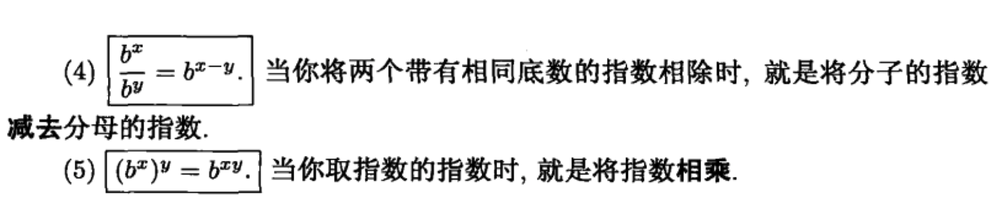
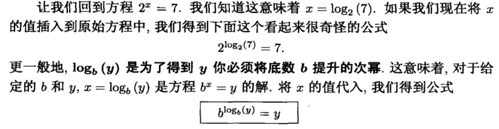
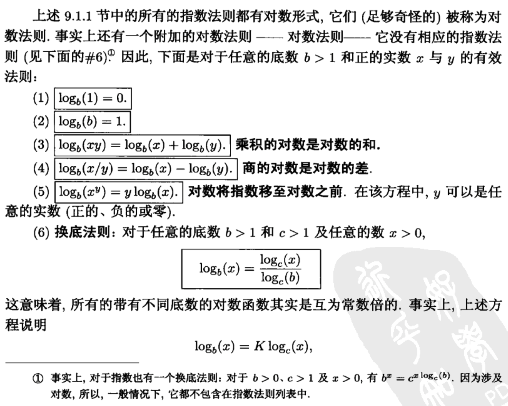
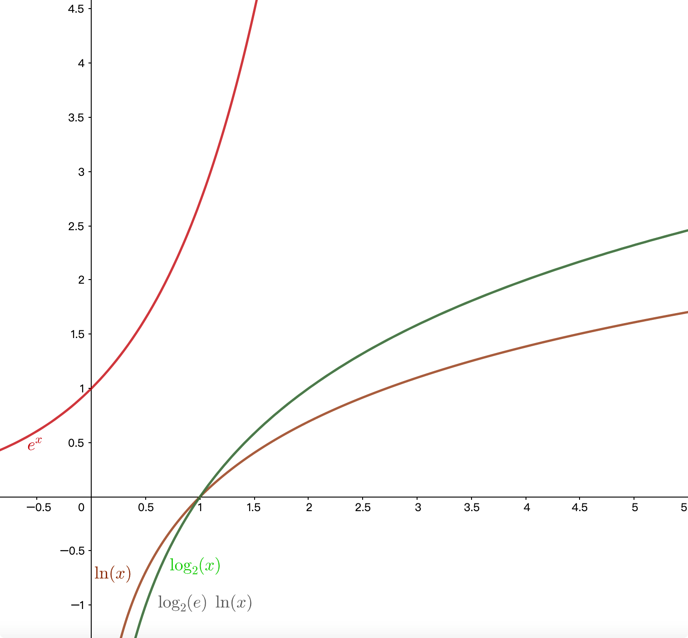

# 指数函数和对数函数

> 学习算法的过程中总是会遇到这个指数和对数级别的时间复杂度，所以这里特别来复习一下。

> 采用的教程是《普林斯顿微积分读本》

## 指数函数

**指数法则**

## 对数函数

**对数法则**

## **关系**

* $e^x$ 和 $lnx$ 相对于 $y=x$ 对称
* $log_2(x)$ 等于 $log_2(e)ln(x)$，即以2为底的对数是常数倍

## 二叉查找树的时间复杂度

起源就是二叉查找树的时间复杂度为 $lgN$，所以我们这里逐步进行分析，搞清楚为什么算出来是这个结果。

$$
\begin{align*}
平均比较次数 = 平均内部路径 + 1 \\
C_N = 二叉查找树内部路径长度  \\
平均查找成本 = 1 + C_N/N \\\\

C_N = N-1  + (C_{0} + C_{N-1})/N  +  (C_{1} + C_{N-2})/N + ...  + (C_{N-1} + C_{0})/N \\

其中： \\ 
- N-1: 表示根节点使得每个
\end{align*}
$$
