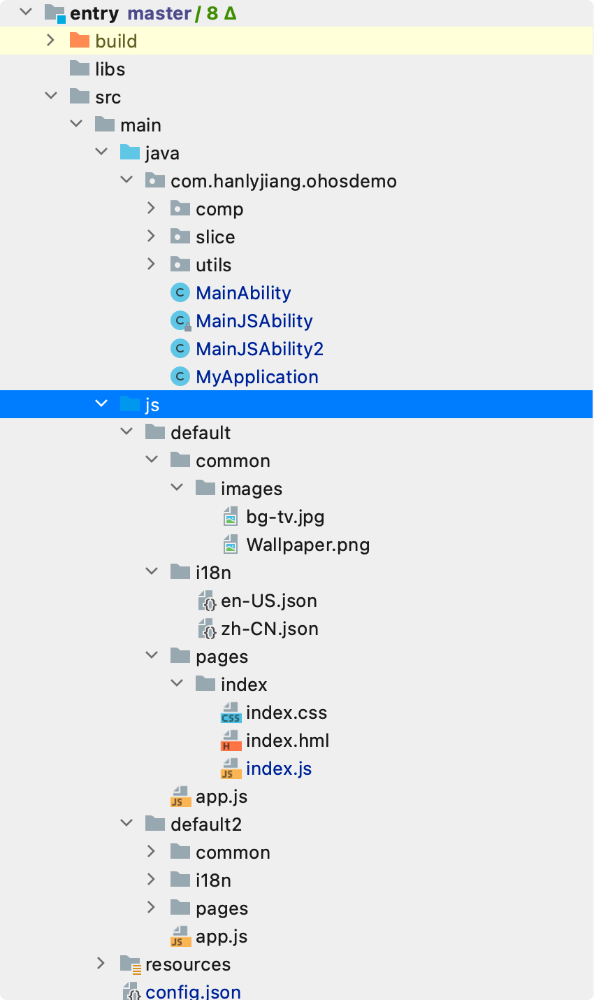

# 资料

* JS API 参考：[HarmonyOS应用开发-服务开发-JS API参考-手机、平板、智慧屏和智能穿戴开发-基于JS扩展的类Web开发范式-框架说明-文件组织](https://developer.harmonyos.com/cn/docs/documentation/doc-references/js-framework-file-0000000000611396)

# Ability框架

## 简介

### 整体内容


同`Android` 对比关系：

* `FeatureAbility` - Activity
* `ServiceAbility` - Service
* `DataAbility` - ContentProvider 
* CES - 广播
* ANS - 通知
* 线程通信
  * InnerEvent - Message
  * EventHandler - Handler
  * EventRunner - Looper
  * EventQueue - MessageQueue


### Ability说明

同Android 单独提供 Activity，Service，ContentProvider 的基类不一样，鸿蒙这三个组件全都是继承自 Ability，那么如何区分一个Ability到底是哪种组件呢？

* 继承后实现时选择性实现对应组件的生命周期方法；

* 在 `config.json` 中定义ability时，需要声明对应的类型（page-FA；service - ServiceAbility； data - DataAbility）

  ```json
  {
      "name": "com.hanlyjiang.ohosdemo.MainJSAbility2",
      "icon": "$media:icon",
      "description": "$string:mainjsability2_description",
      "label": "$string:entry_MainJSAbility2",
      "type": "page",
      "launchType": "standard",
  },
  {
      "name": "com.hanlyjiang.ohosdemo.ServiceAbility",
      "icon": "$media:icon",
      "description": "$string:serviceability_description",
      "type": "service"
  },
  {
      "name": "com.hanlyjiang.ohosdemo.DataAbility",
      "icon": "$media:icon",
      "description": "$string:dataability_description",
      "type": "data",
      "uri": "dataability://com.hanlyjiang.ohosdemo.DataAbility"
  }
  ```

## FA（FeatureAbility）

### FA 生命周期

| 生命周期回调 | 说明                                      |
| ------------ | ----------------------------------------- |
| onStart      | 首次创建触发，仅执行一次 需要setMainRoute |
| onActive     | 进入前台可交互状态后调用                  |
| onInactive   | Page失去焦点时调用                        |
| onBackground | Page不再可见 资源释放及耗时保存操作       |
| onForeground | 重新回到前台（获得焦点 重新申请资源       |
| onStop       | 销毁页面时调用 释放系统资源               |

同`Android`对比，关系如下：


| 鸿蒙         | 安卓      |
| ------------ | --------- |
| onStart      | onCreate  |
| onActive     | onResume  |
| onInactive   | onPause   |
| onBackground | onStop    |
| onForeground | onRestart |
| onStop       | onDestory |


# UI开发框架

## ArkUI

> 官方文档： [JS FA概述](https://developer.harmonyos.com/cn/docs/documentation/doc-guides/ui-js-fa-overview-0000000000585484)


## ArkUI-JS UI

> 了解更多：
>
> * [HarmonyOS应用开发-服务开发-工具-HUAWEI DevEco Studio使用指南-工程管理-HarmonyOS工程介绍](https://developer.harmonyos.com/cn/docs/documentation/doc-guides/project_overview-0000001053822398)

### 关键词

* `AceAbility`：加载JS的Ability的基类实现
* `setInstanceName`： 指定AceAbility加载的js目录（加载多个通过此方法指定js目录）

### 项目结构



* `AceAbility` 子类（上面对应的是`MainJSAbility`）
* `default` 目录
  * `app.js` ： 全局的JavaScript逻辑文件和应用的生命周期管理
  * `pages/index.js` : JS FA(JS 界面) - ==可以有多个page==
* `config.json`： js 声明

### app.js

应用生命周期回调

```js
export default {
    onCreate() {
        console.info('AceApplication onCreate');
    },
    onDestroy() {
        console.info('AceApplication onDestroy');
    }
};
```

### index.js(JS FA)

* 页面生命生命周期回调
* 页面业务逻辑(数据绑定，事件处理等)


```js
export default {
    data: {
        title: ""
    },
    onInit() {
        console.log("JS Page onInit")
    },
    onActive(){
        console.log("JS Page onActive")
    },
    onInactive(){
        console.log("JS Page onInactive")
    },
    onShow(){
        console.log("JS Page onShow")
    },
    onHide(){
        console.log("JS Page onHide")
    },
    onDestroy(){
        console.log("JS Page onDestroy")
    }
}
```

### 生命周期

```shell
OHSO_DEMO:  Application initialized
OHSO_DEMO:  MainAbility onStart
OHSO_DEMO:  MainAbility onActive

// 打开JS PAGE
OHSO_DEMO:  MainAbility onInactive
OHSO_DEMO:  MainJSAbility onStart
JSApp:  app Log: AceApplication onCreate（app.js）
OHSO_DEMO:  MainJSAbility onActive
JSApp:  app Log: JS Page onInit
JSApp:  app Log: JS Page onActive
JSApp:  app Log: JS Page onShow
OHSO_DEMO:  MainAbility onBackground

// 切换最近任务
OHSO_DEMO:  MainJSAbility onInactive
JSApp:  app Log: JS Page onInactive
OHSO_DEMO:  MainJSAbility onBackground
JSApp:  app Log: JS Page onHide

// 恢复
OHSO_DEMO:  MainJSAbility onForeground
JSApp:  app Log: JS Page onShow
OHSO_DEMO:  MainJSAbility onActive
JSApp:  app Log: JS Page onActive

// 回退（退出JS PAGE）
JSApp:  app Log: JS Page onHide
JSApp:  app Log: JS Page onDestroy
OHSO_DEMO:  MainJSAbility onInactive
OHSO_DEMO:  MainAbility onInactive
OHSO_DEMO:  MainAbility onActive
OHSO_DEMO:  MainJSAbility onBackground
OHSO_DEMO:  MainJSAbility onStop
JSApp:  app Log: AceApplication onDestroy （app.js）
```

* JS 的生命周期在Java内部。
* 


### HML 

> HML（HarmonyOS Markup Language）是一套类HTML的标记语言。通过组件、事件构建出页面的内容。页面具备数据绑定、事件绑定、列表渲染、条件渲染等高级能力。


### index.css 


# 鸿蒙特性

## 服务流转


# 其他


## 日志输出

### HiLog

```java
    static final HiLogLabel label = new HiLogLabel(HiLog.LOG_APP, MY_MODULE, "MY_TAG"); //MY_MODULE=0x00201
    HiLog.warn(label, "Failed to visit %{private}s, reason:%{public}d.", url, errno);
```

输出如下：

```shell
Result: 05-26 11:01:06.870 1051 1051 W 00201/test: Failed to visit <private>, reason:503.
```

> 注意： <private> 隐藏了本该被输出的 url 


## 对应概念/类

* `LayoutBoost` -> `LayoutInflater`

## 常见问题

### 隐藏 ActionBar 

将如下配置段添加到 module 中，或者添加到 ability 中。

```json
	"metaData": {
          "customizeData": [
            {
              "name": "hwc-theme",
              "value": "androidhwext:style/Theme.Emui.Light.NoTitleBar"
            }
          ]
    }
```

> 按理应该提供直接对Ability设置主题的配置方式，但是不知道配置项。

