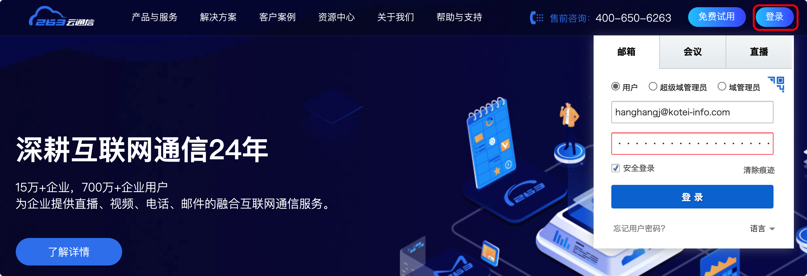
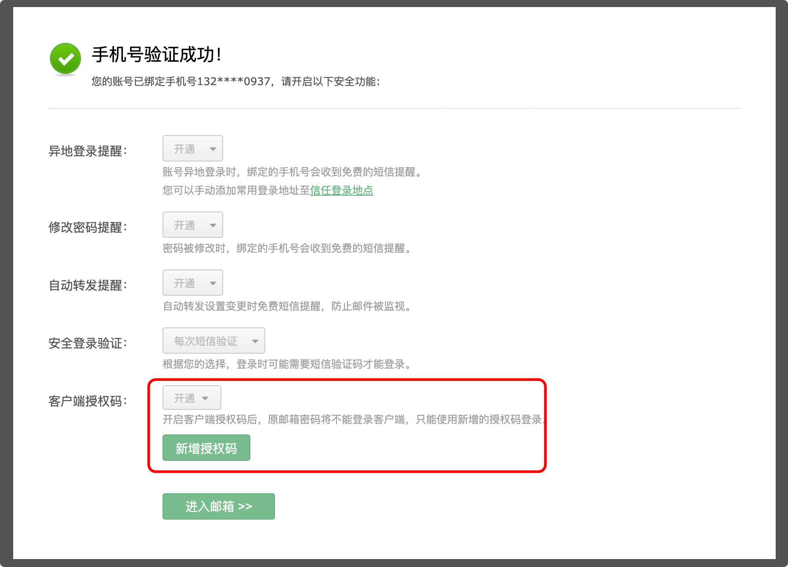

# 入职记录

* 钉钉扫描二维码加入组织群

  * 需要填写部门名称及工号，其中部门为：==大客户事业二部==，工号HR会给

* 新员工入职培训（线上）：学习钉钉新员工入职培训课程并完成考试（2天内）

* 新员工培训（线下）：王伟

* 工牌

  * 外门打卡

* **停车办理**

* **邮箱配置**

  * 邮箱登录地址为： https://www.263.net/

  * 

  * 初次登陆需要修改密码并验证手机号

  * 如需登陆手机端，可以添加授权码

    * 可以在首次验证手机号之后，弹出的界面中添加：

      

    * 参考官方视频教程在手机端进行配置（iPhone+安卓）： https://community.263.net/product/20190329/1381.html 

      > **POP 配置**
      >
      > 发件：pop.263.net
      >
      > 收件： smtp.263.net
      >
      > 密码：授权码

* **工牌申请**

  * 📧发送邮件：一寸白底电子照给 jiamind@kotei-info.com，邮件填写如下信息：

    ```shell
    主题： 【工牌申请】姓名-工号-部门
    
    正文如下：
    
    姓名：xxx
    工号：xxxx
    部门：xxxxxx
    ```

    

