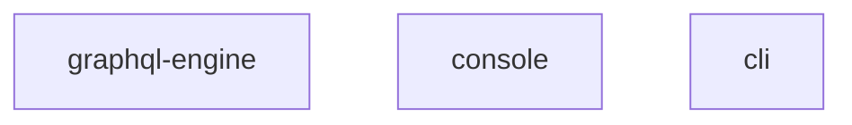

# hasura吉奥修改说明

hasura是一个能将数据库直接包装为Graphql-API的引擎，目前支持postgres数据库，后续可能会支持mysql及sql server。目前基于postgres的fdw机制，我们也可以间接的支持mysql，oracle等其他数据库，所以可以作为统一的API发布及访问引擎；

我们使用hasura作为融合中心的块数据API引擎，针对开源版本作了如下修改/扩展：

1. 汉化了 graphl-engine console，其中包括：
   * 汉化 graphql-engine的console入口文件中的 `Loading...`;
   * console web页面的所有界面；
2. 根据需要扩展了几个模块，模块扩展的方式为：1）在console中添加扩展模块的web操作界面；2）提供对应的springboot服务作为后端接口提供服务；到目前为止，包括以下模块：
   * token管理服务
   * 数据库集成服务
   * restapi服务

## 相关资料

开源的：

* 开源仓库Github地址：[hasura/graphql-engine](hasura/graphql-engine)
* 官方Dockerhub镜像地址：[hasura/graphql-engine](https://hub.docker.com/r/hasura/graphql-engine/tags?page=1&ordering=last_updated)

改造后的：

* 现有镜像编译仓库： [gitlab/blockapi-engine](http://zh-gitlab.geostar.com.cn/dept-development/product-project/geopanel/development-center/blockdataapi-engine/-/tree/v1.3.2/docker)

## hasura结构说明



* graphql-engine: graphql 引擎
* console：前端界面，实际上console也会一起打包到graphql-engine的镜像里面
* Hasura CLI是一个命令行工具，是管理Hasura项目和迁移的主要模式。


代码结构说明：	

```shell
graphql-engine 
	|-- server
		  |-- src-rsr
		  		|-- console.html
	|-- console
		  |-- xx.html
		  |-- xxxx
```

server 目录会编译出一个 graphql-engine 的二进制文件，其中会包含 `server/src-rsr/console.html` 文件作为首页的加载模板，console.html 内容如下：

```html
<html lang="en-us">
  <head>
    <script>
     window.__env = {
       consoleMode: "server",
       urlPrefix: "/console",
       consolePath: "{{consolePath}}",
       isAccessKeySet: {{isAdminSecretSet}},
       isAdminSecretSet: {{isAdminSecretSet}},
       enableTelemetry: {{enableTelemetry}},
       assetsPath: "https://graphql-engine-cdn.hasura.io/console/assets",
       assetsVersion: "{{assetsVersion}}",
       cdnAssets: {{cdnAssets}},
       serverVersion: "{{serverVersion}}",
     };
     window.__env.versionedAssetsPath = window.__env.assetsPath;
    </script>
  </head>
  <body>
    <style>
    .mainContent {
      display: 'none';
      opacity: 0;
      transition: opacity .20s linear;
    }
    .mainContent.show {
      display: 'block';
      opacity: 1;
      transition: opacity .20s linear;
    }
    </style>

    <div id="loading">
      <div class="page-loading" style="
      min-height: 100vh;
      width: 100%;
      display: flex;
      align-items: center;
      font-family: sans-serif;
      justify-content: center;
      ">
        <span class="" style="
        font-size: 2em;
        margin-top: -3em;
        color: #848484;
        ">
        Loading...
      </span>
      </div>
    </div>
    <div id="content" class="mainContent"></div>

    <script>
     // helper functions
     const loadIcon = (url) => {
       linkElem = document.createElement('link');
       linkElem.rel = 'icon';
       linkElem.type = 'image/png';
       linkElem.href = url;
       document.head.append(linkElem);
     };
     const loadCSS = (url) => {
       linkElem = document.createElement('link');
       linkElem.rel = 'stylesheet';
       linkElem.charset = 'UTF-8';
       linkElem.href = url;
       document.body.append(linkElem);
     };
     const loadScript = (url) => {
       scriptElem = document.createElement('script');
       scriptElem.charset = 'UTF-8';
       scriptElem.src = url;
       document.body.append(scriptElem);
     };
     const prependSlash = (str) => str === '' ? '' : '/' + str;
     const loadAssets = () => {
       loadCSS(window.__env.assetsPath + '/common/css/font-awesome.min.css.gz');
       loadIcon(window.__env.assetsPath + '/common/img/favicon_green.png');
       loadCSS(window.__env.versionedAssetsPath + '/main.css.gz');
       loadScript(window.__env.versionedAssetsPath + '/commonConfig.js.gz');
       loadScript(window.__env.versionedAssetsPath + '/main.js.gz');
       loadScript(window.__env.versionedAssetsPath + '/vendor.js.gz');
     };

     // if cdnAssets is set to false, load assets from server instead of cdn
     if (window.__env.cdnAssets === false) {
       window.__env.assetsPath =
         window.location.pathname.slice(
           0, window.location.pathname.lastIndexOf(window.__env.consolePath)
         ) + '/console/assets';
       // set the path to get versioned assets from server
       window.__env.versionedAssetsPath = window.__env.assetsPath + '/versioned';

     // otherwise load from cdn itself
     } else {
       // set the path (cdn-based) to get assets from
       window.__env.versionedAssetsPath = window.__env.assetsPath + prependSlash(window.__env.assetsVersion);
     }
     // load the assets now
     loadAssets();
    </script>
  </body>
</html>

```

console.html 的逻辑：

* 在未加载完成前，显示 “Loading...”
* 加载main.js
* 加载main.css
* 加载vendor.js
* 加载commonConfig.js（开源版本没有，我们自行添加，用于添加自定义的扩展模块的服务地址的配置）

可以看到 console.html 只是一个入口，其中内容全部从外部加载。

> ⚠️注意： console.html 会被编译到二进制的graphql-engine 文件中


## console 模块改造说明

如上所述：

1. 我们需要汉化 console.html 文件中的“Loading...”

2. 我们添加了若干扩展模块，这些模块会在console的web页面中添加若干管理页面，这些页面会从用户的浏览器中去访问后面对应的springboot的服务；

3. 每个地方部署的对应的springboot的服务的地址是动态变化的，所以我们需要有一种方式来将服务地址动态的塞入到console 中，故在console.html 中引入了commonConfig.js用于配置springboot的服务地址；（commonConfig.js中的服务地址需要在容器启动时动态的替换为实际的地址）。

   

# 镜像构建流程

## 概览

以下为整体的构建流程，其中 <span style="background-color:#FF8A8C;">  </span> 的为我们需要构建的镜像，包括中间镜像和最终的成果镜像；


1. 首先，我们需要构建 `graphql-engine-builder` 的镜像，其中包括haskell的GHC编译器及cabal依赖管理工具；
2. 然后我们使用`graphql-engine-builder`镜像对graphql-engine的源码进行编译，生成graphql-engine的二进制可执行文件及graphql-engine运行所需要的依赖库；
3. 由于第二步构建过程中有很多中间成果，我需要为graphql-engine创造一个纯净的运行环境以缩小最终的运行镜像的大小，所以我们需要构建 `graphql-engine-packager` 镜像，其中包含一个精简版的根文件系统。
4. 现在，我们将第二部中生成的graphql-engine及其依赖文件和第三部 `graphql-engine-packager` 镜像中的根文件系统合并到一个scratch镜像，然后生成 `graphql-engine-base` 的镜像，这个镜像已经包含了一个可以正常运行的 graphql-engine ，只是没有集成console资源到镜像中；
5. 最后我们对console进行编译，生成assets资源，然后基于 `graphql-engine-base` 添加这些前端资源文件，生成我们最终需要的 `graphql-engine` 镜像；

## 辅助镜像构建过程

在构建graphql-engine的过程中，我们使用了其他几个辅助镜像，本文档记录这些镜像的构建过程；
* `graphql-engine-builder`： graphql-engine 构建器，包含构建graphql-engine所需要的各种编译环境
* `graphql-engine-packager`： graphql-engine 打包docker镜像时使用的辅助镜像，用于提供graphql-engine镜像所需的rootfs
* `haskell-docker-packager`:  `graphql-engine-packager` 镜像的基础镜像，`graphql-engine-packager` 会基于此镜像添加若干运行所需的包；

### graphql-engine-builder
参考： [builder/graphql-engine-builder/README.md](builder/graphql-engine-builder/README.md) 

### haskell-docker-packager
> 此处仅说明arm版本的镜像构建过程，amd64版本直接使用[hasura官方镜像](https://hub.docker.com/r/hasura/haskell-docker-packager)即可。
```shell script
git clone git@github.com:hanlyjiang/haskell-docker-builder.git 
make build 
```
构建完毕后会生成名为 `hanlyjiang/haskell-docker-packager:{日期}` 的镜像。

### graphql-engine-packager
`graphql-engine-packager` 镜像基于`haskell-docker-packager`镜像构建，直接进入到本项目的 `server` 目录，然后执行 docker build 命令进行构建：

- 设置镜像信息
```shell script
registry=hanlyjiang  # 替换成自行设置的值
packager_ver=version # 替换成自行设置的值
```

- arm 机器上执行：    
```shell script

docker build -t '$registry/graphql-engine-packager:$packager_ver' -f packaging/packager-arm.df ./packaging/
```

- 非arm机器上交叉构建arm镜像
```shell script
docker buildx build -t '$registry/graphql-engine-packager:$packager_ver' -f packaging/packager-arm.df ./packaging/ --load
```

