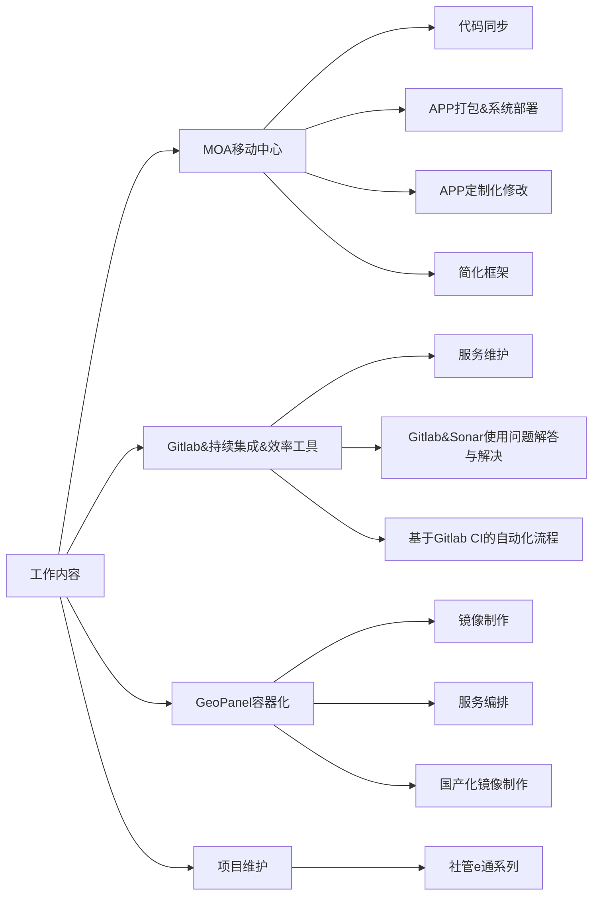

# 本文档内容总体说明

**更新记录**

| 时间       | 内容                                                         |
| ---------- | ------------------------------------------------------------ |
| 2021/03/16 | 创建文档                                                     |
| 2021/03/23 | 添加GeoPanel服务容器编排及可视化部署运维系统的章节 添加社管e通打包壳维护章节 添加GeoPanel-移动中心-代码同步章节 |
| 2021/03/25 | 补充arm镜像构建中交叉构建与运行的相关问题及建议              |
| 2021/03/26 | 添加移动中心国产化镜像制作相关内容                           |
| 2021/03/29 | 添加Gitlab&持续集成&效率工具章节                             |
| 2021/03/30 | 添加Gitlab相关的安装配置及使用文档                           |
| 2021/03/31 | 添加整理Gitlab CI自动化相关文档及内容                        |
| 2021/04/01 | 补充Gitlab使用中常见的问题及技巧 补充使用gitlab-ci的缓存加速构建的方式 |

可能需要交接的工作内容概览如下，后面会按照这个内容大纲来一一梳理：

**内容导航：**

* [GeoPanel容器化](./2-GeoPanel容器化.html)
* [项目维护-社管e通打包壳维护](3-项目维护-社管e通打包壳维护.html)
* [Gitlab相关](4-Gitlab相关.html)
* [GeoPanel-移动中心](5-GeoPanel-移动中心.html)
* [可视化运维部署](6-可视化运维部署.html)

