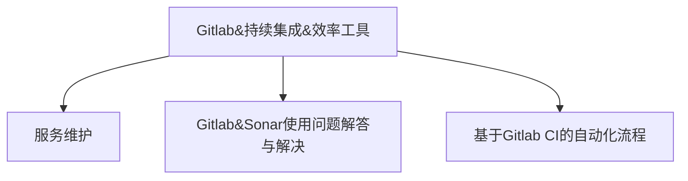
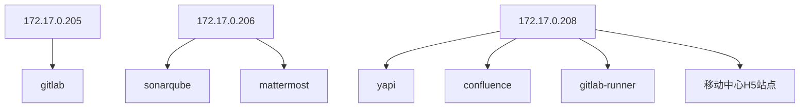

# Gitlab&持续集成&效率工具



## 服务维护

目前有3个服务器需要维护，上面有部署若干服务：



服务的连接方式及部署的服务可以参考文档： [《Gitlab-SonarQube服务信息汇总》](https://shimo.im/docs/REkKVZppmPcjFQqx/)， 该文档记录了服务器的ssh远程的方式，各服务的部署启动方式，部署的目录；

以下简要说明各个服务的维护方式及可能遇到的问题。

### gitlab（205）

* 部署目录： `/data/gitlab/`

teambition的thoughts上记录了部分使用过程中可能遇到的问题，可以访问[tb的此文档目录](https://thoughts.teambition.com/workspaces/5e8da16aaf7af5001a4c7222/folders/5ee970c5b7ad5400012b51ac) 进行查阅；

这里我们重点强调下gitlab的重启可能遇到的问题，**使用过程中发现，在gitlab重启时，如果有gitlab-runner不停的向gitlab服务器发送请求，则有可能导致gitlab无法启动，故我们采取gitlab启动过程中不连接网络，启动完成后再连接网络的方式启动gitlab**详细可参考[tb上的此文章](https://thoughts.teambition.com/workspaces/5e8da16aaf7af5001a4c7222/docs/5f4c5eaf77f66f00010659ae)。


### sonarqube （206）

* 部署目录：`/data/_data/sonarqube`

一般只需要启动及重启，可参考   [《Gitlab-SonarQube服务信息汇总》](https://shimo.im/docs/REkKVZppmPcjFQqx/) 的相关小节，主要命令如下：

```shell
# 部署    
docker stack deploy -c docker-compose.yml sonarqube

# 停止 
docker stack down sonarqube

# 重新启动
docker stack up sonarqube -c docker-compose.yml
```

### yapi（208）

* 部署目录： `/data/yapi-docker-deploy` 

```shell
# 启动命令
docker stack deploy -c docker-compose.yml yapi
# 其他维护命令基于yapi的stack执行即可
```

### mattermost相关（206）

mattermost相关请联系段春先


### gitlab-runner（208）

208上的gitlab-runner作为部门的公用runner，执行各种通用任务。


我们在208上注册启动了两个runner，一个使用docker方式运行，一个使用二进制方式直接运行在主机上，使用的时候需要注意区分；

#### docker方式运行的runner

* 使用docker方式运行的runner使用geostar用户运行，用于执行通用任务，使用docker作为执行器。
* 相关维护操作直接对容器进行即可：
  * 重启：`docker restart gitlab-runner`
  * 扩展了命令别名，默认情况下，使用geostar用户在主机上直接执行 gitlab-runner命令时，实际上时执行 `docker exec -it gitlab-runner [命令]` 
  * 执行命令：`docker exec -it gitlab-runner bash`

#### 二进制运行的runner

* 使用二进制运行的runner使用root用户运行，使用shell作为执行器，用于执行需要直接操作主机的命令，如打包docker镜像。
* 相关维护操作需要使用root用户完成（通过 /usr/bin/gitlab-runner 命令）
  * 如，查看状态：`sudo /usr/bin/gitlab-runner status`

## Gitlab&Sonar使用问题解答与解决

sonarqube的启动重启请参考 [《Gitlab-SonarQube服务信息汇总》](https://shimo.im/docs/REkKVZppmPcjFQqx/) 中的sonar的部署方式。

## 基于Gitlab CI的自动化流程相关

这里下面另外启动一个章节说明


# Gitlab相关-Gitlab安装及配置

## 安装

我们使用docker来安装Gitlab，执行如下命令即可安装运行，完成后使用

```shell
export GITLAB_DATA=/data/gitlab
# 设置主机的ip域名
export HOST_IP=192.168.43.62
mkdir $GITLAB_DATA/config $GITLAB_DATA/logs $GITLAB_DATA/data
docker run --detach \
        --hostname $HOST_IP \
        --publish 443:443 --publish 80:80 --publish 22:22 \
        --name gitlab \
        --restart always \
        --volume $GITLAB_DATA/config:/etc/gitlab \
        --volume $GITLAB_DATA/logs:/var/log/gitlab \
        --volume $GITLAB_DATA/data:/var/opt/gitlab \
        gitlab/gitlab-ce:13.9.1-ce.0
```

> * 数据全部挂载在外部目录 GITLAB_DATA 中
> * `--hostname 192.168.43.62` : 指定当前服务的IP或者域名，后续将会显示为gitlab代码仓库的克隆地址
> * `--restart always` : 设置服务自动重启

> 查看gitlab的可用版本： 
>
> * [dockerhub/gitlab-ce](dockerhub/gitlab-ce)
> * [gitlab release page](https://about.gitlab.com/releases/categories/releases/)

### **查看启动状态**

启动期间可以使用 `docker ps` 查看状态，如STATUS中显示为`starting`则表示服务还在启动中，如显示为`healthy`则表示服务已正常启动，即可访问 http://192.168.43.62 访问Gitlab的web地址。

```shell
CONTAINER ID        IMAGE                          COMMAND             CREATED             STATUS                 PORTS                                                          NAMES
79b432f0f601        gitlab/gitlab-ce:13.0.6-ce.0   "/assets/wrapper"   2 months ago        Up 2 weeks (healthy)   0.0.0.0:22->22/tcp, 0.0.0.0:80->80/tcp, 0.0.0.0:443->443/tcp   gitlab
```

也可使用 `docker logs -f gitlab` 来查看gitlab的服务启动日志

### 设置root管理员用户密码

首次打开页面后会提示设置root用户的密码，设置后务必记录好用户密码，后续将使用此用户对Gitlab进行管理


## 配置LDAP

服务启动正常后，`$GITLAB_DATA/config` 文件夹中即生成了gitlab的配置文件，可编辑`$GITLAB_DATA/config/gitlab.rb` （对应容器内部 `/etc/gitlab/gitlab.rb` ）文件来修改gitlab配置以使用LDAP

```shell
vim /etc/gitlab/gitlab.rb
```

通过`?` 搜索`LDAP`，找到如下配置端，按如下方式进行修改：

```ruby
### LDAP Settings
###! Docs: https://docs.gitlab.com/omnibus/settings/ldap.html
###! **Be careful not to break the indentation in the ldap_servers block. It is
###!   in yaml format and the spaces must be retained. Using tabs will not work.**

gitlab_rails['ldap_enabled'] = true

gitlab_rails['ldap_servers'] = YAML.load <<-'EOS'
   main:
     label: '域账号'
     host: '172.17.0.3'
     port: 389
     uid: 'sAMAccountName'
     bind_dn: 'CN=智慧城市Mattermost系统,OU=邮箱用户,DC=geostar,DC=com,DC=cn'
     password: '3uQ5V2LDgG'
     encryption: 'plain' # "start_tls" or "simple_tls" or "plain"
     verify_certificates: false
     smartcard_auth: false
     active_directory: true
     allow_username_or_email_login: false # 是否允许以用户名登录（邮箱也会取用户名来严重）
     lowercase_usernames: false
     block_auto_created_users: false
     base: 'OU=武大吉奥-域用户,DC=geostar,DC=com,DC=cn'
     user_filter: ''
EOS
```

> 配置修改说明：
>
> * `ldap_enabled` 需要设置为true
> * `ldap_servers` 配置AD域相关信息
>   * label： 随便取，会显示在gitlab的登录页面
>   * host： 域控制服务器主机地址
>   * port： 域控制器服务端口
>   * uid：  将域用户信息中的哪个字段作为gitlab上的登录标识（一般都是sAMAccountName）
>   * bind_dn： 用于访问域控制服务器的用户账号，用户账号的格式需要使用`CN=xxx,OU=XXX,DC=XXXX` 类似的格式
>   * password： 对应的base_dn账号的密码
>   * base： 用于登录时，会去base所定义的组里面去检索用户是否存在，如用户在这个范围内，才可以登录；如及用于公司一个部门的登录，可将base值配置到部门级别，则其他部分无法以域账号进行登录；
>
> 提示： 如无法确认 uid，bind_dn，base 等的值，可以咨询信息中心或者使用AD域访问查看软件（如：[Apache Directory](http://directory.apache.org/)）连接到域账号控制器服务后，通过图形界面查看对应信息；

修改完毕后需要保存文件后重启gitlab服务，对于docker启动的gitlab来说，可执行如下命令重启服务：

```shell
# 其中gitlab为我们使用docker run 命令时通过--name选项指定的容器名称
docker restart gitlab 
```

待gitlab重启完毕后，登录界面即出现域账号登录的tab入口，点击域账号tab即可使用域账号进行登录


## 配置邮箱通知

公司邮箱服务器配置：

我们使用向信息中心申请的公共的mattermost邮箱账号。

```ruby
gitlab_rails['smtp_enable'] = true
gitlab_rails['smtp_address'] = "mail.geostar.com.cn"
gitlab_rails['smtp_port'] = 25
gitlab_rails['smtp_user_name'] = "zh-mattermost@geostar.com.cn"
gitlab_rails['smtp_password'] = "3uQ5V2LDgG"
gitlab_rails['smtp_domain'] = "geostar.com.cn"
gitlab_rails['smtp_authentication'] = "login"
gitlab_rails['smtp_enable_starttls_auto'] = true
gitlab_rails['smtp_tls'] = false
```

163邮箱配置示例：（需在163邮箱中开启SMTP服务，可参考： [CSDN-如何使用163的SMTP服务发邮件？](https://blog.csdn.net/liuyuinsdu/article/details/113878840)）

```ruby
gitlab_rails['smtp_enable'] = true
gitlab_rails['smtp_address'] = "smtp.163.com"
gitlab_rails['smtp_port'] = 25
gitlab_rails['smtp_user_name'] = "colorless@163.com"
gitlab_rails['smtp_password'] = "密码"
gitlab_rails['smtp_domain'] = "163.com"
gitlab_rails['smtp_authentication'] = "login"
gitlab_rails['smtp_enable_starttls_auto'] = true
gitlab_rails['smtp_tls'] = false
```


## 关闭及管理员配置

### 赋予指定域账号管理员权限

在配置了域账号登录之后，先让需要设置为管理员的账号使用域账号登录一次gitlab，登录后gitlab即会为该用户创建关联的gitlab账号。

然后使用root用户登录，进入


将用户的访问类型切换为管理员：


### 关闭用户注册

在配置了域账号登录之后，可以关闭用户注册，即只允许拥有域账号的人员进行登录；


# Gitlab相关-安装并注册Gitlab-Runner 

## 安装Gitlab-Runner

gitlab-runner可以使用docker方式运行，也可以在主机上运行其二进制可执行文件，可按如下方式进行选择：

* 执行通用的构建测试任务及与不需要直接访问主机目录的，以docker方式安装；
* 执行部署类任务或需要直接访问主机目录的，以二进制方式安装；

以下分别介绍上述两种安装方式。


### 使用docker安装gitlab-runner

使用docker方式安装的，需先在主机上安装docker环境，可参考 Docker 官方安装文档。以下操作假设主机上已正确安装并配置了docker运行环境；

>我们使用alpine的镜像来减小大小

```shell
# 建立配置挂载目录
mkdir -p /data/gitlab-runner/config
# 建立构建目录挂载目录
mkdir -p /data/gitlab-runner/home
# 注意，这里我们使用了基于alpine的镜像来减小大小；使用 --restart 标识来自动重启
docker run -d --name gitlab-runner --restart always \
  -v /data/gitlab-runner/config:/etc/gitlab-runner \
  -v /data/gitlab-runner/home:/home/gitlab-runner \
  -v /var/run/docker.sock:/var/run/docker.sock \
  gitlab/gitlab-runner:alpine
  
# 通过以下命令设置docker开机自启
sudo systemctl enable docker
```

### docker安装的gitlab-runner常用操作

#### 运行命令

使用已有容器

```shell
# 容器已经运行的情况下
# 1. 交互式执行，执行以下命令，然后输入命令
docker exec -it gitlab-runner /bin/bash
# 然后执行命令
gitlab-runer --help
# 2. 单次执行
docker exec gitlab-runner gitlab-runner --help
```

使用临时的：

```shell
docker run --rm -t -i gitlab/gitlab-runner:alpine --help
# -it 使用交互式终端
# --rm 自动删除
```

#### 重启gitlab-runner

```
docker restart gitlab-runner
```

#### 升级版本

```shell
# 获取最新
docker pull gitlab/gitlab-runner:alpine
docker stop gitlab-runner && docker rm gitlab-runner
docker run -d --name gitlab-runner --restart always \
  -v /var/run/docker.sock:/var/run/docker.sock \
  -v /data/gitlab-runner/config:/etc/gitlab-runner \
  -v /data/gitlab-runner/home:/home/gitlab-runner \
  gitlab/gitlab-runner:alpine
```

#### 查看日志

```shell
docker logs gitlab-runner
```

#### 配置 gitlab-runner 别名

在 `~/.bash_profile` 或 `~/.bashrc` 文件中加入如下函数配置，后续运行 gitlab-runner 命令时即可省去docker exec 命令

```shell
# 添加 gitlab-runner 直接执行到容器
function gitlab-runner(){
    docker exec -it gitlab-runner gitlab-runner $@
}
```


### 使用二进制包安装运行gitlab-runner

#### 获取安装包安装并运行

* Centos or RedHat 使用如下命令安装：

  ```shell
  ARCH=$(arch)
  
  curl -LJO "https://gitlab-runner-downloads.s3.amazonaws.com/latest/rpm/gitlab-runner$ARCH.rpm"
  
  rpm -i gitlab-runner_$ARCH.rpm
  ```

* Debian or Ubuntu 使用如下命令安装

  ```shell
  ARCH=$(arch)
  
  curl -LJO "https://gitlab-runner-downloads.s3.amazonaws.com/latest/deb/gitlab-runner_$ARCH.deb"
  
  dpkg -i gitlab-runner_$ARCH.deb
  ```

* Windows 安装

  请参考官方文档： https://docs.gitlab.com/runner/install/windows.html#installation

* 测试是否安装成功，如能成功输出gitlab-runner的用法信息，则表示安装成功

  ```
  gitlab-runner --help
  ```

* 测试是否成功启动

  ```
  gitlab-runner status
  # 如输出 Service is running，则表示成功启动了
  ```

  > 通过docker方式运行的runner在运行 `gitlab-runner status`时会输出 `not running`，这对于docker方式运行的runner是正常的，只有直接运行于主机上的runner需要启动对应的服务；

#### 安装并更新Git版本

Gitlab-CI 任务在 runner 机器上执行，会先通过git获取对应仓库的最新代码，这个获取代码的操作是通过git来完成的，所以我们需要安装git工具；

* **安装Git**

  ```shell
  sudo yum install -y git
   # 查看版本
  git --version
  # centos7 上为 1.8.x，无法满足gitlab要求
  ```

* **升级Git版本**

  某些linux发型版上git版本过低，在执行流水线时会失败，需要升级git版本，可按如下方式从源码安装最新git版本；

  * 下载git v2.27.0源码

    ```shell
    ## 以下下载方式任选其一
    # 可选下载方式1 - 从gitee 克隆
    git clone -b v2.27.0 https://gitee.com/hanlyjiang/git.git git-2.27.0
    cd git-2.27.0 && git checkout -b tag-v2.27.0 v2.27.0
    
    # 可选下载方式2 - 从github直接下载包
    curl -LJO https://github.com/git/git/archive/v2.27.0.tar.gz
    tar -xvf git-2.27.0.tar.gz 
    cd git-2.27.0
    ```

  * 编译安装

    ```shell
    # 安装编译依赖库
    sudo yum install  -y autoconf gcc openssh zlib-devel
    
    # 编译并安装
    make configure ;# as yourself
    ./configure --prefix=/usr ;# as yourself
    make -j8 all ;# as yourself
    sudo make install ;# as root
    
    # 确认版本：
    git --version
    # git version 2.27.0
    ```

#### 将gitlab-runner用户添加到docker用户组（可选）

如需要在该gitlab-runner的CI脚本中运行docker命令，这需要将 gitlab-runner用户添加到docker的用户组，可执行如下命令：

```shell
sudo usermod -a -G docker gitlab-runner

# 验证权限
sudo -u gitlab-runner -H docker info
```

#### 修改 gitlab-runner 构建目录

如在执行ci任务时，拉取代码时报build目录权限问题，可尝试按如下方式修改指定runner的构建目录

1. 查找配置文件路径

   ``` shell
   gitlab-runner list 
   # 其中ConfigFile的值就是对应的配置文件，如：
   # ConfigFile=/etc/gitlab-runner/config.toml
   ```

2. 修改 `builds_dir` 指向

   找对该任务对应的`[[runner]]` 配置段，并在该配置中添加 `builds_dir` 指向新的具有权限的目录，然后重启启动gitlab-runner即可；

   ```yaml
   [[runners]]
     name = "blockdataapi-engine"
     url = "http://172.17.0.205/"
     token = "Y-6zdV9zzi8xsY1rygbn"
     executor = "shell"
     builds_dir = "/data/gitlab-runner/builds"
     [runners.custom_build_dir]
     [runners.cache]
       [runners.cache.s3]
       [runners.cache.gcs]
   ```


## 注册 Runner 到 Gitlab

这里我们将runner注册为群组的Runner，群组runner可以在群组中共享，所有子群组和项目都可以使用该Runner。也可以将Runner注册到指定项目仓库上，操作上只有获取gitlab-runner注册信息时不一样；

### 获取gitlab-runner注册信息

> 如需注册到具体项目，在项目的设置在进入对应的CI/CD设置即可，后续操作流程一致；

在群组的设置中打开 CI/CD 设置


展开 Runner 栏位


这里我们选择通过手动设置group runner的方式来注册，可以获取到以下信息：


### 注册runner

以docker方式运行的gitlab-runner可按如下方式进入交互环境，**直接二进制运行的无需此操作**；

在gitlab-runner 的机器上执行注册命令，将runner注册到gitlab，为了方便操作，我们使用以下命令进入gitlab-runner容器shell环境：

```shell
docker exec -it gitlab-runner /bin/bash
```

执行完成后出现如下交互窗口

```shell
bash-4.4#
```

docker方式运行的runner需在此bash中执行命令，主机之间运行的runner直接在shell中执行即可。

### 执行register命令进行注册

```shell
gitlab-runner register 
# url：
http://172.17.0.205/
# token
cEJ611JDeCWSMyu7WXWi
# description - 用于辨识该注册所属的群组或项目，可以设置为方便区分的字符串
sonarqube-runner
# ci-tag - 标签用于后续CI配置中选择此执行器，后期可以通过gitlab界面更改
sonarqube,common-build
# executor - 后续CI任务的执行方式，docker方式运行的请选择docker
docker
# default image - CI配置中未指定镜像时默认使用的镜像
busybox:1.31.1
```

以下为一个注册过程的交互示例：

```shell
bash-4.4# gitlab-runner register 
Runtime platform                                    arch=amd64 os=linux pid=205 revision=05161b14 version=12.4.1
Running in system-mode.                            
                                                   
Please enter the gitlab-ci coordinator URL (e.g. https://gitlab.com/):
http://172.17.0.205/
Please enter the gitlab-ci token for this runner:
cEJ611JDeCWSMyu7WXWi
Please enter the gitlab-ci description for this runner:
[e0311b0ce34b]: sonarqube-runner
Please enter the gitlab-ci tags for this runner (comma separated):
sonarqube,common-build
Registering runner... succeeded                     runner=cEJ611JD
Please enter the executor: virtualbox, docker+machine, docker-ssh+machine, custom, docker-ssh, parallels, kubernetes, docker, shell, ssh:
docker
Please enter the default Docker image (e.g. ruby:2.6):
busybox:1.31.1
Runner registered successfully. Feel free to start it, but if it's running already the config should be automatically reloaded!
```

### 注册后确认

完成后在刚才的页面可以看到；


### 取消注册

使用 list 命令查看当前注册的token及url

```shell
gitlab-runner list
# 输出类似
Runtime platform                                    arch=amd64 os=linux pid=23 revision=05161b14 version=12.4.1
Listing configured runners                          ConfigFile=/etc/gitlab-runner/config.toml
sonarqube-runner                                    Executor=docker Token=wNwxjEztRpKxYDyK1zVd URL=http://172.17.0.205/
```

使用list命令输出的token机url作为参数 使用unregister命令取消注册

```shell
gitlab-runner unregister -t 7KM7ftthLAYeJdsB3Tbk -u http://172.17.0.205/
```


## 了解更多

* [DOCKER 方式安装gitlab-runner](https://docs.gitlab.com/runner/install/docker.html)
* [Linux安装gitlab-runner-Gitlab官方文档](https://docs.gitlab.com/runner/install/linux-manually.html)
* [使用Docker运行Gitlab-Runner-Gitlab官方文档](https://docs.gitlab.com/runner/install/docker.html)
* [注册Runner-Gitlab官方文档](https://docs.gitlab.com/runner/register/index.html)
* [Gitlab-Runner alpine Dockerfile](https://gitlab.com/gitlab-org/gitlab-runner/blob/master/dockerfiles/alpine/Dockerfile)
* [Windows上注册Runner](https://docs.gitlab.com/runner/install/windows.html)
* [如何在docker执行器中构建Docker镜像？](http://github.com/help/ci/docker/using_docker_build.md)


# Gitlab相关-GitlabCI&CD自动化

**可先阅读文档：** 

* Gitlab&Mattermost&Sonarqube介绍-无批注.pdf（本地文件）
* [Gitlab协作工具使用指引](http://172.17.0.205/Public-Share/gitlab-usage)

**关键点总结：**

* 主要概念：Gitlab，gitlab-ci.yml，runner，流水线，job

  * Gitlab 提供代码托管，提供ci/cd能力
  * Gitlab-CI从 项目源码中的gitlab-ci.yml文件中读取CI流程，然后执行，我们在此文件中定义流水线及任务
  * Runner是一个具体的机器，用于执行任务

* Runner执行器：

  * shell：执行与机器相关的任务，需要使用主机命令的，如docker打包，部署
  * docker： 使用容器执行通用的构建任务
  * 注册流程参考：[《2019/11/19-GitlabRunner配置-共享》](https://shimo.im/docs/PVAPV289P6tmFVql/ )

* Gitlab-ci配置参考： http://172.17.0.205/help/ci/yaml/README.md

* Gitlab-ci重要配置 - **job**

  * 定义要执行的任务，使用script定义具体要执行的命令

* Gitlab-ci重要概念 - 阶段 - 定义执行顺序

  * 顶层的stage定义流水线的阶段，job下的stage确定该job的归属，按顶层的stage定义的顺序执行job

* Gitlab-ci重要概念 - **变量** - 用于参数化构建流程 

  * 预定义变量：http://172.17.0.205/help/ci/variables/predefined_variables.md
  * Gitlab Web界面配置变量，支持在群组及项目级别分别配置，项目级别的优先级较高
  * gitlab-ci.yml 中配置变量，yml中配置的变量会被web界面中配置的覆盖

* Gitlab-ci重要配置 - 归档

  * 用于将成果归档，可供下载
  * 用于将成果在不同的阶段的job中传递（Gitlab自动完成）
  * 使用时指定要归档的文件相对于CI_PROJECT_DIR的路径即可
  * **特别注意**要限制归档可以存储的时间，避免无用的归档文件占据gitlab磁盘空间

* Gitlab-ci重要配置 - 规则（only，except，rule）

  * **only/expect**

  * - 提交相关：

    - - branches - 所有分支
      - tags - 所有标签
      - pushes - 推送
      - merge_requests - 提起合并请求
      - external_pull_requests - 外部合并请求（基本用不到）

  * - 其他：

    - - api - 调用gitlab api触发
      - external - 未了解
      - pipelines - 未了解
      - **schedules** ： 定时器（gitlabCI/CD设置页面设置）
      - triggers：- 未了解
      - **web**： 界面手动触发
      - chat - 用不到

  * rules

    * 参考使用规则定义 http://172.17.0.205/help/ci/yaml/README.md#rules
    * 参考示例 [GeoSocial自动部署](http://172.17.0.205/geosocial-pc/auto-build-deploy/front-auto-deploy/-/blob/master/.gitlab-ci.yml)


**CI/CD配置示例**

* [VuePress Web项目CI自动构建及部署](http://172.17.0.205/Development/Mobile/geopanel/h5-sdk-api-document/-/blob/master/.gitlab-ci.yml)
* Android
  * [Android项目CI自动打包-洪山管理通](http://172.17.0.205/Development/Mobile/support/cgt-sgt/hongshan-sgt/-/blob/master/.gitlab-ci.yml)
  * [Android项目自动打包-移动中心APP](http://172.17.0.205/GeoPanel/MobileCenter/geopanel-android/-/blob/geo-client-android/master/.gitlab-ci.yml)
* springboot:
  * [springboot gradle自动打包-GeoRobox3.0-后台](http://172.17.0.205/Development/Mobile/georobox_3_0/georobox-mobile-server/-/blob/master/.gitlab-ci.yml)
  * [springboot-gradle打包示例-自动打包-多环境部署](http://172.17.0.205/Public-Share/gitlab-ci-examples/springboot-gradle/-/blob/gitlab-ci/.gitlab-ci.yml)
* sonar代码检查：
  * [使用帮助-Sonar检查通用模板配置](http://172.17.0.205/Public-Share/gitlab-usage/-/wikis/%E4%BD%BF%E7%94%A8Gitlab/%E4%BD%BF%E7%94%A8gitlab-ci%E8%BF%9B%E8%A1%8Csonar%E4%BB%A3%E7%A0%81%E6%A3%80%E6%9F%A5#331-%E9%80%9A%E7%94%A8%E9%A1%B9%E7%9B%AE%E9%85%8D%E7%BD%AE%E9%99%A4msbuild%E4%B9%8B%E5%A4%96%E7%9A%84%E9%A1%B9%E7%9B%AE)
  * [C#代码检查示例项目](http://172.17.0.205/Public-Share/gitlab-ci-examples/donet-sonar-scanner-sample-project/-/blob/master/.gitlab-ci.yml)
  * [移动中心Android代码检查](http://172.17.0.205/GeoPanel/MobileCenter/geopanel-android/-/blob/geo-client-android/master/.gitlab-ci.yml)

# Gitlab相关-使用提示

## CI脚本中变量含有特殊字符时的处理

对于变量中有`$`的，可以使用两个 `$` 来进行转义，如：

```
robot$$gitlab
```


## 如何检查CI配置？

> 注意： CI规则的检查是和项目相关的，只能在对应的项目中进行检查

检查CI配置是否合规，可在项目的CI/CD界面，点击`CI配置检查（CI lint）`，然后粘贴自己的配置到输入框中执行检查


## Docker Runner的构建加速（配置数据卷）

Docker的Runner非常适合用于作为通用的构建机器，以执行各种不同类型的语言及不同打包工具的编译任务，比方说gradle,maven，npm等等。

一般来说，我们的项目都会使用很多第三方的依赖，而且这些依赖只是在构建需要时从网络上获取，然后构建工具会将这些包缓存在某个目录中，如：

* gradle 一般放置在 `~/.gradle` 目录中，同时也会存储 gradle 的各种版本；
* mvn 一般放置于 `~/.m2` 目录中；

使用容器构建时，这些缓存目录都位于容器内部，也就是每次都需要重新下载，非常浪费时间。所以我们需要能让这些目录可以自动挂载到执行的容器中，gitlab-runner提供了这种能力，具体配置方式参考如下：

1. 找到gitlab-runner的配置文件，可通过如下命令查找，查看其中的ConfigFile指向的目录

   ```shell
   $ sudo /usr/bin/gitlab-runner list
   
   Runtime platform                                    arch=amd64 os=linux pid=15738 revision=05161b14 version=12.4.1
   Listing configured runners                          ConfigFile=/etc/gitlab-runner/config.toml
   blockdataapi-engine                                 Executor=shell Token=Y-6zdV9zzi8xsY1rygbn URL=http://172.17.0.205/
   产品开发部                                               Executor=shell Token=vdxuftxm6EL_fVgAS7Td URL=http://172.17.0.205/
   移动中心-部署                                             Executor=shell Token=zx2vFV3x4S19n5mJDjD_ URL=http://172.17.0.205/
   localhost                                           Executor=shell Token=3xHHCWiysKqf4kWdnA_e URL=http://172.17.0.205/
   ```

   > 注意：如果是通过gitlab运行的gitlab-runner，则在挂载的config目录

2. 找到对应的Runner配置段，可通过name进行区分

   ```yaml
   [[runners]]
     name = "sonarqube-runner"
     url = "http://172.17.0.205/"
     token = "wNwxjEztRpKxYDyK1zVd"
     executor = "docker"
     [runners.custom_build_dir]
     [runners.docker]
       tls_verify = false
       image = "busybox:1.31.1"
       privileged = false
       disable_entrypoint_overwrite = false
       oom_kill_disable = false
       disable_cache = false
       shm_size = 0
     [runners.cache]
       [runners.cache.s3]
       [runners.cache.gcs]
   ```

3. 在  `[runners.docker]` 配置中添加`volumes`配置，示例如下，写法于通过docker挂载命名卷一致 

   ```yaml
   [[runners]]
     name = "sonarqube-runner"
     url = "http://172.17.0.205/"
     token = "wNwxjEztRpKxYDyK1zVd"
     executor = "docker"
     [runners.custom_build_dir]
     [runners.docker]
       tls_verify = false
       image = "busybox:1.31.1"
       privileged = false
       disable_entrypoint_overwrite = false
       oom_kill_disable = false
       disable_cache = false
       volumes = ["/cache", "maven:/root/.m2", "gradle_gradle:/home/gradle/.gradle", "nginx_static:/work/html", "android_build_tools:/android-sdk/build-tools", "android_platforms:/android-sdk/platforms", "android_extras:/android-sdk/extras"]
       shm_size = 0
     [runners.cache]
       [runners.cache.s3]
       [runners.cache.gcs]
   ```

   > 提示：修改后直接保存，无需重新启动gitlab-runner，下次对应的任务跑到这个runner上时，即会自动生效

   > 这里解释下几个卷的配置：
   >
   > * `"maven:/root/.m2"`: 一般的maven的镜像的缓存配置目录在`/root/.m2` 
   > * `"gradle_gradle:/home/gradle/.gradle"`: 一般的gradle镜像的缓存目录 `/home/gradle/.gradle`
   > * `"nginx_static:/work/html"`: 为我们通过docker启动的一个nginx服务，启动时挂载了 nginx_static 到/work/html，在ci任务中，我们可在容器中将web资源拷贝到执行任务的容器内部的/work/html目录即可将web资源发布到该runner上启动的nginx服务中
   > * 另外两个都是自行构建的android构建镜像的缓存目录。

## 使用cache-缓存加速构建

可使用gitlab的cache关键字缓存构建的依赖下载文件

```yaml
cache:
  key: "$CI_COMMIT_REF_SLUG"
  paths:
    - node_modules/

stages:
    - test
    - build
    - deploy

build:
  stage: build
  image: node:11-alpine
  script:
    # - npm install --registry=https://registry.npm.taobao.org
    - npm install 
    - npm run build:prod
  artifacts:
    expire_in: 1 hours
    name: "$CI_PROJECT_NAME--$CI_COMMIT_REF_NAME--$CI_COMMIT_SHORT_SHA--$CI_JOB_NAME--$CI_JOB_ID"
    paths:
      - dist/
  tags:
    - common-build
  only:
    - branches
    - web
```

之后在任务开始时，会加载缓存：


在任务完成后，会保存缓存：


配置前后的构建时间差距如下：（第一次需要3分钟，第二次只需要1分钟）


> 参考： 
>
> * [Cache dependencies in GitLab CI/CD](https://docs.gitlab.com/ee/ci/caching/index.html)
> * [gitlab-ci.yaml - cache](https://docs.gitlab.com/ee/ci/yaml/README.html#cache)


# Gitlab相关-升级记录（12.10.0-13.0.6）

考虑到后续可能需要对gitlab进行升级，这里将之前的一次升级记录贴出，供后续升级作为参考。

> 升级需要选择无人使用的时段，并提前通知。

## 升级准备工作

### **确定升级路线**

- 现有版本：12.10.0
- 当下目标版本：13.0.6
- 结合 [Gitlab升级路线建议](https://docs.gitlab.com/ee/policy/maintenance.html#upgrade-recommendations) 确定如下升级路线：
  - 12.10.0 -> 13.0.0 -> 13.0.6 
  - 由于我们跨大版本升级了（12-13），所以引入了 13.0.0 的中间升级路径

### **获取最新版本信息**

- 查看 gitlab release页面 信息
- 查看 gitlab docker hub 获取gitlab-ce docker镜像版本TAG：
- 13.0.0: `gitlab/gitlab-ce:13.0.0-ce.0`
- 13.0.6: `gitlab/gitlab-ce:13.0.6-ce.0`
- 查看升级注意事项
- 升级流程： https://docs.gitlab.com/omnibus/docker/README.html#update
- 版本升级建议路线：https://docs.gitlab.com/ee/policy/maintenance.html#upgrade-recommendations

## 备份

备份有两种方式，备份的数据量不相同：

* 对docker挂载的gitlab数据目录整体备份
* 使用 gitlab的 `gitlab-backup create` 命令创建备份，可包含所有git仓库，包括wiki及权限信息。

> 建议对挂载的gitlab数据目录进行一次整体备份，目前暂不清楚gitlab-backup create命令创建的备份是否包含ci相关内容。

以下对gitalb-backup 命令执行备份进行简要介绍。数据目录的备份方式直接对目录进行操作即可。

进入到gitlab部署机器，执行如下命令：

```shell l
docker exec -t <container name> gitlab-backup create
# 如果docker容器的名称是gitlab，则可以执行如下命令，备份完成后位于gitlab的数据目录，如：/data/gitlab/data/backups/
docker exec -t $(docker ps | grep gitlab | awk '{print $1}') gitlab-backup create
# 备份配置目录
sudo tar -cvf /data/gitlab/data/backups/1592710400_2020_06_21_12.10.0_gitlab_config_backup.tar /data/gitlab/config 
```

## 执行升级：

- 进入到gitlab部署机器 

```shell
ssh -p 10022 geostar@172.17.0.205
```

- 获取Gitlab中间版本镜像及最终版本镜像

```shell
docker pull gitlab/gitlab-ce:13.0.0-ce.0
docker pull gitlab/gitlab-ce:13.0.6-ce.0
```

- 停止并移除现有服务

```shell
sudo docker stop gitlab 
sudo docker rm gitlab 
```

- 进行升级，使用 13.0.0 的镜像运行gitlab，gitlab会自动处理数据升级流程

```shell
    sudo docker run --detach \
        --hostname 172.17.0.205 \
        --publish 443:443 --publish 80:80 --publish 22:22 \
        --name gitlab \
        --restart always \
        --volume /data/gitlab/config:/etc/gitlab \
        --volume /data/gitlab/logs:/var/log/gitlab \
        --volume /data/gitlab/data:/var/opt/gitlab \
        gitlab/gitlab-ce:13.0.0-ce.0
```

- 待 13.0.0 升级完毕之后，升级到 13.0.6，使用 13.0.6 的镜像运行gitlab

```shell
      sudo docker stop gitlab 
      sudo docker rm gitlab 
      sudo docker run --detach \
        --hostname 172.17.0.205 \
        --publish 443:443 --publish 80:80 --publish 22:22 \
        --name gitlab \
        --restart always \
        --volume /data/gitlab/config:/etc/gitlab \
        --volume /data/gitlab/logs:/var/log/gitlab \
        --volume /data/gitlab/data:/var/opt/gitlab \
        gitlab/gitlab-ce:13.0.6-ce.0
```

## 确认升级成功

登录管理员账号，进入管理中心-仪表盘，查看gitlab版本：


